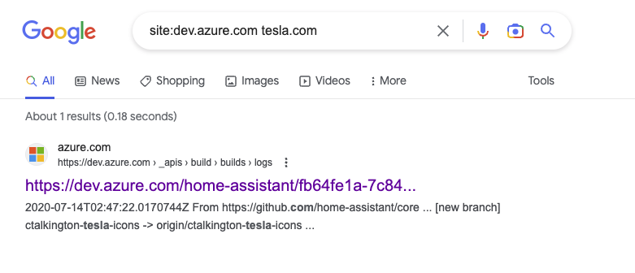
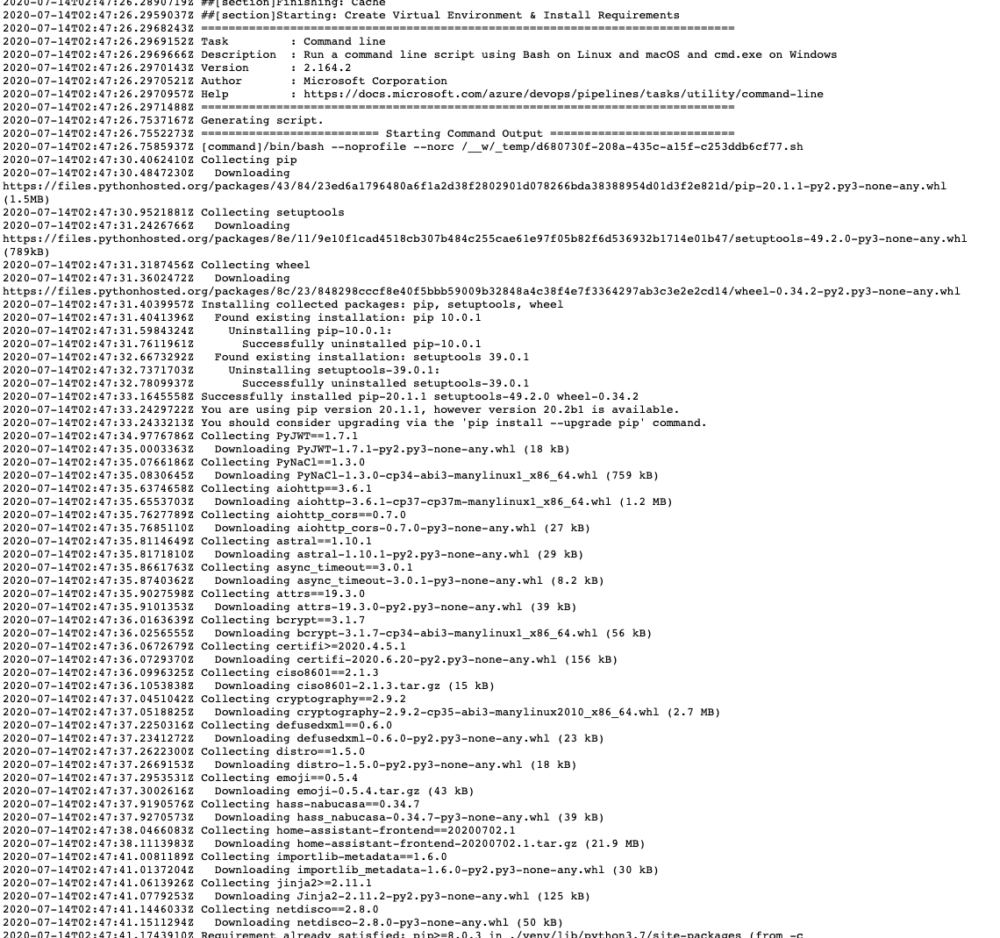

# Google Dorking 
> notes about google dorking

`site:dev.azure.com tesla.com`


**Result**


## Inroduction

Introduction:
Google Dorking, also known as Google hacking, is a technique used by cybersecurity professionals and hackers alike to find sensitive information and vulnerabilities on the internet using advanced search queries. By utilizing Google's advanced search operators, you can unearth valuable data that may not be easily accessible through regular searches.

1. Understanding Google search operators:
Google search operators are special characters or commands that allow you to refine and filter your search results. Some common operators include:
```
site: (search within a specific website)
filetype: (search for a specific file type)
inurl: (search for a specific term within URLs)
intitle: (search for a specific term within page titles)
intext: (search for a specific term within page content)
```
2. Basic Google Dorking examples:
Here are some basic examples of Google Dorking queries:
```
Find login pages: inurl:/login intitle:"login"
Search for exposed database files: filetype:sql intext:password
Discover open directories containing sensitive documents: intitle:"index of" "financial" filetype:xls
```
3. Advanced Google Dorking techniques:
Advanced Google Dorking involves chaining multiple search operators together to create complex queries. This allows you to be more specific and precise in your searches. For example:
```
Find exposed WordPress configuration files: site:example.com filetype:txt intext:"define('DB_NAME', 'wp_database')"
Search for confidential documents on a specific website: site:example.com filetype:pdf intitle:"confidential"
```
4. Staying ethical and legal:
Google Dorking is a powerful tool that can reveal sensitive information and vulnerabilities. It is crucial to use this knowledge responsibly and ethically. Avoid accessing unauthorized data or exploiting vulnerabilities without permission. Always respect the privacy of others and follow applicable laws and regulations.

5. Staying up-to-date:
Google Dorking is an ever-evolving technique. Stay current with new search operators, dorking methods, and the latest cybersecurity news. Follow reputable sources and engage with the cybersecurity community to keep your skills sharp.

### Elliot from Mr Robot Google Dorking Generic Applications
If Elliot from Mr. Robot were to use Google Dorking on Evil Corp's website, he might focus on finding sensitive information or vulnerabilities. Here are some hypothetical examples of search queries he might use:

1. Discover exposed configuration files:
- site:evilcorp.com filetype:config intext:"database"
- site:evilcorp.com inurl:"wp-config.php"
2. Search for login portals:
- site:evilcorp.com inurl:/login intitle:"login"
- site:evilcorp.com intitle:"admin login"
3. Locate sensitive documents:
- site:evilcorp.com filetype:pdf intitle:"confidential"
- site:evilcorp.com filetype:xls intitle:"financial"
4. Identify potential vulnerabilities:
- site:evilcorp.com intext:"Index of /" "Parent Directory"
- site:evilcorp.com intitle:"phpinfo()"

### Elliot from Mr Robot Google Dorking Spring Boot 3 Application
if Elliot from Mr. Robot were to use Google Dorking on a Spring Boot 3 application hosted on evilcorp.com, he might focus on finding sensitive information, configuration files, or vulnerabilities specific to Spring Boot applications. Here are some hypothetical examples of search queries he might use:

1. Discover exposed configuration files:
- site:evilcorp.com filetype:yml intext:"spring.datasource.url"
- site:evilcorp.com filetype:properties intext:"spring.datasource.username"
2. Search for application.properties files:
site:evilcorp.com filetype:properties intitle:"application.properties"
site:evilcorp.com inurl:"resources" filetype:properties intitle:"application"
3. Locate H2 console (used for in-memory databases):
- site:evilcorp.com inurl:"/h2-console"
- site:evilcorp.com intitle:"H2 Console" intext:"Settings"
4. Identify potential vulnerabilities or exposed Actuator endpoints:
- site:evilcorp.com inurl:"/actuator/health"
- site:evilcorp.com inurl:"/actuator/env"
5. Find exposed API documentation:
- site:evilcorp.com inurl:"/swagger-ui.html"
- site:evilcorp.com intitle:"API Documentation" intext:"spring boot"

## SQL Injection via Dorking

using SQL errors Dork:
site:target.com intext:"sql syntax near" | intext:"incorrect syntax near"

indexed page with sql error

SQL dork :
site:target.com intext:"sql syntax near" |
intext:"syntax error has occurred" | intext:"incorrect syntax near" | intext:"unexpected end of SQL command" | intext:"Warning: mysql_connect()" | intext:"Warning: mysql_query()" | intext:"Warning: pg_connect()"
