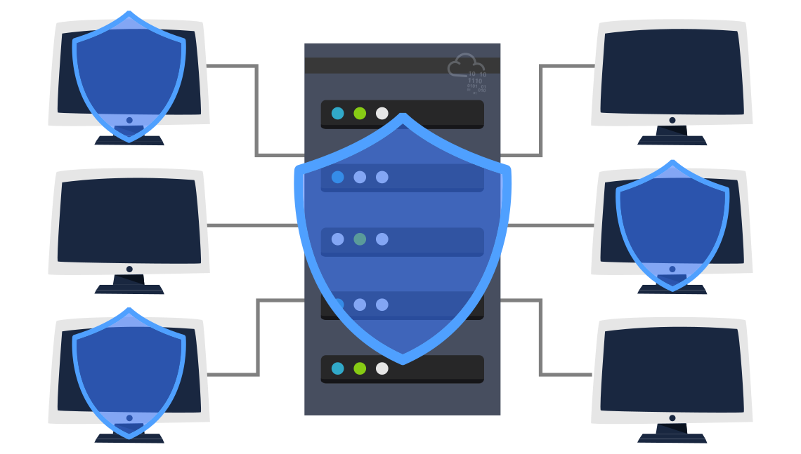
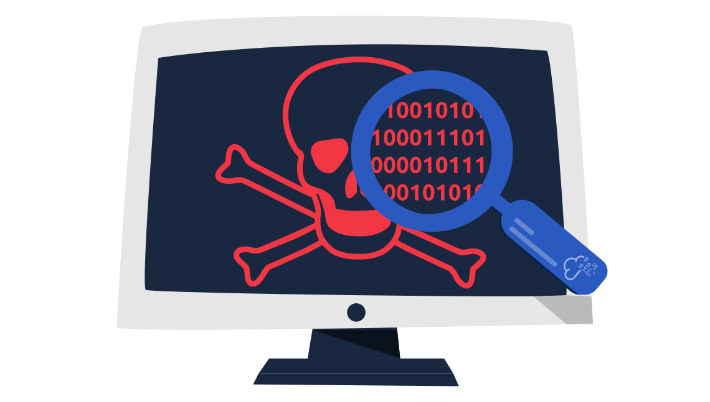

# INTRO TO CYBER SECURITY

## Offensive Security Intro
```
gobuster -u http://fakebank.com -w wordlist.txt dir
```
In the command above, -u is used to state the website we're scanning, -w takes a list of words to iterate through to find hidden pages.

---

Web Application Security

```
This task will investigate a vulnerable website that uses Insecure Direct Object References (IDOR). IDOR falls under the category of Broken Access Control. Broken access control means that an attacker can access information or perform actions not intended for them. Consider the case where a web server receives user-supplied input to retrieve objects (files, data, documents) and that they are numbered sequentially. Let’s say that the user has permission to access a photo named IMG_1003.JPG. We might guess that there are also IMG_1002.JPG and IMG_1004.JPG; however, the web application should not provide us with that image even if we figured out its name. In general, an IDOR vulnerability can occur if too much trust has been placed on that input data. In other words, the web application does not validate whether the user has permission to access the requested object.

Just providing the correct URL for a user or a product does not necessarily mean the user should be able to access that URL. For instance, consider the product page https://store.tryhackme.thm/products/product?id=52. We can expect this URL to provide details about product number 52. In the database, items would be assigned numbers sequentially. The attacker would try other numbers such as 51 or 53 instead of 52; this might reveal other retired or unreleased products if the web application is vulnerable.

Let’s consider a more critical example; the URL https://store.tryhackme.thm/customers/user?id=16 would return the user with id=16. Again, we expect the users to have sequential ID numbers. The attacker would try other numbers and possibly access other user accounts. This vulnerability might work with sequential files; for instance, if the attacker sees 007.txt, the attacker might try other numbers such as 001.txt, 006.txt, and 008.txt. Similarly, if you were ID number 16 and ID number 17 was another user, by changing the ID to 17, you could see sensitive data that belongs to another user. Likewise, they can change the ID to 16 and see sensitive data that belongs to you. (Of course, we assume here that the system is vulnerable to IDOR.)


my user:
https://inventory-management.thm/activity?user_id=11 

just by entering this url with user id 9
https://inventory-management.thm/activity?user_id=9

i was able to make changes with the website using the identity of user_id=9
the database admin
```


## Defensive Security Intro 

Offensive security focuses on one thing: breaking into systems. Breaking into systems might be achieved through exploiting bugs, abusing insecure setups, and taking advantage of unenforced access control policies, among other things. Red teams and penetration testers specialize in offensive security.

Defensive security is somewhat the opposite of offensive security, as it is concerned with two main tasks:

Preventing intrusions from occurring
Detecting intrusions when they occur and responding properly
Blue teams are part of the defensive security landscape.



Some of the responsibilities:
- Security Operations Center (SOC)
- Threat Intelligence
- Digital Forensics and Incident Response (DFIR)
- Malware Analysis

### Areas of Defensive Security 
- Security Operations Center (SOC), where we cover Threat Intelligence
- Digital Forensics and Incident Response (DFIR), where we also cover Malware Analysis


**Incident Response**
An incident usually refers to a data breach or cyber attack; however, in some cases, it can be something less critical, such as a misconfiguration, an intrusion attempt, or a policy violation. Examples of a cyber attack include an attacker making our network or systems inaccessible, defacing (changing) the public website, and data breach (stealing company data). How would you respond to a cyber attack? Incident response specifies the methodology that should be followed to handle such a case. The aim is to reduce damage and recover in the shortest time possible. Ideally, you would develop a plan ready for incident response.

The four major phases of the incident response process are:

- **Preparation**: This requires a team trained and ready to handle incidents. Ideally, various measures are put in place to prevent incidents from happening in the first place.
- **Detection and Analysis**: The team has the necessary resources to detect any incident; moreover, it is essential to further analyze any detected incident to learn about its severity.
- **Containment, Eradication, and Recovery**: Once an incident is detected, it is crucial to stop it from affecting other systems, eliminate it, and recover the affected systems. For instance, when we notice that a system is infected with a computer virus, we would like to stop (contain) the virus from spreading to other systems, clean (eradicate) the virus, and ensure proper system recovery.
- **Post-Incident Activity** : After successful recovery, a report is produced, and the learned lesson is shared to prevent similar future incidents.


**Malware Analysis**
Malware stands for malicious software. Software refers to programs, documents, and files that you can save on a disk or send over the network. Malware includes many types, such as:

- Virus is a piece of code (part of a program) that attaches itself to a program. It is designed to spread from one computer to another; moreover, it works by altering, overwriting, and deleting files once it infects a computer. The result ranges from the computer becoming slow to unusable.
- Trojan Horse is a program that shows one desirable function but hides a malicious function underneath. For example, a victim might download a video player from a shady website that gives the attacker complete control over their system.
- Ransomware is a malicious program that encrypts the user’s files. Encryption makes the files unreadable without knowing the encryption password. The attacker offers the user the encryption password if the user is willing to pay a “ransom.”



 Malware analysis aims to learn about such malicious programs using various means:

- Static analysis works by inspecting the malicious program without running it. Usually, this requires solid knowledge of assembly language (processor’s instruction set, i.e., computer’s fundamental instructions).
- Dynamic analysis works by running the malware in a controlled environment and monitoring its activities. It lets you observe how the malware behaves when running.


**NOTE:**
```
There are many open-source databases out there, like AbuseIPDB, and Cisco Talos Intelligence, where you can perform a reputation and location check for the IP address. Most security analysts use these tools to aid them with alert investigations. You can also make the Internet safer by reporting the malicious IPs, for example, on AbuseIPDB

once you get the malicious IP address we need to escalate it to a staff member
```


## Careers in Cyber Security 

### Security Analyst 


Responsible for maintaining the security of an organisation's data

Security analysts are integral to constructing security measures across organisations to protect the company from attacks. Analysts explore and evaluate company networks to uncover actionable data and recommendations for engineers to develop preventative measures. This job role requires working with various stakeholders to gain an understanding of security requirements and the security landscape.

**Responsibilities**  
Working with various stakeholders to analyse the cyber security throughout the company
Compile ongoing reports about the safety of networks, documenting security issues and measures taken in response
Develop security plans, incorporating research on new attack tools and trends, and measures needed across teams to maintain data security.

**Learning Paths**  
TryHackMe's learning paths will give you both the fundamental technical knowledge and hands-on experience, which is crucial to becoming a successful Security Analyst.

- Pre Security
- Cyber Defense


### Security Engineer 


Design, monitor and maintain security controls, networks, and systems to help prevent cyberattacks

Security engineers develop and implement security solutions using threats and vulnerability data - often sourced from members of the security workforce. Security engineers work across circumventing a breadth of attacks, including web application attacks, network threats, and evolving trends and tactics. The ultimate goal is to retain and adopt security measures to mitigate the risk of attack and data loss.

**Responsibilities**  
Testing and screening security measures across software
Monitor networks and reports to update systems and mitigate vulnerabilities
Identify and implement systems needed for optimal security

**Learning Paths**  
TryHackMe's learning paths will give you both the fundamental technical knowledge and hands-on experience, which is crucial to becoming a successful Security Engineer.

- Cyber Defense
- JR Penetration Tester
- Offensive Pentesting


### Malware Analyst


Analyses all types of malware to learn more about how they work and what they do

A malware analyst's work involves analysing suspicious programs, discovering what they do and writing reports about their findings. A malware analyst is sometimes called a reverse-engineer as their core task revolves around converting compiled programs from machine language to readable code, usually in a low-level language. This work requires the malware analyst to have a strong programming background, especially in low-level languages such as assembly language and C language. The ultimate goal is to learn about all the activities that a malicious program carries out, find out how to detect it and report it.

**Responsibilities**  
Carry out static analysis of malicious programs, which entails reverse-engineering
Conduct dynamic analysis of malware samples by observing their activities in a controlled environment
Document and report all the findings


### Penetration Tester


Responsible for testing technology products for security loopholes

You may see penetration testing referred to as pentesting and ethical hacking. A penetration tester's job role is to test the security of the systems and software within a company - this is achieved through attempts to uncover flaws and vulnerabilities through systemised hacking. Penetration testers exploit these vulnerabilities to evaluate the risk in each instance. The company can then take these insights to rectify issues to prevent a real-world cyberattack.

**Responsibilities**  
Conduct tests on computer systems, networks, and web-based applications
Perform security assessments, audits, and analyse policies
Evaluate and report on insights, recommending actions for attack prevention

**Learning Paths**  
TryHackMe's learning paths will give you both the fundamental technical knowledge and hands-on experience, which is crucial to becoming a successful Penetration Tester.

- JR Penetration Tester
- Offensive Pentesting

### Red Teamer


Plays the role of an adversary, attacking an organisation and providing feedback from an enemies perspective

Red teamers share similarities to penetration testers, with a more targeted job role. Penetration testers look to uncover many vulnerabilities across systems to keep cyber-defence in good standing, whilst red teamers are enacted to test the company's detection and response capabilities. This job role requires imitating cyber criminals' actions, emulating malicious attacks, retaining access, and avoiding detection. Red team assessments can run for up to a month, typically by a team external to the company. They are often best suited to organisations with mature security programs in place.

Responsibilities
Emulate the role of a threat actor to uncover exploitable vulnerabilities, maintain access and avoid detection
Assess organisations' security controls, threat intelligence, and incident response procedures
Evaluate and report on insights, with actionable data for companies to avoid real-world instances
Learning Paths
TryHackMe's learning paths will give you both the fundamental technical knowledge and hands-on experience, which is crucial to becoming a successful Red Teamer.

JR Penetration Tester
Offensive Pentesting
Red Teamer


## MY NOTES 

