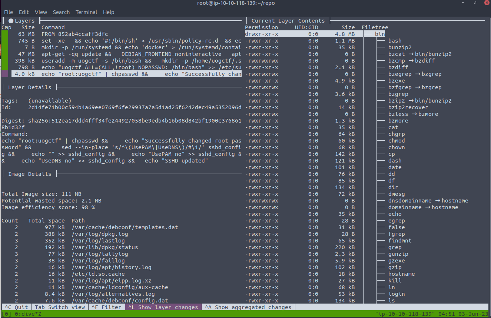

# Docker Exploits

## Intro to Docker
Docker employs the same technology used in containerisation to isolate applications into containers called the Docker Engine. The Docker Engine is essentially an API that runs on the host operating system, which communicates between the operating system and containers to access the system’s hardware (such as CPU, RAM, networking and disk)

Because of this, the Docker engine is extensive and allows you to do things like:

- Connect containers together (for example, a container running a web application and another container running a database)
- Export and import applications (images)
- Transfer files between the operating system and container

### History of Docker
Originally created by Solomon Hykes in 2013, Docker is open-source and has become a well-renowned name within containerisation.

Docker started as an internal project for dotCloud (a PaaS provider), where it was then showcased in PyCon in 2013 and then quickly made open-source.

While containerisation's original concepts started in 1979 with Unix V7, Docker has made containerisation a popular technology since its release in 2013. Docker’s popularity is due to making the benefits of containerisation accessible and modern.

As of April 2022, It is fair to say that Docker is extremely popular. To be precise:
- 13 million developers are using Docker [1]
- There are 7 million applications made and ready to use with Docker [2]
- 13 billion applications are downloaded monthly! [3]
- …and this is just from the official repository

### How Does containerisation works?

Namespaces essentially segregate system resources such as processes, files and memory away from other namespaces.

Every process running on Linux will be assigned two things:

- A namespace
- A process identifier (PID)
Namespaces are how containerisation is achieved! Processes can only "see" other processes that are in the same namespace - no conflicts in theory. Take Docker, for example, every new container will be running as a new namespace, although the container may be running multiple applications (and in turn, processes).


## The Docker Rodeo
> https://tryhackme.com/room/dockerrodeo

### Setup

- add your instance IP address to `/etc/hosts`
```/etc/host
10.10.118.107       docker-rodeo.thm
```
- tell docker to trust your instance at `/etc/docker/daemon.json`
```
# create or enter a new line
{
  "insecure-registries" : ["docker-rodeo.thm:5000","docker-rodeo.thm:7000"]
}
```
- Stop and Start Docker (NOT Restart)
```
sudo systemctl stop docker
sleept 20
sudo systemctl start docker
```

### Abusing Docker Registry

Before we begin exploiting a Docker Registry, we need to first understand not only how we interact with them, but as to why they are so lucrative for us pentesters.

Docker Registries, at their fundamental, are used to store and provide published Docker images for use. Using repositories, creators of Docker images can switch between multiple versions of their applications and share them with other people with ease.

As with any system that we are going to be penetration testing, we need to enumerate the services running to understand any potential entry points. In our case, Docker Registry runs on port 5000 by default, however, this can be easily changed, so it is worth confirming via with a nmap scan like so: `sudo nmap -sV 10.10.118.107`

```
sudo nmap -sV 10.10.118.107

Starting Nmap 7.60 ( https://nmap.org ) at 2023-05-29 05:09 BST
Nmap scan report for docker-rodeo.thm (10.10.118.107)
Host is up (0.0036s latency).
Not shown: 997 closed ports
PORT     STATE SERVICE VERSION
22/tcp   open  ssh     OpenSSH 7.6p1 Ubuntu 4ubuntu0.3 (Ubuntu Linux; protocol 2.0)
5000/tcp open  http    Docker Registry (API: 2.0)
7000/tcp open  http    Docker Registry (API: 2.0)
MAC Address: 02:51:91:D0:D6:81 (Unknown)
Service Info: OS: Linux; CPE: cpe:/o:linux:linux_kernel

Service detection performed. Please report any incorrect results at https://nmap.org/submit/ .
Nmap done: 1 IP address (1 host up) scanned in 38.41 seconds

```

Not only is Nmap capable of discovering the Docker Registry, but also the API version - this is important to note for how we will interact with it.

The Docker Registry is a JSON endpoint, so we cannot just simply interact with it like we would a normal website - we will have to query it. Whilst this can be done via the terminal or browser, dedicated tools such as Postman or Insomnia are much better suited for the job. I will be using Postman in this room.

Docs: https://docs.docker.com/registry/spec/api/


**Discovering Repositories** 
We need to send a GET request to http://docker-rodeo.thm:5000/v2/_catalog to list all the repositories registered on the registry.
```json
{
    "repositories": [
        "cmnatic/myapp1",
        "dive/challenge",
        "dive/example"
    ]
}
```

Before we can begin analysing a repository, we need two key pieces of information: 
1. The repository name
2. Any repository tag(s) published

We currently have the repository name (cmnatic/myapp1) now we just need to list all tags that have been published. Every repository will have a minimum of one tag. This tag is the "latest" tag, but there can be many tags, all with different code, for example, major software versions or two tags for "production" and "development".

Send a GET request to `http://docker-rodeo.thm:5000/v2/repository/name/tags/list` to query all published tags. For our application, our request would look like so

`http://docker-rodeo.thm:5000/v2/cmnatic/myapp1/tags/list`
```json
{
    "name": "cmnatic/myapp1",
    "tags": [
        "notsecure",
        "latest",
        "secured"
    ]
}
``

**Grabbing the Data!** 

With these two important pieces of information about a repository known, we can enumerate that specific repository for a manifest file. This manifest file contains various pieces of information about the application, such as size, layers and other information. I'm going to grab the manifest file for the "notsecure" tag via the following GETrequest: http://docker-rodeo.thm:5000/v2/cmnatic/myapp1/manifests/notsecure

```json
{
   "schemaVersion": 1,
   "name": "cmnatic/myapp1",
   "tag": "notsecure",
   "architecture": "amd64",
   "fsLayers": [
      {
         "blobSum": "sha256:6e9b6055dfc50d2c85f1d56a61686f0f155632ed00eb484f2faae99fcdde9bee"
      },
      {
         "blobSum": "sha256:a3ed95caeb02ffe68cdd9fd84406680ae93d633cb16422d00e8a7c22955b46d4"
      },
      {
         "blobSum": "sha256:4429b8d1a27b563a13bea19a39dc9cda477b77bb94dcf95236b80bfaeaddd4b9"
      }
   ],
   "history": [
      {
         "v1Compatibility": "{\"architecture\":\"amd64\",\"config\":{\"Hostname\":\"\",\"Domainname\":\"\",\"User\":\"\",\"AttachStdin\":false,\"AttachStdout\":false,\"AttachStderr\":false,\"Tty\":false,\"OpenStdin\":false,\"StdinOnce\":false,\"Env\":[\"PATH=/usr/local/sbin:/usr/local/bin:/usr/sbin:/usr/bin:/sbin:/bin\"],\"Cmd\":[\"bash\"],\"ArgsEscaped\":true,\"Image\":\"sha256:bb3ff36f9b5eb9f8f32cf0584acac540428c04e7aa6fc20dbaca1b2380411d75\",\"Volumes\":null,\"WorkingDir\":\"\",\"Entrypoint\":null,\"OnBuild\":null,\"Labels\":null},\"container\":\"52cf98d7eb6aa25be283eebcffbd897ed31b386258497bf1132f4fbeb5e033a1\",\"container_config\":{\"Hostname\":\"\",\"Domainname\":\"\",\"User\":\"\",\"AttachStdin\":false,\"AttachStdout\":false,\"AttachStderr\":false,\"Tty\":false,\"OpenStdin\":false,\"StdinOnce\":false,\"Env\":[\"PATH=/usr/local/sbin:/usr/local/bin:/usr/sbin:/usr/bin:/sbin:/bin\"],\"Cmd\":[\"/bin/sh\",\"-c\",\"echo \\\"thm{here_have_a_flag}\\\" \\u003e /root/root.txt\"],\"Image\":\"sha256:bb3ff36f9b5eb9f8f32cf0584acac540428c04e7aa6fc20dbaca1b2380411d75\",\"Volumes\":null,\"WorkingDir\":\"\",\"Entrypoint\":null,\"OnBuild\":null,\"Labels\":null},\"created\":\"2020-10-24T19:32:51.335770476Z\",\"docker_version\":\"19.03.13\",\"id\":\"236e40b3b1f018782604f78df6557d6ad47ac3cb8ad36342ea9cac06225b5262\",\"os\":\"linux\",\"parent\":\"983e6c996aa7d6ff7492f8f57be975e997180bf809ec193b173dcea4f9f97cd6\"}"
      },
      {
         "v1Compatibility": "{\"id\":\"983e6c996aa7d6ff7492f8f57be975e997180bf809ec193b173dcea4f9f97cd6\",\"parent\":\"63555f783d1f8c6b12ed383963261c7d9693ceef04580944c103167117503219\",\"created\":\"2020-10-13T01:40:01.167771798Z\",\"container_config\":{\"Cmd\":[\"/bin/sh -c #(nop)  CMD [\\\"bash\\\"]\"]},\"throwaway\":true}"
      },
      {
         "v1Compatibility": "{\"id\":\"63555f783d1f8c6b12ed383963261c7d9693ceef04580944c103167117503219\",\"created\":\"2020-10-13T01:40:00.890033494Z\",\"container_config\":{\"Cmd\":[\"/bin/sh -c #(nop) ADD file:ce4857398d963428cc93cbf7215159279fc5be5f51713a4637fb734be1c438b4 in / \"]}}"
      }
   ],
   "signatures": [
      {
         "header": {
            "jwk": {
               "crv": "P-256",
               "kid": "R67R:W5IG:RQKS:FPO5:4UPI:JMKR:237G:QBI6:WOZE:SZDI:WIRI:3POD",
               "kty": "EC",
               "x": "qdMYtIgaXQMOCHqALIOms_5F9pzQzHxFIUfeaRSSJrY",
               "y": "bl07hVbk8w6CAnQr2lF6gj0IQgO1nqt-BAfgwAmUHB8"
            },
            "alg": "ES256"
         },
         "signature": "DoYrgzLR9fRGCeAbIz7-vZ6n9Gym5ID4OgIedMo2EUQeo1I0Gw9m6TKfnHqvYmyUKBx4ScFaI2piqjNjc_NAow",
         "protected": "eyJmb3JtYXRMZW5ndGgiOjI1NzAsImZvcm1hdFRhaWwiOiJDbjAiLCJ0aW1lIjoiMjAyMy0wNi0wMlQwNToxMjo1M1oifQ"
      }
   ]
}
```


docker enumeration script
```bash
#!/bin/bash

# URL for Docker Registry
registry="http://docker-rodeo.thm:5000"
#registry="http://docker-rodeo.thm:7000" # 2nd Registry

# Get the catalog of repositories
repositories=$(curl -s "$registry/v2/_catalog" | jq -r '.repositories[]')

# Loop over the repositories
for repo in $repositories; do
    # Get the list of tags for this repository
    tags=$(curl -s "$registry/v2/$repo/tags/list" | jq -r '.tags[]')

    echo "Repository: $repo"
    echo "Tags: $tags"
    echo ""
done


#response
Repository: cmnatic/myapp1
Tags: notsecure
latest
secured

Repository: dive/challenge
Tags: latest

Repository: dive/example
Tags: latest
```


```
Repository: securesolutions/webserver
Tags: production

http://docker-rodeo.thm:7000/v2/securesolutions/webserver/manifests/production
```

response
```json
{
   "schemaVersion": 1,
   "name": "securesolutions/webserver",
   "tag": "production",
   "architecture": "amd64",
   "fsLayers": [
      {
         "blobSum": "sha256:7a668bba7a1a84d9db8a2fb2826f777e64233780a110041db8d42b797515cf57"
      },
      {
         "blobSum": "sha256:bc4544ab6267aaf520480ea4cc98e3169d252eab631801ef199b1ded807f306d"
      },
      {
         "blobSum": "sha256:07813898d5e66ad253cf5bb594a47c6963a75412ee3562d212d3bc1e896ad62f"
      },
      {
         "blobSum": "sha256:fdbb44f75d5b29f06c779f6eec33e886d165053275497583a150c9c2b444f3af"
      },
      {
         "blobSum": "sha256:a3ed95caeb02ffe68cdd9fd84406680ae93d633cb16422d00e8a7c22955b46d4"
      },
      {
         "blobSum": "sha256:bb79b6b2107fea8e8a47133a660b78e3a546998fcf0427be39ac9a0af4a97e90"
      }
   ],
   "history": [
      {
         "v1Compatibility": "{\"architecture\":\"amd64\",\"config\":{\"Hostname\":\"\",\"Domainname\":\"\",\"User\":\"\",\"AttachStdin\":false,\"AttachStdout\":false,\"AttachStderr\":false,\"Tty\":false,\"OpenStdin\":false,\"StdinOnce\":false,\"Env\":[\"PATH=/usr/local/sbin:/usr/local/bin:/usr/sbin:/usr/bin:/sbin:/bin\"],\"Cmd\":[\"bash\"],\"ArgsEscaped\":true,\"Image\":\"sha256:1e4a2d11384ed8ac500f2762825c3f3d134ad5d78813a5d044357b66d4c91800\",\"Volumes\":null,\"WorkingDir\":\"\",\"Entrypoint\":null,\"OnBuild\":null,\"Labels\":null},\"container\":\"72913ee3dc1d3bf6af92d8412b87a5803f04f7088ba7a8a4d8baf2de9078300d\",\"container_config\":{\"Hostname\":\"\",\"Domainname\":\"\",\"User\":\"\",\"AttachStdin\":false,\"AttachStdout\":false,\"AttachStderr\":false,\"Tty\":false,\"OpenStdin\":false,\"StdinOnce\":false,\"Env\":[\"PATH=/usr/local/sbin:/usr/local/bin:/usr/sbin:/usr/bin:/sbin:/bin\"],\"Cmd\":[\"/bin/sh\",\"-c\",\"printf \\\"Username: admin\\\\nPassword: production_admin\\\\n\\\" \\u003e /var/www/html/database.config\"],\"Image\":\"sha256:1e4a2d11384ed8ac500f2762825c3f3d134ad5d78813a5d044357b66d4c91800\",\"Volumes\":null,\"WorkingDir\":\"\",\"Entrypoint\":null,\"OnBuild\":null,\"Labels\":null},\"created\":\"2020-10-24T19:48:37.160476683Z\",\"docker_version\":\"19.03.13\",\"id\":\"7b05b529c51e9322588fe7ef7e9be250681641b9f207900c035a26abc2b7eac2\",\"os\":\"linux\",\"parent\":\"a3531d00ed14133152959cb0bc77cb214a65638bb5e295f0a57262049f56add3\"}"
      },
      {
         "v1Compatibility": "{\"id\":\"a3531d00ed14133152959cb0bc77cb214a65638bb5e295f0a57262049f56add3\",\"parent\":\"a64c6dae778e931d83b59934a5b58f97b85e09c743ed1b18cb053ca0ecd2c58a\",\"created\":\"2020-10-24T19:48:36.298388069Z\",\"container_config\":{\"Cmd\":[\"/bin/sh -c #(nop) COPY file:2c21f1c2caced37ec7c49be85e912509576e3aa6c68101bc90d3f56ae682b19c in /var/www/html/database.config \"]}}"
      },
      {
         "v1Compatibility": "{\"id\":\"a64c6dae778e931d83b59934a5b58f97b85e09c743ed1b18cb053ca0ecd2c58a\",\"parent\":\"2f585dc1662c7b0b99f93dfea45dd83e4b2bebdbf3e470c01e0569b941cb2cea\",\"created\":\"2020-10-24T19:48:36.007380392Z\",\"container_config\":{\"Cmd\":[\"/bin/sh -c mkdir -p /var/www/html/\"]}}"
      },
      {
         "v1Compatibility": "{\"id\":\"2f585dc1662c7b0b99f93dfea45dd83e4b2bebdbf3e470c01e0569b941cb2cea\",\"parent\":\"3a41447eea9358b0bfca1df658a78a9fcfe2f8281da222f9bea7a70e2dc0a03c\",\"created\":\"2020-10-24T19:46:44.83701677Z\",\"container_config\":{\"Cmd\":[\"/bin/sh -c apt-get update -y\"]}}"
      },
      {
         "v1Compatibility": "{\"id\":\"3a41447eea9358b0bfca1df658a78a9fcfe2f8281da222f9bea7a70e2dc0a03c\",\"parent\":\"5bd584b8f9464a6553e557ab0eceb484a63e77ab1b552c05eab75eeedde7c6d0\",\"created\":\"2020-10-13T01:39:05.467867564Z\",\"container_config\":{\"Cmd\":[\"/bin/sh -c #(nop)  CMD [\\\"bash\\\"]\"]},\"throwaway\":true}"
      },
      {
         "v1Compatibility": "{\"id\":\"5bd584b8f9464a6553e557ab0eceb484a63e77ab1b552c05eab75eeedde7c6d0\",\"created\":\"2020-10-13T01:39:05.233816802Z\",\"container_config\":{\"Cmd\":[\"/bin/sh -c #(nop) ADD file:0dc53e7886c35bc21ae6c4f6cedda54d56ae9c9e9cd367678f1a72e68b3c43d4 in / \"]}}"
      }
   ],
   "signatures": [
      {
         "header": {
            "jwk": {
               "crv": "P-256",
               "kid": "WPQB:FXDM:SBYA:4JQ4:KXD3:6XYA:CIBD:GDW7:DGYM:NEJE:MEEF:WGDR",
               "kty": "EC",
               "x": "MIzMa2HECcQ_TQmssIO6el7Nm3Xy-Tbimq0_NRwSiB8",
               "y": "s5jJC1WJJvpQCwAxOgoq0is3rN_m2PNleuIjoSE4EXs"
            },
            "alg": "ES256"
         },
         "signature": "xMUXycz4LIE366W2k0eFublPcLkhg-LuGEPbyJPcwVgGs9letoS85P_9x1djgU9kaymZUfpmOpIAUfK4-b2r2Q",
         "protected": "eyJmb3JtYXRMZW5ndGgiOjQwMTksImZvcm1hdFRhaWwiOiJDbjAiLCJ0aW1lIjoiMjAyMy0wNi0wMlQwNjoxMDo1MVoifQ"
      }
   ]
}
```

### Docker Diving 

Investigating Docker Layers: 
https://github.com/wagoodman/dive#installation

**Installation**

Ubuntu | Debian Base
```
wget https://github.com/wagoodman/dive/releases/download/v0.9.2/dive_0.9.2_linux_amd64.deb
sudo apt install ./dive_0.9.2_linux_amd64.deb
```

Mac
```
brew install dive
```



