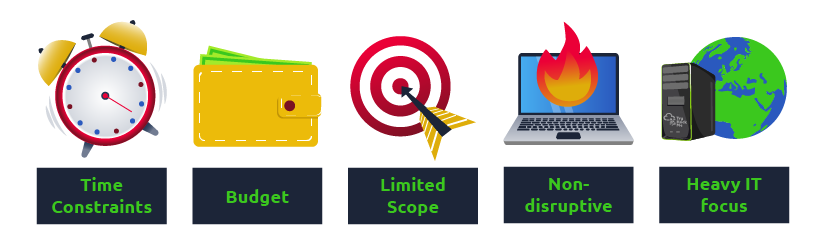
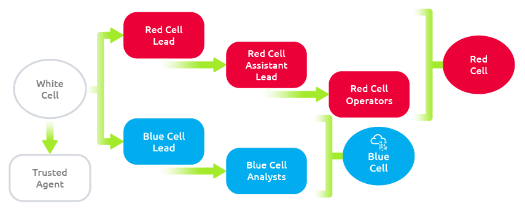
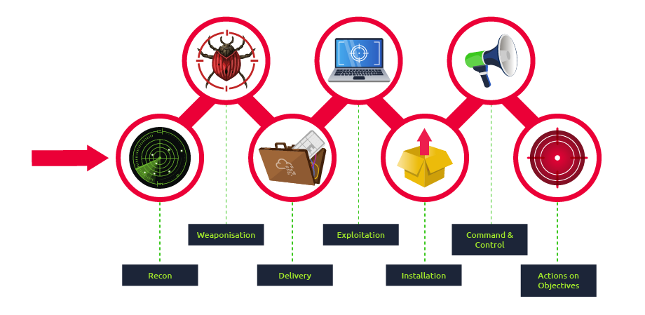
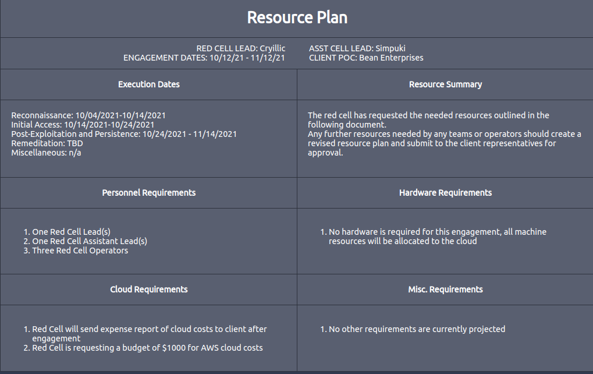

# Red Team Fundamentals

Cybersecurity is a constant race between white hat hackers and black hat hackers. As threats in the cyber-world evolve, so does the need for more specialized services that allow companies to prepare for real attacks the best they can.

While conventional security engagements like vulnerability assessments and penetration tests could provide an excellent overview of the technical security posture of a company, they might overlook some other aspects that a real attacker can exploit. In that sense, we could say that conventional penetration tests are good at showing vulnerabilities so that you can take proactive measures but might not teach you how to respond to an actual ongoing attack by a motivated adversary.

**Vulnerability Assessments**

Vulnerability Assessments aim to find weaknesses in network systems. They scan many hosts for security flaws but avoid harmful actions. Focus is on identifying issues and enabling effective fixes. Automated tools and non-technical operators are mostly used. It's like spotting problems without causing harm.

**Pentetration Tests**
Penetration Tests go beyond finding vulnerabilities. They try to exploit them and assess their impact on the whole network. It's like testing how attackers could use weaknesses to break in and spread through the network. This approach considers vulnerabilities' interactions. It's about understanding how attackers can exploit weaknesses for wider damage.

**Advanced Persistent Threats and why Regular Pentesting is not Enough**
Regular pentesting has limitations: it's loud, may miss non-tech attacks, and relaxes security. Real attackers (Advanced Persistent Threats or APTs) are more covert and skilled. They persistently infiltrate networks. APTs challenge companies' readiness, often targeting critical sectors. Red teaming is a realistic response to APTs, simulating actual attacks for better defense.

Notes: 
- Vulnerability Assessments CANNOT prepare us to detect a real attacker on our network 
- Penetration Testers are not concerned about being detected by the client 

## Red Team Engagements 

Red teaming complements penetration tests, focusing on detection and response to real threats. It simulates adversary tactics and strategies to test blue team's reaction without their prior knowledge. Goals are set, like compromising a key system, and red team tries to achieve them while evading detection. It's not about outsmarting blue team, but improving their ability to handle real threats. 

Red team engagements also improve on regular penetration tests by considering several attack surfaces:

- Technical Infrastructure: Like in a regular penetration test, a red team will try to uncover technical vulnerabilities, with a much higher emphasis on stealth and evasion.
- Social Engineering: Targeting people through phishing campaigns, phone calls or social media to trick them into revealing information that should be private.
- Physical Intrusion: Using techniques like lockpicking, RFID cloning, exploiting weaknesses in electronic access control devices to access restricted areas of facilities.
- Depending on the resources available, the red team exercise can be run in several ways:

- Full Engagement: Simulate an attacker's full workflow, from initial compromise until final goals have been achieved.
- Assumed Breach: Start by assuming the attacker has already gained control over some assets, and try to achieve the goals from there. As an example, the red team could receive access to some user's credentials or even a workstation in the internal network.
- Table-top Exercise:  An over the table simulation where scenarios are discussed between the red and blue teams to evaluate how they would theoretically respond to certain threats. Ideal for situations where doing live simulations might be complicated.

Notes: 
- The goals of a red team engagement will often be referred to as flags or "crow jewels"
- Tactics, Techniques and Procedures - During a red team engagement, common methods used by attackers are emulated against the target

## Teams and Functions of an Engagement 

|    Team    |                                                                                                                                                                          Definition                                                                                                                                                                          |
|:----------:|:------------------------------------------------------------------------------------------------------------------------------------------------------------------------------------------------------------------------------------------------------------------------------------------------------------------------------------------------------------:|
| Red Cell   | A red cell is the component that makes up the offensive portion of a red team engagement that simulates a given target's strategic and tactical responses.                                                                                                                                                                                                   |
| Blue Cell  | The blue cell is the opposite side of red. It includes all the components defending a target network. The blue cell is typically comprised of blue team members, defenders, internal staff, and an organisation's management.                                                                                                                                |
| White Cell | Serves as referee between red cell activities and blue cell responses during an engagement. Controls the engagement environment/network. Monitors adherence to the ROE. Coordinates activities required to achieve engagement goals. Correlates red cell activities with defensive actions. Ensures the engagement is conducted without bias to either side. |

Definitions are sourced from redteam.guide.

Since this is a red team-oriented room, we will focus on the responsibilities of the red cell. Below is a table outlining the roles and responsibilities of members of the red team.

|           Role          |                                                                      Purpose                                                                      |
|:-----------------------:|:-------------------------------------------------------------------------------------------------------------------------------------------------:|
| Red Team Lead           | Plans and organises engagements at a high level—delegates, assistant lead, and operators engagement assignments.                                  |
| Red Team Assistant Lead | Assists the team lead in overseeing engagement operations and operators. Can also assist in writing engagement plans and documentation if needed. |
| Red Team Operator       | Executes assignments delegated by team leads. Interpret and analyse engagement plans from team leads.                                             |

## Engagement Structure 

A core function of the red team is adversary emulation. While not mandatory, it is commonly used to assess what a real adversary would do in an environment using their tools and methodologies. The red team can use various cyber kill chains to summarize and assess the steps and procedures of an engagement.

The blue team commonly uses cyber kill chains to map behaviors and break down an adversaries movement. The red team can adapt this idea to map adversary TTPs (Tactics, Techniques, and Procedures) to components of an engagement.

Many regulation and standardization bodies have released their cyber kill chain. Each kill chain follows roughly the same structure, with some going more in-depth or defining objectives differently. Below is a small list of standard cyber kill chains.

- Lockheed Martin Cyber Kill Chain
- Unified Kill Chain
- Varonis Cyber Kill Chain
- Active Directory Attack Cycle
- MITRE ATT&CK Framework

In this room, we will commonly reference the "Lockheed Martin Cyber Kill Chain." It is a more standardized kill chain than others and is very commonly used among red and blue teams.

The Lockheed Martin kill chain focuses on a perimeter or external breach. Unlike other kill chains, it does not provide an in-depth breakdown of internal movement. You can think of this kill chain as a summary of all behaviors and operations present.

  |       Technique       |                                      Purpose                                      |                     Examples                     |
  |:---------------------:|:---------------------------------------------------------------------------------:|:------------------------------------------------:|
  | Reconnaissance        | Obtain information on the target                                                  | Harvesting emails, OSINT                         |
  | Weaponization         | Combine the objective with an exploit. Commonly results in a deliverable payload. | Exploit with backdoor, malicious office document |
  | Delivery              | How will the weaponized function be delivered to the target                       | Email, web, USB                                  |
  | Exploitation          | Exploit the target's system to execute code                                       | MS17-010, Zero-Logon, etc.                       |
  | Installation          | Install malware or other tooling                                                  | Mimikatz, Rubeus, etc.                           |
  | Command & Control     | Control the compromised asset from a remote central controller                    | Empire, Cobalt Strike, etc.                      |
  | Actions on Objectives | Any end objectives: ransomware, data exfiltration, etc.                           | Conti, LockBit2.0, etc.                          |

## Creating Resource Plans

The resource plan is the second document of the engagement plan, detailing a brief overview of dates, knowledge required (optional), resource requirements. The plan extends the CONOPS and includes specific details, such as dates, knowledge required, etc.

Unlike the CONOPS, the resource plan should not be written as a summary; instead, written as bulleted lists of subsections. As with most red team documents, there is no standard set of resource plan templates or documents; below is an outline of example subsections of the resource plan.

- Header
  - Personnel writing
  - Dates
  - Customer
- Engagement Dates
  - Reconnaissance Dates
  - Initial Compromise Dates
  - Post-Exploitation and Persistence Dates
  - Misc. Dates
- Knowledge Required (optional)
  - Reconnaissance
  - Initial Compromise
  - Post-Exploitation
- Resource Requirements
  - Personnel
  - Hardware
  - Cloud
  - Misc.

The key to writing and understanding a resource plan is to provide enough information to gather what is required but not become overbearing. The document should be straight to the point and define what is needed.

## Reference

- https://0xdf.gitlab.io/2021/07/08/playing-with-printnightmare.html
- https://attack.mitre.org/groups/G0008/ 
- https://redteam.guide/docs/checklists/red-team-checklist 

