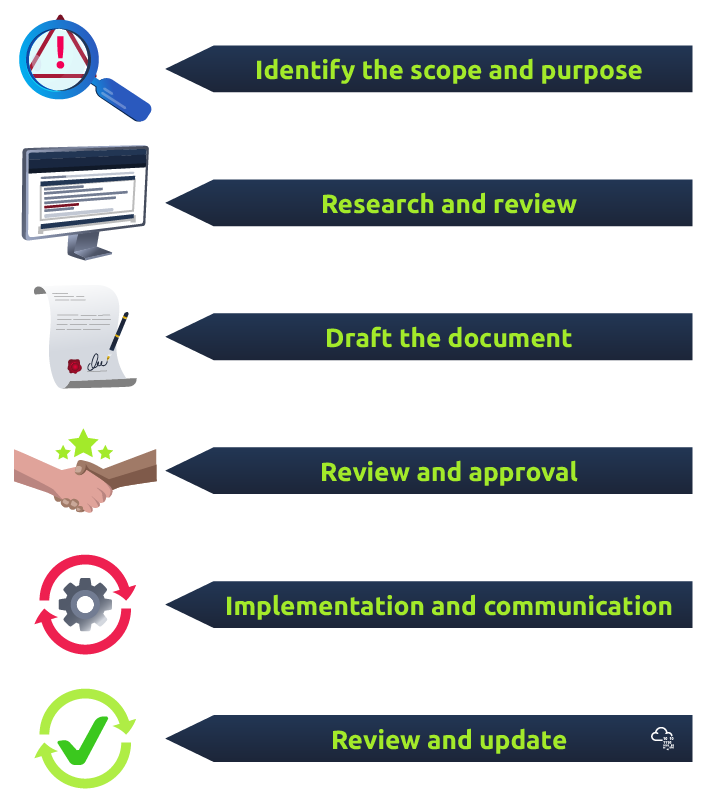
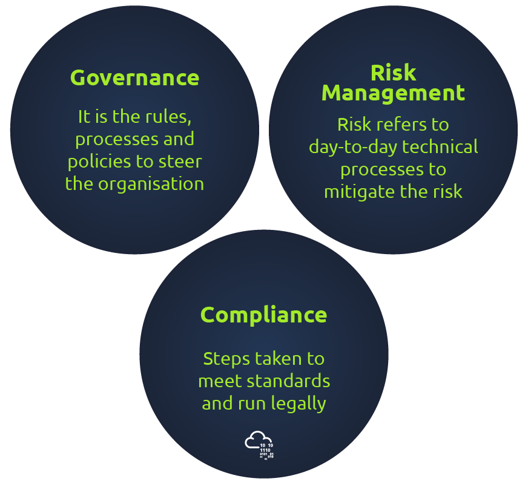

# Governance & Regulation
> https://tryhackme.com/room/cybergovernanceregulation

 Information Security Frameworks
The information security framework provides a comprehensive set of documents that outline the organisation's approach to information security and governs how security is implemented, managed, and enforced within the organisation. This mainly includes:
- Policies: A formal statement that outlines an organisation's goals, principles, and guidelines for achieving specific objectives.
- Standards: A document establishing specific requirements or specifications for a particular process, product, or service.
- Guidelines: A document that provides recommendations and best practices (non-mandatory) for achieving specific goals or objectives.
- Procedures: Set of specific steps for undertaking a particular task or process.
- Baselines: A set of minimum security standards or requirements that an organisation or system must meet.

**Developing Governance Documents**

Define Purpose:

Clearly outline what the document will cover and why it's necessary. For instance, a password policy ensures strong user passwords, while a baseline sets a minimum security level for systems.
Research:

Investigate laws, regulations, industry standards, and best practices for a comprehensive and current document. Check existing documents to avoid duplication or contradictions.
Drafting:

Develop a clear and concise outline. Draft the document with specificity, ensuring it aligns with organizational goals and values. Follow best practices for different document types.
Review and Approval:

Have the document reviewed by stakeholders, including experts and legal teams. Incorporate feedback, ensuring alignment with organizational goals. Secure final approval from relevant stakeholders.
Implementation and Communication:

Communicate the document to all involved parties. Ensure understanding of roles and responsibilities in implementing it. Develop training programs for clarity and adherence.
Review and Update:

Regularly review and update the document to keep it relevant. Monitor compliance, adjusting based on feedback and changes in the threat landscape or regulations.

**Preparing a Password Policy**
- Define password requirements: Minimum length, complexity, and expiration.
- Define password usage guidelines: Specify how passwords should be used, such as requiring unique passwords for each account, prohibiting the sharing of passwords, and prohibiting default passwords.
- Define password storage and transmission guidelines: Using encryption for password storage and requiring secure connections for password transmission.
- Define password change and reset guidelines: How often passwords should be changed etc. 
- Communicate the policy: Communicate the password policy to all relevant employees and stakeholders, and ensure that they understand the requirements and guidelines. Develop training and awareness programs to ensure that employees follow the policy.
- Monitor compliance: Monitor compliance with the password policy and adjust the policy as needed based on feedback and changes in the threat landscape or regulatory environment.

**Making an Incident Response Procedure**
- Define incident types: Unauthorised access, malware infections, or data breaches.
- Define incident response roles and responsibilities: Identify the stakeholders,  such as incident response team members, IT personnel, legal and compliance teams, and senior management. 
- Detailed Steps: Develop step-by-step procedures for responding to each type of incident,  including initial response steps, such as containing the incident and preserving evidence; analysis and investigation steps, such as identifying the root cause and assessing the impact; response and recovery steps, such as mitigating the incident, reporting and restoring normal operations.
- Report the incident to management and document the incident response process for future reference.
- Communicate the incident response procedures.
- Review and update the incident response procedures.

## Governance Risk and Compliance (GRC)

As we have studied, information security governance and compliance are necessary to maintain any organisation's overall security posture. But how to achieve it? Here comes the role of the Governance and Risk Compliance (GRC) framework. It focuses on steering the organisation's overall governance, enterprise risk management, and compliance in an integrated manner. It is a holistic approach to information security that aligns with the organisation's goals and objectives and helps to ensure that the organisation operates within the boundaries of relevant regulations and industry standards. GRC framework has the following three components:

Components of GRC
- Governance Component: Involves guiding an organisation by setting its direction through information security strategy,  which includes policies, standards, baselines, frameworks, etc., along with establishing appropriate monitoring methods to measure its performance and assess the outcomes.
- Risk Management Component: Involves identifying, assessing, and prioritising risks to the organisation and implementing controls and mitigation strategies to manage those risks effectively. This includes monitoring and reporting on risks and continuously evaluating and refining the risk management program to ensure its ongoing effectiveness.
- Compliance Component: Ensuring that the organisation meets its legal, regulatory, and industry obligations and that its activities align with its policies and procedures. This includes developing and implementing compliance programs, conducting regular audits and assessments, and reporting on compliance issues to stakeholders.

**How to Develop GRC Program - Generic Guidelines** 
A well-developed and implemented GRC program for cyber security provides an integrated framework for managing risks, complying with regulations and standards, and improving the overall security perspective of an organisation. It enables effective governance, risk management, and compliance activities, mitigating cyber incidents' impact and ensuring business resilience. In this section, we will explore how to develop and implement a GRC framework. Developing and implementing a GRC framework involves various steps; we will explain each step with an appropriate example so that we can easily understand:

- Define the scope and objectives: This step involves determining the scope of the GRC program and defining its goals. For example, a company can implement a GRC program for its customer data management system. The objective might be to reduce cyber risks to 50% in the next 12 months while maintaining the trust of its customers. 
- Conduct a risk assessment: In this step, the organisation identifies and assesses its cyber risks. For example, a risk assessment might reveal that the customer data management system is vulnerable to external attacks due to weak access controls or outdated software. The organisation can then prioritize these risks and develop a risk management strategy.
- Develop policies and procedures: Policies and procedures are developed to guide cyber security practices within the organisation. For example, the company might establish a password policy to ensure the usage of strong passwords. They might also implement logging and monitoring system access procedures to detect suspicious activity.
- Establish governance processes: Governance processes ensure the GRC program is effectively managed and controlled. For example, the organisation might establish a security steering committee that meets regularly to review security risks and make decisions about security investments and priorities. Roles and responsibilities are defined to ensure everyone understands their role in the program.
- Implement controls: Technical and non-technical controls are implemented to mitigate risks identified in risk assessment. For example, the company might implement firewalls, Intrusion Prevention System (IPS), Intrusion Detection System (IDS), and Security Information and Event Management (SIEM) to prevent external attacks and impart employee training to improve security awareness and reduce the risk of human error.
- Monitor and measure performance: Processes are established to monitor and measure the effectiveness of the GRC program. For example, the organisation can track metrics and compliance with security policies. This information is used to identify areas for improvement and adjust the program as needed.
- Continuously improve: The GRC program is constantly reviewed and improved based on performance metrics, changing risk profiles, and stakeholder feedback. For example, suppose the organisation experiences a security incident. In that case, it might conduct a post-incident analysis to identify the root cause and make changes to prevent a similar incident from happening again.

Related Rooms:
- Intrusion Detection: https://tryhackme.com/room/idsevasion
- IDS/IPS evasion techniques: https://tryhackme.com/room/redteamnetsec
- SIEM: https://tryhackme.com/room/introtosiem

## Privacy and Data Protection