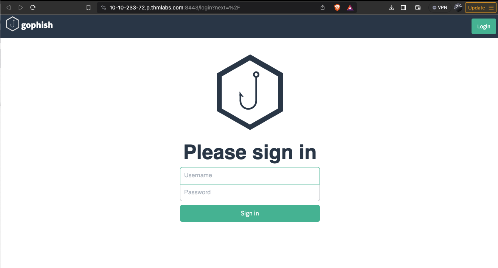
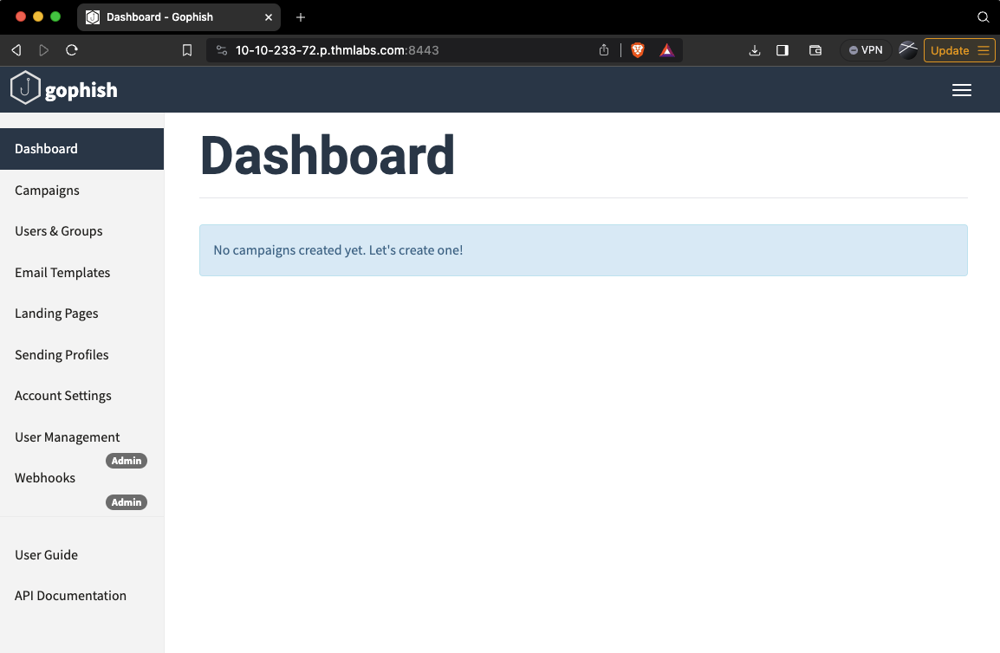
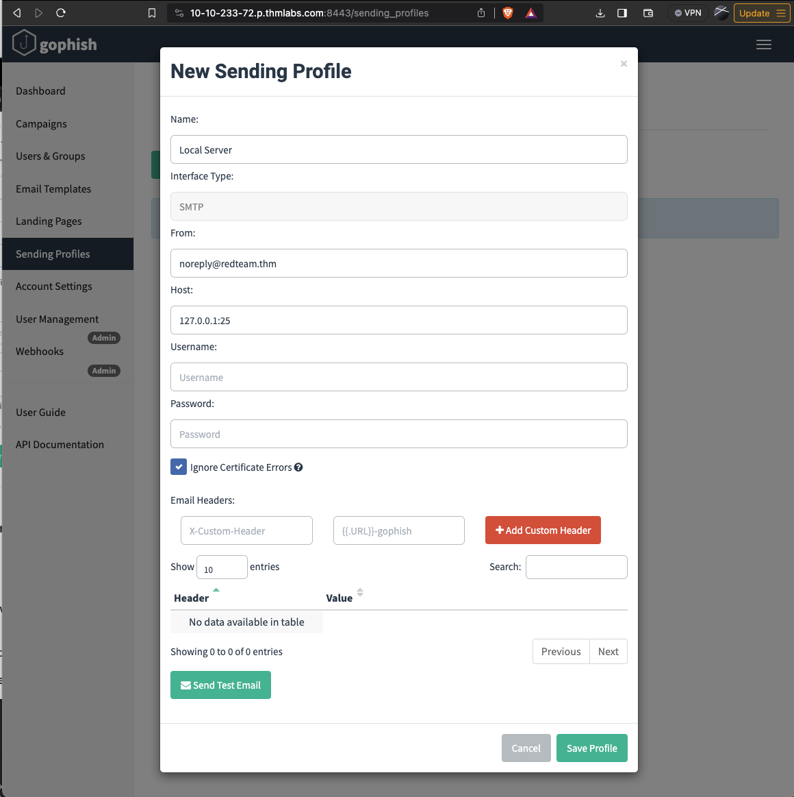
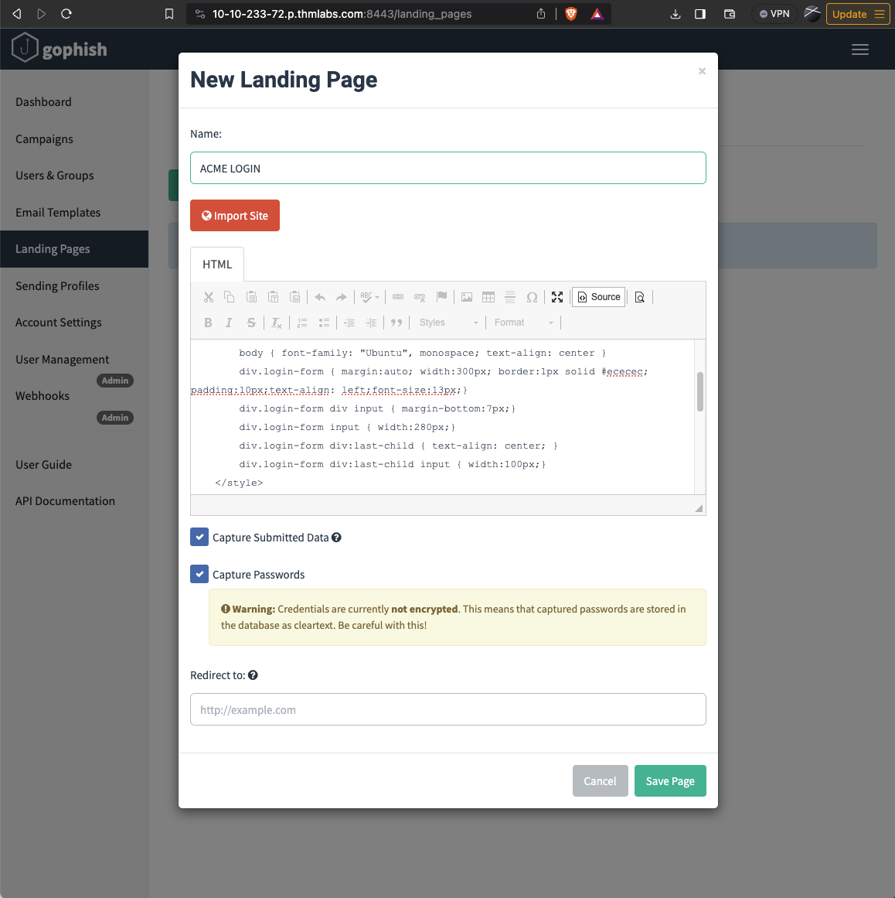
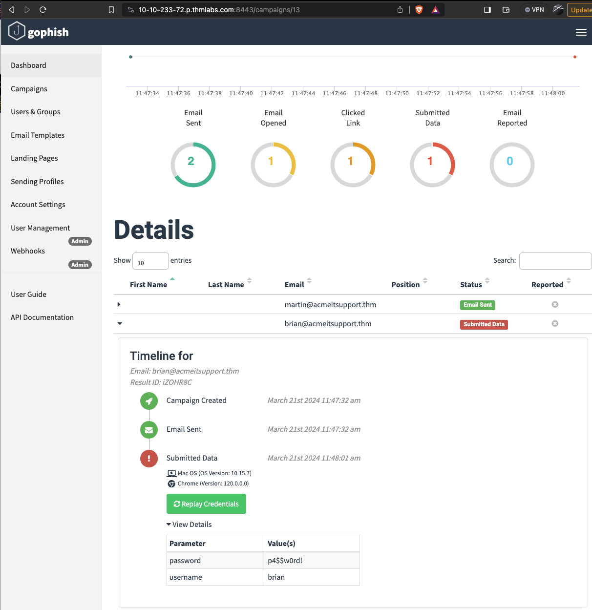

# Intro to Phishing
> https://tryhackme.com/room/phishingyl


Before you learn what phishing is, you'll need to understand the term social engineering. Social engineering is the psychological manipulation of people into performing or divulging information by exploiting weaknesses in human nature. These "weaknesses" can be curiosity, jealously, greed and even kindness and the willingness to help someone. Phishing is a source of social engineering delivered through email to trick someone into either revealing personal information, credentials or even executing malicious code on their computer.

These emails will usually appear to come from a trusted source, whether that's a person or a business. They include content that tries to tempt or trick people into downloading software, opening attachments, or following links to a bogus website.

A term you'll come across and the type of phishing campaign a red team would participate in is spear-phishing, as with throwing a physical spear; you'd have a target to aim at, the same can be said with spear-phishing in that you're targeting an individual, business or organisation rather than just anybody as mass. This is an effective form of phishing for a red team engagement as they are bespoke to the target it makes them hard to detect by technology such as spam filters, antivirus and firewalls.

A red team could be contracted to solely carry out a phishing assessment to see whether a business is vulnerable to this type of attack or can also be part of a broader scale assessment and used to gain access to computer systems or services.

Some other methods of phishing through other mediums are smishing which is phishing through SMS messages, and vishing which is performed through phone calls.


Example Scenario:


The below example scenario shows how an employee of a company could be tricked into revealing their credentials.


1) The attacker locates the physical location of the target business.
2) The attacker then looks for nearby food suppliers and discovers a company called Ultimate Cookies!
3) The Attacker registers the domain name ultimate-cookies.thm
4) The attacker then crafts an email to their target, tempting them with an offer of receiving some free cookies if they sign up to the website. Because the victim has heard of this local company, they are more likely to trust it.
5) The victim then follows the link in the email to the fake website created by the attacker and registers online. To keep things simple, the victim reuses the same password for all their online accounts.
6) The attacker now has the victim's email address and password and can log onto the victim's company email account. The attacker could now have access to private company information and also have somewhere to launch another phishing attack against other employees.


## Writing Convincing Phishing Emails

We have three things to work with regarding phishing emails: the sender's email address, the subject and the content.


The Senders Address:

Ideally, the sender's address would be from a domain name that spoofs a significant brand, a known contact, or a coworker. See the Choosing A Phishing Domain task below for more information on this.


To find what brands or people a victim interacts with, you can employ OSINT (Open Source Intelligence) tactics. For example:

- Observe their social media account for any brands or friends they talk to.
- Searching Google for the victim's name and rough location for any reviews the victim may have left about local businesses or brands.
- Looking at the victim's business website to find suppliers.
- Looking at LinkedIn to find coworkers of the victim.
- The Subject:

You should set the subject to something quite urgent, worrying, or piques the victim's curiosity, so they do not ignore it and act on it quickly.

Examples of this could be:

- Your account has been compromised.
- Your package has been dispatched/shipped.
- Staff payroll information (do not forward!)
- Your photos have been published.

The Content:

If impersonating a brand or supplier, it would be pertinent to research their standard email templates and branding (style, logo's images, signoffs etc.) and make your content look the same as theirs, so the victim doesn't expect anything. If impersonating a contact or coworker, it could be beneficial to contact them; first, they may have some branding in their template, have a particular email signature or even something small such as how they refer to themselves, for example, someone might have the name Dorothy and their email is dorothy@company.thm. Still, in their signature, it might say "Best Regards, Dot". Learning these somewhat small things can sometimes have quite dramatic psychological effects on the victim and convince them more to open and act on the email.


If you've set up a spoof website to harvest data or distribute malware, the links to this should be disguised using the anchor text and changing it either to some text which says "Click Here" or changing it to a correct looking link that reflects the business you are spoofing, for example:

```html
<a href="http://spoofsite.thm">Click Here</a>
<a href="http://spoofsite.thm">https://onlinebank.thm</a>
```
What tactic can be used to find brands or people a victim interacts with?	OSINT
What should be changed on an HTML anchor tag to disguise a link?	anchor text

## PHISHING INFRASTRUCTURE

A certain amount of infrastructure will need to be put in place to launch a successful phishing campaign.

Domain Name:
You'll need to register either an authentic-looking domain name or one that mimics the identity of another domain. See task 5 for details on how to create the perfect domain name.

SSL/TLS Certificates:
Creating SSL/TLS certificates for your chosen domain name will add an extra layer of authenticity to the attack.

Email Server/Account:
You'll need to either set up an email server or register with an SMTP email provider. 

DNS Records:
Setting up DNS Records such as SPF, DKIM, DMARC will improve the deliverability of your emails and make sure they're getting into the inbox rather than the spam folder.

Web Server:
You'll need to set up webservers or purchase web hosting from a company to host your phishing websites. Adding SSL/TLS to the websites will give them an extra layer of authenticity. 

Analytics:
When a phishing campaign is part of a red team engagement, keeping analytics information is more important. You'll need something to keep track of the emails that have been sent, opened or clicked. You'll also need to combine it with information from your phishing websites for which users have supplied personal information or downloaded software. 

Automation And Useful Software:
Some of the above infrastructures can be quickly automated by using the below tools.

GoPhish - (Open-Source Phishing Framework) - getgophish.com
GoPhish is a web-based framework to make setting up phishing campaigns more straightforward. GoPhish allows you to store your SMTP server settings for sending emails, has a web-based tool for creating email templates using a simple WYSIWYG (What You See Is What You Get) editor. You can also schedule when emails are sent and have an analytics dashboard that shows how many emails have been sent, opened or clicked.

The Next task will talk you through how to launch a phishing campaign using this software.

SET - (Social Engineering Toolkit) - trustedsec.com
The Social Engineering Toolkit contains a multitude of tools, but some of the important ones for phishing are the ability to create spear-phishing attacks and deploy fake versions of common websites to trick victims into entering their credentials.

## Using GoPhish

Firstly launch the virtual machine by clicking the green Start Machine button on the right; once loaded, click the following URL to open the GoPhish login page https://10-10-233-72.p.thmlabs.com:8443  or if you're connected to the TryHackMe VPN, you can to go https://10.10.233.72  (if you receive an Nginx error, wait another 30 seconds and try again).


admin
tryhackme




**Sending Profiles:**

Sending profiles are the connection details required to actually send your Phishing emails; this is just simply an SMTP server that you have access to. Click the Sending Profiles link on the left-hand menu and then click the "New Profile" button.

Next, add in the following information as per the screenshot below:

Name: Local Server
From: noreply@redteam.thm
Host: 127.0.0.1:25



**Landing Pages**

Next, we're going to set up the landing page; this is the website that the Phishing email is going to direct the victim to; this page is usually a spoof of a website the victim is familiar with.

Click the Landing Pages link on the left-hand menu and then click the "New Page" button.
Give the Landing Page the name ACME Login, next in the HTML box; **you'll need to press** the **Source button** to allow us to enter the HTML code as shown below:

```html
<!DOCTYPE html>
<html lang="en">
<head>
    <meta charset="UTF-8">
    <title>ACME IT SUPPORT - Admin Panel</title>
    <style>
        body { font-family: "Ubuntu", monospace; text-align: center }
        div.login-form { margin:auto; width:300px; border:1px solid #ececec; padding:10px;text-align: left;font-size:13px;}
        div.login-form div input { margin-bottom:7px;}
        div.login-form input { width:280px;}
        div.login-form div:last-child { text-align: center; }
        div.login-form div:last-child input { width:100px;}
    </style>
</head>
<body>
    <h2>ACME IT SUPPORT</h2>
    <h3>Admin Panel</h3>
    <form method="post">
        <div class="login-form">
            <div>Username:</div>
            <div><input name="username"></div>
            <div>Password:</div>
            <div><input type="password" name="password"></div>
            <div><input type="submit" value="Login"></div>
        </div>
    </form>
</body>
</html>
```



Email Templates:

This is the design and content of the email you're going to actually send to the victim; it will need to be persuasive and contain a link to your landing page to enable us to capture the victim's username and password. Click the Email Templates link on the left-hand menu and then click the New Template button. Give the template the name Email 1, the subject New Message Received, click the HTML tab, and then the Source button to enable HTML editor mode. In the contents write a persuasive email that would convince the user to click the link, the link text will need to be set to https://admin.acmeitsupport.thm, but the actual link will need to be set to {{.URL}} which will get changed to our spoofed landing page when the email gets sent, you can do this by highlighting the link text and then clicking the link button on the top row of icons, make sure to set the protocol dropdown to <other>.

**Users & Groups**

This is where we can store the email addresses of our intended targets. Click the Users & Groups link on the left-hand menu and then click the New Group button. Give the group the name Targets and then add the following email addresses:

- martin@acmeitsupport.thm 
- brian@acmeitsupport.thm 
- accounts@acmeitsupport.thm

Click the Save Template button; once completed



## Phishing Domain

Choosing the right Phishing domain to launch your attack from is essential to ensure you have the psychological edge over your target. A red team engagement can use some of the below methods for choosing the perfect domain name.

Expired Domains:
Although not essential, buying a domain name with some history may lead to better scoring of your domain when it comes to spam filters. Spam filters have a tendency to not trust brand new domain names compared to ones with some history.


Typosquatting:
Typosquatting is when a registered domain looks very similar to the target domain you're trying to impersonate. Here are some of the common methods:

Misspelling: goggle.com Vs google.com
Additional Period: go.ogle.com Vs google.com
Switching numbers for letters: g00gle.com Vs google.com
Phrasing: googles.com Vs google.com
Additional Word: googleresults.com Vs google.com

These changes might look unrealistic, but at a glance, the human brain tends to fill in the blanks and see what it wants to see, i.e. the correct domain name.

TLD Alternatives:

A TLD (Top Level Domain) is the .com .net .co.uk .org .gov e.t.c part of a domain name, there are 100's of variants of TLD's now. A common trick for choosing a domain would be to use the same name but with a different TLD. For example, register tryhackme.co.uk to impersonate tryhackme.com.

IDN Homograph Attack/Script Spoofing:

Originally domain names were made up of Latin characters a-z and 0-9, but in 1998, IDN (internationalized domain name) was implemented to support language-specific script or alphabet from other languages such as Arabic, Chinese, Cyrillic, Hebrew and more. An issue that arises from the IDN implementation is that different letters from different languages can actually appear identical. For example, Unicode character U+0430 (Cyrillic small letter a) looks identical to Unicode character U+0061 (Latin small letter a) used in English, enabling attackers to register a domain name that looks almost identical to another.

## MS office in Phishing

Often during phishing campaigns, a Microsoft Office document (typically Word, Excel or PowerPoint) will be included as an attachment. Office documents can contain macros; macros do have a legitimate use but can also be used to run computer commands that can cause malware to be installed onto the victim's computer or connect back to an attacker's network and allow the attacker to take control of the victim's computer.

Take, for example, the following scenario:

A staff member working for Acme IT Support receives an email from human resources with an excel spreadsheet called "Staff_Salaries.xlsx" intended to go to the boss but somehow ended up in the staff members inbox instead. 

What really happened was that an attacker spoofed the human resources email address and crafted a psychologically tempting email perfectly aimed to tempt the staff member into opening the attachment.


Once the staff member opened the attachment and enabled the macros, their computer was compromised.

## Browser Exploits

Another method of gaining control over a victim's computer could be through browser exploits; this is when there is a vulnerability against a browser itself (Internet Explorer/Edge, Firefox, Chrome, Safari, etc.), which allows the attacker to run remote commands on the victim's computer.

Browser exploits aren't usually a common path to follow in a red team engagement unless you have prior knowledge of old technology being used on-site. Many browsers are kept up to date, hard to exploit due to how browsers are developed, and the exploits are often worth a lot of money if reported back to the developers.

That being said, it can happen, and as previously mentioned, it could be used to target old technologies on-site because possibly the browser software cannot be updated due to incompatibility with commercial software/hardware, which can happen quite often in big institutions such as education, government and especially health care.

Usually, the victim would receive an email, convincing them to visit a particular website set up by the attacker. Once the victim is on the site, the exploit works against the browser, and now the attacker can perform any commands they wish on the victim's computer.

An example of this is CVE-2021-40444 from September 2021, which is a vulnerability found in Microsoft systems that allowed the execution of code just from visiting a website.

