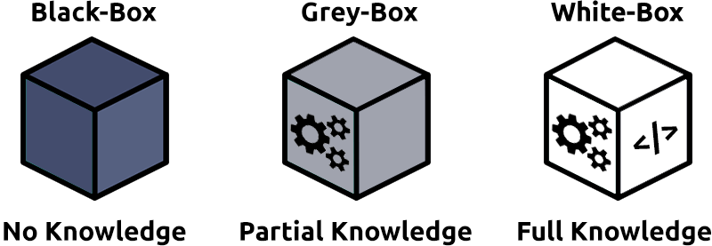

# Introduction to Pentesting 

A Penetration test or pentest is an ethically-driven attempt to test and analyse the security defences to protect these assets and pieces of information. A penetration test involves using the same tools, techniques, and methodologies that someone with malicious intent would use and is similar to an audit.
According to Security Magazine, a cybersecurity industry magazine, there are over 2,200 cyber attacks every day - 1 attack every 39 seconds.

## PENTESTING FUNDAMENTALS
### Penetration Testing Ethics 

Penetration test is an **authorised audit** and defences as agreed by the owners of the systems. 
Anything that falls outside of this agreement is deemed unauthorised

Before a penetration test starts, a formal discussion occurs.
This discussion forms the **scope of the penetration testing agreement**

| Hat Category |                                                              Description                                                              |                                            Example                                           |
|:------------:|:-------------------------------------------------------------------------------------------------------------------------------------:|:--------------------------------------------------------------------------------------------:|
|   White Hat  |           These hackers are considered the "good people". They remain within the law and use their skills to benefit others.          |      For example, a penetration tester performing an authorised engagement on a company.     |
|   Grey Hat   | These people use their skills to benefit others often; however, they do not respect/follow the law or ethical standards at all times. |                       For example, someone taking down a scamming site.                      |
|   Black Hat  |   These people  are criminals and often seek to damage organisations or gain some form of financial benefit at the cost of others.    | For example, ransomware authors infect devices with malicious code and hold data for ransom. |


**Rules of Engagement (ROE)**

The ROE is a document that is created at the initial stages of a penetration testing engagement. This document consists of three main sections (explained in the table below), which are ultimately responsible for deciding how the engagement is carried out. The SANS institute has a great example of this document which you can view online here. 
https://sansorg.egnyte.com/dl/bF4I3yCcnt/?

|   Section  |                                                                                                                      Description                                                                                                                     |
|:----------:|:----------------------------------------------------------------------------------------------------------------------------------------------------------------------------------------------------------------------------------------------------:|
| Permission |                     This section of the document gives explicit permission for the engagement to be carried out. This permission is essential to legally protect individuals and organisations for the activities they carry out.                    |
| Test Scope |                   This section of the document will annotate specific targets to which the engagement should apply. For example, the penetration test may only apply to certain servers or applications but not the entire network.                  |
|    Rules   | The rules section will define exactly the techniques that are permitted during the engagement. For example, the rules may specifically state that techniques such as phishing attacks are prohibited, but MITM (Man-in-the-Middle) attacks are okay. |

### Penetration Testing Methodologies 


|         Stage         |                                                                                                                                                                                    Description                                                                                                                                                                                   |
|:---------------------:|:--------------------------------------------------------------------------------------------------------------------------------------------------------------------------------------------------------------------------------------------------------------------------------------------------------------------------------------------------------------------------------:|
| Information Gathering |                                                                                       This stage involves collecting as much publically accessible information about a target/organisation as possible, for example, OSINT and research.  Note: This does not involve scanning any systems.                                                                                      |
|  Enumeration/Scanning |                                                                                                              This stage involves discovering applications and services running on the systems. For example, finding a web server that may be potentially vulnerable.                                                                                                             |
|      Exploitation     |                                                                                                     This stage involves leveraging vulnerabilities discovered on a system or application. This stage can involve the use of public exploits or exploiting application logic.                                                                                                     |
|  Privilege Escalation | Once you have successfully exploited a system or application (known as a foothold), this stage is the attempt to expand your access to a system. You can escalate horizontally and vertically, where horizontally is accessing another account of the same permission group (i.e. another user), whereas vertically is that of another permission group (i.e. an administrator). |
|   Post-exploitation   |                                                                             This stage involves a few sub-stages:  1. What other hosts can be targeted (pivoting) 2. What additional information can we gather from the host now that we are a privileged user 3.  Covering your tracks 4. Reporting                                                                             |


**OSSTMM**

The Open Source Security Testing Methodology Manual provides a detailed framework of testing strategies for systems, software, applications, communications and the human aspect of cybersecurity.
> https://www.isecom.org/OSSTMM.3.pdf 

The methodology focuses primarily on how these systems, applications communicate, so it includes a methodology for:
- Telecommunications (phones, VoIP, etc.)
- Wired Networks
- Wireless communications

**OWASP**  
The "Open Web Application Security Project" framework is a community-driven and frequently updated framework used solely to test the security of web applications and services 

**NIST Cybersecurity Framework 1.1**  
The NIST Cybersecurity Framework is a popular framework used to improve an organisations cybersecurity standards and manage the risk of cyber threats. This framework is a bit of an honourable mention because of its popularity and detail.
 
**NCSC CAF**  
The Cyber Assessment Framework (CAF) is an extensive framework of fourteen principles used to assess the risk of various cyber threats and an organisation's defences against these.

The framework applies to organisations considered to perform "vitally important services and activities" such as critical infrastructure, banking, and the likes. The framework mainly focuses on and assesses the following topics:
- Data security
- System security
- Identity and access control
- Resiliency
- Monitoring
- Response and recovery planning

### Black/Grey/White Box Testing 



There are three primary scopes when testing an application or service. Your understanding of your target will determine the level of testing that you perform in your penetration testing engagement. In this task, we'll cover these three different scopes of testing.

**Black-Box Testing**  
This testing process is a high-level process where the tester is not given any information about the inner workings of the application or service.

**Grey-Box Testing**  
the limited knowledge given saves time, and is often chosen for extremely well-hardened attack surfaces.

**White-Box Testing**
The tester will have full knowledge of the application and its expected behaviour


### Test 

Abbey Feltwood
HR Administrator at the ACME company

Email: a.feltwood@acme.co.uk 
500 + connections 

```
user@thm:~$ scan 96.37.50.151

Starting vulnerability scan
Vulnerability scan for 96.37.50.151
Service Vulnerable?
Web Yes
Login No
```

## PRINCIPLES OF SECURITY

### The CIA Triad 
The CIA triad is an information security model that is used in consideration throughout creating a security policy. This model has an extensive background, ranging from being used in 1998.

**Confidentiality**
This element is the protection of data from unauthorized access and misuse. Organisations will always have some form of sensitive data stored on their systems. To provide confidentiality is to protect this data from parties that it is not intended for.

**Integrity**
The CIA triad element of integrity is the condition where information is kept accurate and consistent unless authorized changes are made. It is possible for the information to change because of careless access and use, errors in the information system, or unauthorized access and use. In the CIA triad, integrity is maintained when the information remains unchanged during storage, transmission, and usage not involving modification to the information. Steps must be taken to ensure data cannot be altered by unauthorised people (for example, in a breach of confidentiality).

**Availability**
In order for data to be useful, it must be available and accessible by the user.

Availability is very often a key benchmark for an organisation. For example, having 99.99% uptime on their websites or systems (this is laid out in Service Level Agreements). When a system is unavailable, it often results in damage to an organisations reputation and loss of finances. Availability is achieved through a combination of many elements, including:
- Having reliable and well-tested hardware for their information technology servers (i.e. reputable servers)
- Having redundant technology and services in the case of failure of the primary
- Implementing well-versed security protocols to protect technology and services from attack

### Principles Of Privileges 

It is vital to administrate and correctly define the various levels of access to an information technology system individuals require.

The levels of access given to individuals are determined on two primary factors:
- The individual's role/function within the organisation
- The sensitivity of the information being stored on the system

Two key concepts are used to assign and manage the access rights of individuals
**Privileged Access Management (or PAM for short).**
If you wanted to manage the privileges a system access role had

**Privileged Identity Management (PIM)**
If you wanted to create a system role that is based on a users role/responsibilities with an organisation

### Security Models Continued

**The Bell-La Padula Model**
is used to achieve confidentiality. This model has a few assumptions, such as an organisation's hierarchical structure it is used in, where everyone's responsibilities/roles are well-defined.
![model] (./media/4-bell-model.png)

The Bell LaPadula Model is popular within organisations such as governmental and military. This is because members of the organisations are presumed to have already gone through a process called vetting. Vetting is a screening process where applicant's backgrounds are examined to establish the risk they pose to the organisation. Therefore, applicants who are successfully vetted are assumed to be trustworthy - which is where this model fits in.


**Biba Model**
The Biba model is arguably the equivalent of the Bell-La Padula model but for the integrity of the CIA triad.
 
This model applies the rule to objects (data) and subjects (users) that can be summarised as "no write up, no read down". This rule means that subjects can create or write content to objects at or below their level but can only read the contents of objects above the subject's level.
![model] (./media/4-biba-model.png)

The Biba model is used in organisations or situations where integrity is more important than confidentiality. For example, in software development, developers may only have access to the code that is necessary for their job. They may not need access to critical pieces of information such as databases, etc.

### Threat Modeling & Incident Response
Threat modelling is the process of reviewing, improving, and testing the security protocols in place in an organisation's information technology infrastructure and services.

The threat modelling process is very similar to a risk assessment made in workplaces for employees and customers
- Preparation
- Identification
- Mitigations
- Review


## My Key Take Aways 

I. PENTESTING FUNDAMENTALS
Make sure to discuss first with the System owner about the attack and create a **RULES OF ENGAGEMENT**. 

Stages of the Pentetration testing are:
- Info Gathering 
Go to linkedin, their website. collect public available data.
Find interests, connections, etc 


- Enumeration/Scanning
- Exploitation
- Privilege Escalation
- Post-Exploitation 

And After the attack there are alot of Pen Test Assessment Framework you can use. 
mainly I think I'll focus on **OWASP**


There a lot of Pentesting Assessment Frameworks 

---

Security Models 
**The Bell-La Padula Model** is good for military organizations  
**Biba Model** is good for software development organizations


