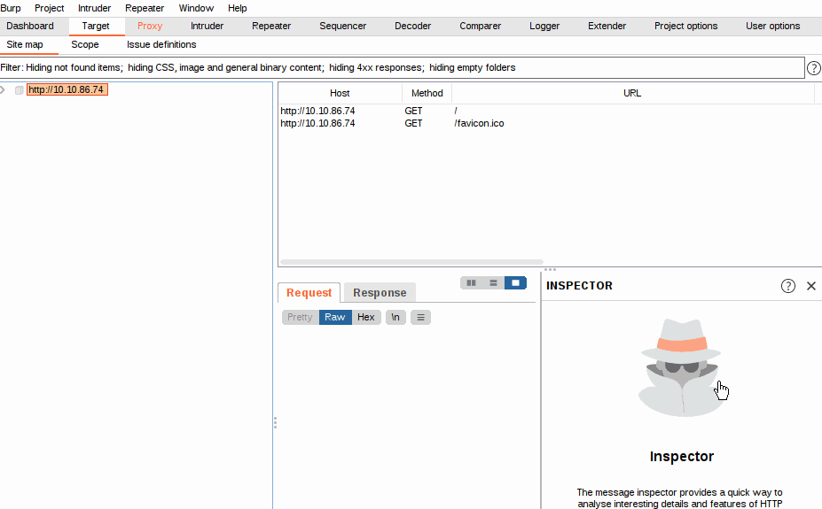
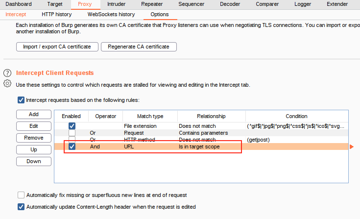
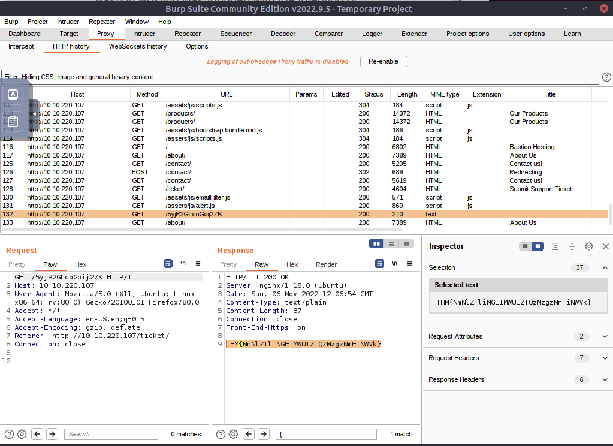
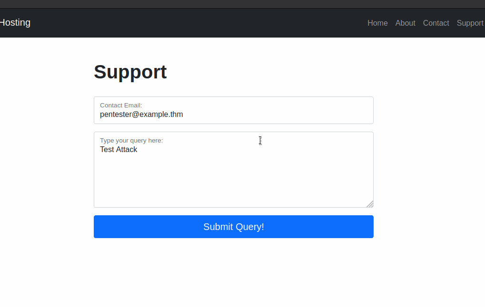
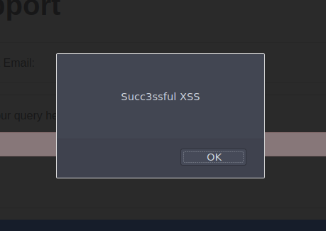

# Burpsuite 

## Burpsuite Basics 

Whilst Burp Community has a relatively limited feature-set compared to the Professional edition, it still has many superb tools available. These include:

- Proxy: The most well-known aspect of Burp Suite, the Burp Proxy allows us to intercept and modify requests/responses when interacting with web applications.
- Repeater: The second most well-known Burp feature -- Repeater -- allows us to capture, modify, then resend the same request numerous times. This feature can be absolutely invaluable, especially when we need to craft a payload through trial and error (e.g. in an SQLi -- Structured Query Language Injection) or when testing the functionality of an endpoint for flaws.
- Intruder: Although harshly rate-limited in Burp Community, Intruder allows us to spray an endpoint with requests. This is often used for bruteforce attacks or to fuzz endpoints.
- Decoder: Though less-used than the previously mentioned features, Decoder still provides a valuable service when transforming data -- either in terms of decoding captured information, or encoding a payload prior to sending it to the target. Whilst there are other services available to do the same job, doing this directly within Burp Suite can be very efficient.
- Comparer: As the name suggests, Comparer allows us to compare two pieces of data at either word or byte level. Again, this is not something that is unique to Burp Suite, but being able to send (potentially very large) pieces of data directly into a comparison tool with a single keyboard shortcut can speed things up considerably.
- Sequencer: We usually use Sequencer when assessing the randomness of tokens such as session cookie values or other supposedly random generated data. If the algorithm is not generating secure random values, then this could open up some devastating avenues for attack.

### PROXY

Burp Proxy is the most fundamental (and most important!) of the tools available in Burp Suite. It allows us to capture requests and responses between ourselves and our target. These can then be manipulated or sent to other tools for further processing before being allowed to continue to their destination

"Match and Replace" section; this allows you to perform regexes on incoming and outgoing requests. For example, you can automatically change your user agent to emulate a different web browser in outgoing requests or remove all cookies being set in incoming requests. Again, you are free to make your own rules here.

### PROXYING HTTPS

What happens if we navigate to a site with TLS enabled? For example, `https://google.com/`

Firefox is telling us that the `Portswigger Certificate Authority (CA)` isn't authorised to secure the connection

**ACTION ITEM**  

First, with the proxy activated head to http://burp/cert; this will download a file called cacert.der -- save it somewhere on your machine.

Next, type `about:preferences` into your Firefox search bar and press enter; this takes us to the FireFox settings page. Search the page for "certificates" and we find the option to "View Certificates"

Clicking the "View Certificates" button allows us to see all of our trusted CA certificates. We can register a new certificate for Portswigger by pressing "Import" and selecting the file that we just downloaded.

In the menu that pops up, select "Trust this CA to identify websites", then click Ok:

We should now be free to visit any TLS enabled sites that we wish!

### SCOPING AND TARGETING 

It can get extremely tedious having Burp capturing all of our traffic. When it logs everything (including traffic to sites we aren't targeting), it muddies up logs we may later wish to send to clients. In short, allowing Burp to capture everything can quickly become a massive pain.

We just chose to disable logging for out of scope traffic, but the proxy will still be intercepting everything. To turn this off, we need to go into the Proxy Options sub-tab and select "And URL Is in target scope" from the Intercept Client Requests section:

With this option selected, the proxy will completely ignore anything that isn't in the scope, vastly cleaning up the traffic coming through Burp.

### PROXY SITE MAP AND ISSUE DEFINITIONS 

Control of the scope may be the most useful aspect of the Target tab, but it's by no means the only use for this section of Burp.

There are three sub-tabs under Target:

- **Site map** allows us to map out the apps we are targeting in a tree structure. Every page that we visit will show up here, allowing us to automatically generate a site map for the target simply by browsing around the web app. Burp Pro would also allow us to spider the targets automatically (i.e. look through every page for links and use them to map out as much of the site as-is publicly accessible using the links between pages); however, with Burp Community, we can still use this to accumulate data whilst we perform our initial enumeration steps.
The Site map can be especially useful if we want to map out an API, as whenever we visit a page, any API endpoints that the page retrieves data from whilst loading will show up here.
- **Scope**: We have already seen the Scope sub-tab -- it allows us to control Burp's target scope for the project.
- **Issue Definitions**: Whilst we don't have access to the Burp Suite vulnerability scanner in Burp Community, we do still have access to a list of all the vulnerabilities it looks for. The Issue Definitions section gives us a huge list of web vulnerabilities (complete with descriptions and references) which we can draw from should we need citations for a report or help describing a vulnerability.

**THE CHALLENGE** 

I just visited the website and manually viewing the pages. 
while intercepting the requests

then i switched to the `HTTP HISTORY` Sub Tab and viewed all the request/response 

THM{NmNlZTliNGE1MWU1ZTQzMzgzNmFiNWVk} 

### EXAMPLE ATTACK 
Trying to type ` `

BUT Front end side has a filter

With the request captured in the proxy, we can now change the email field to be our very simple payload from above: . After pasting in the payload, we need to select it, then URL encode it with the Ctrl + U shortcut to make it safe to send. This process is shown in the GIF below:

Finally, press the "Forward" button to send the request.

You should find that you get an alert box from the site indicating a successful XSS attack!

    

