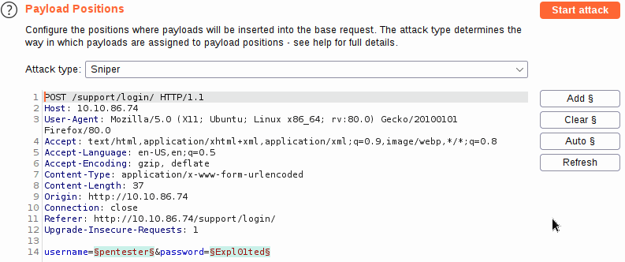
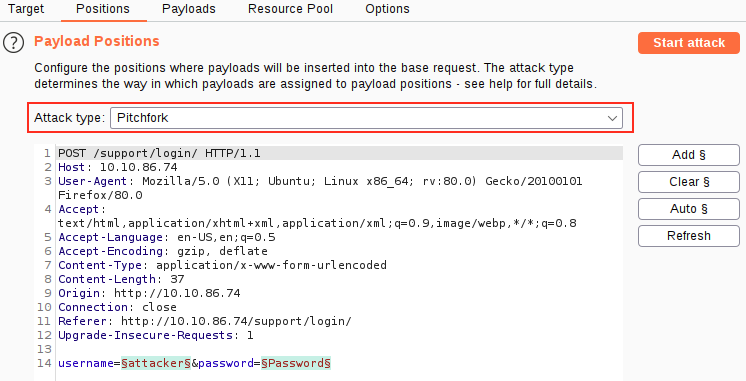
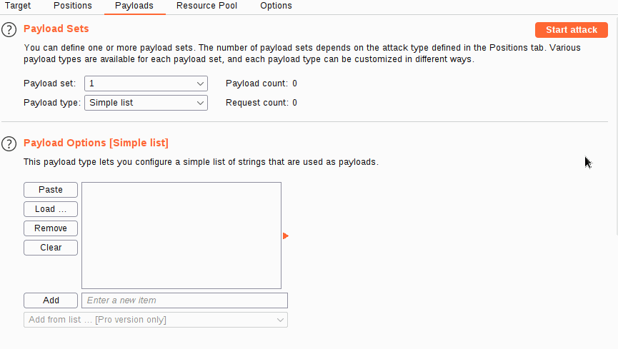
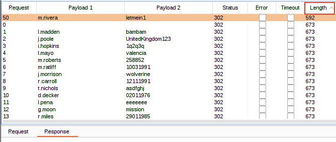
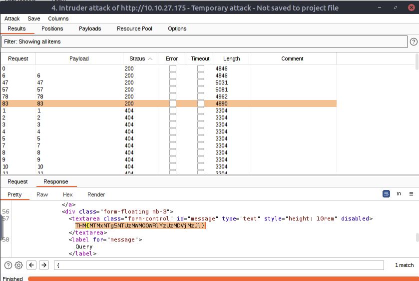
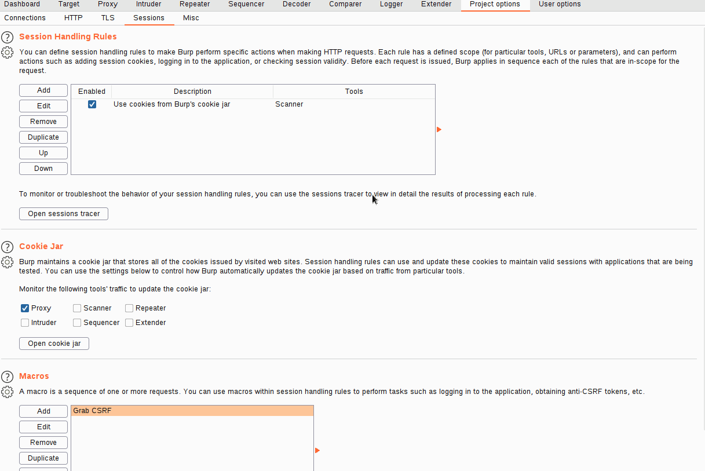
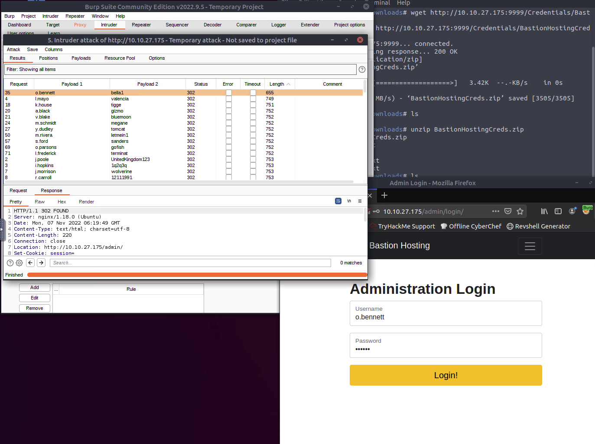

# Burpsuite 

## Burpsuite Basics 

Whilst Burp Community has a relatively limited feature-set compared to the Professional edition, it still has many superb tools available. These include:

- Proxy: The most well-known aspect of Burp Suite, the Burp Proxy allows us to intercept and modify requests/responses when interacting with web applications.
- Repeater: The second most well-known Burp feature -- Repeater -- allows us to capture, modify, then resend the same request numerous times. This feature can be absolutely invaluable, especially when we need to craft a payload through trial and error (e.g. in an SQLi -- Structured Query Language Injection) or when testing the functionality of an endpoint for flaws.
- Intruder: Although harshly rate-limited in Burp Community, Intruder allows us to spray an endpoint with requests. This is often used for bruteforce attacks or to fuzz endpoints.
- Decoder: Though less-used than the previously mentioned features, Decoder still provides a valuable service when transforming data -- either in terms of decoding captured information, or encoding a payload prior to sending it to the target. Whilst there are other services available to do the same job, doing this directly within Burp Suite can be very efficient.
- Comparer: As the name suggests, Comparer allows us to compare two pieces of data at either word or byte level. Again, this is not something that is unique to Burp Suite, but being able to send (potentially very large) pieces of data directly into a comparison tool with a single keyboard shortcut can speed things up considerably.
- Sequencer: We usually use Sequencer when assessing the randomness of tokens such as session cookie values or other supposedly random generated data. If the algorithm is not generating secure random values, then this could open up some devastating avenues for attack.

## PROXY

Burp Proxy is the most fundamental (and most important!) of the tools available in Burp Suite. It allows us to capture requests and responses between ourselves and our target. These can then be manipulated or sent to other tools for further processing before being allowed to continue to their destination

"Match and Replace" section; this allows you to perform regexes on incoming and outgoing requests. For example, you can automatically change your user agent to emulate a different web browser in outgoing requests or remove all cookies being set in incoming requests. Again, you are free to make your own rules here.

### PROXYING HTTPS

What happens if we navigate to a site with TLS enabled? For example, `https://google.com/`


Firefox is telling us that the `Portswigger Certificate Authority (CA)` isn't authorised to secure the connection

**ACTION ITEM**  

First, with the proxy activated head to http://burp/cert; this will download a file called cacert.der -- save it somewhere on your machine.

Next, type `about:preferences` into your Firefox search bar and press enter; this takes us to the FireFox settings page. Search the page for "certificates" and we find the option to "View Certificates"


Clicking the "View Certificates" button allows us to see all of our trusted CA certificates. We can register a new certificate for Portswigger by pressing "Import" and selecting the file that we just downloaded.

In the menu that pops up, select "Trust this CA to identify websites", then click Ok:


We should now be free to visit any TLS enabled sites that we wish!


### SCOPING AND TARGETING 

It can get extremely tedious having Burp capturing all of our traffic. When it logs everything (including traffic to sites we aren't targeting), it muddies up logs we may later wish to send to clients. In short, allowing Burp to capture everything can quickly become a massive pain.


We just chose to disable logging for out of scope traffic, but the proxy will still be intercepting everything. To turn this off, we need to go into the Proxy Options sub-tab and select "And URL Is in target scope" from the Intercept Client Requests section:


With this option selected, the proxy will completely ignore anything that isn't in the scope, vastly cleaning up the traffic coming through Burp.
### PROXY SITE MAP AND ISSUE DEFINITIONS 

Control of the scope may be the most useful aspect of the Target tab, but it's by no means the only use for this section of Burp.

There are three sub-tabs under Target:

- **Site map** allows us to map out the apps we are targeting in a tree structure. Every page that we visit will show up here, allowing us to automatically generate a site map for the target simply by browsing around the web app. Burp Pro would also allow us to spider the targets automatically (i.e. look through every page for links and use them to map out as much of the site as-is publicly accessible using the links between pages); however, with Burp Community, we can still use this to accumulate data whilst we perform our initial enumeration steps.
The Site map can be especially useful if we want to map out an API, as whenever we visit a page, any API endpoints that the page retrieves data from whilst loading will show up here.
- **Scope**: We have already seen the Scope sub-tab -- it allows us to control Burp's target scope for the project.
- **Issue Definitions**: Whilst we don't have access to the Burp Suite vulnerability scanner in Burp Community, we do still have access to a list of all the vulnerabilities it looks for. The Issue Definitions section gives us a huge list of web vulnerabilities (complete with descriptions and references) which we can draw from should we need citations for a report or help describing a vulnerability.

**THE CHALLENGE** 

I just visited the website and manually viewing the pages. 
while intercepting the requests

then i switched to the `HTTP HISTORY` Sub Tab and viewed all the request/response 


THM{NmNlZTliNGE1MWU1ZTQzMzgzNmFiNWVk} 

### EXAMPLE ATTACK 
Trying to type `<script>alert("Succ3ssful XSS")</script> `


BUT Front end side has a filter

With the request captured in the proxy, we can now change the email field to be our very simple payload from above: <script>alert("Succ3ssful XSS")</script>. After pasting in the payload, we need to select it, then URL encode it with the Ctrl + U shortcut to make it safe to send. This process is shown in the GIF below:


Finally, press the "Forward" button to send the request.

You should find that you get an alert box from the site indicating a successful XSS attack!


## REPEATER 

Burp Suite Repeater allows us to craft and/or relay intercepted requests to a target at will. In layman's terms, it means we can take a request captured in the Proxy, edit it, and send the same request repeatedly as many times as we wish. Alternatively, we could craft requests by hand, much as we would from the CLI (Command Line Interface), using a tool such as cURL to build and send requests


    
## INTRUDER 

Intruder is Burp Suite's in-built fuzzing tool. It allows us to take a request (usually captured in the Proxy before being passed into Intruder) and use it as a template to send many more requests with slightly altered values automatically. For example, by capturing a request containing a login attempt, we could then configure Intruder to swap out the username and password fields for values from a wordlist, effectively allowing us to bruteforce the login form. Similarly, we could pass in a fuzzing[1] wordlist and use Intruder to fuzz for subdirectories, endpoints, or virtual hosts. This functionality is very similar to that provided by command-line tools such as Wfuzz or Ffuf.

On the right-hand side of the interface, we have the buttons labelled "Add §", "Clear §", and "Auto §":
- Add lets us define new positions by highlighting them in the editor and clicking the button.
- Clear removes all defined positions, leaving us with a blank canvas to define our own.
- Auto attempts to select the most likely positions automatically; this is useful if we cleared the default positions and want them back.

Here is a GIF demonstrating the process of adding, clearing, and automatically reselecting positions:


### Sniper

Sniper is good for attacks where we are only attacking a single parameter
We can calculate the number of requests that Intruder Sniper will make as requests = numberOfWords * numberOfPositions.
This quality makes Sniper very good for single-position attacks (e.g. a password bruteforce if we know the username or fuzzing for API endpoints).

```
wordlist = admin, guest
string
username=§pentester§&password=§exploited§

Test runs
- username=admin&password=exploited
- username=guest&password=exploited
- username=pentester&password=admin
- username=pentester&password=guest
```

### Battering Ram 
If we use Battering ram to attack this, Intruder will take each payload and substitute it into every position at once.
each item in our list of payloads gets put into every position for each request. True to the name, Battering ram just throws payloads at the target to see what sticks.
 
```
wordlist = admin, guest
string
username=§pentester§&password=§Expl01ted§

Test runs
- username=admin&password=admin
- username=guest&password=guest

```

### Pitchfork 

Pitchfork is the attack type you are most likely to use. It may help to think of Pitchfork as being like having numerous Snipers running simultaneously. Where Sniper uses one payload set (which it uses on every position simultaneously), Pitchfork uses one payload set per position (up to a maximum of 20) and iterates through them all at once
needs 2 wordlists
- Our first wordlist will be usernames. It contains three entries: joel, harriet, alex.
- Let's say that Joel, Harriet, and Alex have had their passwords leaked: we know that Joel's password is J03l, Harriet's password is Emma1815, and Alex's password is Sk1ll

When using Intruder in pitchfork mode, the requests made would look something like this:


| Request Number |            Request Body            |
|:--------------:|:----------------------------------:|
|        1       |     username=joel&password=J03l    |
|        2       | username=harriet&password=Emma1815 |
|        3       |    username=alex&password=Sk1ll    |


### Cluster Bomb 

Like Pitchfork, Cluster bomb allows us to choose multiple payload sets: one per position, up to a maximum of 20; however, whilst Pitchfork iterates through each payload set simultaneously, Cluster bomb iterates through each payload set individually, making sure that every possible combination of payloads is tested.
Let's use the same wordlists as before:
- Usernames: joel, harriet, alex.
- Passwords: J03l, Emma1815, Sk1ll.

| Request Number |            Request Body            |
|:--------------:|:----------------------------------:|
|        1       |     username=joel&password=J03l    |
|        2       |   username=harriet&password=J03l   |
|        3       |     username=alex&password=J03l    |
|        4       |   username=joel&password=Emma1815  |
|        5       | username=harriet&password=Emma1815 |
|        6       |   username=alex&password=Emma1815  |
|        7       |    username=joel&password=Sk1ll    |
|        8       |   username=harriet&password=Sk1ll  |
|        9       |    username=alex&password=Sk1ll    |

Cluster Bomb will iterate through every combination of the provided payload sets to ensure that every possibility has been tested. This attack-type can create a huge amount of traffic (equal to the number of lines in each payload set multiplied together)

### Example
Attack type pitchfork

Load two different wordlist
usename and password


Once the attack has completed, we will be presented with a new window giving us the results -- but we have a new problem. Burp sent 100 requests: how are we supposed to know which one(s), if any, are valid?
he next most common solution is to use the Length of the responses to identify differences between them



i click the length col to sort out the different one

### PRACTICAL 

Target: `http://10.10.27.175/support/ticket/NUMBER`

generated number 1-100 then used sniper attack for discovering IDOR tickets



### EXTRA MILE 

using burp macro
We have the same username and password fields as before, but now there is also a session cookie set in the response, as well as a CSRF (Cross-Site Request Forgery) token included in the form as a hidden field. If we refresh the page, we should see that both of these change with each request: this means that we will need to extract valid values for both every time we make a request.

setup macro
go to "PROJECT OPTIONS" tab, then "Sessions" sub tab


Now that we have a macro defined, we need to set Session Handling rules that define how the macro should be used.
Still in the "Sessions" sub-tab of Project Options,
scroll up to the "Session Handling Rules" section and choose to "Add" a new rule. 


After configuring the scope rules, 
we need to switch back over to the Details tab and look at the "Rule Actions" section.

As it stands, this macro will now overwrite all of the parameters in our Intruder requests before we send them; this is great, as it means that we will be getting the loginTokens and session cookies added straight into our requests. That said, we should restrict which parameters and cookies are being updated before we start our attack:


You should now have a macro defined that will substitute in the CSRF token and session cookie. All that's left to do is switch back to Intruder and start the attack!

302 for if macro is working, 403 error if not 

Now just run the intruder in pitch fork, then sort the length 
get the lowest value



refresh before trying to log manually


## MY NOTES
Open burp
- scope target 
- options 'Intercept Client Request' check `AND` box
