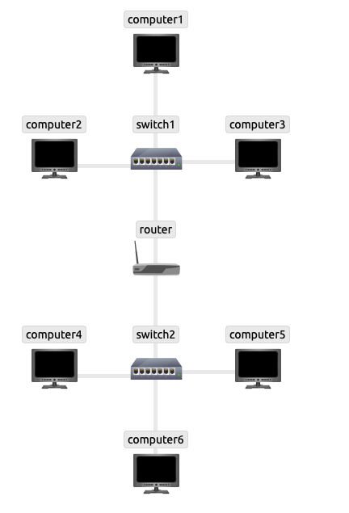
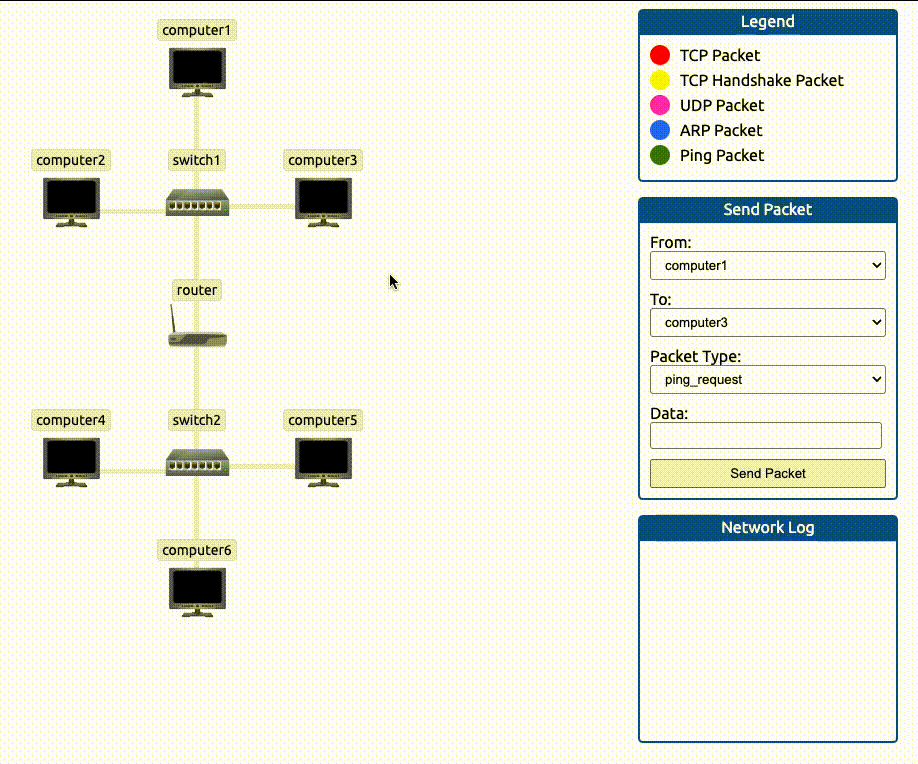
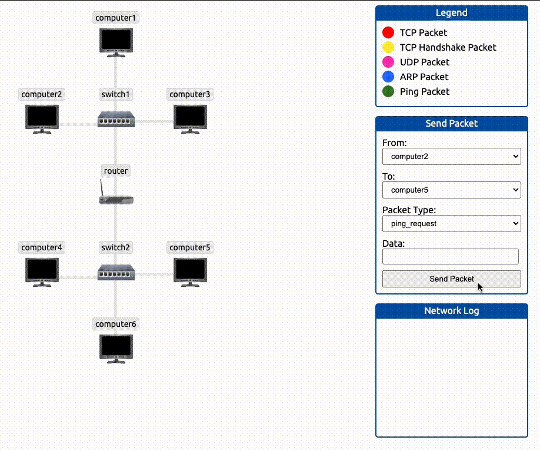
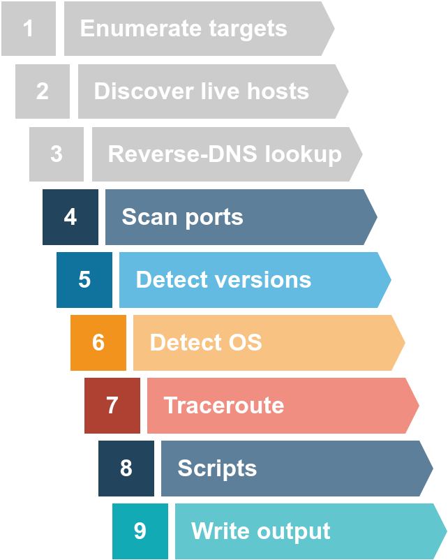
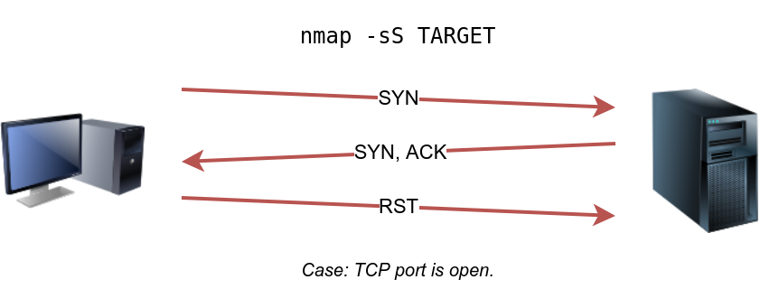
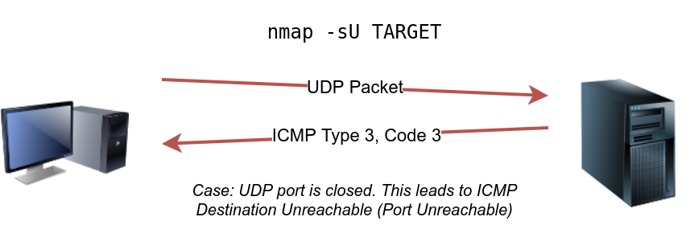

# Network Security

 Network Security Modules:

- Passive Reconnaissance
- Active Reconnaissance
- Nmap Live Host Discovery
- Nmap Basic Port Scans
- Nmap Advanced Port Scans
- Nmap Post Port Scans
- Protocols and Servers
- Protocols and Servers 2
- Network Security Challenge

 after we define passive reconnaissance and active reconnaissance, we focus on essential tools related to passive reconnaissance. We will learn three command-line tools:

- whois to query WHOIS servers
- nslookup to query DNS servers
- dig to query DNS servers

We use whois to query WHOIS records, while we use nslookup and dig to query DNS database records. These are all publicly available records and hence do not alert the target.


We will also learn the usage of two online services:

DNSDumpster
Shodan.io

## PASSIVE VS ACTIVE RECONNAISSANCE 

In passive reconnaissance, you rely on publicly available knowledge. It is the knowledge that you can access from publicly available resources without directly engaging with the target. Think of it like you are looking at target territory from afar without stepping foot on that territory.

Passive reconnaissance activities include many activities, for instance:
- Looking up DNS records of a domain from a public DNS server.
- Checking job ads related to the target website.
- Reading news articles about the target company.

Active reconnaissance, on the other hand, cannot be achieved so discreetly. It requires direct engagement with the target. Think of it like you check the locks on the doors and windows, among other potential entry points.
examples:
- Connecting to one of the company servers such as HTTP, FTP, and SMTP.
- Calling the company in an attempt to get information (social engineering).
- Entering company premises pretending to be a repairman.

### WHOIS 
WHOIS is a request and response protocol that follows the RFC 3912 specification. A WHOIS server listens on TCP port 43 for incoming requests. The domain registrar is responsible for maintaining the WHOIS records for the domain names it is leasing. The WHOIS server replies with various information related to the domain requested. Of particular interest, we can learn:

- Registrar: Via which registrar was the domain name registered?
- Contact info of registrant: Name, organization, address, phone, among other things. (unless made hidden via a privacy service)
- Creation, update, and expiration dates: When was the domain name first registered? When was it last updated? And when does it need to be renewed?
- Name Server: Which server to ask to resolve the domain name?

### NSLOOKUP AND DIG 

Find the IP address of a domain name using `nslookup`, which stands for Name Server Look Up.

| Query type |       Result       |
|:----------:|:------------------:|
|      A     |   IPv4 Addresses   |
|    AAAA    |   IPv6 Addresses   |
|    CNAME   |   Canonical Name   |
|     MX     |    Mail Servers    |
|     SOA    | Start of Authority |
|     TXT    |     TXT Records    |


For instance, nslookup -type=A tryhackme.com 1.1.1.1 (or nslookup -type=a tryhackme.com 1.1.1.1 as it is case-insensitive) can be used to return all the IPv4 addresses used by tryhackme.com.
 
### Conclusion 

|         Lookup WHOIS record         |           whois tryhackme.com           |
|:-----------------------------------:|:---------------------------------------:|
|         Lookup DNS A records        |      nslookup -type=A tryhackme.com     |
| Lookup DNS MX records at DNS server | nslookup -type=MX tryhackme.com 1.1.1.1 |
|        Lookup DNS TXT records       |     nslookup -type=TXT tryhackme.com    |
|         Lookup DNS A records        |           dig tryhackme.com A           |
| Lookup DNS MX records at DNS server |      dig @1.1.1.1 tryhackme.com MX      |
|        Lookup DNS TXT records       |          dig tryhackme.com TXT          |

## ACTIVE RECONNAISSANCE

Active reconnaissance requires you to make some kind of contact with your target. This contact can be a phone call or a visit to the target company under some pretence to gather more information, usually as part of social engineering. Alternatively, it can be a direct connection to the target system, whether visiting their website or checking if their firewall has an SSH port open. Think of it like you are closely inspecting windows and door locks. Hence, it is essential to remember not to engage in active reconnaissance work before getting signed legal authorization from the client.

There are also plenty of add-ons for Firefox and Chrome that can help in penetration testing. Here are a few examples:

- **FoxyProxy** lets you quickly change the proxy server you are using to access the target website. This browser extension is convenient when you are using a tool such as Burp Suite or if you need to switch proxy servers regularly. You can get FoxyProxy for Firefox from here.
- **User-Agent Switcher and Manager** gives you the ability to pretend to be accessing the webpage from a different operating system or different web browser. In other words, you can pretend to be browsing a site using an iPhone when in fact, you are accessing it from Mozilla Firefox. You can download User-Agent Switcher and Manager for Firefox here.
- **Wappalyzer** provides insights about the technologies used on the visited websites. Such extension is handy, primarily when you collect all this information while browsing the website like any other user. A screenshot of Wappalyzer is shown below. You can find Wappalyzer for Firefox here.

**PING**
-c count
-s packet size 


**telnet**
telnet $IP $PORT 
(once connected)
GET / HTTP/1.1
host: example 
( double enter)


### Conclusion 

|      Command     |                   Example                  |
|:----------------:|:------------------------------------------:|
|       ping       | ping -c 10 10.10.235.164 on Linux or macOS |
|       ping       |   ping -n 10 10.10.235.164 on MS Windows   |
|    traceroute    | traceroute 10.10.235.164 on Linux or macOS |
|      tracert     |     tracert 10.10.235.164 on MS Windows    |
|      telnet      |      telnet 10.10.235.164 PORT_NUMBER      |
| netcat as client |        nc 10.10.235.164 PORT_NUMBER        |
| netcat as server |            nc -lvnp PORT_NUMBER            | 


##  NMAP LIVE HOST DICOVERY 

This room is the first of four in this Nmap series 

- Nmap Live Host Discovery
- Nmap Basic Port Scans
- Nmap Advanced Port Scans
- Nmap Post Port Scans

We present the different approaches that Nmap uses to discover live hosts. In particular, we cover:

- **ARP scan**: This scan uses ARP requests to discover live hosts
- **ICMP scan**: This scan uses ICMP requests to identify live hosts
- **TCP/UDP ping scan**: This scan sends packets to TCP ports and UDP ports to determine live hosts.

 Nmap was created by Gordon Lyon (Fyodor), a network security expert and open source programmer. It was released in 1997 
A Nmap scan usually goes through the steps shown in the figure below, although many are optional and depend on the command-line arguments you provide.


### DISCOVERING LIVEHOST 

To visualize an ARP and PING to subnetworks


**Same subnet**


The first ping will require to make an ARP request first to know where is the location of the target.
the second request is will no longer require an ARP request because the address is cached

**Different subnet**

same from top, will first request an ARP then if it's not on the same subnet. 
the router will send another arp request to the Different subnet. 
before the ping request is received.

the second request no longer requires ARP request because address is cached 

### SUMMARY 

|        Scan Type       |              Example Command              |
|:----------------------:|:-----------------------------------------:|
|        ARP Scan        |      sudo nmap -PR -sn MACHINE_IP/24      |
|     ICMP Echo Scan     |      sudo nmap -PE -sn MACHINE_IP/24      |
|   ICMP Timestamp Scan  |      sudo nmap -PP -sn MACHINE_IP/24      |
| ICMP Address Mask Scan |      sudo nmap -PM -sn MACHINE_IP/24      |
|    TCP SYN Ping Scan   |  sudo nmap -PS22,80,443 -sn MACHINE_IP/30 |
|    TCP ACK Ping Scan   |  sudo nmap -PA22,80,443 -sn MACHINE_IP/30 |
|      UDP Ping Scan     | sudo nmap -PU53,161,162 -sn MACHINE_IP/30 |

Remember to add `-sn` if you are only interested in host discovery without port-scanning. Omitting `-sn` will let Nmap default to port-scanning the live hosts.

| Option |              Purpose             |
|:------:|:--------------------------------:|
|   -n   |           no DNS lookup          |
|   -R   | reverse-DNS lookup for all hosts |
|   -sn  |        host discovery only       |

If you want to use a specific DNS server `--dns-servers DNS_SERVER`

> return to finish notes. https://tryhackme.com/room/nmap01 


## NMAP BASIC PORT SCANS

In the previous room, we focused on discovering online systems. So far, we have covered three steps of a Nmap scan:

- Enumerate targets
- Discover live hosts
- Reverse-DNS lookup



The next step would be checking which ports are open and listening and which ports are closed. Therefore, in this room and the next one, we focus on port scanning and the different types of port scans used by nmap. This room explains:

- TCP connect port scan
- TCP SYN port scan
- UDP port scan

### TCP AND UDP PORTS 

a TCP port or UDP port is used to identify a network service running on that host

At the risk of oversimplification, we can classify ports in two states:

- Open port indicates that there is some service listening on that port.
- Closed port indicates that there is no service listening on that port.

However, in practical situations, we need to consider the impact of firewalls. For instance, a port might be open, but a firewall might be blocking the packets. Therefore, Nmap considers the following six states:

- Open: indicates that a service is listening on the specified port.
- Closed: indicates that no service is listening on the specified port, although the port is accessible. By accessible, we mean that it is reachable and is not blocked by a firewall or other security appliances/programs.
- Filtered: means that Nmap cannot determine if the port is open or closed because the port is not accessible. This state is usually due to a firewall preventing Nmap from reaching that port. Nmap’s packets may be blocked from reaching the port; alternatively, the responses are blocked from reaching Nmap’s host.
- Unfiltered: means that Nmap cannot determine if the port is open or closed, although the port is accessible. This state is encountered when using an ACK scan -sA.
- Open|Filtered: This means that Nmap cannot determine whether the port is open or filtered.
- Closed|Filtered: This means that Nmap cannot decide whether a port is closed or filtered.

### TCP FLAGS

**The following figure shows the TCP header as defined in RFC 793.**
This figure looks sophisticated at first; however, it is pretty simple to understand. In the first row, we have the source TCP port number and the destination port number. We can see that the port number is allocated 16 bits (2 bytes). In the second and third rows, we have the sequence number and the acknowledgement number. Each row has 32 bits (4 bytes) allocated, with six rows total, making up 24 bytes.


- URG: Urgent flag indicates that the urgent pointer filed is significant. The urgent pointer indicates that the incoming data is urgent, and that a TCP segment with the URG flag set is processed immediately without consideration of having to wait on previously sent TCP segments.
- ACK: Acknowledgement flag indicates that the acknowledgement number is significant. It is used to acknowledge the receipt of a TCP segment.
- PSH: Push flag asking TCP to pass the data to the application promptly.
- RST: Reset flag is used to reset the connection. Another device, such as a firewall, might send it to tear a TCP connection. This flag is also used when data is sent to a host and there is no service on the receiving end to answer.
- SYN: Synchronize flag is used to initiate a TCP 3-way handshake and synchronize sequence numbers with the other host. The sequence number should be set randomly during TCP connection establishment.
- FIN: The sender has no more data to send.


### TCP CONNECT SCAN

TCP connect scan works by completing the TCP 3-way handshake. In standard TCP connection establishment, the client sends a TCP packet with SYN flag set, and the server responds with SYN/ACK if the port is open; finally, the client completes the 3-way handshake by sending an ACK.


You can choose to run TCP connect scan using `-sT`


### TCP SYN 

Unprivileged users are limited to connect scan. However, the **default scan mode is SYN scan**, and it **requires** a privileged (**root or sudoer**) user to run it.

The figure below shows how the TCP SYN scan works without completing the TCP 3-way handshake


TCP SYN scan is the default scan mode when running Nmap as a privileged user, running as root or using sudo, and it is a very reliable choice. It has successfully discovered the open ports you found earlier with the TCP connect scan, yet no TCP connection was fully established with the target.

`sudo nmap -sS 10.10.238.109`


### UDP SCAN 

UPD does not respond for connection when it's open. 
BUT it sends an `ICMP port unreachable error(typ3, code 3) or ICMP Type3, Code 3`

The following figure shows that if we send a UDP packet to an open UDP port, we cannot expect any reply in return. Therefore, sending a UDP packet to an open port won’t tell us anything.


However, as shown in the figure below, we expect to get an ICMP packet of type 3, destination unreachable, and code 3, port unreachable. In other words, the UDP ports that don’t generate any response are the ones that Nmap will state as open.



### FINE TUNING SCOPE and PERFORMANCE 

You can specify the ports you want to scan instead of the default 1000 ports. Specifying the ports is intuitive by now. Let’s see some examples:

- port list: -p22,80,443 will scan ports 22, 80 and 443.
- port range: -p1-1023 will scan all ports between 1 and 1023 inclusive, while -p20-25 will scan ports between 20 and 25 inclusive.

You can request the scan of all ports by using -p-, which will scan all 65535 ports. If you want to scan the most common 100 ports, add -F. Using --top-ports 10 will check the ten most common ports.

You can control the scan timing using -T<0-5>. -T0 is the slowest (paranoid), while -T5 is the fastest. According to Nmap manual page, there are six templates:

- paranoid (0)
- sneaky (1)
- polite (2)
- normal (3)
- aggressive (4)
- insane (5) 

To avoid IDS alerts, you might consider -T0 or -T1. For instance, -T0 scans one port at a time and waits 5 minutes between sending each probe, so you can guess how long scanning one target would take to finish. If you don’t specify any timing, Nmap uses normal -T3. Note that -T5 is the most aggressive in terms of speed; however, this can affect the accuracy of the scan results due to the increased likelihood of packet loss. Note that -T4 is often used during CTFs and when learning to scan on practice targets, whereas -T1 is often used during real engagements where stealth is more important.

Alternatively, you can choose to control the packet rate using --min-rate <number> and --max-rate <number>. For example, --max-rate 10 or --max-rate=10 ensures that your scanner is not sending more than ten packets per second.

Moreover, you can control probing parallelization using --min-parallelism <numprobes> and --max-parallelism <numprobes>. Nmap probes the targets to discover which hosts are live and which ports are open; probing parallelization specifies the number of such probes that can be run in parallel. For instance, --min-parallelism=512 pushes Nmap to maintain at least 512 probes in parallel; these 512 probes are related to host discovery and open ports.

### SUMMARY

This room covered three types of scans. 

|  Port Scan Type  |       Example Command       |
|:----------------:|:---------------------------:|
| TCP Connect Scan |    nmap -sT 10.10.101.129   |
|   TCP SYN Scan   | sudo nmap -sS 10.10.101.129 |
|     UDP Scan     | sudo nmap -sU 10.10.101.129 | 

These scan types should get you started discovering running TCP and UDP services on a target host.

|         Option        |                  Purpose                 |
|:---------------------:|:----------------------------------------:|
|          -p-          |                 all ports                |
|        -p1-1023       |           scan ports 1 to 1023           |
|           -F          |           100 most common ports          |
|           -r          |      scan ports in consecutive order     |
|        -T<0-5>        | -T0 being the slowest and T5 the fastest |
|     --max-rate 50     |          rate <= 50 packets/sec          |
|     --min-rate 15     |          rate >= 15 packets/sec          |
| --min-parallelism 100 |      at least 100 probes in parallel     |


## MY NOTES 


```bash
#PASSIVE RECON - Public info

nslookup -type=A tryhackme.com     # IPv4 Address
nslookup -type=MX tryhackme.com 1.1.1.1  # Mail Servers
nslookup -type=TXT tryhackme.com     # Txt records

```

other useful sites 
- DNSDumpster 
- shodan.io


