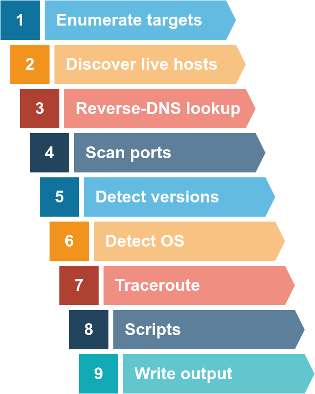

# Network Security

 Network Security Modules:

- Passive Reconnaissance
- Active Reconnaissance
- Nmap Live Host Discovery
- Nmap Basic Port Scans
- Nmap Advanced Port Scans
- Nmap Post Port Scans
- Protocols and Servers
- Protocols and Servers 2
- Network Security Challenge

 after we define passive reconnaissance and active reconnaissance, we focus on essential tools related to passive reconnaissance. We will learn three command-line tools:

- whois to query WHOIS servers
- nslookup to query DNS servers
- dig to query DNS servers

We use whois to query WHOIS records, while we use nslookup and dig to query DNS database records. These are all publicly available records and hence do not alert the target.


We will also learn the usage of two online services:

DNSDumpster
Shodan.io

## PASSIVE VS ACTIVE RECONNAISSANCE 

In passive reconnaissance, you rely on publicly available knowledge. It is the knowledge that you can access from publicly available resources without directly engaging with the target. Think of it like you are looking at target territory from afar without stepping foot on that territory.

Passive reconnaissance activities include many activities, for instance:
- Looking up DNS records of a domain from a public DNS server.
- Checking job ads related to the target website.
- Reading news articles about the target company.

Active reconnaissance, on the other hand, cannot be achieved so discreetly. It requires direct engagement with the target. Think of it like you check the locks on the doors and windows, among other potential entry points.
examples:
- Connecting to one of the company servers such as HTTP, FTP, and SMTP.
- Calling the company in an attempt to get information (social engineering).
- Entering company premises pretending to be a repairman.

### WHOIS 
WHOIS is a request and response protocol that follows the RFC 3912 specification. A WHOIS server listens on TCP port 43 for incoming requests. The domain registrar is responsible for maintaining the WHOIS records for the domain names it is leasing. The WHOIS server replies with various information related to the domain requested. Of particular interest, we can learn:

- Registrar: Via which registrar was the domain name registered?
- Contact info of registrant: Name, organization, address, phone, among other things. (unless made hidden via a privacy service)
- Creation, update, and expiration dates: When was the domain name first registered? When was it last updated? And when does it need to be renewed?
- Name Server: Which server to ask to resolve the domain name?

### NSLOOKUP AND DIG 

Find the IP address of a domain name using `nslookup`, which stands for Name Server Look Up.

| Query type |       Result       |
|:----------:|:------------------:|
|      A     |   IPv4 Addresses   |
|    AAAA    |   IPv6 Addresses   |
|    CNAME   |   Canonical Name   |
|     MX     |    Mail Servers    |
|     SOA    | Start of Authority |
|     TXT    |     TXT Records    |


For instance, nslookup -type=A tryhackme.com 1.1.1.1 (or nslookup -type=a tryhackme.com 1.1.1.1 as it is case-insensitive) can be used to return all the IPv4 addresses used by tryhackme.com.
 
### Conclusion 

|         Lookup WHOIS record         |           whois tryhackme.com           |
|:-----------------------------------:|:---------------------------------------:|
|         Lookup DNS A records        |      nslookup -type=A tryhackme.com     |
| Lookup DNS MX records at DNS server | nslookup -type=MX tryhackme.com 1.1.1.1 |
|        Lookup DNS TXT records       |     nslookup -type=TXT tryhackme.com    |
|         Lookup DNS A records        |           dig tryhackme.com A           |
| Lookup DNS MX records at DNS server |      dig @1.1.1.1 tryhackme.com MX      |
|        Lookup DNS TXT records       |          dig tryhackme.com TXT          |

## ACTIVE RECONNAISSANCE

Active reconnaissance requires you to make some kind of contact with your target. This contact can be a phone call or a visit to the target company under some pretence to gather more information, usually as part of social engineering. Alternatively, it can be a direct connection to the target system, whether visiting their website or checking if their firewall has an SSH port open. Think of it like you are closely inspecting windows and door locks. Hence, it is essential to remember not to engage in active reconnaissance work before getting signed legal authorization from the client.

There are also plenty of add-ons for Firefox and Chrome that can help in penetration testing. Here are a few examples:

- **FoxyProxy** lets you quickly change the proxy server you are using to access the target website. This browser extension is convenient when you are using a tool such as Burp Suite or if you need to switch proxy servers regularly. You can get FoxyProxy for Firefox from here.
- **User-Agent Switcher and Manager** gives you the ability to pretend to be accessing the webpage from a different operating system or different web browser. In other words, you can pretend to be browsing a site using an iPhone when in fact, you are accessing it from Mozilla Firefox. You can download User-Agent Switcher and Manager for Firefox here.
- **Wappalyzer** provides insights about the technologies used on the visited websites. Such extension is handy, primarily when you collect all this information while browsing the website like any other user. A screenshot of Wappalyzer is shown below. You can find Wappalyzer for Firefox here.

**PING**
-c count
-s packet size 


**telnet**
telnet $IP $PORT 
(once connected)
GET / HTTP/1.1
host: example 
( double enter)


### Conclusion 

|      Command     |                   Example                  |
|:----------------:|:------------------------------------------:|
|       ping       | ping -c 10 10.10.235.164 on Linux or macOS |
|       ping       |   ping -n 10 10.10.235.164 on MS Windows   |
|    traceroute    | traceroute 10.10.235.164 on Linux or macOS |
|      tracert     |     tracert 10.10.235.164 on MS Windows    |
|      telnet      |      telnet 10.10.235.164 PORT_NUMBER      |
| netcat as client |        nc 10.10.235.164 PORT_NUMBER        |
| netcat as server |            nc -lvnp PORT_NUMBER            | 


##  NMAP LIVE HOST DICOVERY 

This room is the first of four in this Nmap series 

- Nmap Live Host Discovery
- Nmap Basic Port Scans
- Nmap Advanced Port Scans
- Nmap Post Port Scans

We present the different approaches that Nmap uses to discover live hosts. In particular, we cover:

- **ARP scan**: This scan uses ARP requests to discover live hosts
- **ICMP scan**: This scan uses ICMP requests to identify live hosts
- **TCP/UDP ping scan**: This scan sends packets to TCP ports and UDP ports to determine live hosts.

 Nmap was created by Gordon Lyon (Fyodor), a network security expert and open source programmer. It was released in 1997 
A Nmap scan usually goes through the steps shown in the figure below, although many are optional and depend on the command-line arguments you provide.




## MY NOTES 


```bash
#PASSIVE RECON - Public info

nslookup -type=A tryhackme.com     # IPv4 Address
nslookup -type=MX tryhackme.com 1.1.1.1  # Mail Servers
nslookup -type=TXT tryhackme.com     # Txt records

```

other useful sites 
- DNSDumpster 
- shodan.io


