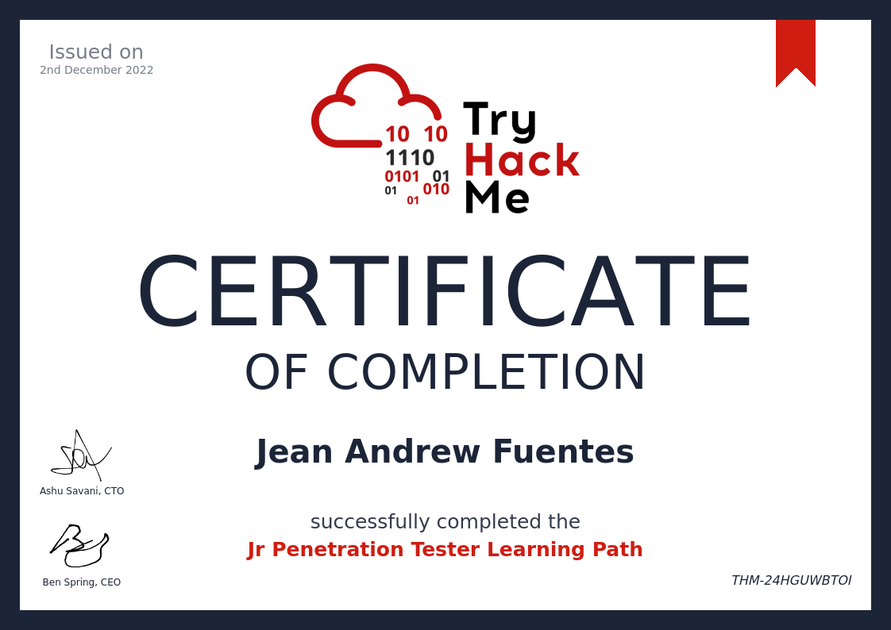
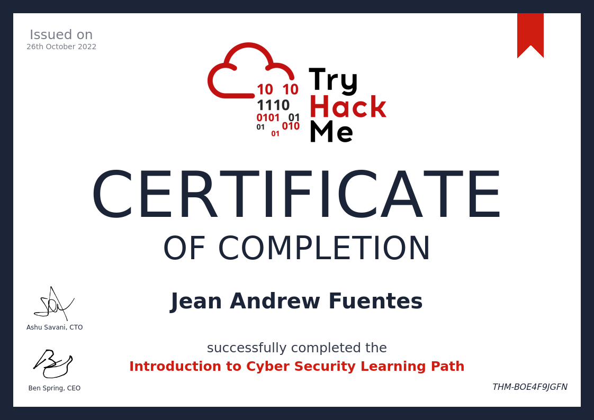

# TryHackMe

## CERTIFICATES

## PATHS

- https://tryhackme.com/paths # INTRODUCTION
- https://tryhackme.com/path/outline/jrpenetrationtester 
- https://tryhackme.com/room/uploadvulns 
- https://tryhackme.com/path/outline/pentesting 
 
### modules
- https://tryhackme.com/module/intro-to-networking
- https://tryhackme.com/module/linux-fundamentals 
- https://tryhackme.com/module/intro-to-networking 
- https://tryhackme.com/module/cryptography
- https://tryhackme.com/module/windows-fundamentals
- 
## WEAKNESSES

Intro to Webhacking 
SSRF - Not yet 100% clear and absorbed

SQL INJECTION 
- Go back in band SQLi Task 5 Redo 
Finished the task but not 100% clear 

BURP REPEATER   
- Go back final challenge with SQLi Union 
- Try to use BURP INTRUDER in the Extra mile Challenge 

## COOL CHALLENGES/ROOMS to revisit

Metasploit: Exploitation Task 5
> https://tryhackme.com/room/metasploitexploitation#
> Use eternal blue vulnerability
> learn about ntlm password hashes,
> learn what registry windows is storing hash password of users

## UNFINISHED ROOMS

Intro to Lan. 
- https://tryhackme.com/room/introtolan 
- https://tryhackme.com/room/osimodelzi

Wireshark 101
- https://tryhackme.com/room/wireshark 

- OWASP TOP 10 
https://tryhackme.com/room/owasptop10 
## CHALLENGES

- EASY https://tryhackme.com/room/basicpentestingjt
- EASY https://tryhackme.com/room/picklerick
- EASY https://tryhackme.com/room/rrootme 

## Security Awareness Trainings
> Trainings for Security Awareness
https://tryhackme.com/room/securityawarenessintro
https://tryhackme.com/room/commonattacks

## Repositories for Hacking 
> Collation of Repositories in CyberSecurity

- https://github.com/samratashok/nishang 
>  Nishang - Offensive PowerShell for red team, penetration testing and offensive security.  
> `wget https://raw.githubusercontent.com/samratashok/nishang/master/Shells/Invoke-PowerShellTcp.ps1 `

- https://github.com/codeandrew/static-binaries
> Static Binaries for Linux, MacOs and Windows.  
> `wget https://github.com/codeandrew/static-binaries/raw/master/binaries/windows/x86/ncat.exe`
